<!--focusSection: -->
<!--checkLinks: -->

# Meta Horizon Creator Manual {ignore=true}

> **Created by the Horizon Community**
> **Author**: wafflecopters (Ari Grant)
> **Contributors**: PigeonNo12, SeeingBlue, Shards632, Tellous (Matt Torres), and UnravelWinter
> **Thanks**: HomeMed


<!-- @import "[TOC]" {cmd="toc" depthFrom=1 depthTo=6 orderedList=true} -->

<!-- code_chunk_output -->

1. [Overview](#overview)
2. [Worlds](#worlds)
    1. [Creating a World](#creating-a-world)
    2. [Publishing and Player Settings](#publishing-and-player-settings)
    3. [Editor Roles](#editor-roles)
    4. [Cloning a World](#cloning-a-world)
    5. [World Snapshot](#world-snapshot)
    6. [World Backups](#world-backups)
3. [Instances](#instances)
    1. [Instance Lifetime](#instance-lifetime)
    2. [Instance Types](#instance-types)
        1. [Visitation Modes: Edit, Preview, and Publish](#visitation-modes-edit-preview-and-publish)
    3. [Available Instances](#available-instances)
        1. [Open, Closed, and Private Instances (Matchmaking)](#open-closed-and-private-instances-matchmaking)
    4. [Instance Selection](#instance-selection)
    5. [Travel, Doors, and Links](#travel-doors-and-links)
    6. [Starting, Stopping and Resetting an Instance](#starting-stopping-and-resetting-an-instance)
4. [Scene Graph](#scene-graph)
    1. [Hierarchy](#hierarchy)
        1. [Ancestors](#ancestors)
        2. [Empty Object and Groups](#empty-object-and-groups)
    2. [Coordinate System](#coordinate-system)
    3. [Transforms](#transforms)
        1. [Position](#position)
        2. [Rotation](#rotation)
        3. [Scale](#scale)
        4. [Offsets - Move, Rotate, and Scale](#offsets---move-rotate-and-scale)
        5. [Transform Property](#transform-property)
        6. [Local Transforms](#local-transforms)
        7. [Pivot Points](#pivot-points)
        8. [Transform Helpers](#transform-helpers)
        9. [Billboarding](#billboarding)
5. [Entities](#entities)
    1. [Entity Class](#entity-class)
    2. [Entity Types](#entity-types)
        1. [Static vs Dynamic Entities](#static-vs-dynamic-entities)
        2. [Intrinsic Entity Types](#intrinsic-entity-types)
        3. [Behavior Entity Types](#behavior-entity-types)
        4. [Entity as() method](#entity-as-method)
        5. [Animated Entities](#animated-entities)
        6. [Interactive Entities](#interactive-entities)
    3. [Entity Properties](#entity-properties)
        1. [Simulated](#simulated)
        2. [Entity Tags](#entity-tags)
        3. [Entity Visibility](#entity-visibility)
            1. [Entity Visibility Permissions](#entity-visibility-permissions)
6. [All Gizmos (Intrinsic Entity Types)](#all-gizmos-intrinsic-entity-types)
    1. [Avatar Pose Gizmo](#avatar-pose-gizmo)
    2. [Collider Gizmo](#collider-gizmo)
    3. [Custom UI Gizmo](#custom-ui-gizmo)
    4. [Debug Console Gizmo](#debug-console-gizmo)
    5. [Door Gizmo](#door-gizmo)
    6. [Dynamic Light Gizmo](#dynamic-light-gizmo)
    7. [Environment Gizmo](#environment-gizmo)
    8. [In-World Item Gizmo](#in-world-item-gizmo)
    9. [Media Board Gizmo](#media-board-gizmo)
    10. [Mirror Gizmo](#mirror-gizmo)
    11. [Navigation Volume](#navigation-volume)
    12. [NPC Gizmo](#npc-gizmo)
    13. [ParticleFx Gizmo](#particlefx-gizmo)
    14. [TrailFx Gizmo](#trailfx-gizmo)
    15. [Projectile Launcher Gizmo](#projectile-launcher-gizmo)
    16. [Quests Gizmo](#quests-gizmo)
    17. [Raycast Gizmo](#raycast-gizmo)
    18. [Script Gizmo](#script-gizmo)
    19. [Snap Destination Gizmo](#snap-destination-gizmo)
    20. [Sound Gizmo](#sound-gizmo)
    21. [Spawn Point Gizmo](#spawn-point-gizmo)
    22. [Static Light Gizmo](#static-light-gizmo)
    23. [Sublevel Gizmo](#sublevel-gizmo)
    24. [Text Gizmo](#text-gizmo)
        1. [Using a Text Gizmo](#using-a-text-gizmo)
        2. [Text Gizmo Limitations](#text-gizmo-limitations)
        3. [Text Gizmo Markup](#text-gizmo-markup)
        4. [Text Gizmo Tags](#text-gizmo-tags)
            1. [Text Gizmo Tag Parameters](#text-gizmo-tag-parameters)
        5. [Supported Text Gizmo Tags](#supported-text-gizmo-tags)
    25. [Trigger Gizmo](#trigger-gizmo)
        1. [Trigger Collisions](#trigger-collisions)
    26. [World Leaderboard Gizmo](#world-leaderboard-gizmo)
    27. [World Promotion Gizmo](#world-promotion-gizmo)
7. [Assets](#assets)
    1. [Creating Assets](#creating-assets)
    2. [Managing Assets](#managing-assets)
    3. [Referencing Assets (Props and IDs)](#referencing-assets-props-and-ids)
        1. [Asset as() method](#asset-as-method)
    4. [3D Model Asset](#3d-model-asset)
        1. [MeshEntity Class](#meshentity-class)
        2. [MeshEntity Style](#meshentity-style)
        3. [MeshEntity setMesh](#meshentity-setmesh)
    5. [Texture Asset](#texture-asset)
    6. [Material Asset](#material-asset)
    7. [Audio Asset](#audio-asset)
    8. [Text Asset (JSON)](#text-asset-json)
    9. [Template Asset](#template-asset)
    10. [Legacy Asset Group](#legacy-asset-group)
8. [Custom Model Import](#custom-model-import)
    1. [SubD vs Custom Models](#subd-vs-custom-models)
        1. [Horizon Lighting](#horizon-lighting)
9. [Scripting](#scripting)
    1. [Creating and Editing Scripts](#creating-and-editing-scripts)
        1. [Syncing Scripts](#syncing-scripts)
        2. [Scripts in Source Control](#scripts-in-source-control)
    2. [Horizon Properties](#horizon-properties)
        1. [Horizon Property Subtleties](#horizon-property-subtleties)
    3. [Types](#types)
        1. [Comparable Interface](#comparable-interface)
        2. [Copying vs Mutating Methods](#copying-vs-mutating-methods)
        3. [Vec3](#vec3)
            1. [Vector Creation](#vector-creation)
            2. [Vector Properties](#vector-properties)
            3. [Vector Operations](#vector-operations)
            4. [Dot Product](#dot-product)
            5. [Cross Product](#cross-product)
            6. [Vector Reflect](#vector-reflect)
            7. [Vector Linear Interpolation (Lerp)](#vector-linear-interpolation-lerp)
        4. [Color](#color)
            1. [Creation](#creation)
            2. [Color Properties](#color-properties)
            3. [Color Operations](#color-operations)
            4. [Color Space Conversions (HSV)](#color-space-conversions-hsv)
            5. [Hex Colors](#hex-colors)
            6. [Color Blending](#color-blending)
        5. [Quaternion](#quaternion)
            1. [Quaternion Creation](#quaternion-creation)
            2. [Quaternion Properties](#quaternion-properties)
            3. [Quaternion Operations](#quaternion-operations)
            4. [Euler Angles](#euler-angles)
            5. [Axis and Angle](#axis-and-angle)
            6. [Look Rotation](#look-rotation)
            7. [Spherical Linear Interpolation (Slerp)](#spherical-linear-interpolation-slerp)
    4. [World Class](#world-class)
    5. [Components](#components)
        1. [Component Class](#component-class)
        2. [Attaching Components to Entities](#attaching-components-to-entities)
        3. [Component Properties](#component-properties)
        4. [Component Lifecycle](#component-lifecycle)
        5. [Async (Delays and Timers)](#async-delays-and-timers)
        6. [Run Every Frame (PrePhysics and OnUpdate)](#run-every-frame-prephysics-and-onupdate)
        7. [BuiltInVariableType](#builtinvariabletype)
        8. [PropTypes](#proptypes)
        9. [SerializableState](#serializablestate)
    6. [Communication Between Components](#communication-between-components)
        1. [Receiving Events](#receiving-events)
        2. [Sending Events](#sending-events)
        3. [Routing Events through Players](#routing-events-through-players)
        4. [Code Block Events](#code-block-events)
            1. [Built-In Code Block Events](#built-in-code-block-events)
        5. [Network Events](#network-events)
        6. [Local Events](#local-events)
            1. [Built-In Local Events](#built-in-local-events)
        7. [Broadcast events](#broadcast-events)
        8. [Converting Between Components and Entities](#converting-between-components-and-entities)
    7. [Disposing Objects](#disposing-objects)
    8. [Frames](#frames)
        1. [Frame Rate](#frame-rate)
        2. [Frame sequence](#frame-sequence)
            1. [Simulation Phase](#simulation-phase)
            2. [Script Phase](#script-phase)
                1. [Scene Graph Mutations](#scene-graph-mutations)
            3. [Synchronization Phase](#synchronization-phase)
    9. [Component Inheritance](#component-inheritance)
    10. [File-Backed Scripts (FBS)](#file-backed-scripts-fbs)
        1. [FBS Script Ids](#fbs-script-ids)
            1. [Branched World Development Source Control Workflow Issues](#branched-world-development-source-control-workflow-issues)
        2. [Converting to FBS](#converting-to-fbs)
        3. [Typescript Scripts Workflow](#typescript-scripts-workflow)
        4. [Codeblock Scripts workflow](#codeblock-scripts-workflow)
        5. [Scripts and Template Assets](#scripts-and-template-assets)
    11. [Script File Execution](#script-file-execution)
    12. [Script Execution Timing](#script-execution-timing)
    13. [Scripting Helper Functions](#scripting-helper-functions)
10. [Network](#network)
    1. [Clients (Devices and the Server)](#clients-devices-and-the-server)
    2. [Entity Ownership](#entity-ownership)
    3. [Local and Default Scripts](#local-and-default-scripts)
        1. [Why Local Scripts and Ownership Matter: Network Latency](#why-local-scripts-and-ownership-matter-network-latency)
    4. [Authority and Reconciliation](#authority-and-reconciliation)
    5. [Ownership Transfer](#ownership-transfer)
        1. [Ownership Transfer Sequence](#ownership-transfer-sequence)
        2. [Discontinuous Ownership Transfers](#discontinuous-ownership-transfers)
        3. [Automatic Ownership Transfers](#automatic-ownership-transfers)
        4. [Transferring Data Across Owners](#transferring-data-across-owners)
11. [Collisions](#collisions)
    1. [Collision Events](#collision-events)
    2. [Colliders](#colliders)
        1. [Active Colliders](#active-colliders)
        2. [Separating a Collider from a Mesh](#separating-a-collider-from-a-mesh)
    3. [Entity Tag Bubbling](#entity-tag-bubbling)
12. [Physics](#physics)
    1. [Units](#units)
    2. [PhysicalEntity Class](#physicalentity-class)
    3. [Creating a Physical Entity](#creating-a-physical-entity)
    4. [Simulated vs Locked Entities](#simulated-vs-locked-entities)
    5. [Applying Forces and Torque](#applying-forces-and-torque)
        1. [Forces](#forces)
        2. [Torques](#torques)
        3. [Springs](#springs)
            1. [Spring Push](#spring-push)
            2. [Spring Spin](#spring-spin)
    6. [PrePhysics vs OnUpdate Events](#prephysics-vs-onupdate-events)
    7. [Player Physics](#player-physics)
        1. [Player Physical Velocity](#player-physical-velocity)
        2. [Player Position and Physics](#player-position-and-physics)
13. [Players](#players)
    1. [Player Class](#player-class)
    2. [Identifying Players](#identifying-players)
        1. [Player Device Type](#player-device-type)
        2. [Player ID](#player-id)
        3. [Player Indices](#player-indices)
        4. [Listing All Players](#listing-all-players)
        5. [Checking Human vs NPC vs Server](#checking-human-vs-npc-vs-server)
        6. [Server Player](#server-player)
        7. [Local Player](#local-player)
    3. [Player Entering and Exiting a World](#player-entering-and-exiting-a-world)
    4. [Player Enter and Exit AFK](#player-enter-and-exit-afk)
    5. [Player Locomotion](#player-locomotion)
    6. [Player Position and Rotation](#player-position-and-rotation)
    7. [Player Body Parts](#player-body-parts)
        1. [Player Hand](#player-hand)
    8. [Player Pose](#player-pose)
        1. [Grip Pose](#grip-pose)
        2. [Scripted Grip Pose](#scripted-grip-pose)
        3. [Scripted Grip Pose Animation](#scripted-grip-pose-animation)
        4. [Avatar Animation](#avatar-animation)
    9. [Voip Settings](#voip-settings)
    10. [Haptics](#haptics)
    11. [Aim Assist](#aim-assist)
    12. [Throwing](#throwing)
14. [Grabbing and Holding Entities](#grabbing-and-holding-entities)
    1. [Creating a Grabbable Entity](#creating-a-grabbable-entity)
    2. [Can Grab](#can-grab)
        1. [Setting "Who Can Grab?"](#setting-who-can-grab)
        2. [Setting "Who Can Take From Holder?"](#setting-who-can-take-from-holder)
        3. [Grab Distance](#grab-distance)
        4. [Grab Lock](#grab-lock)
        5. [Force Grabbing](#force-grabbing)
    3. [Releasing Entities](#releasing-entities)
        1. [Manual release](#manual-release)
        2. [Force release](#force-release)
    4. [Grab Sequence and Events](#grab-sequence-and-events)
        1. [Hand-off (Switching Hands or Players)](#hand-off-switching-hands-or-players)
        2. [Moving Held Entities](#moving-held-entities)
            1. [Moving a Held Entity Locally in Relation to the Hand](#moving-a-held-entity-locally-in-relation-to-the-hand)
            2. [Moving a Held Entity Globally in Relation to the World](#moving-a-held-entity-globally-in-relation-to-the-world)
        3. [Grabbables and Ownership](#grabbables-and-ownership)
15. [Attaching Entities](#attaching-entities)
    1. [Creating an Attachable](#creating-an-attachable)
    2. [Attachable By](#attachable-by)
    3. [Avatar Attachable](#avatar-attachable)
        1. [Scripted Attach](#scripted-attach)
        2. [Detaching](#detaching)
        3. [Socket Attachment](#socket-attachment)
        4. [Sticky Attachments](#sticky-attachments)
            1. [Stick Attachment To](#stick-attachment-to)
        5. [Attachment Anchors](#attachment-anchors)
            1. [Anchor Attachment To](#anchor-attachment-to)
            2. [Auto Scale to Anchor](#auto-scale-to-anchor)
    4. [Attach to 2D screen](#attach-to-2d-screen)
16. [Holstering Entities](#holstering-entities)
    1. [Cross-screen Holstering](#cross-screen-holstering)
        1. [Scripting Holstering](#scripting-holstering)
17. [Player Input](#player-input)
    1. [Player Controls](#player-controls)
        1. [Triggering Player Input Actions](#triggering-player-input-actions)
        2. [Custom Input](#custom-input)
            1. [Connect Local Input](#connect-local-input)
            2. [PlayerInputAction](#playerinputaction)
    2. [Player Input ButtonIcon](#player-input-buttonicon)
        1. [Player Input CodeBlockEvents](#player-input-codeblockevents)
    3. [Focused Interaction](#focused-interaction)
        1. [Entering and Exiting Focused Interaction](#entering-and-exiting-focused-interaction)
        2. [Observing Focused Interactions](#observing-focused-interactions)
        3. [Configuring Focused Interaction Visuals](#configuring-focused-interaction-visuals)
18. [Persistence](#persistence)
    1. [Leaderboards](#leaderboards)
        1. [Creating, Editing, and Deleting Leaderboards](#creating-editing-and-deleting-leaderboards)
        2. [Using the World Leaderboard Gizmo](#using-the-world-leaderboard-gizmo)
        3. [Using a Leaderboard with a Player Persistent Variable](#using-a-leaderboard-with-a-player-persistent-variable)
    2. [Quests](#quests)
        1. [Creating, Editing, and Deleting Quests](#creating-editing-and-deleting-quests)
        2. [Simple vs Tracked Quests](#simple-vs-tracked-quests)
        3. [Using the Quests Gizmo](#using-the-quests-gizmo)
        4. [Resetting Quests](#resetting-quests)
    3. [In-World Purchases (IWPs)](#in-world-purchases-iwps)
        1. [Creating, Editing, and Deleting IWPs](#creating-editing-and-deleting-iwps)
        2. [Using the In-World Purchase Gizmo](#using-the-in-world-purchase-gizmo)
        3. [In-World Item ID String](#in-world-item-id-string)
        4. [In-World Durable Items](#in-world-durable-items)
            1. [Durable In-World Item Asset](#durable-in-world-item-asset)
            2. [Durable In-World Item CodeblockEvents](#durable-in-world-item-codeblockevents)
        5. [In-World Consumable Items](#in-world-consumable-items)
            1. [Item Packs](#item-packs)
            2. [Auto-Use Consumable In-World Items](#auto-use-consumable-in-world-items)
            3. [Handling an Item-Consume Item Request](#handling-an-item-consume-item-request)
        6. [In-World Item CodeBlockEvents](#in-world-item-codeblockevents)
    4. [Player Persistent Variables (PPVs)](#player-persistent-variables-ppvs)
        1. [Using Persistent Player Variables](#using-persistent-player-variables)
        2. [Persistent Variable Groups](#persistent-variable-groups)
        3. [Creating, Editing, and Deleting Player Persistent Variables](#creating-editing-and-deleting-player-persistent-variables)
        4. [Persistent Variable Object Data](#persistent-variable-object-data)
19. [Spawning](#spawning)
    1. [Simple Spawning](#simple-spawning)
        1. [Deleting Simply Spawned Entities](#deleting-simply-spawned-entities)
        2. [Spawn CodeBlockEvents](#spawn-codeblockevents)
    2. [Despawning](#despawning)
    3. [Advanced Spawning (SpawnController)](#advanced-spawning-spawncontroller)
        1. [SpawnController State Machine](#spawncontroller-state-machine)
        2. [SpawnController Methods](#spawncontroller-methods)
    4. [Sublevels](#sublevels)
20. [Showing Players Temporary Messages](#showing-players-temporary-messages)
    1. [Popups](#popups)
    2. [Tooltips](#tooltips)
21. [Custom UI](#custom-ui)
    1. [UIComponent Class](#uicomponent-class)
    2. [Bindings](#bindings)
        1. [Binding Class](#binding-class)
        2. [Creating Bindings](#creating-bindings)
        3. [Global vs Player Binding Values](#global-vs-player-binding-values)
        4. [Setting and Resetting Bindings](#setting-and-resetting-bindings)
        5. [Deriving Bindings](#deriving-bindings)
        6. [Animated Bindings](#animated-bindings)
    3. [UINode Types](#uinode-types)
        1. [Conditional UI (If)](#conditional-ui-if)
        2. [UI View](#ui-view)
        3. [UI Text](#ui-text)
        4. [UI Image](#ui-image)
        5. [UI Pressable](#ui-pressable)
        6. [UI ScrollView](#ui-scrollview)
        7. [UI Dynamic List](#ui-dynamic-list)
22. [Navigation Mesh](#navigation-mesh)
    1. [Navigation Mesh Volume](#navigation-mesh-volume)
    2. [Navigation Mesh Profile](#navigation-mesh-profile)
    3. [Navigation Mesh Agent](#navigation-mesh-agent)
23. [Cross Screens - Mobile vs PC vs VR](#cross-screens---mobile-vs-pc-vs-vr)
    1. [Camera](#camera)
24. [Common Problems and Troubleshooting](#common-problems-and-troubleshooting)
    1. [Horizon TypeScript Symbols](#horizon-typescript-symbols)
25. [All Built-In CodeBlockEvents](#all-built-in-codeblockevents)

<!-- /code_chunk_output -->


<div style="page-break-after: always;"></div>

# Overview

Meta Horizon (called "Horizon" for the rest of this document) is a Metaverse content platform where people can find and create 3D immersive content to play, explore, and socialize in. Horizon calls each experience a [world](#worlds). The content can be accessed on:

**Supported platforms**: mobile, web, Windows PCs, and VR.

Use the Horizon creation tools you can create team-vs-team shooter games, fantasy fighting games, social deception games, hang out spaces and clubs, art exhibits, simulation games, battle royale games, dungeon crawlers, obstacle courses, puzzle games, talk shows, adventure games, stories, party games, improv clubs, and whatever else you can imagine.

The tools support many features for managing and scripting [players](#players), [physics](#physics), [3D meshes](#3d-model-asset), [projectiles](#projectile-launcher-gizmo), [purchases](#in-world-purchases-iwps), [grabbable items](#grabbing-and-holding-entities), [wearable items](#attaching-entities), [player inputs](#player-input), [static](#static-light-gizmo) and [dynamic](#dynamic-light-gizmo) lights, [UI](#custom-ui-gizmo), [Leaderboards](#leaderboards), [NPCs](#npc-gizmo), and more. You can write [scripts](#scripting), handle the [network](#network), package up content into [reusable assets](#assets), dynamically [spawn](#spawning) content into a world while it is running, and so much more.

**Desktop Editor**: Horizon can be installed on a Windows PC through the Meta Quest Link App. Once installed, you click on the ellipsis (the 3 dots menu) Start in Desktop Mode, this opens app with a set of tools where you can create, edit and publish worlds. At this moment, the Desktop Editor is not supported in MAC computers.

**VR Editor**: in Quest VR devices the Meta Horizon app contains an edit mode that allows for creating and editing worlds inside of VR. It offers a natural and intuitive experience where you can place object directly with your hands and immerse yourself in your creations. The VR editor does not provide access to all tools that the desktop has. For the majority of this documentation, we will be covering Desktop Editor mode only.

**TypeScript and Code Blocks**. Horizon uses [TypeScript](https://www.typescriptlang.org/) as its scripting language. TypeScript scripts can only be edited in the Desktop Editor. Horizon also has a custom block-based scripting system (where you write scripts by combining blocks together) that it calls **Codeblocks**. Codeblock Scripts can only be edited in the VR Editor. This documentation only includes TypeScript features.

# Worlds

You use the Desktop Editor to edit worlds, adding content and scripts to build out your ideas. The [publishing menu](#publishing-and-player-settings) enables you to configure worlds settings and publish the world when ready. Worlds are saved in automatic system "files" called [world snapshots](#world-snapshot) which allow [rollback](#world-backups). A published world may be running many [instances](#instances) at once.

## Creating a World

1. Download and install [Meta Quest Link App](https://www.meta.com/en-gb/help/quest/1517439565442928/).

1. Once installed on your PC, navigate to the `Store` from the menu on the left.

1. Search `Meta Horizon Worlds` in the upper-right and install.

1. Launch from the `Library` by clicking the 3 dots and select `Start in Desktop Mode`.

     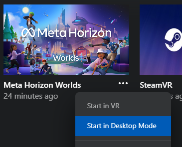

1. Click `New world` in the upper-right.

    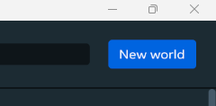

1. Name your world and click `Create`.

    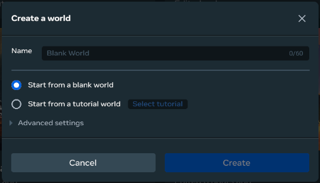

## Publishing and Player Settings

**Publishing**
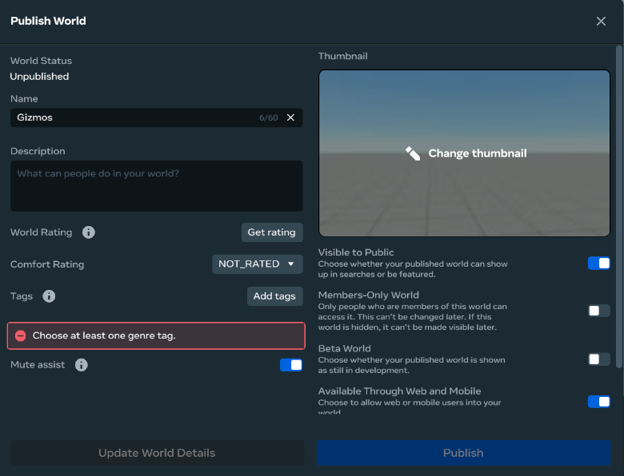

| Field | Description |
|---|---|
| World Status | Displays the current status of the world. |
| Name | Allows you to name your world. Beware, renaming your world will change the name of the folder where the scripts are saved when using Typescript. |
| Description | Allows you to set a description for your world. This will be seen when viewing your world in the Horizon menu, online, or in the app.
| World Rating | Will prompt a series of questions about your world to determine your world rating: 10+, 13+, or 18+. |
| Comfort Rating | Allows you to select a rating for your world that players will see before they visit. This lets players know what kind of experience they can expect. You cannot publish a world as `NOT_RATED`. `COMFORTABLE` suggest not a lot of movement involved, overall calm and slow environment. `Moderate` suggest your world has some limited movement or possible motion sickness inducing aspects. `INTENSE` suggest your world may not be suitable for users who suffer from motion sickness. |
| Tags | Allows you to set up to 3 Tags for your world that helps categorize it in the menu and tells players what kind of experience they can expect. |
| Mute Assist | Turning this on will allow your world to detect loud sounds, profanity or offensive language and prompt your players to mute the offending players. |
| Visible to Public | Determines whether your world will appear in the Horizon Menu, searches, or be featured. If disabled, players can only join your world through invites or Door Gizmo. |
| Members-Only World | Enables `Moderation Presence Required` option. Only allows users who are invited to join your world. Does not allow IWP. WARNING: When enabled and published, it cannot be disabled again. |
| Moderation Presence Required | If enabled, invited players can only enter the world when the creator or a moderator is present. |
| Beta | If enabled, shows your world in Beta status so players know there could be bugs or issues. |
| Available Through Web and Mobile | Determines whether players can join your world on web and mobile.
| Compatible with Web and Mobile | Determines whether your world is optimized for web and mobile so players can know what to expect. |

**Player Settings**
| Field | Description |
|---|---|
| VOIP Settings | `Global` will set every player to global voice. It is not possible to change any VOIP settings further (all gizmos and TypeScript related to VOIP are ignored). The `Local` setting gives the world the default setting, which can then be further changed by environment gizmos and TypeScript. |
| Maximum Player Count | Set the maximum number of people who can be in your world at the same time. Values are between 4 and 32, default is 8. |
| Suggested Minimum Player Count | Sets the recommended minimum number of people needed to enjoy your world. |
| Emotes | Allows players to use emotes in your world |
| Emotes Audio | Allows emotes to play sound effects in your world. |
| Can Hands Collide With Physics Objects | Sets whether a player's hands will collide with interactive objects or pass through them. |
| Can Hands Collide With Static Objects | Sets whether a player's hands will collide with static objects or pass through them. |
| Custom Player Movement | Allows you to move players by script. Warns players they may be moved by script in your world. |
| Generate Instant Replays | Allows scripts to record players after a specific action or event. Requires [horizon/capturing](https://horizon.meta.com/resources/scripting-api/capturing.md/) API |
| Frame Budget Boost (Early Access) | Helps boost frames. Setting to `Default` or `On` may cause visual distortions. [Learn more...](https://fb.me/fbb) |
| Spawn Nearby | When enabled players joining your world will spawn near other players. |
| Footsteps Volume | Adjusts the volume of footstep audio |
| Footsteps Min Distance | Foots steps will play at full volume up to this distance(in meters). |
| Footsteps Max Distance | Foots steps fade out until they reach the max distance then you will be unable to hear them. |
| Hide Action by Default | Mobile Only. Hides action icons by default unless specified otherwise in items properties. |  |
| Disable Dynamic LOD Toggles on Avatar | If enabled, LOD will no longer be applied to avatars. This decreases their detail for players when viewed from a distance. |
| Enable Max Quality Avatar | Enabled advanced shading and increased texture resolution on avatars. May affect performance. |

## Editor Roles

The **owner** is the person who [created the world](#creating-a-world). Once a world is created, there is no way to change the owner. **Collaborators**, can than be added to (and removed from) the world via the Collaborators menu. When adding a collaborator, you choose whether they are an editor or tester.

| Role | Can travel to [editor instances](#instance-lifetime)? | Can enter [build mode](#visitation-modes-edit-preview-and-publish), edit [scene](#scene-graph), and edit [scripts](#scripting)? | Can [publish](#publishing-and-player-settings) the world? | Can edit [persistence](#persistence) settings (create and edit [leaderboards](#leaderboards), [quests](#quests), and [PPVs](#player-persistent-variables-ppvs))? | Can assign [editor roles](#editor-roles)? |
|---|---|---|---|---|---|
| *Owner* | ✅ | ✅ | ✅ | ✅ | ✅ |
| *Editor* | ✅ | ✅ | ❌ | ❌ (Exception: editing Quests *are* allowed) | ❌ |
| *Tester* | ✅ (using the VR Headset) | ❌ | ❌ | ❌ | ❌ |

## Cloning a World

World owners can clone a world. This creates a new one with a different ID than the original. The scene configuration and scripting will be completely independent than the original one, except [template assets](#template-asset) and FBS scripts.

To Clone a world:
1. Open the Desktop Editor and wait for the Creation Home to load. If you are already inside a world, navigate back to the Creation Home by clicking the sandwich menu (the 3 horizontal lines on the upper left corner), and select Return to Creation Home.
1. Click on the ellipsis menu of the world that you want to clone, and select Duplicate.
1. A "Duplicate your world?" UI will appear, with the option of using a default name (the original world name with the world Clone at the end). You can overwrite this field accordingly, if needed.
1. Toggle on the "Add variable groups to duplicate world" option, if you wish to preserve a connection to the Variables Groups of the original world.
1. Click Duplicate to close the UI. Once the Clone is created, you will see in the list of worlds of the Creation Home.

Quests and Leaderboards are also cloned by default, but their completion state and values will be reset. Tracked Quests will continue referencing a connected PPV, even if the Variable Group was not included in the cloned world.

## World Snapshot

When you create a new world, Horizon creates a new "file" on their servers which contains all the information and data for the world. Horizon calls this a **world snapshot**. Every time you update the world, a new snapshot is created. You can manage all the saves snapshots via the [backups](#world-backups) feature.

!!! info **The** world snapshot
    Whenever this document refers to **the world snapshot** it is referring to the specific snapshot that you have loaded the world from (which is the last one saved, unless you did a rollback).

## World Backups

The editor regularly "auto saves" the world, creating a new [world snapshot](#world-snapshot) that is called a **backup**. You can manually create a snapshot as a via the "Save Backup" option.

The list of all previous saved snapshots are viewable in the "Backups" menu. This menu allows you to see the list of backups, see when it was created, modify the name and description, or to **restore** a backup to be the current snapshot.

For instance, before starting a major change to the world, you could create a backup, and then if you run into issues, you could restore that "safe" backup back to when the world was "unchanged". You can also look back into backups to investigate when a certain bug appeared, or to go back and make an [asset](#assets) or copy a [script](#scripting) that you have since modified or deleted.

!!! tip Source Control
    Currently there is no way to put a whole world into an external source control system, such as git, but it is possible to [put the scripts into source control](#scripts-in-source-control).

!!! warning Restoring a backup will overwrite the editable version of the world. Currently, branching is not available.

# Instances

Once published, Horizon maybe have multiple *copies* of a world running at the same time. For example if the [maximum player count](#maximum-player-count) is set to 20 and there are 100 people "in the world" then they would be spread out across *at least* 5 separate copies. These copies are called **instances**.

!!! info Horizon sometimes refers to Instances as "Sessions"
    In all technical documentation, Horizon uses the word *instance*. Given that this is a somewhat technical term, it refers to them as **sessions** within the user-facing side of the product. For example, a person can "create a new session".

## Instance Lifetime
**Creation**: When a player travels to a world (to play it or edit it), Horizon [finds or creates an instance](#instance-selection) of the right [type](#instance-types).

**Longevity**: The instance then remains running as long as players stay in it. Even when all players leave, and the instance becomes empty, it may stay running for some time, in case any players try to return or new players arrive.

**Destruction**: When there are no players in an instance it will be destroyed, after some timeout threshold. In rare instances a server error may also cause an instance to be destroyed (which will send all players in it back to the app-launch state).

!!! warning Destroyed instances are permanently gone and so is their data.
    When an instance is destroyed there is no way for players to get back that specific instance. Any data they had "acquired" in that instance is permanently lost. You can **use [Horizon persistence](#persistence) to track data across instances and visits**.

## Instance Types

There are three types of instances: **published instances**, **editor instances** and **preview instances**. The editing tools, for modifying a world, are only available inside of an *editor instance*. There is no way to turn one into the other; when Horizon [starts up a new instance](#instance-selection), based on how the player is traveling, and then the type never changes, for as long as the instance is [alive](#instance-lifetime).

| Instance Type  | How do you travel to one? | Can you open the editing tools? | How many instances are allowed? |
|---|---|---|---|
| *Published* | Use the "Visit World" button, or [travel](#travel-doors-and-links) to a friend, travel via a door. | No | No limit |
| *Editor* | Use the "Edit World" button if you are the [world owner, editor, or a tester](#editor-roles). | Yes, if you are the [owner or an editor](#editor-roles). | 1 |
| *Preview* | Use the "Preview version" button on the [Creator Portal](https://horizon.meta.com/creator/), or using the Preview Configuration actions (send link to Meta Quest phone app, open in browser or copy preview url). | No | No limit |

Preview instances mirror the same functionality as Published instance. The difference is that Preview instances will contain recent-unpublished edits of a world. Preview instances are not discoverable.

### Visitation Modes: Edit, Preview, and Publish

"Visiting" a world in Horizon is done in one of three modes: edit, play, and publish. In a [published instance](#instance-types), all players are always in "publish mode". In an [editor instance](#instance-types), the creator and editors can switch back and forth between edit and preview modes; testers are always in preview mode.

| Mode | Description | Instance Type | Required Role |
|---|---|---|---|
| *Edit* | Experience the world **as an editor** where you can modify the world. | Editor Instance | Editor |
| *Preview* | Experience the world **as a player** from within the editable instance. | Editor Instance | Editor or Tester |
| *Publish* | Experience the world **as a player** in a published instance. | Published Instance | n/a |

!!! info Debug Console Gizmo Visibility
  The [Debug Console Gizmo](#debug-console-gizmo) has setting to control which visitation mode(s) it is visible in.

## Available Instances

A player can only travel to an instance if that instance is **available for the player**. Availability is determined by three criteria, all of which must be met:

1. **[Isn't at maximum player count](#maximum-player-count)**: a player can only travel to a world if there as at least one [index](#player-indices) available. If the capacity is set to 20 and there are 19 people there, then 1 more can travel to the world. It is then unavailable for all players until at one player leaves.
1. **Is Safe**: Horizon has an undisclosed, and evolving, set of rules for what it deems *safe*, regarding travel. These rules may include: which players have blocked one another (and how recently), if the traveling player has recently been voted out of that instance, if the instance has a moderated event running, and more.
1. **[Instance is Open](#open-closed-and-private-instances-matchmaking)**: all [published instances](#instance-types) exist as either *open* or *closed*. An **open instance** can be joined by a player (if the above criteria are met). A **closed instance** can only be joined by players who are explicitly invited by players already in the instance.

### Open, Closed, and Private Instances (Matchmaking)

Instances can be *open* or *private*, controlling whether anyone can join, or if you can join by invite only. The *matchmaking* APIs allow you to *close* an *open instance* meaning that no one else can jon.

**Open Instance**: An instance is **open** if anyone can join it. Open instances are created by default when joining a world. They can also be created by using the 3 dots on a published world page and selecting `Launch an Open Session`. Anyone can join an open instance.

**Private Instance**: An instance is **private** when people can only join it by invite. Players can create a private instance by using the `Launch a Closed Session` option under the 3 dots on a published world page.

**Matchmaking**: Creators can also decide when to open and close an `Open Instance`(but not a `Private Instance`) by using the Matchmaking API. When an instance is closed in this way, players cannot join or be invited to join.

Matchmaking is a property of the `World` class.

```ts
//Property
allowPlayerJoin(allow: boolean): Promise<void>;

//Example
this.world.matchmaking.allowPlayerJoin(false)
```

## Instance Selection

When a player travels to a world, Horizon will determine which instance to send them to (if there are multiple) or create a new instance if needed (if all are full, none exist, or the player specifically created a new one).

!!! info The Editor Instance
    There is only ever (at most) one **editor instance** of a given world. When that one instance is full, no other editors can load the world to edit.

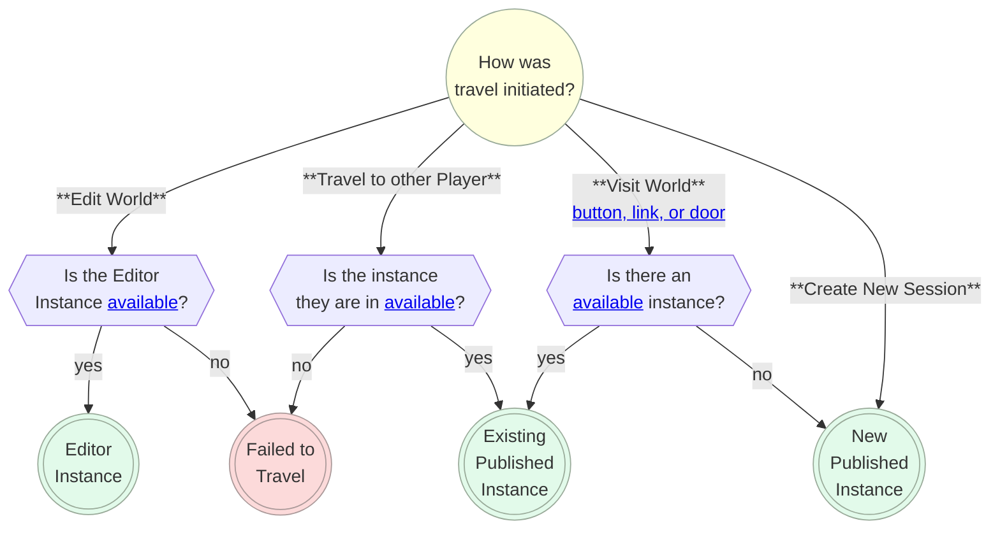

## Travel, Doors, and Links

Players move around Horizon by *traveling* from one location to another. A player is traveling when they are in the loading screen, going from one world to another.

A player may travel for a number of reasons:
  * they are loading into Horizon
  * they selected a world, in their menu
  * they selected a person and then "join", in their menu
  * they pressed a button on a [door](#door-gizmo)
  * they walked into a "travel area" (such as in Venues)
  * they were voted out of their current instance
  * they experience an error and were sent back to their "home" space

The [door gizmo](#door-gizmo) allows you to put "travel buttons" in your world and link them together.

To get a **URL (text link) to one of your worlds** go here: https://horizon.meta.com/creator/worlds_all and then choose a world and navigate to its details page. You will be at a URL starting with `https://horizon.meta.com/world/...`. That is the URL / link for that world!

If you are visiting a world in the browser and copy the URL, it will include a session id, which can help people join you (if you send them that URL).

## Starting, Stopping and Resetting an Instance

An **instance starts** when any of the following occur:
  * player chooses "new session" (instance is created and starts)
  * player travels to a world with no currently [available instance](#available-instances) (instance is created and starts)
  * player travels to the editor for a world that doesn't currently have the editor instance running (instance is created and starts)
  * creator presses the "Play" button in the desktop editor (instance is not created, but it is started)

When an instance starts, all the [script files are run](#script-file-execution) and the [components](#components) associated with the [entities](#entities) in the [scene graph](#scene-graph) are [initialized](#component-lifecycle).

An **instance stops** when any of the following occur:
  * the instance has had no players in it for a while
  * creator presses the "Stop" button in the desktop editor

When an instance stops in the desktop editor, all the components are disposed. In a non-editor instance, all the running scripts can simply be halted.

An **instance resets** when any of the following occur:
  * [World class](#world-class) `reset()` method is called
  * creator presses the "Reset" button in the desktop editor

When an instance resets, all components are disposed, all assets are [despawned](#despawning), all entities are reset to their initial state in the [world snapshot](#world-snapshot), all (new) components are initialized.

!!! warning Be careful resetting a playing instance.
    If an instance is reset while it is playing, it is possible that some in-flight [events](#communication-between-components) end up arriving and being handled after the reset! Thus, it is recommended to **not use `world.reset()`** and instead implement your own reset logic (which is also a better experience for the players).

    In the desktop editor we recommend that when you want to test the world that you habitually **press: "Stop, then Reset, then Play"**.

# Scene Graph

Every world in Horizon is made out of [entities](#entities) each of which has an [intrinsic type](#entity-types) such as being a mesh or a particle effect. Entities can be configured to have *behaviors* (such as being [grabbable](#grabbing-and-holding-entities) or [attachable](#attaching-entities)) and be have other entities as their children (or as a parent). The collection of all of these entities, their attributes, and relationships is called the **scene graph**. When you modify the scene graph in the editor, those changes are saved in the [world snapshot](#world-snapshot).

## Hierarchy

Any [entity](#entities) can be set as the child of another entity. For example, you might make a robot's forearm a [Mesh Entity](#meshentity-class) that is a child of the upper arm [Mesh Entity](#meshentity-class). Or you might put a steering wheel inside a car. The main reasons to create parent-child relationships are:

1. To have the transform of one entity impact another (e.g. moving a car also moves the steering wheel within it).
2. To create "layers" or "folders" in the editor (e.g. putting all trees in a ["collection"](#empty-object-and-groups) to make them easier to manage).

When an entity has no parent, it is called a **root entity**.

### Ancestors

We call the collection of an entity's parent, grandparent, great-grandparent, etc the entity's **ancestors**. If the entity has no parent, we say it has 0 ancestors. If it has just a parent and then grandparent, it would have 2.

We call the children, and their children, and their children, etc of an entity its **descendants**.

### Empty Object and Groups

Empty Objects and Groups are two entity types that create "collections" of entities. They are similar in most regards, with **only a few differences**:

| Type | [Pivots](#pivot-points) | [Interactive](#interactive-entities) Children | [Projectile Launcher](#projectile-launcher-gizmo) | [Child Count](#hierarchy) |
|---|---|---|---|---|
| Group | At the **build-mode center of all their children**. Meaning that moving a child in build-mode will move the [pivot point](#pivot-points). | Children have their **interaction disabled** and cannot be [grabbable](#grabbing-and-holding-entities) or [physical](#physicalentity-class). | [Projectile collisions](#projectile-launcher-gizmo) happen **on the group**. | 1+
| Empty Object | The **center of the Empty Object** is always the [pivot point](#pivot-points). | Children **can be [Interactive Entities](#interactive-entities)**, if the Empty Object's `Motion` is `None`. | [Projectile collisions](#projectile-launcher-gizmo) happen **on a child**. | 0+ |

Empty Objects and Groups **behave identically in regard to [collisions](#collisions), [triggers](#trigger-gizmo), and [raycasts](#raycast-gizmo)**.

They **behave differently with the [projectile launcher](#projectile-launcher-gizmo)**. When a projectile launch is hit, Horizon checks if it has a [parent](#ancestors) and if the parent is a group. If there is a group parent, it uses that as the entity. Otherwise, it uses the original entity it started with. Thus, a group will appear to "bubble up" one level; empty objects do not.

## Coordinate System

**Axes**. Following standard convention, the editor uses *red* for the *<span style="color:red">x-axis</span>*, *green* for the *<span style="color:green">y-axis</span>*, and *blue* for the *<span style="color:blue">z-axis</span>* when displaying "manipulation handles" to move, rotate, or scale an entity.

**Y-up**. The positive-y axis is *up*.

**Left-handed**. The coordinate system is *left-handed*, meaning that if you position the camera so that the positive y-axis is pointing up and the positive x-axis is pointing right then the positive z-axis points forward.

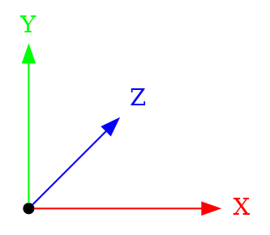

<a id="local-coordinates">**Local coordinates**</a>. Every [entity](#entities) and every [player and player body part](#player-body-parts) has a set of [local axes](#local-transforms) called: **right**, **up**, and **forward** which have an origin at the [pivot point](#pivot-points), if an entity, and at the center of the body part if it is a body part (example: player center is the hips; head center is literally the center of the head). Local coordinates are used for moving entities around in the Desktop editor (if enabled) and are used when interacting with [local transforms](#local-transforms).

!!! example Local Coordinates Example
    The *forward* axis of *a player head* is always pointing away from their face (parallel to their nose), its *right* axis is always point "outward" their right ear, and its *up* axis is pointing out from the top of the skull. When the entity or player body part moves, the origin of these axes move; likewise the axes rotate along with the entity (so that the *right* axis always points out from the right ear).

    ```graphviz {align="center"}
    digraph {
      layout=neato

      O [pos="0,0!" shape=box3d width=0.5 label=""]
      X [pos="1.75,0!" width=0 height=0 shape=none fontcolor=red label=right]
      Y [pos="0,1.5!" width=0 height=0 shape=none fontcolor=green label=up]
      Z [pos="0.52,1.05!" width=0 height=0 shape=none fontcolor=blue label=forward]

      X2 [pos="0.22,0!" width=0 height=0 shape=none fontcolor=red label=""]

      Y2 [pos="0,0.22!" width=0 height=0 shape=none fontcolor=green label=""]

      X2 -> X [color="red"]
      Y2 -> Y [color="green"]
      O -> Z [color="blue"]
    }
    ```

**Meters**. Distances and positions in Horizon are referenced using meters. For example, the position `(0, 1, 0)` is 1 meter (roughly 3.28 feet) up from the center of the world. Avatars in Horizon are approximately 1.8 meter tall (5 feet 11 inches).

**Origin**. The editor has the origin `(0,0,0)` at the center of the grid. The origin cannot be moved.

## Transforms

Entities have three transform properties: [position](#position), [rotation](#rotation), and [scale](#scale). You can use the Properties panel or the "manipulation handles" to manipulate these properties. Editing these values determines how entities are transformed when a new instance starts. **Within the Horizon editor you can only configure initial position, rotation, and scale**. If you want these values to change while the world is running, you will need to modify the values using scripting.

In the desktop editor you can switch quickly between transform tools via the keyboard.
| Manipulation Tool | Keyboard Shortcut |
|---|---|
| Move | W |
| Rotate | E |
| Scale | R |

Entities can be transformed globally and [locally](#local-transforms), they have [pivot points](#pivot-points), and can be [transformed relative to other entities or players](#transform-helpers).

!!! note No Arbitrary Matrix Transforms
    Horizon does not currently allow matrix transforms. You can achieve some skew effects by rotating an entity inside a non-uniformly scaled one. Arbitrary matrix transforms are not exposed to the developer.

### Position

Positions are specified as 3-dimensional vectors, represented as the `Vec3` type in TypeScript. In the editor these are written as a "triple" such as `(0, 0, 0)`.

The `position` property on an entity determines where in 3D space the [pivot point](#pivot-points) of the entity is, in relation to the origin of the world. Often the pivot is just the center of the entity, and so typically the position of an entity is where its center point is.

!!! example Setting a position
    Position is a [read-write property](#horizon-properties) on the `Entity` class. To get the current position of an entity, do:

    ```td
    entity.position.get()
    ```

    To move an entity to be 3 meters up from the origin and 4 meters forward, do:
    ```ts
    entity.position.set(new Vec3(0, 3, 4))
    ```

Setting the `position` property is not influenced by the position of any [ancestors](#ancestors).
See [local transforms](#local-transforms) for setting position relative to a parent entity.

!!! danger <a id="world-max-bounds">An entity position cannot have a value outside of `[-10,000, 10,000]`</a>
    When an entity moves (via `position.set` or via physics) to a location where any of its x-, y-, or z-values are outside the range `[-10,000, 10,000]`, then instead, the **entity will be automatically moved to the location it had at world start** (or at spawn-time if it was spawn). If it is a physics entity, then it will also have its velocity cleared out.

     **Players do not auto-move / respawn when they are too far away from the origin**.

     !!! bug Entities can be spawned farther than 10,000 away from the origin.
        It is a bug that entities can be spawned outside the bounds of the world.


### Rotation

Rotations are specified using a mathematical object called a `Quaternion`. Whenever you see the word "Quaternion", you can just think it means "rotation". This isn't mathematically true but is sufficient for nearly all uses.

Rotations in the editor are specified using [Euler Angles](https://en.wikipedia.org/wiki/Euler_angles) which are a robust way of specifying yaw, pitch, and roll. The default **Euler Order** order in Horizon is **YXZ** meaning that entity does a *yaw*, then a *pitch*, and then a *roll* (when specifying Euler Angles). Euler angles are specified in **degrees**.

!!! tip Rotations are tricky!
    Rotations, Quaternions, Euler Angles, etc are all rather tricky and subtle concepts. It will take a lot of time to build an intuition for them. Be patient and don't worry if rotations seem complex (they are)!

The `rotation` property on an entity determines how much the entity is rotated around its [pivot point](#pivot-points). This rotation is specified *globally*, meaning that it is measured with respect to the world. A zero-rotation will have an entity's up-axis align with the world's y-axis, its right-axis align with the world's x-axis, etc.

!!! example Setting a rotation
    Rotation is a [read-write property](#horizon-properties) on the `Entity` class. To get the current rotation of an entity, do:

    ```td
    entity.rotation.get()
    ```

    To rotate an entity so that it yaws 45 degrees and then rolls 90 degrees, do:
    ```ts
    entity.rotation.set(Quaternion.fromEuler(new Vec3(0, 90, 45)))
    ```

!!! tip Default Rotation ("Not rotated")
    If you want an entity to be "not rotated", set its rotation to be `(0, 0, 0)` in the editor. In TypeScript, you can use any of these lines (they all do the same thing):

    ```ts
    entity.rotation.set(Quaternion.fromEuler(new Vec3(0, 0, 0)))

    entity.rotation.set(Quaternion.fromEuler(Vec3.zero))

    entity.rotation.set(Quaternion.one)
    ```

Setting the `rotation` property is not influenced by the rotation of any [ancestors](#ancestors).
See [local transforms](#local-transforms) for setting rotation relative to a parent entity.

### Scale

Scales are specified as 3-dimensional vectors, represented as the `Vec3` type in TypeScript. In the editor these are written as a "triple" such as `(0, 0, 0)`.

**Inherent Size**: All entities have their own inherent size. For instance, a SubD cube is inherently 1 meter long on each side. [3D model assets](#3d-model-asset) have a size based on how they were authored. The inherent size of an entity is the size it is when it is *unscaled*.

The `scale` property determines the fraction an entity should be of its inherent size. For instance, a SubD cube is inherently 1 meter long on each side. If you set its scale to be `(1, 0.5, 2)` then the cube will be 1 meter long on its right-axis, 0.5 meters long on its up-axis, and 2 meters long on its forward-axis. In this example, the object has been "shrunk" along its up-axis, and "expanded" along its forward-axis.

!!! example Setting a scale
    Scale is a [read-write property](#horizon-properties) on the `Entity` class. To get the current scale of an entity, do:

    ```td
    entity.scale.get()
    ```

    To scale an entity so that it is 3 times bigger on its up axis (than its inherent size), do:
    ```ts
    entity.scale.set(new Vec3(1, 3, 1))
    ```

    Since the default scale is `(1,1,1)`, you can set any part of a scale to `1` to leave the entity "un-scaled" along that axis.

Setting the `scale` property is not influenced by the rotation of any [ancestors](#ancestors).
See [local transforms](#local-transforms) for setting scale relative to a parent entity.

!!! danger Mesh Primitives Have Unexpected Inherent Sizes
    The built-in mesh primitives have an inherent scale of 150 meters on each side (as of Feb 2025). Thus, if you wanted to use a built-in mesh cube and have it be 1 meter long on each side, you would need to give it a scale of (1/150, 1/150, 1/150). This is a longstanding bug.

### Offsets - Move, Rotate, and Scale

When you want to set the position of an entity in relation to the current position we call this **offsetting** the position. There is no built-in API for doing this (as of Feb 2025) but it can be accomplished easily with the pattern of *get-modify-set*.

!!! example Offsetting position and scale
    To move an entity up 2 meters from its current location you can do:
    ```ts
    const offset = new Vec3(0, 2, 0)

    const pos = entity.position.get()
    const newPos = pos.add(offset)
    entity.position.set(pos)
    ```
    Offsetting scale works similarly.

!!! example Offsetting rotation
    To rotate an entity 90 degrees around the world's y-axis, from its current rotation, you can do:
    ```ts
    const offset = Quaternion.fromEuler(new Vec3(0, 90, 0))

    const rot = entity.rotation.get()
    const newRot = offset.mul(rot)
    entity.rotation.set(newRot)
    ```
    Note that `mul()` is used to combine rotations.

    If instead you wanted to rotate an entity 90 degrees around its own up-axis you would do:
    ```ts
    const offset = Quaternion.fromEuler(new Vec3(0, 90, 0))

    const rot = entity.rotation.get()
    const newRot = rot.mul(offset)
    entity.rotation.set(newRot)
    ```
    where the order of the Quaternion multiplication has been flipped. See [Quaternions](#quaternion) for more explanation.

### Transform Property

Each entity has a transform property that can be accessed via `entity.transform`.

```ts
class Entity {
  readonly transform: Transform
  // ...
}
```

Position, rotation, and scale can all be accessed through a `Transform`. The following two lines behave identically.

```
entity.position.set(p)
entity.transform.position.set(p)
```

Additionally, the `Transform` object can be used to access **local** position, rotation, and scale. See the next section for more information.

### Local Transforms

Entities have a `localPosition`, `localRotation`, and `localScale` that can be accessed via the transforms (e.g. `entity.transform.localPosition.get()`). These properties specify values in relation to a parent entity (or to the world if there is no parent), specified in the parent's [local coordinates](#local-coordinates).

Throughout this doc, other than this section, we omit the word *global*. When you see "position", it means "global position".

!!! example Local Position Example
    Let `parent` be an entity that has not been rotated nor scaled with `child` as one of its children.

    If `parent`'s **global position** is `(3, 0, 0)` and `child`'s **global position** is `(8, 1, 0)` then `child`'s **local position** will be `(5, 1, 0)`. The `child`'s local position is how much it is moved from its parent.

    Note: if the `parent` were rotated or scaled then you can't just "subtract the positions".

!!! note Global values "cascade down" the hierarchy.
    An entity's global position/rotation/scale influences the global position/rotation/scale of its children (which then cascades to their child too!). If you have a plate on a table on a boat and the boat moves globally then so do the table and the plate; if the table moves then so does the plate (and everything on it!)

!!! warning Local values exist in the transformed [local coordinate system](#local-coordinates) of the parent.
    Rotating and/or scaling an entity causing it axes to rotate and scaled as well. We call these the *transformed axes*.

    A child with local position of `(0, 6, 0)` is moved 6 units **from the global position** of its parent **along the parent's transformed up-axis**. If there is no parent then this is just 6 meters up the world's y-axis.

### Pivot Points

The transformation origin point of an entity is called its **pivot point**. It rotates around its pivot point, it scales around its pivot point, and when you move an entity its pivot point end ups at the position specified.

1. **Mesh entities** have their pivot points specified when they are authored (e.g. in Blender)
1. **Empty objects** have their pivot points at the center of the gizmo (the grey cube)
1. **Group entities** compute their pivot point to be at the center of their "bounding box" **in edit mode**. For example if you move a child in a group in edit mode then when click off the group it will recompute its pivot point to be at the center of all of its children. *This only happens in edit mode. The pivot of a group doesn't auto-change when the world is running (even if its children move around).*
1. **All other entities** (e.g. door, text gizmo, box collider gizmo, etc) have a built-in pivot point (usually at their center).

!!! warning In the desktop editor the manipulator handles don't always render at the pivot points!
    The desktop editor lets you choose to put the "manipulator handles" at either the `Center` or `Pivot` of entities. Check that dropdown if you aren't seeing the pivots as you expect. This dropdown has no effect on how the world *runs* and is simply there to help with *editing*.

### Transform Helpers

The [Entity class](#entity-class) has a few methods to help with moving and rotating entities. Note that these methods are "just math"; they update the entity's [position](#position) and [rotation](#rotation).

* **Look At**: Rotate the entity to point its [forward axis](#local-transforms) in the direction of the target
    ```ts
    // Entity
    lookAt(target: Vec3, up?: Vec3): void;
    ```
* **Move Relative To**: Move the `entity` so that its `position` to (*relative to* the `target` or `player`'s `bodyPart`) is `relativePosition` when measured in the `space` [coordinate system](#coordinate-system).
    ```ts
    // Entity
    moveRelativeTo(
      target: Entity,
      relativePosition: Vec3,
      space?: Space
    ): void;

    // Entity
    moveRelativeToPlayer(
      player: Player,
      bodyPart: PlayerBodyPartType,
      relativePosition: Vec3,
      space?: Space
    ): void;
    ```
* **Rotate Relative To**: Rotate the `entity` so that its `rotation` to (*relative to* the `target` or `player`'s `bodyPart`) is `relativeRotation` when measured in the `space` [coordinate system](#coordinate-system).
    ```ts
    // Entity
    rotateRelativeTo(
      target: Entity,
      relativeRotation: Quaternion,
      space?: Space
    ): void;

    // Entity
    rotateRelativeToPlayer(
      player: Player,
      bodyPart: PlayerBodyPartType,
      relativeRotation: Quaternion,
      space?: Space
    ): void;
    ```

### Billboarding

An entity is a "billboard" when it automatically rotates to face the player. This uses *per-player rotation* so that each player can see the entity facing toward them.

[Empty objects and groups](#empty-object-and-groups) have a property (in the Properties panel) called **Billboard** with 3 options:

| Billboard Setting  |   |
|---|---|
| None | No automatic rotation |
| Lock-Y | Auto-rotate *per-player* around the y-axis so that the entity always points its [local forward axis](#local-transforms) in the direction of the player (but locked to the *xz*-plane). Its local up axis will always point straight up in the world. |
| Freeform | Auto-rotate *per-player* around any axis to face the player as best as possible. The entity's [local forward axis](#local-transforms) will point exactly in the direction of the player. |

**Billboard User Interfaces (UIs)**: [Leaderboard gizmos](#using-the-world-leaderboard-gizmo) contain a setting called "UI Anchor Style" which can be set to "Static" or "Billboard". When set to "Billboard" it acts just like a group with the billboard property set to "Freeform". All other UIs ([Custom UI](#custom-ui), [Debug Console Gizmo](#debug-console-gizmo), [Quests Gizmo](#quests-gizmo), etc) can be made into a billboard by putting them in a [group](#empty-object-and-groups) or as the child of an [empty object](#empty-object-and-groups) and then using the billboard option there.

# Entities

Every "thing" in the Horizon scene is an _entity_ (a grabbable item, a mesh, a light, a particle effect, a sound, a group of other entities, etc).

!!! info Entity and Object mean the same thing (except in TypeScript)
    Horizon calls these **objects** in the Desktop Editor and VR Tools but calls them **entities** in TypeScript. This document tries to consistently call them entities, except when quoting places where Horizon explicitly uses the word "object", but may accidentally call them objects on occasion.

    In TypeScript `Object` is a built-in for managing data, whereas `Entity` is a Horizon-specific class.

Entities are represented by the [Entity class](#entity-class). They have an [intrinsic type](#intrinsic-entity-types) (such as being a [particle effect](#particlefx-gizmo)) and may have (multiple) [behavior types](#behavior-entity-types) (such as being [grabbable](#grabbing-and-holding-entities)). Entities have a number of [properties](#entity-properties) and methods for managing [visibility](#entity-visibility). Entities can be [transferred to run on player devices](#clients-devices-and-the-server) to improve "smoothness", can be impacted by [physics](#physics) via forces, be made [grabbable](#grabbing-and-holding-entities), be made [attachable](#attaching-entities), and so much more.

## Entity Class

| `Entity` Class Member | Description |
|---|---|
| **Scene Graph** |
| [children](#hierarchy) | All entities that are children of this one (in the Hierarchy panel) |
| [getComponents](#converting-between-components-and-entities) | All components attached to this entity |
| id | A unique id in this [instance](#instances) |
| name | The name in the Properties panel |
| [parent](#hierarchy) | The parent (if any) in the Hierarchy panel |
| **Interaction** |
| [as](#entity-as-method) | Convert the entity to an [intrinsic](#intrinsic-entity-types) or [behavior](#behavior-entity-types) entity type |
| [collidable](#colliders) | Control collidability |
| color | Set the color of the mesh (only works for [SubD](#subd-vs-custom-models)) |
| [exists](#despawning) | Check if the entity exists (either from despawn or a Codeblock script passing an uninitialized reference) |
| [interactionMode](#interactive-entities) | Control the type of interactivity |
| [owner](#entity-ownership) | The player whose [client](#clients-devices-and-the-server) has [authority](#authority-and-reconciliation) of the entity (defaults to the [server player](#server-player)) |
| [simulated](#simulated) | If the entity updated in the [simulation phase](#simulation-phase) of each frame |
| [tags](#entity-tags) | The list of [tags](#entity-tags) on the entity |
| **Transforms** |
| [forward](#local-transforms) | The local forward vector |
| [lookAt](#transform-helpers) | Rotate to look at a point |
| [moveRelativeTo](#transform-helpers) | Move in another entity's [local coordinates](#local-transforms) |
| [moveRelativeToPlayer](#transform-helpers) | Move in a player's [local coordinates](#local-transforms) |
| [position](#position) | The entity's global position |
| [right](#local-transforms) | The local right vector |
| [rotateRelativeTo](#transform-helpers) | Rotate in another entity's [local coordinates](#local-transforms) |
| [rotateRelativeToPlayer](#transform-helpers) | Rotate in a player's [local coordinates](#local-transforms) |
| [rotation](#rotation) | The entity's global rotation |
| [scale](#scale) | The entity's global scale |
| [transform](#transforms) | The entity's transform object |
| [up](#local-transforms) | The local up vector |
| **Visibility** |
| [isVisibleToPlayer](#entity-visibility) | Does a player have *[permission](#entity-visibility-permissions)* to see the entity? |
| [setVisibilityForPlayers](#entity-visibility) | Set the *[permission](#entity-visibility-permissions)* for a player to see the entity |
| [visible](#entity-visibility) | Is the entity visible (which may be [overridden by its parent or by permissions](#entity-visibility)) |

## Entity Types

Every entity in Horizon has an underlying **[intrinsic type](#intrinsic-entity-types)** determined by how the entity was originally created (e.g. whether you instantiated a [Sound Gizmo](#sound-gizmo), [Text Gizmo](#text-gizmo), [3D Model](#3d-model-asset), etc).

Additionally, an entity can have (multiple) **[behavior types](#behavior-entity-types)** based on settings in the Properties panel (such as being [grabbable](#grabbing-and-holding-entities), [attachable](#attaching-entities), etc).

For example, a *hat mesh that is grabbable and attachable* has a intrinsic type of [MeshEntity](#meshentity-class) and two behavior types: [GrabbableEntity](#grabbing-and-holding-entities) and [AttachableEntity](#attaching-entities).

### Static vs Dynamic Entities

All entities in Horizon are either **static** or **dynamic**.

**Static entity**: A static entity can never change in any way (other than being [spawned](#spawning) in and out ). A static entity's position, rotation, color, etc never change. Horizon computes more [detailed lighting](#horizon-lighting) on static entities. Scripts can *read* the data of a static entity (such as getting position) but can never change the values. Static entities **cannot** have [behaviors](#behavior-entity-types) An entity **is static when `Motion` is set to `None` in the Properties panel**.

**Dynamic entity**: A dynamic entity is one that changes. It may move and rotate, have its color changed, have forces applied, be grabbed, be attached to an avatar, etc. A dynamic entity has [simpler lighting](#horizon-lighting) than static entities. Dynamic entities *can* have [behaviors](#behavior-entity-types). An entity **is dynamic when `Motion` is set to `Animated` or `Interactive` in the Properties panel**
  * When `Motion` is set to `Animated` you can [record a "hand animation"](#animated-entities) on the entity.
  * When `Motion` is set to `Interactive` you can make the entity [grabbable](#grabbing-and-holding-entities), [physics-simulated](#physicalentity-class), or both.

!!! note Parents don't affect static vs dynamic.
    A static entity can have a dynamic parent  and vice versa.

### Intrinsic Entity Types

The table below lists all intrinsic types, which are subclasses of `Entity`. Note that some intrinsic types don't have an associated subclass and thus are accessed simply as `Entity` instances. Every entity only has **one intrinsic type** which can be accessed via the [entity.as()](#entity-as-method) method.

The intrinsic type classes (in the table below) all subclass `Entity`. All the [entity properties](#entity-properties) are available on all of them.

[Intrinsic entity types](#intrinsic-entity-types) are organized in the desktop editor into a few top-level categories:
* **Shapes**: built-in mesh "primitive" shapes (such as cube, sphere, torus, cylinder, etc) all of which instantiate [Mesh Entities](#meshentity-class).
* **Gizmos**: entities that have in-world behavior (such as for spawning a player at a location, showing UI, rendering a particle effect, launching a projectile, and so much more). These are all listed in the [table below](#intrinsic-entity-types) and enumerated in full detail [below](#all-gizmos-intrinsic-entity-types).
* **Colliders**: mesh-less entities that still have [a "shape" that can be collided with](#collider-gizmo) (such as sphere, cube, and capsule). Its type is just `Entity`.
* **Sounds**: a large library of pre-made sound effects; you can also create more using the AI sound feature. These all instantiate [sounds gizmos](#sound-gizmo) (which have the type `AudioGizmo`).
* **Empty Object**: a special ["collection" entity](#empty-object-and-groups). Its TypeScript type is just `Entity`.
* **Group**: another special ["collection" entity](#empty-object-and-groups). Its TypeScript type is just `Entity`.
* **Sublevel**: an abstract entity containing information for spawning in [portions of levels](#sublevels).

There is a [full list of all intrinsic entity types and their documentation](#all-gizmos-intrinsic-entity-types) below.

### Behavior Entity Types

 A [dynamic entity](#static-vs-dynamic-entities) can have **multiple behavior types** which can be accessed via the [entity.as()](#entity-as-method) method.

 The behavior type classes (in the table below) all subclass `Entity`. All the [entity properties](#entity-properties) are available on all of them.

| Behavior Type  | Description | TypeScript Class | How to Enable |
|---|---|---|---|
| [Animated (Recording)](#animated-entities) | An entity that has a recording on it. | `AnimatedEntity` | Set `Motion` to `Animated`. Use the `Record` button in the Properties panel.
| [Attachable](#attaching-entities) | An entity that can be attached to a [Player](#players). | `AttachableEntity` | Set `Motion` to `Animated` or `Interactive`. Set `Avatar Attachable` to `Sticky` or `Anchor` in the Properties panel.
| [Grabbable](#grabbing-and-holding-entities) | An entity that can be grabbed and held. | `GrabbableEntity` | Set `Motion` to `Interactive`. Set `Interaction` to `Grabbable` or `Both`. Interaction can also be changed with `entity.interactionMode.set(...)`. |
| [Physics-Simulated](#physicalentity-class) | An entity that can respond to [forces and torques](#physics). | `PhysicalEntity`  | Set `Motion` to `Interactive`. Set `Interaction` to `Physics` or `Both`. Interaction can also be changed with `entity.interactionMode.set(...)` |
| [Navigation Mesh Agent](#navigation-mesh-agent) | An entity that can do its own locomotion using a [navigation mesh profile](#navigation-mesh-profile) | `NavMeshAgent` | In the `Navigation Locomotion` property sub-panel, set `Enabled` to `true`. |

### Entity as() method

You can convert an [Entity](#entity-class) instance into its [intrinsic](#intrinsic-entity-types) or [behavior](#behavior-entity-types) types using the entity `as()` method.

For example:

```ts
const particleEffect: ParticleGizmo = entity.as(ParticleGizmo)
```

Once you call `as()` on an entity, you can store that "casted" entity (in a `let`, `const`, or `class` member) and you don't need to call `as()` on it again.

Note that `as()` returns the same entity back, preserving equality. Thus after the line above, `particleEffect === entity` would evaluate to `true`.

!!! danger The [Entity](#entity-class) `as()` method always succeeds! Do not cast to the wrong type!
    The `as()` method will always return an instance of the requested type. This means that you can convert a text gizmo entity into an `AudioGizmo` without error or warning. However if you then attempt to use it as an `AudioGizmo` you will get errors, warnings, and other unexpected behavior. Don't cast entities, with `as()` to classes they are not. **This is a brittle part of Horizon's TypeScript API that has no workaround.**

!!! danger Do not use TypeScript's built-in `as` operator on an `Entity`.
    The `as()` method on `Entity` actually does work at runtime; it is not just a type-cast. That means the following two lines are **not the same**:
    ```ts
    ✅ const sound = entity.as(AudioGizmo)
    ❌ const sound = entity as AudioGizmo
    ```

### Animated Entities

An **`AnimatedEntity`** is an entity whose **Motion** is set to **Animated** and has a "hand-recorded animation" (created with the "Record" button) which can be played, paused, and stopped.

Animated Entity has these properties in the Properties panel:

* **Animation [Play/Stop/Record]** - Animations can be recorded without scripting. To record an animation in the desktop editor or in VR, set **Motion** to **Animated**, press **"Record"**, adjust the entity’s position, rotation, and/or scale, and then press **"Stop"**. Press **"Play"** to preview the recorded animation.

* **Play on Start** - To play/stop an animation on the first frame on world start, enable/disable **Play on Start**.

* **Loop** - Controls whether an animation loops again (forever) after it finishes playing.
    - **Never** - After an animation finishes playing, do nothing.
    - **Continuously** - After an animation finishes playing, replay the animation again from the first frame.
    - **Back and Forth** - After an animation finishes playing, replay the animation in the opposite direction, starting from the current frame. When that animation finishes, play it again in the forward direction. Repeat alternating forward and backward playback.

* **Speed** - Playback speed of the animation. Defaults to 1. A 0.5 speed would take twice as long to play back.

Use the `AnimatedEntity` class to control recorded animations.
| **Method**     | **Description** |
|---------------|----------------------------------------------------------------|
| **`play()`**  | Play the animation from the current frame, or from the beginning if the animation last completed. |
| **`pause()`** | Pause the animation at the current frame. Playing again will resume, starting at this frame. |
| **`stop()`**  | Reset the animation to the first frame, restoring the entity’s position/rotation/scale to its initial state. |

!!! bug `AnimatedEntity` is not yet "active" in `preStart()` and `start()`.
    Calling `play()` in `preStart()` or `start()` doesn't always work. If you always want to play at start, use the **Play on Start** setting. If you want to do it conditionally, then use a small timeout to delay it.

!!! Warning You cannot directly transform an `AnimatedEntity` with a recorded animation.
    An animated entity ignores any calls to `set()` its position, rotation, or scale.

    An `AnimatedEntity` performs its recorded animation [locally](#local-transforms) when it has a [parent](#ancestors). Thus you can essentially move, rotate, or scale an `AnimatedEntity` by putting it in a [group or empty object](#empty-object-and-groups) and transforming that parent.

!!! Hint Recorded animations can be nested.
    Since an `AnimatedEntity` performs its recorded animation [locally](#local-transforms), entities with recorded animations can be children of other `AnimatedEntity`s.

    This means you can hand-animate a wheel to rotate, duplicate the wheel, set the wheels as children to car, and then hand-animate the car to drive around. You can also script your car to animate on cue by calling `start()` on the car and its wheels on the same frame.

!!! Hint Nested animations can be triggered all at once
    If an `AnimatedEntity` is a group that has the "Animate Group" property enabled, when `play()`, `pause()`, or `stop()` is called on the group, all descendants of that group that are `AnimatedEntity`s will also have the corresponding play/pause/stop method called on them, even if they are not immediate children.

### Interactive Entities

When a [dynamic entity](#static-vs-dynamic-entities)'s `Motion` is set to `Interactive` in the Properties panel it can be used for [grabbing](#grabbing-and-holding-entities), [physics](#physics), or both. We call these **interactive entities**.

An interactive entity's [behavior types](#behavior-entity-types) can be changed at runtime
```ts
entity.interactionMode.set(EntityInteractionMode.Grabbable)
```

with any of the following options:

| Value  | Behavior |
|---|---|
| `EntityInteractionMode.Grabbable`  | The entity is a [GrabbableEntity](#grabbing-and-holding-entities) |
| `EntityInteractionMode.Physics`  | The entity is a [PhysicalEntity](#physicalentity-class) |
| `EntityInteractionMode.Both`  | The entity is both a [GrabbableEntity](#grabbing-and-holding-entities) and a [PhysicalEntity](#physicalentity-class) |

When checking for an entity's interactive [behavior types](#behavior-entity-types) at runtime
```ts
const mode = entity.interactionMode.get()
```

you will get one of the above values, unless the entity is not interactive (meaning that its *Motion* is set to *None* or *Animated*), in which you will instead get the following value:
| Value | Behavior |
|---|---|
| `EntityInteractionMode.Invalid`  | The entity is not interactive and has neither grabbable nor physics behavior types |

You cannot `set` the `interactionMode` to the `Invalid` value. **To temporarily disable interaction set [simulated](#simulated) to `false`** (and the entity will behave as if ["Motion"](#interactive-entities) is set to "None").

!!! warning Be careful putting Interactive Entities inside of hierarchies. Interactivity may be disabled!
    If you want to have an interactive entity be within a hierarchy (e.g. child of another entity) then all of its [ancestors](#ancestors) should be *Empty Objects* or *Mesh Entities*. All ancestors should have `Motion` set to `None`.

    If `Motion` is `Animated` or `Interactive` on any of its [ancestors](#ancestors) then interactivity will be disabled.

    If any of its ancestors are a [Group Entity](#empty-object-and-groups) then interactivity will be disabled.

    If there are any ancestors other than Mesh Entities, Empty Objects, and Group Entities then it is undefined whether or not interaction is disabled.

## Entity Properties

All `Entity` instances have the class properties in the table below. Additionally, entities have methods for managing [visibility](#entity-visibility), [transforming relative to an entity or player](#transform-helpers), and checking if an entity [exists](#entity-exists).

| `Entity` Class Member | Type | Description |
|---|---|---|
| **[Scene Graph](#scene-graph)** |
| id | `bigint` | A unique value representing this entity in this instance. `id`s are not reused (within an instance). |
| name | `ReadableHorizonProperty`<br/>`<string>` | The name the Entity has in Properties panel. |
| [parent](#hierarchy) | `ReadableHorizonProperty`<br/>`<Entity \| null>` | The entity's parent (if there is one). |
| [children](#hierarchy) | `ReadableHorizonProperty`<br/>`<Entity[]>` | The entity's children. |
| [tags](#entity-tags) | `HorizonSetProperty`<br/>`<string>` | The array of tags on the entity. |
| **[Transform](#transforms)** |
| [position](#position) | `HorizonProperty`<br/>`<Vec3>` | The entity's *global* position. |
| [rotation](#rotation) | `HorizonProperty`<br/>`<Quaternion>` | The entity's *global* rotation. |
| [scale](#scale) | `HorizonProperty`<br/>`<Vec3>` | The entity's *global* scale. |
| [transform](#transform-property) | `Transform` | The entity's transform instance (containing properties for [local](#local-transforms) and global values). |
| **[Local Coordinates](#local-transforms)** |
| forward | `ReadableHorizonProperty`<br/>`<Vec3>` | The entity's [local positive z-axis](#local-transforms). |
| up | `ReadableHorizonProperty`<br/>`<Vec3>` | The entity's [local positive y-axis](#local-transforms). |
| right | `ReadableHorizonProperty`<br/>`<Vec3>` | The entity's [local positive x-axis](#local-transforms). |
| **Rendering** |
| color | `HorizonProperty`<br/>`<Color>` | The color the entity renders as. This is *only supported with the [SubD rendering](#subd-vs-custom-models) system*. To change the color of a [MeshEntity](#meshentity-class) use [tinting](#meshentity-style). |
| visible | `HorizonProperty`<br/>`<boolean>` | The top-level control for visibility. Read the [rules for when an entity is visible](#entity-visibility).
| **[Behavior](#interactive-entities)** |
| [collidable](#colliders) | `HorizonProperty`<br/>`<boolean>` | If the entity has its [collider active](#active-colliders). This impacts [grabbability](#can-grab), physics [collision](#collisions), [trigger detection](#trigger-collisions), if a play can stand on an entity (or is blocked by it), etc. |
| [interactionMode](#interactive-entities) | `HorizonProperty`<br/>`<EntityInteractionMode>` | The kind of [interactive entity](#interactive-entities) the entity is. This only works when `Motion` is set to `Interactive`. |
| [simulated](#simulated) | `HorizonProperty`<br/>`<boolean>` | Whether the entity is impacted by [physics](#physics) (if its position and rotation are updated in the [physics calculations](#simulation-phase) of the frame). |
| **Ownership** |
| [owner](#entity-ownership) | `HorizonProperty`<br/>`<Player>` | The [owner](#entity-ownership) of the entity. Changing this property executes an [ownership transfer](#ownership-transfer).

**<a id="entity-exists">exists() method</a>**: When an entity is [depawned](#despawning) its `Entity` instances will then have `exists()` return `false`. Additionally, in Horizon's code block system it is possible to create an `Entity` variable, never set it to anything, and then send it in an event. TypeScript will also see this as an `Entity` instance with `exists()` returning `false`. Non-existent entities return "default values" (e.g. [position](#position) returns the [origin](#coordinate-system)); you should not `set()` any properties on one.

### Simulated

The **simulated** property is only available in scripting (as a `boolean` [read-write Horizon property](#horizon-properties)). The property allows you to disable interaction (as if temporarily setting "Motion" to "None") so that entities don't respond to [physics](#physics) and are not [grabbable](#grabbing-and-holding-entities).

When an [entity](#entities) has **`simulated` set to `false`**:
* It **cannot be grabbed** ❌ (even if [grabbable](#grabbing-and-holding-entities)). If a held entity has its `simulated` set to `false` it *will [force release](#force-release)*.
* It **cannot have [forces applied](#applying-forces-and-torque)** ❌ (even if it is [physical](#physicalentity-class)).
* It **can be attached via scripting** ✅  (if it is [attachable](#attaching-entities)) though it [may push the player](#scripted-attach) (if `collidable` is `true`). If an attached entity has its `simulated` set to `false` it *will NOT detach*.
* It **can be moved** ✅ via `position.set(...)` and `rotation.set(...)` (if it is [dynamic](#static-vs-dynamic-entities)).
* It **can be collided with** following the standard rules for [collisions](#collisions).

The `simulated` property defaults to `true`.

When you call `entity.simulated.set(false)` the entity will lose all [linear and angular velocity](#physics) (as if you had called `entity.zeroVelocity()`). If, or when, `simulated` is re-enabled, those velocities are *not* returned.

Note: the [PhysicalEntity class](#physicalentity-class) has a method `locked`; [locked is very similar to simulated](#simulated-vs-locked-entities).

### Entity Tags

Entities in Horizon can be assigned a list of **tags** which are used of "classifying" entities. Tags are just `string`s. Tags can be assigned in the Properties panel; they can also be modified in scripting with the `Entity` property `tags: HorizonSetProperty<string>`.

When `entity.tags.get().contains(thing)` returns `true` we say that the **`entity` has the tag** `thing`.

Tags (currently) have three primary use cases:
1. **Controlling triggers**: [Trigger gizmos](#trigger-gizmo) have a Properties panel setting that lets you specify a *tag* so that the trigger will only receive trigger enter and exit events for entities that have that tag.
1. **Controlling collisions**: [Entities](#entities) have a Properties panel setting that lets you specify a *tag* that the entity will receive [collision events](#collision-events) from. The entity will only receive collision events if it collides with another entity which has the specified tag.
1. **Controlling raycasts**: [Raycast gizmos](#raycast-gizmo) have a Properties panel setting that lets you specify a *tag* so that the raycast will only generate [RaycastTargetType.Entity](#raycast-gizmo) hit results for entities that have that tag.
1. **Finding entities**: Horizon has a method on the [World class](#world-class) to get all entities in the [instance](#instances) which match a given "query":

```ts
// World
getEntitiesWithTags(
  tags: string[],
  matchOperation?: EntityTagMatchOperation
): Entity[];
```

The method takes an list of tags (a string array) and optionally a match operation (the enum `EntityTagMatchOperation` has `HasAnyExact` and `HasAllExact`) which defaults to `HasAnyExact` if not specified.
* `HasAnyExact`: return all entities in the world that have at least one of the tags in the `tags` argument.
* `HasAllExact`: return all entities in the world that have all of the tags in the `tags` argument.

!!! warning Horizon does not auto-check for duplicate tags.
    Be careful not to give an entity the same tag more than once. Doing so may result in certain events happening more than once or the entity appearing multiple times in lists.

### Entity Visibility

Entities can be rendered ("visible") or not rendered ("invisible"). When an entity is rendered for a specific player we say that it is *visible to that player*. Visibility is controlled in the [world snapshot](#world-snapshot) by setting the **visible** property in the Properties panel. Visibility at runtime is controlled by the `visible` Horizon property on `Entity` and by **player [visibility permissions](#entity-visibility-permissions)**.


**Invisibility cascades down**: If an entity is invisible then so are all of its children (and all [descendants](#ancestors)).

**Visible=false overrides permissions**: When `visible` is set to `false`, the entity is invisible to all players, regardless of player permissions. When `visible` is set to `true`, the entity is visible to players according to the per-player permissions (which default to being visible for everyone).

**Permissions persist when Visible=false**: Changing the `visible` property does not change the visibility permissions. When `visible` is changed to `false` the entity becomes invisible to everyone, but the per-player permissions are intact and will begin acting again if the entity has `visible` changed to `true`.

#### Entity Visibility Permissions

Initially an entity's permissions allow the entity to be seen by all players (when `visible` is set to `true`). You can then modify the settings with the entity method:

```ts
// Entity
setVisibilityForPlayers(
  players: Array<Player>,
  mode: PlayerVisibilityMode
  ): void;
```

where `PlayerVisibilityMode` has the values `VisibleTo` and `HiddenFrom`. When you call this method, it sets the entire permissions for the entity.

**VisibleTo**: only the specified players can see the entity (when it is `visible`) until the permissions are modified again.

**HiddenFrom**: everyone other than  the specified players can see the entity (when it is `visible`) until the permissions are modified again.

**Resetting permissions**: you can reset the permissions to be "visible to everyone" via `entity.resetVisibilityForPlayers()` which acts the same as `entity.setVisibilityForPlayers([], PlayerVisibilityMode.HiddenFrom)`.

**Checking permissions**: `entity.isVisibleToPlayer(player)` allows you to check if `player` can see the `entity` according to the *permissions*. This method is unaffected by the `visible` property; it is telling you if the `player` can see the `entity` *when the entity has `visible` set to `true`*.

!!! note Visibility and Collidability are separate.
    Making an entity invisible (by setting `visible` to `false` or by using per-player visibility controls) does not impact [collidability](#colliders). Even if an entity is invisible it can still be collided with (if it has an [active collider](#active-colliders)). If you want an invisible entity to not be a "blocker" then set `collidable` to `false` as well. At this time **there is no per-player collidability**.

!!! example Example
    Let `entity` be a cube with `visible` set to `true` in the Properties panel. Let `playerA` and `playerB` be the two [players](#players) in the [instance](#instances).

    ```ts
    // Initially, both players can see it.
    entity.visible.set(false) // now no one can see it
    entity.visible.set(true) // both can see it

    // This makes it so only playerA can see it
    entity.setVisibilityForPlayers([playerA], PlayerVisibilityMode.VisibleTo)

    entity.visible.set(false) // no one can see it
    entity.visible.set(true) // only player A can see it

    entity.visible.set(false) // no one can see it

    // This changes the rules, but still no one can see it
    entity.setVisibilityForPlayers([playerB], PlayerVisibilityMode.VisibleTo)

    entity.visible.set(true) // only player B can see it
    ```

# All Gizmos (Intrinsic Entity Types)

All [intrinsic entity types](#intrinsic-entity-types) are listed in the table below, each of which link to detailed documentation.

| [Intrinsic Type](#entity-types) | TypeScript Class |
|---|---|
| [Avatar Pose](#avatar-pose-gizmo) | `Entity` |
| [Box Collider](#collider-gizmo) | `Entity` |
| [Capsule Collider](#collider-gizmo) | `Entity` |
| [Custom UI](#custom-ui-gizmo) | `Entity` |
| [Debug Console](#debug-console-gizmo) | `Entity` |
| [Door](#door-gizmo) | `Entity` |
| [Dynamic Light](#dynamic-light-gizmo) | `DynamicLightGizmo` |
| [Empty Object](#empty-object-and-groups) | `Entity` |
| [Environment](#environment-gizmo) | `Entity` |
| [Group](#empty-object-and-groups) | `Entity` |
| [In-World Item](#in-world-item-gizmo) | `IWPSellerGizmo` |
| [Media Board](#media-board-gizmo) | `Entity` |
| [Mesh](#3d-model-asset) | `MeshEntity` |
| [Mirror](#mirror-gizmo) | `Entity` |
| [Navigation Volume](#navigation-mesh-volume) | `Entity` |
| [NPC](#npc-gizmo) | `AIAgentGizmo` |
| [ParticleFx](#particlefx-gizmo) | `ParticleGizmo` |
| [Projectile Launcher](#projectile-launcher-gizmo) | `ProjectileLauncherGizmo` |
| [Quests](#quests-gizmo) | `AchievementsGizmo` |
| [Raycast](#raycast-gizmo) | `RaycastGizmo` |
| [Script](#script-gizmo) | `Entity` |
| [Snap Destination](#snap-destination-gizmo) | `Entity` |
| [Sound](#sound-gizmo) | `AudioGizmo` |
| [Sound Recorder](#sound-gizmo) | `AudioGizmo` |
| [Spawn Point](#spawn-point-gizmo) | `SpawnPointGizmo` |
| [Static Light](#static-light-gizmo) | `Entity` |
| [Sphere Collider](#collider-gizmo) | `Entity` |
| [Sublevel](#sublevels) | `SublevelEntity` |
| [Text](#text-gizmo) | `TextGizmo` |
| [TrailFx](#trailfx-gizmo) | `TrailGizmo` |
| [Trigger Zone](#trigger-gizmo) | `TriggerGizmo` |
| [World Leaderboard](#world-leaderboard-gizmo) | `Entity` |
| [World Promotion](#world-promotion-gizmo) | `Entity` |

## Avatar Pose Gizmo

**Description**: Allows a player to enter into a specific pose (e.g. electing to sit down in a chair).

| Property | Type | Description |
|---|---|---|
| Pose | `Seat` | There's currently only one option and this is not changeable. |
| Use Custom Exit Direction | `boolean` | Enable if you want the player to exit the pose and face a specific direction (e.g. getting out of a chair and facing away from it). |
| Exit Direction | [Vec3](#vec3) | The direction the player is facing when they exit the pose. This is only available if "Use Custom Exist Direction" is on. |

**TypeScript**: Avatar Pose gizmos are referenced as `Entity` instances with no additional scripting capabilities.

## Collider Gizmo
**Description**: Represents a collision field in your world. Used to stop players, objects, and/or projectiles.
| Property | Type | Description |
|---|---|---|
| Collidable | `boolean` | Determines whether collision is applied to this collider. |
| Collision Layer | `Everything`, `Objects Only`, or `Players Only`. Default is `Everything` | Determines which layers will collide. With `Objects Only`, projectiles and other objects will be blocked, but players can pass through and with `Players Only` everything can pass through except players. |

**TypeScript**: Collider Gizmos are referenced as `Entity` instances with no additional scripting capabilities.

**Limitations**: There is currently no way to script a player to "force"-enter a pose. There is also no way to prevent them from exiting.

## Custom UI Gizmo
**Description**: Presents a custom UI (User Interface) to your players. Also see [Custom UI](#custom-ui)
| Property | Type | Description |
|---|---|---|
| Display mode | `Spatial` or `Screen Overlay` | Determines how your UIs will be seen. `Spatial` means the UI is 3D object somewhere in your world. `Screen Overlay` means it will appear on top of the players screen. |
| Input mode | `No interaction`, `Interactive, Blocking`, or `Interactive, Non Blocking` | Only displayed if the 'Display mode' is `Screen Overlay`. Controls whether the overlay has interaction and, if so, whether it blocks navigation (only for XS players, VR user never have blocked navigation) or does not block navigation (in which case it is invisible to [VR players](#player-device-type)) |
| Raycast | `boolean` | Determines if the raycast will appear for [VR players](#player-device-type). If disabled, [VR players](#player-device-type) cannot interact, [Mobile/Web players](#player-device-type) can unless `Focus Prompt` is disabled.|
| Raycast distance | `number` |  Controls the distance within which a player can interact with the UI panel if `Raycast` is enabled. |
| Mipmap | `boolean` | If enabled, allows you to adjust the level of mipmap which affects how much detail is drawn when viewed from a distance. |
| Focus Prompt | `boolean` | Determines if [Mobile/Web](#player-device-type) can interact with the UI. If disabled, [Mobile/Web players](#player-device-type) cannot interact, but [VR players](#player-device-type) can unless `Raycast` is disabled. |
| Focus prompt distance | `number` | Controls the distance within which a player can interact with the UI panel if `Focus Prompt` is enabled. |

**TypeScript**: Custom UI Gizmos are referenced [as()](#entity-as-method) the `UIGizmo` class from `horizon/ui` with no properties or methods. For more information on `horizon/ui` see [Custom UI](#custom-ui)

**Limitations**: Custom UI Gizmo and their bindings will cause performance issues. See [Custom UI](#custom-ui) for recommendations.

## Debug Console Gizmo

**Description**: Allows creators to monitor the console for messages in Play and Publish [visitation modes](#visitation-modes-edit-preview-and-publish). Debug consoles are never visible to non-collaborators on the world.

| Property | Type | Description
|---|---|---|
| Visibility | `Edit Mode Only`, `Edit and Preview Mode`, or `In Published World` | Determines which [visitation modes](#visitation-modes-edit-preview-and-publish) testers, editors, and the the owner can see the Debug Console Gizmo. |

**TypeScript**: Debug Console is referenced as `Entity` instances with no additional scripting capabilities.

## Door Gizmo

**Description**: Showcase selected public (or unlisted) worlds and allow players to easily travel to them.

| Property | Type | Description |
|---|---|---|
| Door | Existing World | Which will the door should showcase. |
| Visible | `boolean` | Whether the door is visible or not. |

**TypeScript**: doors are referenced as `Entity` instances with no additional scripting capabilities.

**Limitations**:
  * Cannot be [transformed](#transforms) by script. You can put a door in [a group or empty object](#empty-object-and-groups) if you want to script its movement, make it grabbable, etc.
  * Performance intensive due to VFX - use sparingly.
  * Doors play a "shimmering sound" on loop that are audible near them; there is no way to disable the sound. The only partial workaround is to put the door in [a group or empty object](#empty-object-and-groups) and move that parent from the "play area"; the sound will then be too far away to hear.

## Dynamic Light Gizmo

**Description**: Casts movable and changing light during runtime. It can move, rotate, change intensity, etc. If you don't need the light to change, use a [static light](#static-light-gizmo) for better performance.

| Property | Type | Description |
|---|---|---|
| Light Type | `Point` or `Spot` | Type of light. A point light is a point of light emitting in all directions (like a small bulb). A spot like is a "cone" of focused light (just like real spotlights). |
| Color | `Color` | RGB values between 0.0 - 1.0 |
| Intensity | `number` | Light brightness (0-10). |
| Falloff Distance | `number` | Distance light travels (0-100). |

**TypeScript**: dynamic light gizmos are referenced [as()](#entity-as-method) the `DynamicLightGizmo` class with the following properties (light type and color are *not* modifiable in scripts):
```typescript
// DynamicLightGizmo
enabled: HorizonProperty<boolean>;        // Enable/disable the light
falloffDistance: HorizonProperty<number>; // Travel distance (0-100)
intensity: HorizonProperty<number>;       // Brightness (0-10)
spread: HorizonProperty<number>;          // Spot light spread (0-100)
```

**Limitations**:
  * Maximum of 20 Dynamic Lights per world
  * Performance intensive due to per-frame light/shadow processing
  * Dynamic light gizmos do **not** obey [entity visibility](#entity-visibility). They must be turned on/off using their 'enabled' property.

## Environment Gizmo
**Description**: Allows creators to make changes to the properties  of their world like skydome, lighting, fog, voip settings, etc...

| Property | Type | Description |
|---|---|---|
| Active | `boolean` | Only one Environment Gizmo can be active in a world. Enabling this will active this Environment Gizmo, but disable any other Environment Gizmos in the world.
| Skydome Type | `Cubemap` or `Custom Gradient` | `Cubemap` allows you to choose from a predefined texture and `Custom Gradient` lets you paint the sky a gradient color instead. |
| Texture | dropdown | List of predefined Skydome textures.
| Texture Rotation | `number` | Sets the rotation of the Skydome texture on the Y axis only.
| Exposure | `number` | Sets the light intensity of the world. Accepts a value between 0.0 and 2.0. Default is 1.0.
| Custom Light Intensity | `boolean` | If enabled, allows you to adjust the `Light Intensity` property. |
| Light Intensity | `number` | Sets the brightness of global lighting in the world. Accepts values between 0.0 and 2.0 with 1.0 as the default. |
| Custom Fog Color | `boolean` | If enabled, allows you to adjust the `Fog Color` property. |
| Fog Color | `Color` | Sets a custom color to the fog in your world. |
| Fog Density |  `number` | Sets how dense or thick the fog is. Accepts values between 0.0000 and 0.1000. |
| Show Grid | `boolean` | Determines whether the world grid is visible at x:0, y:0, z:0. |
| [VOIP Settings](#voip-settings) | `Environment`, `Default`, `Nearby`, `Extended`, `Whisper`, or `Mute`. `Default` is default. | Sets the default [VOIP setting](#voip-settings) for all players in your world. |

**Typescript**: TypeScript: Environment Gizmos are referenced as Entity instances with no additional scripting capabilities.

**Limitations:**
- Multiple Environment Gizmos are allowed, but only one can be active at a time. You cannot use typescript to directly change their 'Active' property. You can use asset spawning to add a new Environment Gizmo dynamically that will become the new 'Active' gizmo.
- When spawning multiple Environment Gizmos, the original Environment Gizmo may not reactivate when all other gizmos despawn. It might be safer to respawn your original Environment Gizmo when needed.

## In-World Item Gizmo
**Description**: Used to sell In-World Items to users in your worlds. See the [in-world purchases](#using-the-in-world-purchase-gizmo) section for detail.

## Media Board Gizmo
**Description**: Allows players to scroll through pictures that have been shared to the world and approved by the creator.

| Property | Type | Description |
|---|---|---|
| LoD Radius | `number` | Determines at what distance(in meters) the media board will appear for players. |
| Panel UI Mode | `Light Mode` or `Dark Mode` | Set the view for the gizmo. |
| Pinned Page | `number` | Up to 30 photos can be listed, each photo is a page numbered 1-30. If a valid number if used here, the media board will always show that page. |
| Deterministic Ranking | `boolean` | If enabled, photos will be ranked by recency rather than likes. |

**TypeScript**:  Media Board Gizmos are referenced as the `Entity` class with no properties or methods.

## Mirror Gizmo
**Description**: A stationary gizmo that allows players to see a reflection of themselves and the world. Can be used to edit avatars and take pictures.

| Property | Type | Description |
|---|---|---|
| Visible | `boolean` | Sets whether the Mirror Gizmo is visible to players. |
| Photo Capture | `boolean` | Sets whether players can take pictures using the Mirror Gizmo. |
| Name Tag Visibility | `Show` or `Hide` | Sets whether player name tags will appear in the Mirror Gizmo, including pictures. |
| Has Edit Avatar Button | `boolean` | Sets whether players can use the Mirror Gizmo to edit their avatars. |
| Has Frame | `boolean` | Sets whether the Mirror Gizmo has a border around the edge. |
| Aspect Ratio | `9:16`, `16:9` | Determines the Mirror Gizmo's aspect ratio, making it appear in landscape or portrait mode. |
| Render Radius | `number` | Determines how close(in meters) players or objects must be before the mirror will render them. |
| Near LOD Radius | `number` | Determines how close a player must be to see the best level of detail. |
| Far LOD Radius | `number` | Determines how far a player must be to see the lowest level of detail. |
| Near Resolution | `240p`, `340p`, `480p`, `540p`, `720p`, `1080p`, `1440p`, or `2160p` | Determines the reflection resolution when viewed at the best level of detail. |
| Far Resolution | `240p`, `340p`, `480p`, `540p`, `720p`, `1080p`, `1440p`, or `2160p` | Determines the reflection resolution when viewed the lowest level of detail. |
| Near Camera FPS | `number` | Determines the framerate of the reflection when viewed the best detail. |
| Far Camera FPS | `number` | Determines the framerate of the reflection when viewed the lowest detail. |

**TypeScript**: Mirror Gizmos are referenced as the `Entity` class with no properties or methods

**Limitations**: Mirror Gizmos are costly, recommend only one per world and be careful about how much geometry it reflects in your world to avoid performance issues.
## Navigation Volume
**Description**: Allows the creation of [navigation mesh profiles](#navigation-mesh-profile) that can be used to route paths around obstacles in your world. Can be used directly by [NavMeshAgents](#navigation-mesh-agent) or indirectly by other animated objects such as [NPCs](#npc-gizmo).

| Property | Type | Description |
|---|---|---|
| Volume Type | `Inclusion` or `Exclusion` | Sets whether the volume is considered an area where NPCs can walk or not walk. |
| Navigation Profile | dropdown | The navigation profiles added to the world for which this volume should contribute a walkable area configuration. Defaults to All. |

**TypeScript**:  Navigation Volume Gizmos are referenced as the `Entity` class with no properties or methods

## NPC Gizmo
**Description**: Represents an NPC Avatar (bot) spawning location. NPCs act like real [Players](#players). They get a [player id](#player-id) and have events like [Player Enter](#player-entering-and-exiting-a-world). Also see [NPCs](#npc-gizmo).

| Property | Type | Description |
|---|---|---|
| Character Name | `string` | Sets the NPC's name. |
| Spawn on Start | `boolean` | Determines whether the NPC spawns into the world when the world is started. |
| Appearance | `Edit Avatar` and `Refresh` buttons. | Allows you to edit the avatar's appearance and refresh that appearance in the world. |

**TypeScript**:  NPC gizmos are referenced [as()](#entity-as-method) the `AIAgentGizmo` class. However, control of NPCs spawned by the NPC Gizmo are referenced [as()](#entity-as-method) the `AvatarAIAgent` class from the `horizon/avatar_ai_agent` with the following properties and methods.

```ts
//Properties
agentPlayer: ReadableHorizonProperty<Player | undefined>; //The player this agent is associated with.
readonly grabbableInteraction: AgentGrabbableInteraction; //The grabbable interaction capabilities of the agent.
readonly locomotion: AgentLocomotion; //The Locomotion capabilities of the agent.

//Methods
despawnAgentPlayer(): void; //Removes the player embodied by this agent from the world.
static getGizmoFromPlayer(player: Player): Entity | undefined; //Returns the AIAgentGizmo that is associated with the provided player.
spawnAgentPlayer(): Promise<AgentSpawnResult>; //Spawns a player to be embodied by this agent from the world.

export declare enum AgentSpawnResult //The result of a player spawn request
/*
0 = Success
1 = AlreadySpawned
2 = WorldAtCapacity
3 = Error
*/
```

**Limitations**:
- Costly to performance. Considered the same cost as a real player.
- Some methods that work on Players do not work on NPCs, e.g. `GrabbableEntity.forceHold()`, for which `AvatarAIAgent.grabbableInteraction.grab()` should be used instead.
- NPCs do not persist their PPV values past world shutdown.

## ParticleFx Gizmo

**Description**: Play built-in particle effects (smoke burst, water spray, muzzle flare, camp fire, etc). Available from two places in the editor:
1. Gizmo ParticleFX: Created via Build Menu's Gizmos section
2. Asset ParticleFX: Created via Asset Library's VFX category

**Gizmo ParticleFX Properties**:
| Property | Type | Description |
|---|---|---|
| Play on Start | `boolean` | Auto-play when the worlds starts (or when it is [spawned in](#spawning)) |
| Looping | `boolean` | Repeat effect continuously |
| Preset | Dropdown | Select from predefined particles |
| Preview | Button | Test effect in the desktop editor |

**Asset ParticleFX Properties**:
| Property | Type | Description |
|---|---|---|
| Prefab Name | Dropdown | Select from predefined particles |
| Play on Start | `boolean` | Auto-play when world loads |
| Looping | `boolean` | Repeat effect continuously |
| Preview | Button | Test effect |
| Custom FX Properties | Various | Effect-specific settings (e.g., fire color) |

**TypeScript**: particle effect gizmos are referenced [as()](#entity-as-method) the `ParticleGizmo` class with the following methods:
```typescript
/// Particle Gizmo
play(options?: ParticleFXPlayOptions): void;
stop(options?: ParticleFXStopOptions): void;
```

which support optional configuration via the types:

```ts
type ParticleFXPlayOptions = {
  fromStart?: boolean;     // Resource allocation priority
  players?: Array<Player>; // Target specific players
  oneShot?: boolean;       // Override looping property
};

type ParticleFXStopOptions = {
  players?: Array<Player>;// Target specific players
};
```

The `player` property defaults to [all players](#listing-all-players), if not specified. `oneShot` allows you to override the looping property.

`fromStart` is a nuanced expert-level feature; it defaults to `true`. Effects have limited resources (such as a maximum number of particles). When playing an effect while it is already playing the `fromStart` property lets you specify whether the "already playing" or the "new play" gets more priority:
  - `fromStart: true` prioritizes the new effect instance.
  - `fromStart: false` prioritizes completing the current effect.

!!! bug `oneShot` is currently being ignored.
    Currently (Feb 2025) the `oneShot` property has no impact on whether an effect loops or not. It will also use the value in the Looping setting. This is a bug.

## TrailFx Gizmo
**Description**: Emits a colored line behind moving objects with a configurable length, width, and color gradient.
| Property | Type | Description |
|---|---|---|
| Play on Start | `boolean` | Auto-start trail effect when the world starts (or the effect is [spawned in](#spawning)) |
| Length | `number` | Trail length in meters |
| Width | `number` | Trail width in meters |
| Start Color | `Color` | RGB values (0.0-1.0) at trail start |
| End Color | `Color` | RGB values (0.0-1.0) at trail end |
| Preset | `Simple Trail` or `Tapered Trail` | Trail style preset to determine if the trail gets narrower toward the tail (tapered) or stays the same width throughout (simple) |

**TypeScript**: trail effect gizmos are referenced [as()](#entity-as-method) the `TrailGizmo` class with the following members:
```typescript
// TrailGizmo
length: HorizonProperty<number>;  // Trail length in meters
width: HorizonProperty<number>;   // Trail width in meters
play(): void;                     // Start trail effect
stop(): void;                     // Stop and remove trail
```

**Limitations**:
  * Performance intensive - use sparingly
  * Stopping the effect removes the entire drawn trail

!!! bug Trail's sync incorrectly if stopped and started in the same frame.
    When you `stop()` a [TrailFX Gizmo](#trailfx-gizmo) the trail *de-renders* (disappears). If you `stop()` and then `start()` in the same frame then the local client will see the trail disappear and start over. However other clients will only get the `play()` event (due to state compression) and so they won't see the trail "reset". If you need to stop and then start a trail, it is recommended to do it across (at least) 2 frames.

## Projectile Launcher Gizmo
**Description**: Launches configurable particles with customizable physics properties. Ideal for weapons and launchers.

| Property | Type | Description |
|---|---|---|
| Projectile Preset | `string` | Predefined particle effect to launch |
| Speed | `number` | Launch speed in meters per second |
| Player Collision | `No Players`, `All Players Except Owner`, or `All Players` | Determines which players the projectile can collide with. Defaults to `All Players Except Owner`. |
| Object Collision | `No Objects`, `All Objects Except Launcher's Group`, or `All Objects` | Determines which objects the projectile can collide with. Defaults to `All Objects Except Launcher's Group`. |
| Static Collision | `boolean` | Enable/disable collision with static objects |
| Gravity | `number` | Percent of gravity force applied to projectile (value of 1 is standard gravity). Defaults to 0. |
| Scale | `number` | Size multiplier for the projectile. Default to 0.1. |
| Trail Length Scale | `number` | Length of particle trail in meters. Defaults to 1. |
| Projectile Color | `Color` | RGB values (0.0-1.0) for projectile tint. Defaults to (1,1,1) white. |

**TypeScript**: projectile launcher gizmos are referenced [as()](#entity-as-method) the `ProjectileLauncherGizmo` class with the following members:
```typescript
// ProjectileLauncherGizmo
projectileGravity: WritableHorizonProperty<number>;
launch(options?: LaunchProjectileOptions): void;
```

where launch can be configured with

```ts
type LaunchProjectileOptions = {
  speed: number;
  duration?: number;
}
```

**Built-In CodeBlockEvents**: the following events are [sent to](#receiving-events) a `ProjectileLauncherGizmo`:

| [Built-In CodeBlockEvent](#built-in-code-block-events) | Parameter(s) | Description  |
|---|---|---|
| `OnProjectileLaunched` | <nobr>`launcher : Entity`<nobr/> | Sent when a projectile is launched from a launcher with a reference to the launcher. |
| `OnProjectileHitPlayer` | <nobr>`playerHit: Player`<nobr/><br/><nobr>`position: Vec3`</nobr><br/><nobr>`normal: Vec3`</nobr><br/><nobr>`headshot: boolean`</nobr> | Sent when a projectile collides with a `Player`. `playerHit` gives us a reference to the `Player` that was hit by the projectile. `position` is where the collision happened. `normal` is the direction of the surface or face that was hit. `headshot` tells us whether it collided with the players head. |
| `OnProjectileHitObject` | <nobr>`objectHit: Entity`</nobr><br/><nobr>`position: Vec3`</nobr><br/><nobr>`normal: Vec3`</nobr> | Sent when a projectile hits a [dynamic entity](#static-vs-dynamic-entities) (Motion is `Animated`, or `Interactive`). |
| `OnProjectileHitWorld` | <nobr>`position: Vec3`</nobr><br/><nobr>`normal: Vec3`</nobr> | Sent when a projectile hits a [static entity](#static-vs-dynamic-entities) (Motion is `None`). This event is only sent if `Static Collision` is enabled in the Properties panel. |
| `OnProjectileExpired` | <nobr>`position: Vec3`</nobr><br/><nobr>`rotation: Quaternion`</nobr><br/><nobr>`velocity: Vec3`</nobr> | Sent when a projectile despawns by duration limit only. |

**Limitations**:
  * Requires setting Projectile Preset before use
  * Maximum 10 active projectiles per launcher (the 11th launch causes the oldest alive to "vanish")
  * OnProjectileHitObject only triggers for Animated or Interactive entities
  * OnProjectileHitWorld only triggers for entities with Motion set to None
  * High projectile speeds may cause collision detection issues

Note that [empty objects and groups](#empty-object-and-groups) **behave differently with the [projectile launcher](#projectile-launcher-gizmo)**. When a projectile launch is hit, Horizon checks if it has a [parent](#ancestors) and if the parent is a group. If there is a group parent, it uses that as the entity. Otherwise it uses the original entity it started with. Thus a group will appear to "bubble up" one level; empty objects do not.

## Quests Gizmo

**Description**: Displays a list of Quests available in your world for players to track their progress. See the [Quests](#quests) section for full details.

## Raycast Gizmo

**Description**: "Raycasting" is the act of "firing a laser" from a location out into a direction and finding the first thing that it collides with (player, entity, or nothing) and information about the hit (location, surface normal, etc). The act of "casting a ray" into the world like this is thus called a **raycast**. In order to raycast in Horizon you need a Raycast Gizmo to do it from.

**Raycast Gizmo Properties**

| Property | Type | Description |
|---|---|---|
| Collide With | `Players`, `Objects Tagged`, or `Both` | Sets which "collision layer(s)" the raycast will interact with. |
| Object Tag | `string` | When the *Collide With* property is "Objects Tagged" or "Both" this specifies which [entity tag](#entity-tags) the raycast will activate on. |
| Raycast Distance | `number` | The maximum distance (in meters) that the ray should travel before concluding it didn't hit anything. |

**Limitations**: Raycasting too often in a short period of time can hurt performance.

**Typescript**: Raycast Gizmos are referenced [as()](#entity-as-method) the `RaycastGizmo` class with the following method:

```ts
/// Raycast Gizmo
raycast(origin: Vec3, direction: Vec3, options?: {
  layerType?: LayerType;
  maxDistance?: number;
}): RaycastHit | null;
```

which takes the following parameters:

| `RaycastGizmo`'s `raycast()`<br/>Method Arguments | Type | Notes |
|---|---|---|
| origin | [Vec3](#vec3) | The location in the world that the ray should start. |
| direction | [Vec3](#vec3) | The direction the ray should travel in. |
| options | <pre class="language-ts ts"><span><code>{<br/>  layerType?: LayerType,<br/>  maxDistance?: number<br/>} \| undefined</code></span></pre> | This argument is optional. It allows you to momentarily override the "Collide With" and the "Raycast Distance" properties (listed above). The "Object Tag" is only settable in the Properties panel and cannot be overridden. The `LayerType` enum has the values `Player`, `Object`, and `Both`. |

The **return type** of the `raycast` method is `RaycastHit | null`. The result is `null` when the ray traveled the maximum distance without intersecting with any [active colliders](#active-colliders) in the world. Otherwise the result is a `RaycastHit` which has the following properties (notice that the `targetType` value changes the type/existence of the `target` property).

| `RaycastHit` Property | Type | Description |
|---|---|---|
| distance | `number` | The distance traveled from the ray start location until the `hitPoint`. |
| hitPoint | [Vec3](#vec3) | The world location where the ray first hit an [active collider](#active-colliders). |
| normal | [Vec3](#vec3) | A vector [pointing straight out from the surface](#https://en.wikipedia.org/wiki/Normal_(geometry)) where the ray hit. This is useful for [reflecting](#vector-reflect) the ray, for example. |
| targetType | `RaycastTargetType` | The type that was hit. `RaycastTargetType` has the values: `Entity`, `Player`, and `Static`. See the notes below this table. |
| target | `Entity`, `Player`, or *absent* (see the note below the table) | The `Entity` or `Player` hit (matching `targetType`). This field is *missing* if `targetType` is `RaycastTargetType.Static`. |

**Target Type and Target**: The `RaycastHit` type contains the field `targetType` which will contain a value of `RaycastTargetType` (values are: `Entity`, `Player`, and `Static`). The values in `targetType` and `target` depend on what the ray first intersected with:
  * **An entity with the right tag**: if the ray collided with an entity that has [the tag](#entity-tags) specified in the properties of the Raycast gizmo then `targetType` will be `RaycastTargetType.Entity` and the `target` field will be of type `Entity`. Note that this might return one of the entity's [ancestor](#ancestors)'s (see the diagram below). It can return an entity that is [static of dynamic](#static-vs-dynamic-entities).
  * **Any other entity**: if the ray collided with an entity that does not have [the tag](#entity-tags) specified in the properties of the Raycast gizmo then `targetType` will be `RaycastTargetType.Static` and there is not a  `target` field. Note that "Static" is not the same as [static entities](#static-vs-dynamic-entities); this is used when there is no tag match (and is thus *misnamed*).
  * **A player**: if the ray collided with a player (human or [NPC](#npc-gizmo)) then `targetType` will be `RaycastTargetType.Player` and the `target` field will be of type `Player`.

**Tag checking (Hit Algorithm)**: when the ray intersects an [active collider](#active-colliders), if it is associated with an entity, it will walk up the entity's [ancestor chain](#ancestors) looking for an entity with a matching tag. If it reaches the end of the chain (an entity with no parent) it will return `targetType` as `RaycastTargetType.Static` and there will *not* be a `target` field present.

Here's the algorithm that is used (it is [tag bubbling](#entity-tag-bubbling)):

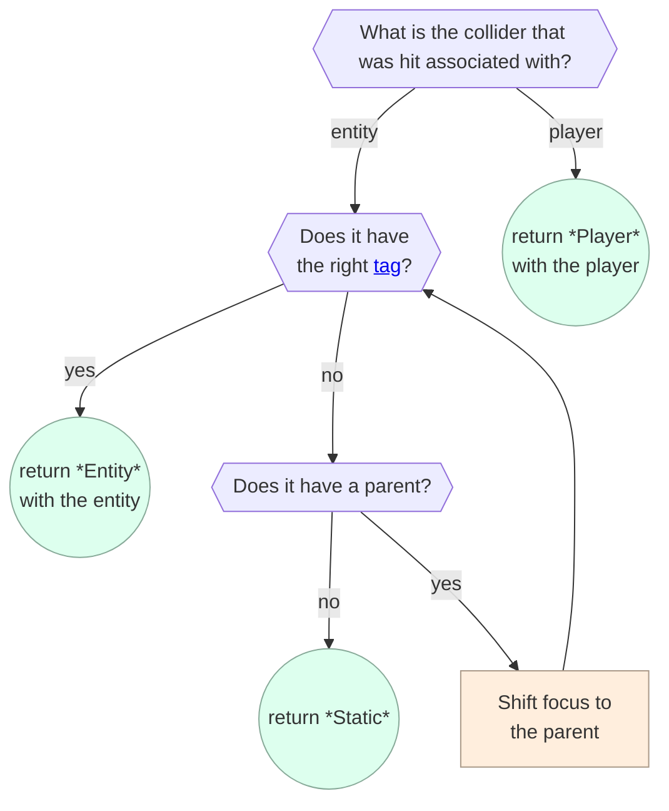

Here's the `RaycastHit` type, which shows the 3 bullets above, in code:
```ts
// Equivalent
type RaycastHit = {
  distance: number; // meters
  hitPoint: Vec3;
  normal: Vec3;
} & (
  | {
    targetType: RaycastTargetType.Static
  } | {
    targetType: RaycastTargetType.Entity;
    target: Entity;
  } | {
    targetType: RaycastTargetType.Player;
    target: Player;
  }
)
```

## Script Gizmo

For Codeblock scripts, the Script gizmo is an in-world gizmo that you can use to open up the Codeblock editor (only in VR).

In the desktop editor, using Typescript scripts, the Script Gizmo doesn't provide much utility. For more info see [file-backed scripts](#file-backed-scripts-fbs).

## Snap Destination Gizmo
**Description**: Designed to help position and orientate players that land on it using teleport locomotion. Has no effect for players using slide locomotion.

| Property | Type | Description
|---|---|---|
| Apply Orientation | `boolean` | Applies a rotation on the player that teleports onto the Snap Destination Gizmo

**Typescript**: Snap Destination Gizmos are referenced as the `Entity` class (with no special methods).

## Sound Gizmo
**Description**: Sound Recorders allow you to record audio for playback, but that's not the only type of audio gizmo in Horizon.
We have 3 different types:
- `Sound Recorder` found in the Gizmo menu. Lets creators record up to 20 minutes of their own audio.
- `Pre-made sound` found in the Sounds menu. Collection of Horizon provided sound effects, background audio, and music. Some are looping, others are not.
- `Audio Graph` obtained from your personal Assets library, such as those generated by [Gen AI](https://developers.meta.com/horizon-worlds/learn/documentation/desktop-editor/generative-ai-creation-tools/generative-ai-creation-audio-tool). Allows you playback audio generated by the Gen AI in the Desktop Editor.

**Sound Recorder**
| Property | Type | Description |
|---|---|---|
| Sound | `Play` and `Record` button | `Play` will attempt to play any audio on the Sound Record Gizmo. `Record` will start recording any sounds coming through your headset mic.|
| Loop |  `boolean` | Determines if the sound will repeat after it is finished.
| Play on Start | `boolean` | Determines if the sound will start to play when the world starts.
| Volume | `number` | Sets the volume of the Sound Recorder Gizmo. Values are between 0.0 and 1.0.
| Pitch | `number` | Sets the pitch of the Sound Record Gizmo. Values are between -24 and 24.
| Global | `boolean` | Determines whether the Sound Recorder Gizmo will play where everyone in the world can hear it. |
| Minimum Distance | `number` | Sets the distance from the Sound Recorder Gizmo before the volume levels starts to fade. Values between 0.0 and 1000.0 |
| Maximum Distance | `number` | Sets the distance from the Sound Recorder Gizmo before the volume completely fades out. Values are between 0.0 and 1000.0. |
| Send Audio Complete | `boolean` | Determines whether the Sound Record Gizmo sends an event when the audio is finished. |

**Pre-made Sound**
| Property | Type | Description |
|---|---|---|
| Preview | `Play` button | Lets creators hear a preview of the sound in Edit Mode. |
| Play on Start | `boolean` | Determines if the sound will start to play when the world starts.
| Play and Forget | `boolean` | (Effects sounds only) A performance enhancement that detaches playback from the sound gizmo location once played. Other copies of the sound can then be played by the gizmo at new locations.
| Play Limit | `number` | (`Play and Forget` only) The limit on the number of outstanding 'forgotten' copies of the sound that are still playing. Oldest still playing sound is stopped when active number of playing copies is reached.
| Volume | `number` | Sets the volume of the Pre-made Sound Recorder Gizmo. Values are between 0.0 and 1.0.
| Pitch | `number` | Sets the pitch of the Pre-made Sound Record Gizmo. Values are between -24 and 24.
| Global | `boolean` | Determines whether the Pre-made Sound Recorder Gizmo will play where everyone in the world can hear it. |
| Minimum Distance | `number` | Sets the distance from the Pre-made Sound Recorder Gizmo before the volume levels starts to fade. Values between 0.0 and 1000.0 |
| Maximum Distance | `number` | Sets the distance from the Pre-made Sound Recorder Gizmo before the volume completely fades out. Values are between 0.0 and 1000.0. |
| Send Audio Complete | `boolean` | Determines whether the Pre-made Sound Gizmo sends an event when the audio is finished. |

**Audio Graph**
| Property | Type | Description |
|---|---|---|
| Preview | `Play` button | Lets creators hear a preview of the sound in Edit Mode. |
| Loop |  `boolean` | Determines if the sound will repeat after it is finished. |
| Play on Start | `boolean` | Determines if the sound will start to play when the world starts. |
| Volume | `number` | Sets the volume of the Pre-made Sound Recorder Gizmo. Values are between 0.0 and 1.0. |
| Volume Randomness | `number` | Randomly adjust the Audio Graph Gizmo volume each play. Values are between 0.0 and 1.0. |
| Pitch | `number` | Sets the pitch of the Pre-made Sound Record Gizmo. Values are between -24 and 24. |
| Pitch Randomness | `number` | Randomly adjust the Audio Graph Gizmo pitch each play. Values are between 0.0 and 4.0. |
| Global | `boolean` | Determines whether the Pre-made Sound Recorder Gizmo will play where everyone in the world can hear it. |
| Minimum Distance | `number` | Sets the distance from the Pre-made Sound Recorder Gizmo before the volume levels starts to fade. Values between 0.0 and 1000.0 |
| Maximum Distance | `number` | Sets the distance from the Pre-made Sound Recorder Gizmo before the volume completely fades out. Values are between 0.0 and 1000.0. |
| Low-Pass Cutoff | `number` | Reduces the amplitude of higher frequency signals. Values are between  1 and 20000. |
| Send Audio Complete | `boolean` | Determines whether the Pre-made Sound Gizmo sends an event when the audio is finished. |

**Typescript**: Sound Gizmos are referenced [as()](#entity-as-method) the `AudioGizmo` class with the following properties and methods.

```ts
//Properties
pitch: WritableHorizonProperty<number>; //The audio pitch in semitones, which ranges from -24 to 24.
volume: WritableHorizonProperty<number, AudioOptions>; //The audio volume, which ranges from 0 (no sound) to 1 (full volume).

//Methods
play(audioOptions?: AudioOptions): void; //Plays an AudioGizmo sound.
stop(audioOptions?: AudioOptions): void; //Stops an AudioGizmo sound.
pause(audioOptions?: AudioOptions): void; //Pauses an AudioGizmo sound.

//Provides AudioGizmo playback options for a set of players.
export declare type AudioOptions = {
    fade: number; //The duration, in seconds, that it takes for the audio to fade in or fade out.
    players?: Array<Player>; //Only plays the audio for the specified players.
    audibilityMode?: AudibilityMode; //Indicates whether the audio is audible to the specified players.
};

enum AudibilityMode {
    AudibleTo = 0
    InaudibleTo = 1
}
```
| [Built-In CodeBlockEvent](#built-in-code-block-events) | Parameter(s) | Description  |
|---|---|---|
| `OnAudioCompleted` |  | Sent when an Sound Gizmo is finished playing or stopped. |

**Limitations**:
- Due to memory cost of storing audio data and CPU cost of spatial audio processing it is recommended 10 max audio graphs in scene.
- The `OnAudioCompleted` event is not sent when sounds loop back to the beginning.

## Spawn Point Gizmo
**Description**: Used to move players instantly to predetermined locations, includes a brief black transition scene. Can also affect camera view, player gravity, and speed.

| Property | Type | Description |
|---|---|---|
| Spawn on start | `boolean` | Determines if the Spawn Point Gizmo will be used to spawn players as they join the world. |
| Set Position Only | `boolean` | Determines if the Spawn Point Gizmo will rotate the player to match its rotation when it spawns them. |
| Player Gravity | `number` | Sets the gravity of each player to this value when this spawn is used. Values between 0.0 and 9.81. |
| Player Speed | `number` | Sets the speed of each player to this value when this spawn is used. Values between 0.0 and 45. |
| Force HWXS Camera | `None`, `Third Person`, `First Person`, `Orbit`, and `Pan` | Determines which camera view [Mobile/Web players](#player-device-type) will have after using the spawn (HWXS stands for Horizon Worlds Cross Screens) |

**Typescript**:  Spawn Point Gizmos are referenced [as()](#entity-as-method) the `SpawnPointGizmo` class with the following properties and methods.

```ts
//Properties
gravity: HorizonProperty<number>; //The gravity for players spawned using this gizmo.
speed: HorizonProperty<number>; //The speed for players spawned using this gizmo.

//Methods
teleportPlayer(player: Player): void; //Teleports a player to the spawn point.

//Example
this.entity.as(SpawnPointGizmo).gravity.set(9.81)
this.entity.as(SpawnPointGizmo).speed.set(4.5)
this.entity.as(SpawnPointGizmo).teleportPlayer(player)
```

**Notes**:
- If no spawn points have `Spawn on start` enabled then a spawn point will be picked at random.
- If multiple spawn points have `Spawn on start` enabled, one will be picked at random for each player entering the world.
- The blue button above the spawn point can be used to set a default spawn for yourself in Edit mode.

## Static Light Gizmo

**Description**: Emits static light that cannot be moved during run-time. Improved performance over [Dynamic Light Gizmo](#dynamic-light-gizmo).

| Property | Type | Description |
|---|---|---|
| Shape | `Cuboid`, `Ellipsoid`, `Disk`, or `Rectangle` | Determines the shape of the static light, affecting how the light is casted onto the surrounding geometry. `Cuboid` and `Ellipsoid` are omnidirectional, while `Disk` and `Rectangle` have a visual directional arrow.
| Color | `Color` | Sets the color of the light coming from the Static Light Gizmo.
| Intensity | `number` | Sets the intensity of the light emitted from the Static Light Gizmo. Values between 0.0 and 100.00 |

**Typescript**:  Static Light Gizmos are referenced simply as the `Entity` class.

## Sublevel Gizmo

**Description**: An entity that helps manage [sublevel spawning](#sublevels).

**Properties**: The first property is called "Sublevel Type", which can be set to `Deeplink` or `Exclude`:

* Use **`Deeplink`** in the world that will load in the sublevel (the *container*). You can then use this entity [as()](#entity-as-method) a [SublevelEntity](#sublevels) to stream the level in. When this setting is used, 2 more settings appear:
    * **Sublevel Initial State** determines the state of the sublevel at world-start. It can be `Active` (which means the sublevel is fully present to players), `Loaded` (meaning that the sublevel is fully ready, just waiting to be "shown"), or `Unloaded` (none of the data is present or ready). See [advanced spawning](#advanced-spawning-spawncontroller) for more information on these options.
    * **World Id** is the world that this entity will stream in (the sublevel). There is a thumbnail picture to click on that will open a "world selector".
* Use **`Exclude`** in a world that is meant to be streamed in (a *sublevel*). Any entities that are [children (or descendants)](#ancestors) of an "Exclude Sublevel" will not load when the sublevel is streamed into the "container world".
    * Example, in the sublevel world you can have a spawn point which is a child of an "Exclude Sublevel" gizmo; that makes it easy to test the sublevel world, but the spawn gizmo won't load in when the container world streams this world in.

**TypeScript**: When the sublevel entity has "Sublevel Type" set to "Deeplink" you can then use the entity [as()](#entity-as-method) a [SublevelEntity](#sublevels) to stream the level in.

## Text Gizmo
**Description**: The text gizmo is a 2D surface on which text can be rendered. It supports a wide variety of [markup](#text-gizmo-markup) commands that allows changing color, size, font, bold, italics, underline, vertical and horizontal offsets, line height, alignment, and [more](#supported-text-gizmo-tags).

| Property | Type | Description |
|---|---|---|
| Text | `string` | Sets the text displaying on the Text Gizmo. |
| Auto Fit | `boolean` | Automatically determines the size of the font. If disabled, you can set the size manually. |
| Fixed Font Size | `number` | Sets the font size of the text when `Auto Fit` is disabled. |
| Visible | `boolean` | Determines if the Text Gizmo is visible to players. |

**Notes**:
- When using fixed font size, the rendered size of text is a combination of the fixed font size and the scale properties of the text gizmo itself

**Typescript**: Text Gizmos are referenced as the `TextGizmo` class with the following properties.

```ts
//Properties
text: HorizonProperty<string>; //The content to display in the text label
```
### Using a Text Gizmo
The initial text of a text gizmo can be set in the Properties panel. Changing the text after that can be done via the `text` [read-write property](#horizon-properties) on the `TextGizmo` class, such as:

```ts
this.entity.as(TextGizmo).text.set('Hello World')
```

!!! note Auto Fit Property
    The text gizmo has the property **auto fit**, which is only settable in the Properties panel. When it is set to `true`, the font size will change to fit the scaled extents of the text gizmo. This is useful for making signs, for example; but, it can look weird to have all signs using slightly different text sizes. You'll have more control of the text, and have more consistency in the world, if you **turn auto fit *off***.

!!! note Text gizmos contribute to draw calls.

### Text Gizmo Limitations

The total length of the text, including all markup, cannot be longer than 1000 characters. If the text is longer than 1000 characters, the text will be truncated.

The text gizmo only supports the English characters (essentially whatever can be typed on an English keyboard without any modifier keys). This means that the text gizmo is not capable of displaying any of the following: á ê ï o ū ç ñ ¿ 月 😂, for example.

### Text Gizmo Markup

Horizon exposes Unity's TextMeshPro markup. The rest of this guide is a summary of [Unity's TextMeshPro documentation](https://docs.unity3d.com/Packages/com.unity.textmeshpro@4.0/manual/RichText.html).

### Text Gizmo Tags

Text markup is able to modify the contents (e.g. making all letters uppercase), styling (such as size or color), and layout (such as alignment, rotation, and spacing) of the text. Markup is specified using tags, which are a word surrounded in angle brackets (e.g. `<b>`). Once a tag is specified, all text that comes after it will have that attribute applied, until that tag "closes" by specifying the tag with a slash before the name (e.g. `</b>`).

!!! example
    `this is <b>bold</b> text`

    will render as

    > this is **bold** text

**Tags that are never *closed* stay active**. The bold attribute starts being applied once `<b>` is encountered and stops when `</b>` is encountered. The closing tag is optional, and if it is omitted, the attribute will continue to be applied until the end of the text.

!!! example
    `this is <b>bold text`

    will render as

    > this is **bold text**

#### Text Gizmo Tag Parameters

Some tags accept a parameter, which is specified after the tag name and an equals sign.

!!! example
    `this is <size=75%>small</size>`

    will render as

    > This is <span style="font-size:75%">small</span>

### Supported Text Gizmo Tags

![[ markup/TextGizmoTable.html ]]

## Trigger Gizmo

**Description**: Detects when a player or object enters or exits an area.

| Property | Type | Description |
|---|---|---|
| Enabled | `boolean` | Determines whether the Trigger Gizmo will detect any events. |
| Trigger On | `Players` or `Objects Tagged` | Sets whether the triggers response to players or objects with a specific tag. |
| Object Tag | `string` | If `Trigger On` is set to `Objects Tagged` then this is the required tag for an object to trigger an event.
| Selectable in Screen Mode | `boolean` | Determines whether [Mobile/Web players](#player-device-type)s will see an interaction option when near the Trigger Gizmo. |

Under the hood, triggers detect *enter* and *exit* using [collisions](#collisions). See the [trigger collisions](#trigger-collisions) section for details on when triggers can and can't detect entities.

**Typescript**:  Trigger Gizmos are referenced [as()](#entity-as-method) the `TriggerGizmo` class with the following properties.

```ts
//Properties
enabled: WritableHorizonProperty<boolean>; //Whether the Trigger is enabled.

//Example of connecting to a trigger entered event.
this.connectCodeBlockEvent(this.entity, CodeBlockEvents.OnPlayerEnterTrigger, (enteredBY) => {
    console.log('Player entered the world.', enteredBY.name.get());
})
```

| [Built-In CodeBlockEvent](#built-in-code-block-events) | Parameter(s) | Description  |
|---|---|---|
| OnPlayerEnterTrigger | `enteredBy: Player` | Sent each time a player has entered the trigger area. |
| OnPlayerExitTrigger | `exitedBy: Player` | Sent each time a player has exited the trigger area. |
| OnEntityEnterTrigger | `enteredBy: Entity` |  Sent each time an object has entered the trigger area. |
| OnEntityExitTrigger | `player: Player` | Sent each time an object has exited the trigger area. |
| "occupied"<sup>†</sup> | <nobr>`by: Player \| Entity`</nobr> | Sent when the first player (or entity) enters a trigger area. This is not a built-in codeblock like the others, you must create this as custom codeblock event. |
| "empty"<sup>†</sup> | <nobr>`by: Player \| Entity`</nobr> | Sent when the last player (or entity) exits the trigger area. This is not a built-in codeblock like the others, you must create this as custom codeblock event.|

†: The *occupied* and *empty* events in the table above are not currently exposed through `CodeBlockEvents`. To use them you you must allocate the events yourself, e.g.

![[ horizonScripts/secretTriggerCodeBlockEvents.ts ]]

**Limitations**: Using too many Trigger Gizmos can affect performance due to their impact on the physics system for collision detection.

### Trigger Collisions

Trigger detection is done at the [collider](#colliders) level.

**Players**

When a player-related collider enters/leaves a trigger set to [detect players](#trigger-gizmo) it sends the [OnEntityEnterTrigger or OnEntityExitTrigger](#trigger-gizmo) event *to the trigger* with the player as the argument.

**Entities**

When an entity-related collider (from a [mesh](#meshentity-class) or a [collider gizmo](#collider-gizmo)) enters/leaves a trigger set to [detect objects](#trigger-gizmo) Horizon will check to see if that entity has the matching tag; if so, it sends the [OnEntityEnterTrigger or OnEntityExitTrigger](#trigger-gizmo)event *to the trigger* with that entity. But then it also looks at every entity in the [ancestor chain](#ancestors) to see if any of those also have the tag. The event will get sent to the trigger for *all* entities in the ancestor chain that have the tag. This means that **when a group enters a trigger, the group *and* its children can cause `OnEntityEnterTrigger` events* as long as they have the right tags.

When a trigger send an [OnEntityEnterTrigger](#trigger-gizmo) event it checks to see if the trigger was previously unoccupied; if so, then the "secret" [occupied](#trigger-gizmo) is also sent to the trigger. Likewise, if this is an `OnEntityExitTrigger` event and the trigger is now unoccupied, then the "secret" [empty](#trigger-gizmo) event is also sent to the trigger.

## World Leaderboard Gizmo
**Description**: Used track and display *sorted* player scores in your world. See the [leaderboard section](#leaderboards) for full detail.

## World Promotion Gizmo
**Description**: Used to show a sign in a world that offers a player to "save the world for later" in the bookmarked worlds.

| Property | Type | Description |
|---|---|---|
| Promotion Type | `Save Panel` | This option cannot currently be changed. |
| Panel UI Mode | `Light Mode` or `Dark Mode` | Determines the color theme. Light vs dark refers to the background color of the gizmo.

**TypeScript**: World Promotion gizmos are referenced as `Entity` instances with no additional scripting capabilities.

# Assets

**Assets** represent data that can be created and used in a world.

**Assets never contain actual entities**. Instead, assets contain *data* such as a texture, text, mesh, or audio. Some asset types ([Template Assets](#template-asset) and [Legacy Asset Groups](#legacy-asset-group)) contain *instructions on how to create entities*. An asset may represent "a [grabbable](#grabbing-and-holding-entities) blue cone with a [script attached](#attaching-components-to-entities)". When you drag that asset out of the Assets panel (or [spawn](#spawning) the asset) it will create a new instance of a blue cone [MeshEntity](#meshentity-class) with the correct properties applied and script attached. You could drag out the asset again and get another new entity. When an asset is "dragged out" of the assets panel, we say the entities are **instantiated (from the asset)**. When an assets is spawned, we say the entities are **spawned (from the asset)**.

**Asset types**: There are various types of assets that are split into two categories:
* **Entity Asset Types**: Assets that are used to *create (configured) entities*.
* **Data Asset Types**: Assets that *provide data* (most of which are used to modify a [MeshEntity](#meshentity-class)).

Note: [3D Model](#3d-model-asset) is in both groups (although it can only be used as data, as a mesh, when there is exactly 1 mesh in the asset).

| Entity Asset Type | Entities Created<br/>([spawning](#spawning) or in-editor) | Where to [Create](#creating-assets) |
|---|---|---|
| [3D Model](#3d-model-asset) | [MeshEntity](#meshentity-class)<br/>or<br/>[Empty Object](#empty-object-and-groups) (with [MeshEntity](#meshentity-class) children) | Assets panel or [Creator Portal Assets section](https://horizon.meta.com/creator/assets/) |
| [Audio](#audio-asset) | [Sound Gizmo](#sound-gizmo) | [Gen AI](https://developers.meta.com/horizon-worlds/learn/documentation/desktop-editor/generative-ai-creation-tools/generative-ai-creation-audio-tool) |
| [Legacy Group](#legacy-asset-group) | Array of [Entity](#entities) | Right-click then "Create Asset" |
| [Template](#template-asset) | Array of [Entity](#entities) | Right-click then "Create Asset" |

| Data Asset Type | How to apply at runtime | Where to [Create](#creating-assets) |
|---|---|---|
| Single Mesh [3D Model](#3d-model-asset) | Use [setMesh](#3d-model-asset) on a [MeshEntity](#entities) | Assets panel or [Creator Portal Assets section](https://horizon.meta.com/creator/assets/) |
| [Material](#material-asset) | Use [setMaterial](#material-asset) on a [MeshEntity](#entities) | Assets panel |
| [Text](#text-asset-json) | Use [fetchAsData](#text-asset-json) on an `Asset` | Assets panel or [Creator Portal Assets section](https://horizon.meta.com/creator/assets/) |
| [Texture](#texture-asset) | Use [setTexture](#texture-asset) on a [MeshEntity](#entities) | Assets panel or [Creator Portal Assets section](https://horizon.meta.com/creator/assets/) |

## Creating Assets

In the Desktop editor there is the "Assets" panel. In this panel you can view, organize, edit, delete, and create assets.

**Create an asset in the Assets panel**: In the assets panel of the desktop editor click "Add New" and then choose from the dropdown. Here you can upload a [3D Model](#3d-model-asset), [Material](#material-asset), [Texture](#texture-asset), or [Text](#text-asset-json). You can also create a folder here to help manage all your assets.

**Upload to the (web) Creator Portal**: Go the the [Creator Portal Assets section](https://horizon.meta.com/creator/assets/) in a browser and select "Import". From there you can upload a [3D Model Assets](#3d-model-asset), [Texture Assets](#texture-asset), or [Text Assets](#text-asset-json).

**Create Asset from Editor Selection**: In the desktop editor, select some entities and then right-click. One of the options is "Create Asset". This is where to create [Template Assets](#template-asset) and [Legacy Asset Groups](#legacy-asset-group).

## Managing Assets

In the Assets panel and the [Creator Portal Assets section](https://horizon.meta.com/creator/assets/) you can edit assets, remove assets, create asset folders, move assets into asset folders, and so on.

**Sharing folders**: Shared folders make collaborating much easier. To share a folder go to the [Creator Portal Assets section](https://horizon.meta.com/creator/assets/), navigate to the folder, and click "Share". You can manage who the folder is shared with. Shared folders appear in the "Assets Panel" under the section "Shared With Me".

!!! warning Assets can be shared across worlds
    Using a [Template Asset](#template-asset) simplifies the process of updating reused assets.

## Referencing Assets (Props and IDs)

You need an instance of the `Asset` class in order to [spawn](#spawning), fetch [text data](#text-asset-json), or [modify the material/mesh/style/texture on a mesh](#meshentity-class). There are two ways to get an instance of `Asset`:
1. **Props**: Create a [Component property](#component-properties) with type `PropTypes.Asset` and then when the script is [attached to an entity](#attaching-components-to-entities) you can drag the asset from the Assets panel into the property slot in the Properties panel.
1. **Direct Allocation**: You can call `new Asset` with the asset id (which you can find by clicking on an asset in the Assets panel). The constructor takes an optional second argument if you want to instance a specific *version* of the asset (you can also find version ids when clicking on an asset and clicking "Version History"). Horizon **does not support JavaScript bigint notation** so you have to create a `bigint` from a `string`. So, you might instantiate an asset like:
      ```ts
      const myAsset = new Asset(BigInt("10000"))
      ```

      If you don't want the latest version you can do:
      ```ts
      const myAsset = new Asset(BigInt("10000"), BigInt("1"))
      ```

### Asset as() method

You can convert an `Asset` instance into its specific type using the asset `as()` method, which behaves just like the [Entity as() method](#entity-as-method).

For example:

```ts
const materialAsset: MaterialAsset = asset.as(MaterialAsset)
```

Once you call `as()` on an asset, you can store that "casted" asset (in a `let`, `const`, or `class` member) and you don't need to call `as()` on it again.

Note that `as()` returns the same asset back, preserving equality. Thus after the line above, `materialAsset === asset` would evaluate to `true`.

!!! danger The [Asset](#assets) `as()` method always succeeds! Do not cast to the wrong type!
    The `as()` method will always return an instance of the requested type. This means that you can convert a text asset into a `TextureAsset` without error or warning. However if you then attempt to use it in [setTexture](#texture-asset), you will get errors, warnings, or other unexpected behavior. Don't cast assets, with `as()` to classes they are not. **This is a brittle part of Horizon's TypeScript API that has no workaround.**

!!! danger Do not use TypeScript's built-in `as` operator on an `Asset`.
    The `as()` method on `Asset` actually does work at runtime; it is not just a type-cast. That means the following two lines are **not the same**:
    ```ts
    ✅ const material = asset.as(MaterialAsset)
    ❌ const material = asset as MaterialAsset
    ```

## 3D Model Asset

**Description**: A 3D Model Asset is 1, or many, 3D meshes with associated materials (and possibly textures).

**Creation**: To create a 3D model asset go to the Assets panel and click "Add New" or go to the [Creator Portal Assets section](https://horizon.meta.com/creator/assets/) and click "Import". Then add [fbx](https://www.autodesk.com/products/fbx/overview) files and images (typically created in digital content creation tools, DCCs, such as [Blender](https://www.blender.org/), [ZBrush](https://www.maxon.net/en/zbrush), or [Maya](https://www.autodesk.com/products/maya/overview) along with [GIMP](#https://www.gimp.org/) or [Adobe Substance Painter](#https://www.adobe.com/products/substance3d/apps/painter.html)). To learn about creating these files, **see the section on [Custom Model Import](#custom-model-import)**.

**Updating**: To update the contents of a [3D Model Asset], find the asset in the Assets panel, click it, and then in the Properties panel click "Replace asset". You can also go to the [Creator Portal Assets section](https://horizon.meta.com/creator/assets/), click the 3 dots on an asset and choose "edit".

**Instantiation**: When you drag out a 3D Model Asset from the Assets panel new entities are created in the world, depending on how many *root meshes* are in the asset:
* **1 Mesh**: A single [MeshEntity](#meshentity-class) is instantiated in the editor.
* **2 or More Meshes**: A an [Empty Object](#empty-object-and-groups) containing an array children (each of which is a [MeshEntity](#meshentity-class)) is instantiated in the editor.

**Spawning**: Regardless of the number of *root meshes*, a 3D Model Asset will spawn as `Array<Entity>`. The entities in the array can be casted to [MeshEntity](#meshentity-class) instances using the [Asset as() method](#asset-as-method).

**Usage**: Instantiating and spawning 3D Model Assets is where all the geometry in worlds come from. These entities will be used to create the world that players move around in, by creating [empty objects and groups](#empty-object-and-groups)  of them, [grabbables](#grabbing-and-holding-entities) to pick up, [attachables](#attaching-entities) to wear, [physics elements](#physicalentity-class) to interact with, and all other things in a world. These assets are how you create [MeshEntities](#meshentity-class), on which you can make [modifications via scripting](#meshentity-class).

### MeshEntity Class

Every [Entity](#entities) that has a 3D mesh (including the built-in "CMI Primitives") can be used as a `MeshEntity` (accessed using the [Asset as() method](#entity-as-method)). These come from [3D Model Assets](#3d-model-asset).

You can apply a [tint](#meshentity-style), [modify color brightness](#meshentity-style), [change the texture](#texture-asset), [change the material](#material-asset), or [change the mesh](#meshentity-setmesh).

| `MeshEntity` Class Member | Description |
|---|---|
| [setMaterial](#material-asset) | Change a material |
| [setTexture](#texture-asset) | Change the texture  |
| [setMesh](#meshentity-setmesh) | Change the mesh |
| [style](#meshentity-style) | Change the tint color, tint strength, and overall brightness of the material |

### MeshEntity Style

The [MeshEntity class](#meshentity-class) has a property `style` of type `EntityStyle`. You can use it for tweaking the visual presentation of the `MeshEntity`.

**The `style` property only works if the `MeshEntity` has a *texture***. So, for example, a VXC (vertex-lit) material cannot have its style modified.

`EntityStyle` has a few [read-write Horizon properties](#horizon-properties):

| `EntityStyle` read-write Horizon property | Type | Default | Notes |
|---|---|---|---|
| `brightness` | `number`<br/><nobr>(`0` to `100`)</nobr> | `1` | Luminance adjustment.<nobr><ul><li>`0` is black</li><li>`1` is no change</li><li>`100` is very bright</li></ul></nobr> |
| `tintColor` | [Color](#color) | white `(1,1,1)` | A color to mix into the base color. |
| `tintStrength` | `number`<br/><nobr>(`0` to `1`)</nobr> | `0` | The amount to mix `tintColor` into the base color..<nobr><ul><li>`0` is no tint</li><li>`1` is fully tinted</li></ul></nobr> |

**Mesh Style Equation**: When Horizon is rendering a pixel on a textured [MeshEntity](#meshentity-class), it computes a color (by looking up a pixel in the texture, a "texel"). Call that the `baseColor` is then augments that color by the equation (these are not all real functions in Horizon):
```ts
colorLerp(
  baseColor,
  tintColor.mul(luminance(baseColor)),
  tintStrength
).mul(brightness)
```
where `luminance` gets the brightness of the texel color and `colorLerp` acts just like [Vec3 lerp](#vector-linear-interpolation-lerp).

### MeshEntity setMesh

You can change the mesh on a [MeshEntity](#meshentity-class) while the world is running via the `setMesh` method:

```ts
// MeshEntity
setMesh(
  mesh: Asset,
  options: SetMeshOptions
): Promise<void>;
```

Which takes two arguments:
* **mesh**: An asset which needs to actually be a [3D Model Asset](#3d-model-asset) or you will get an error. If the asset has 1 mesh then it will replace the current mesh on the entity. If the asset has multiple root meshes, then the first one will be used for the replacement.
* **options**: An optional parameter to specify whether you also want to update the material as well (which defaults to `true`)
  ```ts
  type SetMeshOptions = {
    updateMaterial?: boolean;
  };
  ```

The method returns a `Promise<void>` which you can `await` for to know when the swap has occurred. Note that the swap is not instantaneous since the new mesh may have to be downloaded, have its lighting computed, have its [collider](#colliders) updated, etc.

## Texture Asset

**Description**: A Texture Asset is a 2D image (or set of images) that can be applied to [MeshEntities](#meshentity-class) or used in [Custom UIs](#custom-ui). You can convert an `Asset` to a `TextureAsset` using the [Asset as() method](#asset-as-method).

**Creation**: To create a texture asset go to the Assets panel and click "Add New" or go to the [Creator Portal Assets section](https://horizon.meta.com/creator/assets/) and click "Import". You can then import PNG (.png) files. If the texture is to be used with a [Custom UI Gizmo](#custom-ui-gizmo) then it should just be RGB. If it is to be used with `setTexture` (below) then it should match the [texture configuration of the material it will be paired](#custom-model-import) with. You can also create Texture Assets with [Gen AI Textures](https://developers.meta.com/horizon-worlds/learn/documentation/desktop-editor/generative-ai-creation-tools/generative-ai-creation-texture-tool), though be aware this feature is not yet available to all users.

!!! tip Power-of-two dimensions
    For best performance and memory usage, texture dimensions should be powers of two (e.g. 256x256, 512x1024, etc.).

**Usage**: Textures can be applied to [MeshEntities](#meshentity-class) via the `setTexture` method:

```typescript
// MeshEntity
setTexture(
  texture: TextureAsset,
  options?: SetTextureOptions
): Promise<void>;

type SetTextureOptions = {
  players?: Array<Player>;
};
```

The method returns a `Promise<void>` which you can `await` to know when the swap has occurred. The swap is not instantaneous since the texture may need to be downloaded and processed.

!!! tip Player-specific textures
    Using the `players` option lets you show different textures to different players. This is useful for things like player-specific UI elements or visual effects that should only be visible to certain players.

## Material Asset

**Description**: A Material Asset defines how a surface should be rendered, representing one of the [supported materials](#custom-model-import). You can convert an `Asset` to a `MaterialAsset` using the [Asset as() method](#asset-as-method).

**Creation**: Materials are typically created as part of [3D Model Assets](#3d-model-asset) when importing from DCCs like Blender or Maya. The Desktop editor also provides some built-in materials in the Asset Library.

**Usage**: Materials can be applied to [MeshEntities](#meshentity-class) via the `setMaterial` method:

```typescript
// MeshEntity
setMaterial(
  materialAsset: MaterialAsset,
  options?: SetMaterialOptions
): Promise<void>;

type SetMaterialOptions = {
  // Which material slot to update (for multi-material meshes)
  materialSlot?: number | string;
}
```

The method returns a `Promise<void>` which you can `await` to know when the swap has occurred. The swap is not instantaneous since the material may need to be downloaded and processed.

!!! warning Material slots
    If a mesh uses multiple materials, you must specify which slot to update using the `materialSlot` option. Slots can be referenced by index or by using the Unreal naming convention: a material name ending in `_skin##` will determine a slot index (e.g. `face_skin00` is slot `0`; `face_skin03` is slot `3`). You cannot specify a slot number higher than the number of materials in the original material.

    See more info here: https://developers.meta.com/horizon-worlds/learn/documentation/custom-model-import/creating-custom-models-for-horizon-worlds/multiple-materials-per-mesh

## Audio Asset

**Description**: Audio assets created [Sound Gizmos](#sound-gizmo) when instantiated or spawned.

**Creation**: The only way to create an Audio Asset is to use the [Gen AI](https://developers.meta.com/horizon-worlds/learn/documentation/desktop-editor/generative-ai-creation-tools/generative-ai-creation-audio-tool) feature in the Desktop editor. Note that currently **the Gen AI features are not available to all creators**.

**Usage**: Instantiate or [spawn](#spawning) the asset. Usage is then the same as a [Sound Gizmo](#sound-gizmo).

## Text Asset (JSON)

**Description**: Text Assets make it easy store (and version) `string` or [JSON](https://en.wikipedia.org/wiki/JSON) data. You could also paste the data into a TypeScript file, but Text Assets make it much easier to manage, share, version, etc.

**Creation**: To create a text asset go to the Assets panel and click "Add New" or go to the [Creator Portal Assets Section](https://horizon.meta.com/creator/assets/) and click "Import".

**Usage**: To use a text asset, first get it [as an Asset instance](#referencing-assets-props-and-ids). Then call `fetchAsData` on it:

```ts
// Asset
fetchAsData(
  options?: Partial<FetchAsDataOptions>
): Promise<AssetContentData>;
```

**fetchAsData options**: The optional `options` parameter in `fetchAsData` lets you specify if you want to "skip the cache":
```ts
type FetchAsDataOptions = {
  skipCache: boolean;
};
```

Skipping the caches means to fetch the latest data from the servers. If you don't provide the options then `skipCache=false` is used. Regularly fetching data with `skipCache=true` can greatly degrade the performance of your world.

**fetchAsData return type**: The `fetchAsData` function returns `Promise<AssetContentData>`. The `AssetContentData` class has two relevant methods:

```ts
// AssetContentData
asText(): string
asJSON<T = JSON>(): T | null
```

The `asText` method will return the JSON serialized (e.g. as if with [JSON.stringify](https://developer.mozilla.org/en-US/docs/Web/JavaScript/Reference/Global_Objects/JSON/stringify)).

The `asJSON` method returns `null` if the the asset is not a text asset with JSON. Otherwise it returns the JSON data casted to the type `T`. **`asJson()` does no work to ensure that the data is compatible with the type `T`**. You should do runtime checks to ensure that the data has the right structure before using it. We recommend included a type "tag" and version number in the JSON if possible, to ease these checks. This is the same advice we give for [persistent object data](#persistent-variable-object-data). See that section for more details on our advice.

## Template Asset

**Description**: Template Assets are similar to [Prefabs in Unity](https://docs.unity3d.com/Manual/Prefabs.html). They allow you to create an asset that you can instantiate, and then edit such that edits propagate to all instantiations (without losing any *overrides* on instantiations).

**Creation**: To create a Template Asset, select a number of entities in the desktop editor. Then right-click and choose "Create Asset". Fill out the form, with "Asset Type" set to "Template Asset". Read the documentation on [how file-backed scripts interact with template assets](#file-backed-scripts-fbs). Template assets can be nested.

**Updating**: Once you have a Template Asset (by creating one or having on shared with you), you can edit it. Find the asset in the Assets panel, right-click it, and choose *"Edit Template Definition*". This will reconfigure the entire desktop editor to be editing a new "mini world" which just the contents of the asset. Whatever you create / edit / delete here will end up being the new contents of the asset. When you are done, click "Save" (or click "Discard" if you don't want to keep your edits). It will ask you if you want to propagate the changes outward to instantiations of the asset. Also, in all worlds that use the asset, the "available asset updates" button will get a blue dot; you can use that button to accept the newer versions of the asset. **Do not override properties on children of an instantiated template asset.** When a template asset is updated, all instantiations will lose any overrides that are not on the *root*. If you want to set overrides on the "sub-elements" you should split the template into smaller one.

**Instantiation**: You can drag a template asset out from the Assets panel and into the world to instantiate its contents. You will get only one root entity: if the asset describes only 1 entity then that is wha will be instantiated; it the asset describes multiple entities then you will get an [Empty Object](#empty-object-and-groups) with all the entities as children. You can then modify the properties on the *root entity* (such as [attaching a component](#attaching-components-to-entities), [changing props](#component-properties), or adjusting any [entity settings](#all-gizmos-intrinsic-entity-types)). Those overrides will persist even if you update the asset (described above).

**Unlinking**: When you instantiate a template asset you can "unlink" the entities from the asset. This allows you to modify the internals, delete some pieces, etc. But when you do so, it will no longer get updates when the template is updated. If you want to do an unlink, select an instantiated root entity, right-click it and choose "Unlink instance root".

**Spawning**: If you [spawn](#spawning) a template asset into a world, you will get a single entity (if the asset only has 1) or you will get an [Empty Object](#empty-object-and-groups) with all the entities as children. In either case, the entity created is the [root entity](#deleting-simply-spawned-entities).

## Legacy Asset Group

**⚠️ Recommendation: do not use**. You should use [Template Assets](#template-asset) which support all the same functionality and more (which is why this kind is *"legacy"*).

**Description**: A *Legacy Asset Group* represents a collection of entities, property settings, and/or scripts. Unlike [Template Assets](#template-asset), they do not allow you to automatically update all instances whenever you make an edit.

**Creation**: To create a legacy asset group, select some assets in the Desktop Editor and then right-click. The dropdown will include the "Create Asset" option. In the dialogue that appears, change "Asset Type" to "Legacy Asset Group".

**Instantiation**: You can drag a legacy asset group out from the Assets panel and into the world to instantiate its contents.

**Spawning**: If you [spawn](#spawning) a legacy asset group into a world, the entities will be in the array in the same order that you selected the entities when you made the asset. The first entity you select, when making the asset, becomes the **root entity**.

# Custom Model Import

Horizon allows creators to import 3D meshes (with materials and texture) into their worlds, which become [3D Model Assets](#3d-model-asset) that can be instantiated (by dragging them out into the world from the Assets panel) or [spawned](#spawning) while a world is running.

Note that Horizon has two different rendering systems: [SubD and Meshes](#subd-vs-custom-models). When you [create a world](#creating-a-world) you pick one you want to use. Custom models cannot be imported into a **SubD world**.

To use custom models, see the "creating" notes in the [3D Model Assets](#3d-model-asset) section. You upload FBX files and png files to create a single asset (which may include multiple separate meshes / objects). The meshes are instantiated as the [MeshEntity class](#meshentity-class) which can be [tinted and modified with scripting](#meshentity-style).

The guides for creating custom models are here:

https://developers.meta.com/horizon-worlds/learn/documentation/custom-model-import/getting-started-with-custom-model-import/

There are a number of supported material types:

https://developers.meta.com/horizon-worlds/learn/documentation/custom-model-import/creating-custom-models-for-horizon-worlds/materials-guidance-and-reference-for-custom-models

!!! note No post-processing, custom shaders, normal maps, rigs, skinning, baked animations, LODs, mipmaps, or custom particle effects.
    Currently there are no post-process rendering options which makes things like bloom, motion blur, sepia, etc impossible. Likewise, you cannot write custom shaders or use normal / bump / displacement maps. Other advanced features such as rigging, skinning, LODs, mipmaps, terrain, etc are currently unavailable. Emissive materials will look bright but don't actually contribute to the ambient [lighting](#horizon-lighting).

## SubD vs Custom Models

Horizon has two different mesh+rendering systems. They cannot be mixed; you must choose which you want to use when [creating a world](#creating-a-world). *If you find any workarounds to mix them in one world, you may experience unexpected and unpredictable results.*

1. **SubD ("primitives")** - This is the original "legacy" system in Horizon. Worlds are created solely using primitive shapes (cub, sphere, cylinder, cone, etc). The primitives are implement using [subdivision](https://en.wikipedia.org/wiki/Subdivision_surface); you'll notice that as you get closer to the shapes they will subdivide and become smoother and smooth. Since Horizon uses [vertex lighting](#horizon-lighting) this means that [static lights](#static-light-gizmo) and [dynamic lights](#dynamic-light-gizmo) can appear to have decent spatial resolution.
2. **Custom Models ("tri-mesh")** - This system uses a more standard rendering pipeline of triangular mesh (tri-mesh) models with materials and textures. Here you can make detailed meshes (and bake geometric detail into textures), make transparent meshes, create custom colliders, offset pivots, and more.

### Horizon Lighting

Horizon uses [vertex lighting](https://en.wikipedia.org/wiki/Gouraud_shading). You'll notice that [dynamic lights](#dynamic-light-gizmo) (e.g. if you make a flashlight) don't look good on your meshes unless you tessellate sufficient (cut triangles into smaller triangular to create a higher density of vertices).

Horizon has a custom built [global illumination (GI)](https://en.wikipedia.org/wiki/Global_illumination) system that calculates [ambient occlusion (AO)](https://en.wikipedia.org/wiki/Ambient_occlusion) (so that meshes self-shadow) as well as color bounce and color bleed. All of this lighting information is baked onto the meshes and into light probes (some of which is stored in the [world snapshot](#world-snapshot)). This is one of the main reasons that [spawning](#spawning) is slow; it is computing the lighting. [Sublevel streaming](#sublevels) is so much faster because lighting is pre-computed at the (static) world level.

If you want to create meshes that *disable* Horizon's GI system then you should use the *unlit* material:

https://developers.meta.com/horizon-worlds/learn/documentation/custom-model-import/creating-custom-models-for-horizon-worlds/materials-guidance-and-reference-for-custom-models#unlit-materials

# Scripting

Scripts are how you create dynamism in worlds. You use them to create interactivity and movement. You use scripts to make something simple like a door that opens when you approach it as well as the most complex things, such as an entire complex team-vs-team shooter game (which would use many separate scripts).

**TypeScript**: Scripts are written in [TypeScript](https://www.typescriptlang.org/). They can be edited in the Desktop Editor as well as the scripts web tool (click [here](https://horizon.meta.com/creator/worlds_all_) and then select a world and then select "Scripts").

**Code Blocks**: Horizon also has a drag-and-drop scripting system called "Code Blocks" that are only editable in VR (and outside the scope of this document).

**Components and Files**: In scripts you define [Component](#components) classes that you can attach to `Entities` in the Desktop editor. You can specify [properties](#component-properties) ("props") in the `Components` that will show in the Properties panel in the Desktop editor, allowing you to set and change the properties in the editor, per-entity. Scripts can contain other code too, which is executed [when files are loaded](#script-file-execution). Components have a detailed [lifecycle](#component-lifecycle) that execution through the [frame](#frame-sequence).

**Core types**: Component instances communicate with one another and [the world](#built-in-code-block-events) by [sending and receiving events](#communication-between-components). There are many types in Horizon, but you'll most often use the core game types: [Entity](#entities), [Player](#players), [Asset](#assets), [Component](#components), and [World](#world-class); the core data types: [Vec3](#vec3) (for position and scale), [Color](#color), and [Quaternion](#quaternion) (for rotations); and the event types: [LocalEvent](#local-events), and [NetworkEvent](#network-events).

## Creating and Editing Scripts

You can create scripts by using the create button in the scripts dropdown or simply creating a new file in the scripts folder. Click the [≣] button in the editor and then "Launch TypeScript Editor". You can then create and edit files. Note that script-editing behaves quite differently depending on if [file-backed scripts](#file-backed-scripts-fbs) are enabled.

!!! warning Editing a script while the editor is playing a world **reloads that file**.
    This is often useful, but it can cause surprises with only part of the world reloading. You may need to restart the world for certain efforts. Read about [file execution](#script-file-execution) for more information.

### Syncing Scripts

When you create, edit, or delete scripts in a world's scripts folder, Horizon automatically tracks and syncs those edits to the [world snapshot](#world-snapshot).

!!! tip If syncing doesn't appear to be working, delete the  *.editor* file, leave world, and come back.

### Scripts in Source Control

When you open a world in the editor, Horizon checks to see if the scripts match what is saved in the [world snapshot](#world-snapshot). If they don't match, it will ask if you want to update the world with the scripts you have in the folder. Thus, the scripts folder acts like an "auto-sync directory". This means that you can put a git repo in the scripts folder, share the same repo with different "forks" of a world, use submodules to share scripts, and more!

## Horizon Properties

Most data in the Horizon [scene graph](#scene-graph) is accessed via *Horizon Properties*:

```ts
const pos = entity.position.get()
otherEntity.position.set(pos)
```

Properties can be
1. **read-only**: only a `get()` method. Uses `ReadableHorizonProperty`.
1. **write-only**: only a `set()` method. Uses `WritableHorizonProperty`.
1. **read-write**: `get()` and `set()` methods. Uses `HorizonProperty`.

**Calling `set` on a Horizon property does *not* change the value immediately**. See the section on [scene graph mutations](#scene-graph-mutations) for the details.

There is an additional class `HorizonSetProperty` which is used for managing properties that act like Sets such as [entity tags](#entity-tags). You can `get()` and `set(values)` the values; additionally there are methods for `length()`, `contains()`, `clear()`, `add(value)`, and `remove(value)`. Note that the `HorizonSetProperty` is meant to act like a `Set`. However the `get()` and `set()` methods both use arrays, for convenience and simplicity.

!!! example Horizon Property Example
    Here is some of the [`PhysicalEntity`](#physicalentity-class) class:

    ```ts
    class PhysicalEntity extends Entity {
      gravityEnabled: WritableHorizonProperty<boolean>
      locked: HorizonProperty<boolean>
      velocity: ReadableHorizonProperty<Vec3>
      // ...
    }
    ```

    From the above definition we can discern that we can do the following with a physical entity:

    * `set` if is gravity enabled, as a `boolean`, but can't get the current setting.
    * `set` if it is locked, as a `boolean`, and `get` if it is locked.
    * `get` the current velocity, as a `Vec3`, but not set the velocity (instead, you must use [forces](#applying-forces-and-torque)).

!!! info Writable properties may accept a second argument.
    Consider this snippet of the [AudioGizmo](#sound-gizmo) class

    ```ts
    class AudioGizmo extends Entity {
      pitch: WritableHorizonProperty<number>;
      volume: WritableHorizonProperty<number, AudioOptions>;
      // ...
    }
    ```

    We can `set` the current pitch and volume (but not get them):

    ```ts
    audioGizmo.pitch.set(12)
    audioGizmo.volume.set(0.5)
    ```

    The `set()` on `volume` takes an additional second parameter of type `AudioOptions`, allowing further configuration (duration of the fade, in this case).

    ```ts
    audioGizmo.volume.set(0.5, { fade: 1 })
    ```

### Horizon Property Subtleties

!!! warning Horizon Property's `set()` is not immediate.
    When you `set` a Horizon property the value is not immediately saved back to the [scene graph](#scene-graph). This allows different scripts to all "see the same state of the world" regardless of what order they run in. This means that if you `get` a value right after setting it that you will still get the old value.

    In the following code `pos1` and `pos2` will have the same value.

    ```ts
    const pos1 = entity.position.get()
    entity.position.set(Vec3.zero)
    const pos2 = entity.position.get()
    ```

    Read about the [frame sequence](#frame-sequence) to learn more about when properties update.

    !!! tip Track your scene graph value updates when needed.
        If you need to know values after `set`ting but before they are committed to the scene graph, you should track the values manually (such as in a class variable).

!!! danger Never modify the result of `get()`. Create a new instance, or [clone()](#copying-vs-mutating-methods), first.
    **Never mutate the result of a `get()`.** Don't do direct field mutation (e.g. `v.x += 4` on a vector) or use [mutating methods](#copying-vs-mutating-methods) such as `v.addInPlace(w)` or `v.copy(w)`. These **will "corrupt" the property value**.

    Horizon properties cache their values until the scene graph is updated (see [frame sequence](#frame-sequence) for when). This means that `get()` keeps returning the same value until the update occurs. The following code is then dangerous:

    ```ts
    // BAD #1!
    const p = entity.position.get()
    p.x += 10

    // BAD #1!
    const p = entity.position.get()
    p.addInPlace(new Vec3(0, 10, 0))
    ```

    If any code now reads that object's position it will get the wrong value, until the next time the property is updated in the [frame sequence](#frame-sequence).

    You should always `clone` a Horizon property's value before modifying it (or add a [method that creates a new value](#copying-vs-mutating-methods)).

    ```ts
    // OK #1
    const p = entity.position.get().clone()
    p.x += 10

    // OK #2
    const p = entity.position.get().add(new Vec3(0, 10, 0))
    ```

!!! danger [TypeScript's built-in class property setters and getters](https://www.typescriptlang.org/docs/handbook/2/classes.html#getters--setters) do not work with Horizon properties.
    Horizon does not use standard TypeScript properties. You must do
    ```ts
    entity.position.set(newPosition)
    ```

    and will get an error if you do:

    <pre class="language-ts ts"><span class="errorCode"><code>entity.position</code></span><span><code> = newPosition</code></span></pre>

## Types

There are many TypeScript types in Horizon; however, there are a few that form the backbone of most scripts:

| Type | Description |
|---|---|
| [Component](#components)  | Add interactivity and logic to a world (by creating a [subclasses](#component-class) and attaching it to an entity). |
| [World](#world-class) | Information and methods related to the current [instance](#instances). |
| [Entity](#entities) | A [node](#entities) in the [scene graph](#scene-graph) with intrinsic attributes and behavior. There are many [subtypes](#entity-types) available via [entity.as()](#entity-as-method). |
| [Player](#players) | A [player](#players) in the world ([instance](#instances)), including the "[server player](#server-player)" and [NPC players](#npc-gizmo). |
| [Asset](#assets) | Data that lives outside the scene graph (such as [text blobs](#text-asset-json), [textures](#texture-asset), and ["prefabs"](#template-asset)). |
| [Vec3](#vec3) | A "3D quantity" which can be used to represent [position](#position), [velocity, acceleration, force, torque](#physics), [scale](#scale), and more. |
| [Quaternion](#quaternion) | An abstract mathematical object primarily used for representing *rotations*. |
| [Color](#color) | An RGB Color with each component between 0 and 1. |

**Construction / new**: `Component`s, `Entity`s, `Player`s, and the `World` are all created by the system. You should never instantiate these directly with `new`. You can (and will) instantiate `Vec3`, `Quaternion`, and `Color`. You can allocate `Asset`s directly with their asset ids.

**Equality comparison**: `Entity` and `Player` can be compared directly with `===` and `!==`; these have been implemented to compare their underlying `id`s. All other types will use built-in TypeScript equality checks. `Vec3`, `Quaternion`, and `Color` implement [Comparable<T>](#comparable-interface)

### Comparable Interface
`Vec3`, `Quaternion`, and `Color` implement `Comparable<T>` which provides the methods `equal(other: T): boolean` and `equalApprox(other: T, epsilon?: number): boolean`.

**Epsilon**: represents the maximum distance the two can be apart and still be considered equal (it defaults to a small number around `1e-6` which is 0.000001).

All three classes also implement static versions of these methods. For clarity here is a subset of the `Vec3` class:

```ts
class Vec3 implements Comparable<Vec3> {
  equals(vec: Vec3): boolean;
  equalsApprox(vec: Vec3, epsilon?: number): boolean;

  static equals(vecA: Vec3, vecB: Vec3): boolean;
  static equalsApprox(vecA: Vec3, vecB: Vec3, epsilon?: number): boolean;

  // ...
}
```

!!! example Example: Comparing Vec3 instances
    ```ts
    const a = new Vec3(1, 2, 3)
    const b = new Vec3(1, 2, 3)

    console.log(a === b)            // false ❌
    console.log(a.equal(b))         // true  ✅

    const c = new Vec3(1, 2, 3.000000001)

    console.log(a.equal(c))         // false ❌
    console.log(a.equalApprox(c))   // true  ✅
    ```

If you compare `Vec3`, `Quaternion`, and `Color` with `===` or `!==` then you are doing *referential* equality which means "is this the exact same instance?". In the above example `a === b` is `false` because `a` and `b` are different class instances (even though they represent the same vector); however `a === a` is `true` because both sides are the same class instance (the same *reference*).

### Copying vs Mutating Methods

`Vec3`, `Quaternion`, and `Color` all implement a number of patterns around mutability. This section only refers to those 3 classes.

1. **inPlace methods**: methods that end with the suffix `...InPlace` will mutate the `this` they are called on. Thus `vec.mulInPlace(2)` is the same as `vec.x *= 2; vec.y *= 2; vec.z *= 2`. In place methods return `this` for convenience (chaining operations).
1. **new by default**: in contrast to the above point, if a method *does not end with `...InPlace` then it creates a *new* instance. Thus `vec.mul(2)` is the same as `new Vec3(vec.x * 2, vec.y * 2, vec.z * 2)`. The one exception is `copy()`.
1. **copy(input)**: this method should really be called `copyInPlace`. It takes the `input` argument and makes `this` be `equal()` to it. It returns `this` again for convenience (chaining operations). Thus `vec.copy(other)` is the same as `vec.x = other.x; vec.y = other.y; vec.z = other.z`.
1. **clone()**: creates a new equivalent instance ([which would return true with `equal()` but not `===`](#comparable-interface)). Thus `vec.clone()` is the same as `new Vec3(vec.x, vec.y, vec.z)`.
1. **out argument**: some methods (e.g. `Vec3.add`) take an optional `out` argument. If the `out` argument is provided then the result is "created" inside of that argument (similar to `out.copy(result)`) and also returned. If the *out* argument is not provided then a new instance is created and returns. Thus `Vec3.add(a, b)` is the same as `a.add(b)`, whereas `Vec3.add(a, b, result)` is equivalent to `result.copy(a).addInPlace(b)`.

!!! danger Don't mutate the result of a [Horizon Property](#horizon-properties) `get()`.
    Mutating the result of a property `get()` -- either by mutating a field, such as `v.x += 4` on a vector or via an *in place* method such as `v.addInPlace(w)` or `v.copy(w)` -- will cause the property to [report the wrong value](#horizon-property-subtleties) to future `get()`s.

### Vec3

The `Vec3` class represents a 3-dimensional quantity which is usually a 3D [position](#position). It can also be used to represent an [offset](#offsets---move-rotate-and-scale), [velocity, force, torque](#physics), [scale](#scale), [Euler Angles](#euler-angles), and more.

#### Vector Creation

`Vec3s` can be created in several ways:

```ts
// Direct construction
const vec = new Vec3(1, 2, 3)

// Static convenience vectors
const origin = Vec3.zero      // ( 0,  0,  0)
const unit = Vec3.one         // ( 1,  1,  1)
const right = Vec3.right      // ( 1,  0,  0)
const up = Vec3.up            // ( 0,  1,  0)
const forward = Vec3.forward  // ( 0,  0,  1)
const down = Vec3.left        // (-1,  0,  0)
const down = Vec3.down        // ( 0, -1,  0)
const forward = Vec3.backward // ( 0,  0, -1)
```

#### Vector Properties

* `x: number` - The magnitude along the X axis
* `y: number` - The magnitude along the Y axis
* `z: number` - The magnitude along the Z axis

#### Vector Operations

`Vec3` has the `equal(other: Vec3)` and `equalApprox(other: Vec3, epsilon?: number)` methods from [Comparable<T>](#comparable-interface), and their `static` counterparts. It also has `copy(other)` and `clone()` [methods](#copying-vs-mutating-methods).

`Vec3`s support many common mathematical operations which support both [copying and mutating versions](#copying-vs-mutating-methods):

```ts
const v1 = new Vec3(1, 0, 0)
const v2 = new Vec3(0, 1, 0)

// Addition and subtraction
const sum = v1.add(v2)       // (1,  1, 0)
const diff = v1.sub(v2)      // (1, -1, 0)

// Scalar multiplication and division
const doubled = v1.mul(2)    // (2,   0, 0)
const halved = v1.div(2)     // (0.5, 0, 0)

// Length operations
const length = v1.magnitude()           // 1
const lengthSqr = v1.magnitudeSquared() // 1

// Normalization (makes length 1)
const normalized = v1.normalize() // (1, 0, 0)

// Vector products
const dot = v1.dot(v2)       // 0
const cross = v1.cross(v2)   // (0, 0, 1)

// Get distance between vectors
const dist = v1.distance(v2)           // 1.414...
const distSqr = v1.distanceSquared(v2) // 2
```

The following table assumes that `v`, `w`, `r`, and `out` are `Vec3`s; `s` and `n` are `number`s.
| Operation  | Code | Math | Description |
|---|---|---|---|
| Addition | `r = v.add(w)`<br/>`v.addInPlace(w)`<br/>`Vec3.add(v, w, out)` | $$\vec v + \vec w$$ | Get the sum of two vectors. |
| Subtraction | `r = v.sub(w)`<br/>`v.subInPlace(w)`<br/>`Vec3.sub(v, w, out)` | $$\vec v - \vec w$$ | Get the difference of two vectors. |
| Scalar Multiplication | `r = v.mul(w)`<br/>`v.mulInPlace(w)`<br/>`Vec3.mul(v, s, out)` | $$\vec v s$$ | Scale a vector. |
| Scalar Division | `r = v.div(w)`<br/>`v.divInPlace(w)`<br/>`Vec3.div(v, s, out)` | $$\vec v \frac{1}{s}$$ | Inverse-scale a vector. |
| Component-wise Multiplication | `r = v.componentMul(w)`<br/>`v.componentMulInPlace(w)` | $$\vec v \otimes \vec w$$ | Multiply the two vectors component-by-component. |
| Component-wise Division | `r = v.componentDiv(w)`<br/>`v.componentDivInPlace(w)` | $$\vec v \oslash \vec w$$ | Divide the two vectors component-by-component. |
| Magnitude (Length) | `n = v.magnitude()` | $$\|\vec v\|$$ | Compute the Euclidean magnitude (length or norm) of the vector. |
| Magnitude (Length) Squared | `n = v.magnitudeSquared()` | $$\|\vec v\|^2$$ | Compute the Euclidean magnitude (length or norm) squared of the vector. |
| Normalize | `r = v.normalize()`<br/>`v.normalizeInPlace()`<br/>`Vec3.normalize(v, out)` | $$\frac{\vec v}{\|\vec v\|}$$ | Divide a vector by its length to product a vector with a length of 1 (in the same direction). Exception: the zero-vector normalizes to the zero-vector. |
| Distance | `n = v.distance(w)` | $$\|\vec v - \vec w\|$$ | The (Euclidean) distance between `v` and `w`. |
| Distance Squared | `n = v.distanceSquared(w)` | $$\|\vec v - \vec w\|^2$$ | The squared (Euclidean) distance between `v` and `w`. |
| Dot Product | `n = v.dot(w)`<br/>`n = Vec3.dot(v, w)` | $$\vec v\cdot \vec w$$ | The [dot product](#dot-product) of `v` and `w`. |
| Cross Product | `r = v.cross(w)`<br/>`v.crossInPlace(w)`<br/>`Vec3.cross(v, w, out)` | $$\vec v\times \vec w$$ | The [cross product](#cross-product) of `v` and `w`. |
| Reflection | `r = v.reflect(w)`<br/>`v.reflectInPlace(w)` | $$\vec v - \frac{2(\vec v \cdot \vec w)}{\|\vec w\|^2}\vec w$$ | [Reflect](#vector-reflect) `v` across `w`. |
| Lerp | `Vec3.lerp(v, w, s, out)` | $$\vec v + (\vec w - \vec v)s$$ | Compute the [linear interpolation](#vector-linear-interpolation-lerp) `v` and `w` the amount `s`.

#### Dot Product

The **dot product** is a fundamental vector operation that multiples the lengths of the two vectors together and then multiples in a "sameness value"; that value is 1 if they are parallel, 0 if they are perpendicular, and -1 if the are facing opposite directions (anti-parallel). If the two vectors both have length 1 then the dot product gives you a number between -1 and 1. The length of the dot product in general is $$|\vec v\cdot \vec w| = |\vec v||\vec w|\cos\theta$$ where $\theta$ is the angle between the two vectors.

Common uses for dot product include:
* Determining if vectors are **perpendicular** (dot product is 0)
* Testing if vectors are pointing in **similar directions** (dot product > 0)
* Testing if vectors are **pointing apart** (dot product < 0)
* Finding the **angle between** vectors. The angle (in radians) between `v` and `w` is $$\arccos\left(\frac{\vec v\cdot \vec w}{|\vec v|\, |\vec w|}\right)$$ which in code is
```ts
Math.acos(v.dot(w).div(v.magnitude() * w.magnitude()))
```
* Calculating the **projection** of one vector onto another. To find the vector you get when "flattening" `v` onto `w` you do $$\frac{\vec v \cdot \vec w}{|\vec w|^2}\vec w$$ which in code is
```ts
w.mul(v.dot(w) / w.magnitudeSquared())
```

The diagram below shows the "projection of `v` only `w`" as the orange arrow; it's like the "shadow" of `v` on `w`.
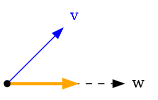

#### Cross Product

The cross product produces a new vector that is perpendicular to both input vectors. Its length is $$|\vec v\times \vec w| = |\vec v||\vec w|\sin\theta$$ where $\theta$ is the angle between the two vectors.

This is especially useful for:
* Finding perpendicular directions
* Determining surface normals
* Creating coordinate systems (e.g. finding the `right` vector from `up` and `forward`).

!!! tip Cross product order matters.
    The cross product is not commutative: `up.cross(forward)` produces `right`, whereas `forward.cross(up)` produces `left`.

```ts
const right = new Vec3(1, 0, 0)
const up = new Vec3(0, 1, 0)

// Cross product returns a vector perpendicular to both inputs
const forward = right.cross(up)    // (0,  0,  1)
const backward = up.cross(right)   // (0,  0, -1)

// Building a coordinate system
const normal = surfaceNormal.normalize()
const tangent = normal.cross(Vec3.up).normalize()
const bitangent = normal.cross(tangent)

// Static method with optional output vector
const result = new Vec3(0, 0, 0)
Vec3.cross(right, up, result)  // Stores result in existing vector
```

#### Vector Reflect

Vector reflection, via `v.reflect(n)`, calculates how a vector bounces off a surface. Given a vector `n`, it acts like that vector is pointing directly out from a surface. Then it takes the `v` and gives the direction after `v` "bounces" off the surface.

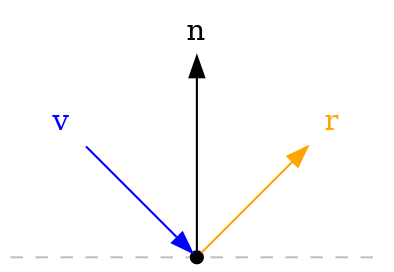

Vector reflection is most often used for:
* [Collision](#collision-events) calculations
* Physics simulations
* Ray calculations

The code `v.reflect(n)` is equivalent to
```ts
v.sub(n.mul(2 * v.dot(n) / n.magnitudeSquared()))
```
which in math is:
$$\vec v - 2\frac{\vec v \cdot \vec n}{\|\vec n\|^2}\vec n$$

#### Vector Linear Interpolation (Lerp)

Linear interpolation is the act of smoothly blending between two values (linearly) and is usually abbreviated as "Lerp" (<u>L</u>inear int<u>erp</u>olation).

**Blend value**: Lerp takes a start a value, an end value, and a "blend" number. If the blend value is 0 then you get back the start value. If the blend value is 1 then you get the end value. A blend value of 0.5 gives you the value halfway between the start and the end. A blend value of 0.25 gives the point one-fourth of the way from the start to the end. And so on.

```ts
const start = new Vec3(0, 0, 0)
const end = new Vec3(10, 0, 0)

const mid = Vec3.lerp(start, end, 0.5)        //  (5, 0, 0)
const nearStart = Vec3.lerp(start, end, 0.3)  //  (3, 0, 0)
const atEnd = Vec3.lerp(start, end, 1.0)      // (10, 0, 0)
```

### Color

The `Color` class contains an RGB (red, green, blue) color with each component between 0 and 1. The class allows color space conversion (from [HSV](#color-space-conversions-hsv)), [hex colors](#hex-colors), and [operations](#color-operations) that can be used for effects such as [blending and filtering](#color-blending).

**No alpha**: The `Color` class does not have an `alpha` component (transparency). It is possible to use alpha with [Custom UI](#uinode-types) and with [meshes](#custom-model-import) but those alpha values are *not* part of the `Color` class.

#### Creation

Colors can be created in several ways:

```ts
// Direct construction with RGB values (0-1)
const red = new Color(1, 0, 0)
const purple = new Color(0.5, 0, 0.5)

// Static convenience colors
const r = Color.red    // (1, 0, 0)
const g = Color.green  // (0, 1, 0)
const b = Color.blue   // (0, 0, 1)
const w = Color.white  // (1, 1, 1)
const k = Color.black  // (0, 0, 0)

// From hex string
const fromHex = Color.fromHex("#ff0000")  // (1, 0, 0)

// From HSV (hue, saturation, value)
const fromHSV = Color.fromHSV(new Vec3(0, 1, 1))  // red
```

The `fromHex` method only supports 6-digit colors which must be preceded by the `#` mark.

#### Color Properties

* `r: number` - The red component (0 to 1)
* `g: number` - The green component (0 to 1)
* `b: number` - The blue component (0 to 1)

#### Color Operations
`Color` has the `equals(other: Color)` and `equalsApprox(other: Color, epsilon?: number)` methods from [Comparable<T>](#comparable-interface), and their `static` counterparts. It also has `copy(other)` and `clone()` [methods](#copying-vs-mutating-methods).

Colors support several common operations which have both copying and mutating versions:

```ts
const c1 = new Color(1, 0, 0)
const c2 = new Color(0, 1, 0)

// Addition and subtraction
const sum = c1.add(c2)       // (1, 1, 0)
const diff = c1.sub(c2)      // (1, -1, 0)

// Scalar multiplication and division
const darker = c1.mul(0.5)   // (0.5, 0, 0)
const brighter = c1.div(0.5) // (1, 0, 0) - clamped to 1

// Component-wise multiplication
const mixed = c1.componentMul(c2)  // (0, 0, 0)

// Color space conversions
const hsv = c1.toHSV()       // (0, 1, 1)
const hex = c1.toHex()       // "#ff0000"
const vec = c1.toVec3()      // Vec3(1, 0, 0)
```

The following table assumes that `c`, `d`, and `out` are `Color`s; `s` is a number; `v` is a `Vec3`.

| Operation | Code | Description |
|---|---|---|
| Addition| `r = c.add(d)`<br/>`c.addInPlace(d)`<br/>`Color.add(c, d, out)` | Adds two colors component-wise. |
| Subtraction | `r = c.sub(d)`<br/>`c.subInPlace(d)`<br/>`Color.sub(c, d, out)` | Subtracts colors component-wise. |
| Scalar Multiplication | `r = c.mul(s)`<br/>`c.mulInPlace(s)`<br/>`Color.mul(c, s, out)` | Multiplies each component by a scalar. |
| Scalar Division | `r = c.div(s)`<br/>`c.divInPlace(s)`<br/>`Color.div(c, s, out)` | Divides each component by a scalar. |
| Component-wise Multiplication | `r = c.componentMul(d)`<br/>`c.componentMulInPlace(d)` | Multiplies two colors component-by-component. Useful for color filtering, e.g. `color.componentMul(new Color(0, 0.5, 1))` "deletes" the red component, cuts the green component in half, and leaves the blue component alone. |
| To Vec3 | `v = c.toVec3()` | Convenience method to move the `r`, `g`, and `b` values into a `Vec3`'s `x`, `y`, and `z`, respectively.

#### Color Space Conversions (HSV)
The `Color` class supports conversions between RGB and HSV (Hue, Saturation, Value):

```ts
// RGB to HSV
const red = new Color(1, 0, 0)
const hsv = red.toHSV() // Vec3(0, 1, 1)
                        // x: hue (0-1)
                        // y: saturation (0-1)
                        // z: value (0-1)

// HSV to RGB
const purple = Color.fromHSV(new Vec3(0.83, 1, 1))
```

#### Hex Colors

Hex color codes are a standard method of specifying colors by using a hash sign (#) and then six hexadecimal digits (0-9 and a-f). The `Color` class supports conversion to and from hex format:

```ts
// From hex to Color
const red = Color.fromHex("#ff0000")
const purple = Color.fromHex("#800080")
const navy = Color.fromHex("#000080")

// From Color to hex
const color = new Color(1, 0, 0)
const hex = color.toHex()  // "#ff0000"
```

Note that hex colors must include the `#` prefix and use two digits for each of red, green, and blue (with `00` being the lowest value and `ff` being the highest for each component).

#### Color Blending
Colors can be blended using the various mathematical operations:

```ts
// Mix two colors equally
const color1 = new Color(1, 0, 0)  // red
const color2 = new Color(0, 0, 1)  // blue
const purple = color1.mul(0.5).add(color2.mul(0.5))

// Create a darker version
const darker = color1.mul(0.5)

// Color filtering using component multiplication
const filter = new Color(1, 0.8, 0.8)  // slight red tint
const filtered = color1.componentMul(filter)
```

### Quaternion

The `Quaternion` class represents an abstract mathematical object which is often used to represent rotations in 3D space, as they avoid issues like gimbal lock that can occur with Euler angles.

#### Quaternion Creation
`Quaternion`s can be created in several ways:

```ts
// Direct construction
const quat = new Quaternion(0, 0, 0, 1)

// Static convenience quaternions
const zero = Quaternion.zero     // (0, 0, 0, 0)
const identity = Quaternion.one  // (0, 0, 0, 1)
const xRot = Quaternion.i        // (1, 0, 0, 0)
const yRot = Quaternion.j        // (0, 1, 0, 0)
const zRot = Quaternion.k        // (0, 0, 1, 0)

// From Euler angles (in degrees)
const fromEuler = Quaternion.fromEuler(new Vec3(90, 0, 0))

// From axis-angle (angle in radians)
const fromAxisAngle = Quaternion.fromAxisAngle(Vec3.up, Math.PI/2)

// From forward and up vectors
const lookRot = Quaternion.lookRotation(Vec3.forward)
```

!!! warning `Quaternion.one` means "no rotation".
    Do not use `Quaternion.zero` when you mean "a rotation of 0 degrees". It turns out that `Quaternion.zero` isn't even a rotation and should (nearly) never be used unless you truly know what you are doing math-wise.

!!! tip Don't `new` a `Quaternion`, unless you know the math!
    `Quaternion`s are complex beasts. You can't just pass any 4 values into the constructor (you might not even get a valid rotation). Instead always create a rotation from [euler angles](#euler-angles), [axis and angle](#axis-and-angle), or a [look rotation](#look-rotation).

#### Quaternion Properties

* `x: number` - The x component of the quaternion
* `y: number` - The y component of the quaternion
* `z: number` - The z component of the quaternion
* `w: number` - The w component of the quaternion (scalar part)

#### Quaternion Operations
`Quaternion` has the `equals(other: Quaternion)` and `equalsApprox(other: Quaternion, epsilon?: number)` methods from [Comparable<T>](#comparable-interface), and their `static` counterparts. It also has `copy(other)` and `clone()` [methods](#copying-vs-mutating-methods). Note that quaternion equality is special: two quaternions are considered equal if their components are equal OR if the negation of their components are equal, since both represent the same rotation. Only every compare with the methods above.

`Quaternion`s support several common operations which have both copying and mutating versions:

```ts
const q1 = new Quaternion(0, 0, 0, 1)
const q2 = new Quaternion(0, 1, 0, 0)

// Multiplication (combines rotations)
const combined = q1.mul(q2)

// Inversion (reverses rotation)
const inverse = q1.inverse()

// Normalization (ensures unit length)
const normalized = q1.normalize()

// Conjugate
const conjugate = q1.conjugate()

// Convert to Euler angles (in degrees)
const euler = q1.toEuler()

// Get rotation axis and angle
const axis = q1.axis()
const angle = q1.angle() // in radians
```

The following table assumes that `q`, `r`, and `out` are `Quaternion`s; `v` and `w` are `Vec3`s; `t` is a `number`.

| Operation  | Code | Math | Description |
|---|---|---|---|
| Multiplication | `r = p.mul(q)`<br/>`p.mulInPlace(q)` | $$pq$$ | Combines two rotations. Order matters: `p.mul(q)` means apply `q` rotation first, then `p`. |
| Inversion | `r = q.inverse()`<br/>`q.inverseInPlace()`<br/>`r = Quaternion.inverse(q)` | $$q^{-1}$$ | Creates a quaternion that represents the opposite rotation (negative angle around the same axis). |
| Normalization | `r = q.normalize()`<br/> `q.normalizeInPlace() `<br/>`Quaternion.normalize(q, out)` | $$\frac{q}{\|q\|}$$ | Ensures the quaternion has unit length. *If it doesn't have unit length then it isn't a valid rotation!* |
| Conjugate | `r = q.conjugate()`<br/>`q.conjugateInPlace() `<br/>`Quaternion.conjugate(q, out)` | $$q^\ast$$ | Negates the x, y, and z components. For unit quaternions, this is the same as `inverse`. |
| Vector Rotation | `w = Quaternion.mulVec3(q, v)` | $$q\vec vq^\ast$$ | Rotates a `v` by `q`, producing a new `Vec3`. |
| Interpolation | `Quaternion.slerp(q, p, t, out)` | $$\left(pq^{-1}\right)^tq$$ | Smoothly interpolates between two rotations via [Spherical Linear Interpolation (Slerp)](#spherical-linear-interpolation-slerp) |
| Vector Quaternion | `q = Quaternion.fromVec3(v)` | $$(\vec v, 0)$$ | Create a quaternion with values `(v.x, v.y, v.z, 0)`. Note that this will likely not be a valid rotation and is only useful for advanced math techniques.

#### Euler Angles

**Euler angles** are one intuitive way to think about rotations (they are similar to "yaw, pitch, and roll"). When you type a rotation into the desktop editor as 3 values, you are describing a rotation via Euler angles.

The `Quaternion` class provides methods to convert between the quaternions and Euler angles:

```ts
// Convert from Euler angles (in degrees)
const quat = Quaternion.fromEuler(
  new Vec3(90, 0, 0),
  EulerOrder.XYZ
)

// Convert to Euler angles (in degrees)
const euler = quat.toEuler(EulerOrder.XYZ)
```

**Rotation order** matters: rotating around the y-axis by 90 degrees and then the x-axis by 90 degrees is *not* the same as doing those rotations in the other order. So when you specify Euler angle, it is important to specify the order the 3 numbers are applied in. The desktop editor uses the order: rotate around y ("yaw"), then rotate around x ("pitch"), then rotate around z ("roll"). This order is called "YXZ" since it matches the order the values are applied.

The `EulerOrder` enum specifies the order in which rotations are applied. The default value for `fromEuler` and `toEuler` is `EulerOrder.YXZ`. All possible orders are supported: `XYZ`, `XZY`, `YXZ`, `YZX`, `ZXY`, and `ZYX`.

#### Axis and Angle

Every rotation can be represented as rotating around some axis by some angle. Given an `axis` vector and an  `angle` (in radians) you can create a quaternion. The `axis` does *not* need to be normalized.

```ts
const axis = new Vec3(0, 1, 0)  // rotate around y-axis
const angle = Math.PI / 4       // rotate by 45 degrees

const q = Quaternion.fromAxisAngle(axis, angle)
```

which will create a quaternion with the components:
```ts
const a = axis.normalized()
const s = Math.sin(angle/2)
const c = Math.cos(angle/2)
const q = new Quaternion(a.x * s, a.y * s, a.z * s, c)
```

You can also go the other way - extracting the axis and angle from a quaternion:

```ts
const quat = Quaternion.fromAxisAngle(Vec3.up, Math.PI/2)

const axis = quat.axis()    // (0, 1, 0)
const angle = quat.angle()  // ~1.57 radians (90 degrees)
```

Axis-angle representation is particularly useful for:
* Understanding rotations geometrically
* Rotating around specific axes like joints or hinges
* Creating smooth circular motion by incrementing the angle
* Converting between different rotation representations

#### Look Rotation

Look rotation is particularly useful for cameras and objects that need to orient themselves to face a particular direction. You specify which direction you want the `forward` to point in and then what direction the `up` should point in (or point as closely as possible to). The `up` value is optional and defaults to `Vec3.up`. The two input vectors *do not need to be normalized*.

```ts
// Look down the world's x-axis with your up pointing along the world's z-axis
const quat = Quaternion.lookRotation(Vec3.right, Vec3.forward)
```

This is commonly used to:
* Orient cameras to look at targets
* Make objects face their direction of movement
* Align objects with surface normals

#### Spherical Linear Interpolation (Slerp)

Similar to [lerp](#vector-linear-interpolation-lerp), **Slerp** (<u>S</u>pherical <u>Lerp</u>) provides smooth interpolation between two quaternion rotations. Like vector lerp, it takes a blend value between 0 and 1:

```ts
const start = Quaternion.fromEuler(new Vec3(0, 0, 0))
const end = Quaternion.fromEuler(new Vec3(0, 90, 0))

const halfway = Quaternion.slerp(start, end, 0.5)    // 45 degree rotation
const quarter = Quaternion.slerp(start, end, 0.25)   // 22.5 degree rotation
const complete = Quaternion.slerp(start, end, 1.0)   // 90 degree rotation
```

## World Class

The `World` class represents the currently running [instance](#instances) and the [world](#worlds)'s [persistent data](#persistence).

| `World` Class Member | Description |
|---|---|
| **System Events** |
| `static onUpdate` | The built-in [LocalEvent](#local-events) for subscribing to the [on-update frame event](#run-every-frame-prephysics-and-onupdate). |
| `static onPrePhysicsUpdate` | The built-in [LocalEvent](#local-events) for subscribing to the [pre-physics frame event](#run-every-frame-prephysics-and-onupdate). |
| **Instance Management** |
| `reset` | [Reset the instance](#starting-stopping-and-resetting-an-instance). |
| `matchmaking` | Manage the instance's [open setting](#open-closed-and-private-instances-matchmaking). |
| **Instance Players** |
| `getPlayerFromIndex` | Find which, if any, [Player](#players) has the given [index](#player-indices). |
| `getPlayers` | Get [all current players in the instance](#listing-all-players). |
| `getServerPlayer` | Get the [player representing the server](#server-player). |
| `getLocalPlayer` | Determine [which player's client is running the current code](#clients-devices-and-the-server). |
| `ui` | Show a [popup or tooltip UI](#showing-players-temporary-messages) to players. |
| **World Entities** |
| `getEntitiesWithTags` | [Find entities](#entity-tags) in the instance. |
| `spawnAsset` | [Spawn an asset](#simple-spawning) into the instance. |
| `deleteAsset` | [Delete spawned entities](#despawning) from the instance. |
| **World Data** |
 `id` | Get the unique id for this world. |
| `leaderboards` | Manage player [leaderboard scores](#leaderboards). |
| `persistentStorage` | Manager [persistence (player saved data)](#persistence). |

## Components

Components are the powerhouse of scripting in Horizon. They contain the logic and behaviors for [reacting to events](#receiving-events) in the world and making stuff happen in the world (such as [transforming entities](#transforms), activating [gizmos](#all-gizmos-intrinsic-entity-types), and more).

The **primary steps for scripting** are:
1. Create a [new file](#creating-and-editing-scripts) (or add to an existing one)
1. Create a new [Component class](#component-class)
1. [Attach the Component](#attaching-components-to-entities) to an entity (or many entities)
1. Add [property definitions](#component-properties) that will appear in the Properties panel
1. Connect code to run when [system (or user) events occur](#receiving-events)

The steps above are the "main path" but there are also many more parts of scripting:
* [Sending events](#sending-events)
* [Creating timers and async code](#async-delays-and-timers)
* [Creating local scripts](#local-and-default-scripts) and [transferring ownership](#ownership-transfer) for low-latency interactions
* [Running code every frame](#run-every-frame-prephysics-and-onupdate)
* [Interacting with the physics system](#applying-forces-and-torque)
* [Rendering UI](#custom-ui)
* [Creating popups (or tooltips)](#showing-players-temporary-messages)
* [Spawning assets](#spawning)
* [Tinting and modifying meshes](#meshentity-class)
* [Managing NPCs](#npc-gizmo)
* [Creating and updating persistence](#persistence)
and so much more!

### Component Class

Scripting an entity requires [attaching a component to it](#attaching-components-to-entities). Creating Components is the core of scripting. To create a component, you subclass `Component`, override the `start` method (code that runs when the entity ["awakens"](#component-lifecycle)), and [register the component](#attaching-components-to-entities). A minimal component looks like:

```ts
class BasicComponent extends Component<typeof BasicComponent> {
  override start() {}
}
Component.register(BasicComponent)
```

The most unusual part is the `<typeof BasicComponent>` part. You must always put the component's class name within the angle brackets (`<>`) after `Component` (this is a trick Horizon uses for [component props](#component-properties)).

### Attaching Components to Entities

**Registering**: the code `Component.register(BasicComponent)` above must be called for every component subclass that you create. This call results in the component appearing in the **Attached Script** dropdown in the desktop editor. The component will appear with the format *filename:componentName*. So if the `BasicComponent` above is inside the TypeScript file `Demo` then the script will appear in the Attached Script dropdown as `Demo:BasicComponent`. This allows you to put **multiple components in a [file](#script-file-execution)**.

The `Component.register` method takes an optional second argument to override the name in the dropdown. So if the following line of code is in a file `Obstacles`:

```ts
Component.register(SpinningTurntableComponent, 'Spinner')
```

then the class will appear in the Attached Script dropdown as *Obstacles:Spinner*. If you want to override the name in `Component.register`, only use letters, numbers, and underscore in the name.

**Attaching**: once a component subclass is registered, you can click an entity in the desktop editor, open the Properties panel, and choose it from the Attached Script dropdown. That entity will now [run the code](#component-lifecycle) in that component. Once you attach a script, the Properties panel will show all the component's properties as editable fields. The next section explains how to add properties to a component.

### Component Properties

Components can define properties that appear in the Properties panel by implementing the optional static method `propsDefinition`. When you [attach the component](#attaching-components-to-entities), these properties will be configurable in the UI and accessible via the component's `props` field.

!!! example Component Properties Example
    Here's a simple example showing how to define properties:

    ```ts
    import {Color, Component, PropTypes} from 'horizon/core'

    class ExampleComponent extends Component<typeof ExampleComponent> {
      static propsDefinition = {
        name : {type : PropTypes.String},
        color : {type : PropTypes.Color, default: new Color(1, 0.5, 0)}
      }

      override start() {
        console.log(this.props.name, this.props.color.toString())
      }
    }
    Component.register(ExampleComponent)
    ```

    This example creates:
      * A name field that shows as a text input
      * A color field that shows as a color picker, defaulting to orange (1, 0.5, 0)

The static `propsDefinition` object defines your properties. Each property needs:
  * A *key* that will become the property name in `this.props`
  * An *object* value containing:
    * `type`: *Required*. a value from [PropTypes](#proptypes) (note that not all kinds of `PropTypes` are useful in a `propsDefinition`; see the limitations below).
    * `default`: *Optional*. Initial value for the property in the Properties panel.

| `PropTypes` Value | Results In | Default Value | Notes |
|---|---|---|---|
| `Number` | `number` | `0` | - |
| `String` | `string` | `''` | - |
| `Boolean` | `boolean` | `false` | - |
| `Vec3` | `Vec3` | `(0, 0, 0)` | - |
| `Color` | `Color` | `(0, 0, 0)` Black | RGB values between 0 and 1. |
| `Entity` | `Entity \| null` | `null` | Cannot specify default |
| `Quaternion` | `Quaternion` | `(0, 0, 0)` | Properties panel value is edited as [YXZ Euler angles](#euler-angles) |
| `Asset` | `Asset \| null` | `null` | Cannot specify default |

!!! warning Important Type Distinctions
    Entity is a type used in code like:
    ```ts
    const e: Entity = ...
    ```

    While `PropTypes.Entity` is data used in `propsDefinition` or [CodeBlockEvents](#code-block-events).

!!! tip No Type Checking
    TypeScript does not type-check the `static propsDefinition` object. Verify your property definitions carefully.

**Limitations**
* **Player**: the `PropTypes` object includes `PropTypes.Player` but there is no way to make use of it for `propsDefinition`.
* **Arrays**: the `PropTypes` enum includes array versions of all types (like `NumberArray`),  but there is no way to make use of them for `propsDefinition`.
**Nullable Types**: Properties using `PropTypes.Entity` or `PropTypes.Asset` will always be nullable: `Entity | null` or `Asset | null`, respectively. You must check for `null` before using these properties:
  ```ts
  static propsDefinition = {theEntity: {type: PropTypes.Entity}}

  // ...

  override start() {
    if (this.props.theEntity !== null) {
      // Safe to use this.props.theEntity here
    }
  }
  ```

### Component Lifecycle

Components follow a strict, sequential lifecycle with 3 key parts. All components are **prepared** and then all are **started** (this is useful for [event subscriptions](#receiving-events)). Then all components are "active", running in the world. If, or when, the editor stops, the component's entity [despawns](#despawning), or the component's entity [prepares to change owner](#ownership-transfer) then they are **torn down**.

Likewise, when a group of entities are [spawned](#spawning), all them are prepared; then, all of them are started.

1. **Preparation** - When components are created (via instance start, [spawning](#spawning), or [after an ownership transfer](#ownership-transfer)):
    * Component allocation occurs
    * Constructor executes
    * Property initializers run
    * `initializeUI()` executes ([UIComponents](#uicomponent-class) only)
    * `preStart()` executes
2. **Start** - After preparation:
    * `start()` executes
    * `receiveOwnership()` executes (only during ownership transfers)
    * Component becomes "active" (begins processing events and timers)
3. **Teardown** - When the editor stops, component [despawns](#despawning), or an [before an ownership transfer](#ownership-transfer):
    * `transferOwnership()` executes (only during ownership transfers)
    * Component is [disposed](#disposing-objects), meaning that `dispose()` executes and all callbacks registered with `registerDisposeOperation` run, except for the ones where the `DisposeOperationRegistration` was already [canceled or ran](#disposing-objects).
    * All [async timeouts and intervals] created with the component are canceled.
    * All [event subscriptions](#receiving-events) created with the component are [disconnected](#receiving-events).

!!! info Initializing a collection of Components
    When a set of components need to be initialized, **all are prepared before any are started**. This is important for [connecting to receive events](#receiving-events).

    This is true for:
      * all components at the start of the instance
      * all components in a group of [spawned](#spawning) entities
      * all components [changing owner](#ownership-transfer) at the same time

The diagram below shows the full lifecycle of a component. All green rectangle boxes are TypeScript code executing during the [Script Phase](#script-phase). The [full breakdown a frame](#frame-sequence) gives another view into when all these actions occur and the [ownership transfer](#ownership-transfer) section explains how a "move" is implemented as one component *tearing down* and then a new one *preparing and starting*.

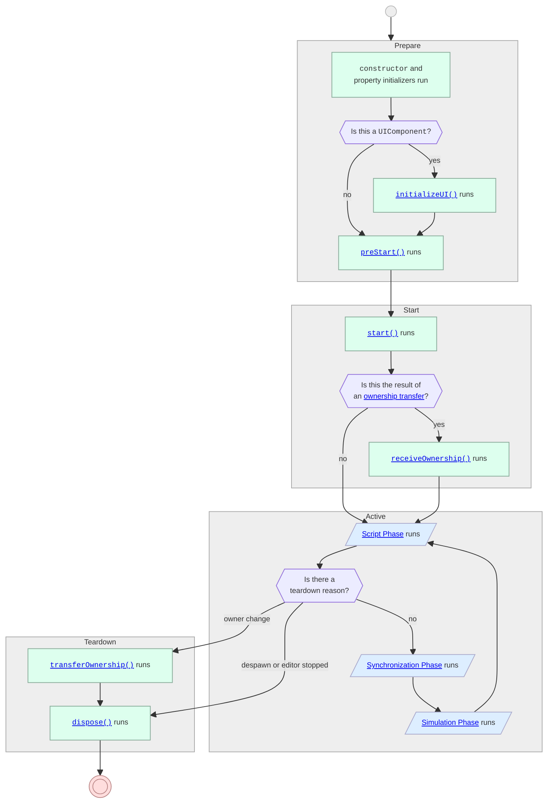

!!! warning Connect to events in `preStart`. Send events in `start`.
    Do *not* connect in `start`. Do *not* send in `preStart`. See the explanation in the [events section](#receiving-events) for a detailed. explanation.

!!! warning Property initializers run before `props` are available.
    ```typescript
    // ❌ Incorrect: Props not available during initialization
    class BadComponent extends Component<typeof BadComponent> {
        private color = this.props.color  // Will throw an error!
    }

    // ✅ Correct: Initialize in preStart
    class GoodComponent extends Component {
        private color: Color = new Color(0, 0, 0)  // Default value if needed

        override preStart() {
            this.color = this.props.color  // Safe to access props here
        }
    }
    ```
!!! warning Do not attempt to override the component constructor.
     The base Component class handles critical setup that could break if the constructor is overridden. So, instead:
      - Use property initializers for data (without accessing props)
      - Use `preStart()` for event registration
      - Use `start()` for initialization behavior

### Async (Delays and Timers)

There are two ways to delay code (to run it later):
 * **timeouts**: code that will run once after a delay (unless canceled before it runs).
 * **intervals**: code that will run after a delay, and then again after that same delay, and so on forever (unless it is canceled).

Canceling a timeout or an interval is called **clear**ing it. These naming conventions are consistent with standard JavaScript.

[Component](#components) instances have a member `async` that provides access to functions for creating async code. For example if you have a `component` you might write:
```ts
component.async.setTimeout(() => console.log('ready!'), 1000 /* ms */)
```

to execute the given `console.log(...)` after 1000 milliseconds(1 second). The following methods are provided in `Component`'s `async` member:

| `Component` `async` member  | Description |
|---|---|
| `setTimeout(`<br/><nobr>`  callback: TimerHandler,`</nobr><br/><nobr>`  timeout?: number,`</nobr><br/><nobr>`  ...args: unknown[]`</nobr><br/>`) => number`  | Schedule the `callback` to fire after `timeout` milliseconds. If `args` are provided then they will be passed into `callback` when it is called. `setTimeout` returns an `id` that can be passed to `clearTimeout` to cancel running `callback` (if it is cancelled before it does so). If `timeout` is omitted it will be treated as 0 (see below). |
| `clearTimeout(`<br>`  id: number`<br/>`) => void` | Cancel the timeout with the given `id` (if it hasn't run yet). |
| `setInterval(`<br/><nobr>`  callback: TimerHandler,`</nobr><br/><nobr>`  timeout?: number,`</nobr><br/><nobr>`  ...args: unknown[]`</nobr><br/>`) => number` | Schedule the `callback` to fire after `timeout` milliseconds (and then again after the same delay, and again, and so on). If `args` are provided then they will be passed into `callback` every time that it is called. `setInterval` returns an `id` that can be passed to `clearInterval` to cancel running `callback` (so that it doesn't run any more times). If `timeout` is omitted it will be treated as 0 (see below). |
| `clearInterval(`<br>`  id: number`<br/>`) => void` | Cancel the interval with the given `id` (it will not run any more times). |

**Component disposal**: the `id`s returned from `setTimeout` and `setInterval` are automatically registered with the component's [disposal](#disposing-objects) to be cleared. Thus if you write:

```ts
component.async.setInterval(() => console.log('hi!'), 1000 /* ms */)
```

then if, or when, `component` is [torn down](#component-lifecycle), the interval will be automatically canceled.

**Synchronization phase**: the callbacks passed to `setTimeout` and `setInterval` are executed in the [Synchronization Phase](#synchronization-phase) when async callbacks are checked for readiness.

!!! warning Timeouts and Intervals are not precisely timing. They make a "best attempt" at the delay (but may wait slightly *longer*).
    The methods above are not precise in when the callback runs. They will wait at least as long as the requested `timeout` value and then run at *the next convenient time* after that. So, for example, if you create a `timeout` with a 0 millisecond delay, it won't run immediately; it will run "super soon" (likely during the next [Synchronization Phase](#synchronization-phase)). If you create an interval with a timeout of 0 milliseconds, it may only run it a few times (or even just once) every frame, to prevent hurting perf.

!!! tip Use underscores to make numbers more readable.
    JavaScript (and therefore TypeScript) allows underscores to be inserted into numbers solely for readability. That means `123` and `1_2_3` are the same value. You can thus use underscores to make numbers more readable. So instead of writing `10000` to mean 10,000 milliseconds, you can write `10_000`!

### Run Every Frame (PrePhysics and OnUpdate)

[Async intervals](#async-delays-and-timers) are not effective for **running code every frame** because they are difficult to align the timing of (due to being [imprecise](#async-delays-and-timers)).

The [World](#world-class) has two static members exposing [Local Events](#local-events) that are [broadcast](#broadcast-events) every frame (to all [clients](#clients-devices-and-the-server)):

| `World` class<br/>`static` member | Type | Description |
|---|---|---|
| `onPrePhysicsUpdate` | <pre class="language-ts ts"><span><code>LocalEvent<{<br/>  deltaTime: number<br/>}></code></span></pre> | A built-in [local event](#local-events) that is [broadcast](#broadcast-events) every frame **[before physics runs](#simulation-phase)** to all clients [device and server](#clients-devices-and-the-server). |
| `onUpdate` | <pre class="language-ts ts"><span><code>LocalEvent<{<br/> deltaTime: number<br/>}></code></span></pre> | A built-in [local event](#local-events) that is [broadcast](#broadcast-events) every frame **[after physics runs](#simulation-phase)** to all clients [device and server](#clients-devices-and-the-server). |

```ts
const subscription = component.connectLocalBroadcastEvent(
  World.onUpdate,
  (info) => {
    // runs every frame before physics updates
    console.log(`${info.deltaTime} seconds since last frame`)
  }
)
```

Callbacks registered with `onPrePhysicsUpdate` run before physics computations occur in the frame. Callbacks registered with `onUpdate` run after physics computations. **onUpdate is usually what you need**. See the description of [prePhysics vs onUpdate](#prephysics-vs-onupdate-events) for more information. Note that [onPrePhysicsUpdate is only useful for *players* (not entities)](#prephysics-vs-onupdate-events).

The callback provides a single argument of type `{deltaTime: number}` which contains the amount of time that has passed since the event was last broadcast. See the section on [receiving events](#receiving-events) to learn about `connectLocalBroadcastEvent` and the `EventSubscription` that it returns.

### BuiltInVariableType

`BuiltInVariableType` represent "primitive Horizon data". It is used in [CodeBlockEvents](#code-block-events) and [defining props with PropTypes](#component-properties). The different types in `BuiltInVariableType` are available as a TypeScript object in [PropTypes](#proptypes).

```ts
type BuiltInVariableType =
  | string      | string[]
  | number      | number[]
  | boolean     | boolean[]
  | Vec3        | Vec3[]
  | Entity      | Entity[]
  | Quaternion  | Quaternion[]
  | Color       | Color[]
  | Player      | Player[]
  | Asset       | Asset[]
```

### PropTypes

`PropTypes` is an enum representing all the same values in [BuiltInVariableType](#builtinvariabletype). `PropTypes` is used in creating the [component propsDefinition](#component-properties) and in creating [CodeBlockEvents](#code-block-events).

```ts
const PropTypes = {
  Number: "number";
  String: "string";
  Boolean: "boolean";
  Vec3: "Vec3";
  Color: "Color";
  Entity: "Entity";
  Quaternion: "Quaternion";
  Player: "Player";
  Asset: "Asset";
  NumberArray: "Array<number>";
  StringArray: "Array<string>";
  BooleanArray: "Array<boolean>";
  Vec3Array: "Array<Vec3>";
  ColorArray: "Array<Color>";
  EntityArray: "Array<Entity>";
  QuaternionArray: "Array<Quaternion>";
  PlayerArray: "Array<Player>";
  AssetArray: "Array<Asset>";
};
```

### SerializableState

`SerializableState` represents the type of data that can be packaged up to be **sent over the network**. It is used in [NetworkEvents](#network-events) and [ownership transfer](#transferring-data-across-owners).

```ts
type SerializableState =
  | { [key: string]: SerializableState }
  | SerializableState[]
  | PersistentSerializableStateNode
  | TransientSerializableStateNode

type PersistentSerializableStateNode =
  | Vec3 | Entity | Quaternion | Color
  | number | boolean | string
  | bigint | null;
type TransientSerializableStateNode = Player;
```

`PersistentSerializableState` is data that can be packaged up to store in [persistent data](#persistence). It is the same as `SerializableState` *except* that it *does not include Player* (since player instances are [ephemeral to the instance](#player-id)).

## Communication Between Components

The primary way in which components communicate with one another, and react to occurrences in the world, is by **sending** and **receiving** events through entities (or [through players](#routing-events-through-players)). If two components are running on the same [client](#clients-devices-and-the-server) then you can have them [interact directly without using events](#converting-between-components-and-entities).

There are multiple kinds of events with different purposes. Event listeners are usually [connected](#receiving-events) in `preStart`. Events can be [sent](#receiving-events) at any time.

`LocalEvent`s and `NetworkEvent`s can be sent to specific entities or be [broadcast](#broadcast-events) to all listeners in the world. Many "system actions" (such as [players entering the world](#player-entering-and-exiting-a-world), an [entity being grabbed](#grab-sequence-and-events), a [collision occurring](#collision-events), etc) are sent as [built-in CodeBlockEvents](#built-in-code-block-events); there [are many built-in CodeBlockEvents](#all-built-in-codeblockevents).

All event types can be instantiated with **custom user-made types** by simply calling `new` on the event type and making one. When creating custom events, export them so that you can create them once and share them across files. If you keep instantiating the same event repeatedly across your code, you are likely to make an error (and make refactors more difficult).

| Event | Purpose | Timing | Payload |
|---|---|---|---|
| **CodeBlockEvent** | Listen to [built-in CodeBlockEvents](#built-in-code-block-events). Communicate with [Codeblock scripts](#scripting). | *Asynchronously* run in the next [Script Phase](#synchronization-phase) if sent to the [same client](#clients-devices-and-the-server). Otherwise, it runs after a network trip on the receiving [client](#clients-devices-and-the-server). | Tuple of [BuiltInVariableType](#builtinvariabletype)s. |
| **LocalEvent** | Communicate with a TypeScript scripted entity on the [same client](#clients-devices-and-the-server). Supports [broadcast](#broadcast-events). | Delivered *synchronously* (immediately). | *Anything* |
| **NetworkEvent** | Communicate with a TypeScript scripted entity on [any client](#clients-devices-and-the-server). Supports [broadcast](#broadcast-events). | *Asynchronously* run in the next [Script Phase](#synchronization-phase) if sent to the [same client](#clients-devices-and-the-server). Otherwise, it runs after a network trip on the receiving [client](#clients-devices-and-the-server) | [SerializableState](#serializablestate) |

**When to use each event type**: you should always try to use a [LocalEvent] or direct method call, and you need to cross a [network](#network) then use a [NetworkEvent]. Use [CodeBlockEvents](#code-block-events) when listening to [certain built-in events](#built-in-code-block-events) or when communicating with [Codeblock scripts](#scripting).

Here's a flowchart that may help:

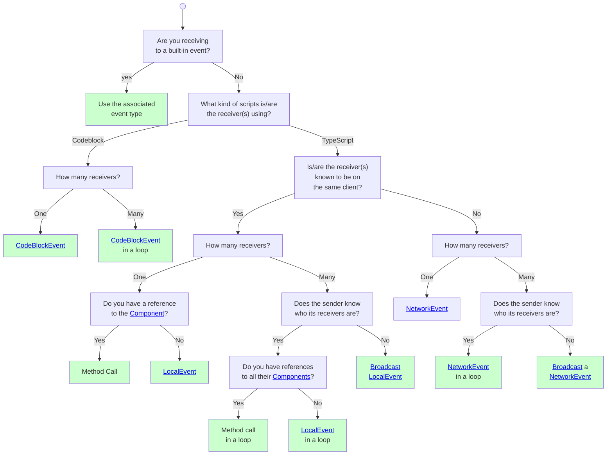

### Receiving Events

**Connecting Events**: Events are "subscribed" to using a `Component` method starting with `connect...`, such as

```ts
const subscription = component.connectLocalEvent(
  entity, event, callback
)
```

which will result in `callback` being run every time `event` is sent to `entity` (if `entity` has the same owner as `component.owner`, since the line above used a *local* event).When using [broadcast](#broadcast-events), there is no specified entity to listen to.

```ts
component.connectLocalBroadcastEvent(event, callback)
```

Many "system actions" are communicated by sending [built-in CodeBlockEvents](#built-in-code-block-events) to entities. There are also some [built-in local-events](#built-in-local-events).

You can also connect to [events sent to players](#routing-events-through-players).

**Disconnecting Events**: All `connect...` events return an `EventSubscription`, a type with a single `disconnect(): void` method. Calling

```ts
subscription.disconnect()
```

would make it so that `callback` is no longer called. It's good practice to disconnect listeners when you are done with them.

!!! warning Connect to events in `preStart`. Send in `start`.
    Imagine the following scenario: `ComponentA`, in its `start`, sends an event to `ComponentB`'s entity; but `ComponentB` doesn't register to listen to the event until its `start`. Does `ComponentB` get the event? It depends on which component `start`ed first!

    This is a subtle problem. To address this: **all components `preStart` before any `start`**. This means that if `ComponentA` sends an event in `start` and `ComponentB` subscribes to that event in `preStart` then `ComponentB` is guaranteed to to be ready to receive the event by time `ComponentA` sends it!

    **Never `connect` in `start`. Never `send` in `preStart`**. This can cause events to get missed!

!!! warning Long-running event callbacks will hurt execution [frame rate](#frame-rate) and eventually time out and be "killed".
    If an event callbacks runs for a long time it will "stall" all script execution (since it is single-threaded). Eventually Horizon will kill a long-running callback (but only after some number of seconds). When a long callback runs for too long it can block most of the other system behavior and cause unexpected results. Extremely large work-loads should be split up across frames.

### Sending Events

There are many events sent by the system ([built-in CodeBlockEvents](#built-in-code-block-events) and [built-in local-events](#built-in-local-events)). You can also `new` your own events and then send and receive them as well.

To send an event you simply use the `Component` `send...` method matching the event type:

```ts
component.sendNetworkEvent(entity, networkEvent, data)
```

The `data` will then be passed into any callback that are connected to that event on that entity. If you are sending a broadcast even then you don't specify the receiver:

```ts
component.sendNetworkBroadcastEvent(networkEvent, data)
```

You can also [send events to players](#routing-events-through-players).

**Cannot Cancel**: once an event is sent there is no way to revoke it.

### Routing Events through Players

The (non-[broadcast](#broadcast-events)) `connect...` and `send...` methods on [Component](#component-class) allow either an [Entity](#entities) or a [Player](#players) for the `target` argument.

Routing events through players follows the same rules as entities.

The example below shows a script that has [props](#component-properties) for a [trigger](#trigger-gizmo) and an index. It [listens to](#receiving-events) the [OnPlayerEnterTrigger](#trigger-gizmo) event to know when a player enters the trigger. When one does, a network event is sent **to the player** to announce that they were "captured" by the trigger with the given index. Anyone listening to the `playerCaptured` event on that player will receive the event.

Note that the `playerCaptured` event is `export`ed from the file so that other scripts can listen to it. Also, this particular example could have also been achieved with a [broadcast event](#broadcast-events).
![[ horizonScripts/playerEventExample.ts ]]

### Code Block Events

`CodeBlockEvent`s are a **legacy event type** used for listening to [built-in events](#built-in-code-block-events) and for communicating with [Codeblock scripts](#scripting). **Do not create custom `CodeBlockEvent`s** as they can conflict with built-in events and cause unexpected behavior (unless you are communicating with [Codeblock scripts](#scripting), then you *must* use `CodeBlockEvent`s).

**Creation**:
```ts
const cbEvent = new CodeBlockEvent<[food: string, count: number]>(
    'registerGroceries',
    [PropTypes.String, PropTypes.Number]
)
```

A `CodeBlockEvent` requires:
- A name string (e.g. `'registerGroceries'`)
- A tuple of parameter types passing in as [PropTypes](#proptypes) and as generics (in the `<...>`)

Usage example (where the event is sent to the component's entity):
![[ horizonScripts/codeBlockEventExample.ts ]]

**Properties**:
- **Client Support**: Can be sent and received across [clients](#clients-devices-and-the-server), meaning that you can send to an entity with a different owner than the sender, and likewise connect to an entity with a different owner than the connector. One exception: [built-in broadcast CodeBlockEvents](#built-in-broadcasted-code-block-events) *cannot* be received on a different client than the event is emitted on.
- **Execution**: Runs in the next [Script Phase](#script-phase) after receipt (which maybe be on a different client after a "network trip")
- **Data Format**: Requires a tuple of [BuiltInVariableType](#builtinvariabletype)s
- **Event Disambiguation**: System checks both name and parameterTypes before executing listeners

!!! warning CodeBlockEvents have a per-frame limit.
    If `sendCodeBlockEvent` is called, including for [built-in events](#built-in-code-block-events), 2048 times or more in a frame, then an error is thrown, disrupting [event execution for the frame](#script-phase).

#### Built-In Code Block Events
The system uses `CodeBlockEvent`s for many built-in actions. For example, when an [entity](#entities) enters a [trigger zone](#trigger-gizmo) with matching [tags](#entity-tags), the system sends `CodeBlockEvents.onEntityEnterTrigger` to the trigger. See the [list of built-in CodeBlockEvents](#all-built-in-codeblockevents) for more info.

<a id="built-in-broadcasted-code-block-events">**Broadcast `CodeBlockEvents`**</a>: some built-in `CodeBlockEvent`s are "broadcast" meaning that you can *listen to any entity to receive them* (as long the receiver is executing on the same [client](#clients-devices-and-the-server) the event is emitted on). The [list built-in CodeBlockEvents](#all-built-in-codeblockevents) includes information on which ones are *broadcast*. Throughout this document, 🔈 denotes a *server-broadcast* `CodeBlockEvent`; 🏠 denotes a *device-broadcast* `CodeBlockEvent`.

For example, to listen to `CodeBlockEvents.onPlayerEnterWorld`, you can listen to it on *any entity* (though it has to be [server-owned](#entity-ownership)). There is no way to *send* a broadcast event yourself.

```ts
// on a Component
this.connectCodeBlockEvent(
  entity, // any entity owned by the server
  CodeBlockEvents.onPlayerEnterWorld,
  callback
)
```

!!! info CodeBlockEvents are the only way for TypeScript and [Codeblock scripts](#scripting) to communicate
    [Codeblock scripts](#scripting) are unable to use either [LocalEvents](#local-events) or [NetworkEvents](#network-events), thus the only method of communication between them is via [CodeBlockEvents](#code-block-events).

!!! bug Sending a CodeBlockEvent with an Asset parameter to scripts with 'local' execution mode will throw a silent error.
    If you do try to send an Asset in a CodeBlockEvent from a script executing on the [server](#clients-devices-and-the-server) to one executing on a [player device](#clients-devices-and-the-server), the server script execution will be silently killed at the point where you try to send the event. Recall that unless you are communicating with [Codeblock scripts](#scripting), the **advice is to never use custom CodeBlockEvents**. Use [LocalEvents](#local-events) and [NetworkEvents](#network-events) for all your event sending and receiving.

!!! danger A TypeScript connecting to an entity with an attached [Codeblock scripts](#scripting) can lead to issues.
    Some times TypeScript and [Codeblock scripts](#scripting) will "fight each other" when both listening to events from the same entity. It is a subtle bug that doesn't appear in all cases. However we recommend: **do not have TypeScript and [Codeblock scripts](#scripting) listen to events from the same entity**.

    Example: Imagine a [trigger](#trigger-gizmo) that has a [Codeblock script](#scripting) attached to it that listens to [trigger enter](#trigger-gizmo) on `self` (Codeblock's version of `this.entity`). If you then have a TypeScript script also connect to the [trigger enter](#trigger-gizmo) event then it turns out that neither script will receive trigger events for that trigger.

### Network Events

`NetworkEvent`s are the **recommended alternative to `CodeBlockEvent`s** for communication between components with different [owners](#entity-ownership).

**Creation**:
```ts
const networkEvent = new NetworkEvent<{ code: number }>(
  'setCodeWithNumber'
)
```

A `NetworkEvent` requires:
- A name string (highly specific to avoid conflicts)
- A payload type satisfying `SerializableState`

Usage example (where the event is sent to the component's entity):
![[ horizonScripts/networkEventExample.ts ]]

**Properties**:
- **Client Support**: Can be sent and received across [clients](#clients-devices-and-the-server), meaning that you can send to an entity with a different owner than the sender, and likewise connect to an entity with a different owner than the connector.
- **Execution**: Runs in the next [Script Phase](#script-phase) after receipt (which maybe be on a different client after a "network trip")
- **Data Format**: Accepts any [SerializableState](#serializablestate)
- **Event Disambiguation**: ⚠️ The system only checks the event name - use highly specific names to avoid conflicts between different `NetworkEvent`s!

### Local Events

`LocalEvent`s are designed for communication between entities on the same client, offering maximum flexibility with minimal overhead. They execute essentially as **synchronous function calls**.

**Creation**:
```ts
const doorEvent = new LocalEvent<{open: boolean, date: Date}>(
  'setDoorState'
)
```

A `LocalEvent` requires:
- An optional name string (useful for debugging)
- A type parameter for payload; it can be any type whatsoever (since there is no network serialization). Note that the example above *cannot* be done with [NetworkEvent](#network-events) because `Date` is not compatible with [SerializableState](#serializablestate).

Usage example (where the event is sent to the component's entity):
![[ horizonScripts/localEventExample.ts ]]

**Properties**:
  * **Client Support**: Local only - events cannot cross [client](#clients-devices-and-the-server) boundaries
  * **Execution**: Immediate synchronous execution on the [local client](#clients-devices-and-the-server)
  * **Data Format**: Accepts any arbitrary type as payload type
  * **Event Disambiguation**: Uses referential equality - no risk of name conflicts.

!!! warning You must use the exact same `LocalEvent` instance for both `sendLocalEvent` and `connectLocalEvent`.
    Since `LocalEvent`s are disambiguated *referentially* you **must use the same `LocalEvent` instance**. In the code below, the first example will run `callback`. The second example does not.
    ```ts
    // Example 1: ✅ Right!
    const evt = new LocalEvent('jump')
    this.connectLocalEvent(entity, evt, callback)
    // ... later ...
    this.sendLocalEvent(entity, evt, {})

    // Example 2: ❌ Wrong!
    // The send is using a different event than the connect.
    this.connectLocalEvent(entity, new LocalEvent('jump'), callback)
    // ... later ...
    this.sendLocalEvent(entity, new LocalEvent('jump'), {})
    ```

#### Built-In Local Events

There are currently two groups of built-in [LocalEvents](#local-events):
  * The [World](#world-class) class has static members [onPrePhysicsUpdate and onUpdate](#run-every-frame-prephysics-and-onupdate) for running code every frame ([before and after physics](#synchronization-phase), respectively). These are broadcast on all [clients](#clients-devices-and-the-server).
  * The [PlayerControls](#player-controls) class has static members for `onFocusedInteractionInputStarted`, `onFocusedInteractionInputMoved`, `onFocusedInteractionInputEnded`, and `onHolsteredItemsUpdated` which are all [broadcast](#broadcast-events) on the [player device](#clients-devices-and-the-server) that own the controls.

### Broadcast events

[NetworkEvents](#network-events) and [LocalEvents](#local-events) both support broadcasting. Instead of [sending events](#sending-events) to and [listening to events](#receiving-events) on a specific entity, you instead simply listen for the event being "broadcast", and then any registered listener can receive it.

Note: events are simply [LocalEvents](#local-events), [NetworkEvents](#network-events), or [CodeBlockEvents](#code-block-events). There is no special "broadcast event type". Instead, broadcast refers to the way that events are sent and received.

!!! warning Me mindful not to overuse broadcast events.
    Broadcast events decouple senders from receivers without requiring specific entity or player targets. However, overuse can lead to performance issues when many listeners run unnecessarily to check if events are relevant to them. If this happens, consider either splitting the event into more specific events or [routing through entities or players](##routing-events-through-players) instead.

For example, if you create the following `LocalEvent`:

```ts
const evt = new LocalEvent<{value: number}>()
```
then you send it like this (there is no `entity` receiver arg)
```ts
component.sendLocalBroadcastEvent(evt, {value: 10})
```
and it will be received by all listeners on the same [client](#clients-devices-and-the-server) (since it's a local event). To register one of those listeners, do:
then you can register to listen to it being sent from
```ts
component.connectLocalBroadcastEvent(evt, callback)
```

**[LocalEvent](#local-events) Broadcast**: `sendLocalBroadcastEvent` will synchronously (immediately) call all registered listeners on the same [client](#clients-devices-and-the-server). The order that the callbacks are called in is undefined and should not be relied on. [There are some built-in LocalEvents](#built-in-local-events) which are broadcasted.

**[NetworkEvent](#network-events) Broadcast**: `sendNetworkBroadcastEvent` is asynchronous (delayed). Any listeners on the same [client](#clients-devices-and-the-server) will process the event in the next [Script Phase](#script-phase). Listeners on other clients will wait until they receive the event (over the network) and then will process the event in their next [Script Phase](#script-phase).

!!! info NetworkEvent broadcast has an extra optional parameter for fine-grained control.
    The `sendNetworkBroadcastEvent` method takes an extra, optional, final parameter: `player?: Player[]` which allows you to limit which [clients](#clients-devices-and-the-server) the event is sent to. This allows for fine-grained optimization, but should ⚠️ only be used if you absolutely understand what you are doing.

**[CodeBlockEvent](#code-block-events) Broadcast**: There are no methods for sending or receiving broadcast `CodeBlockEvent`s. However there are some [built-in CodeBlockEvents that can be connected to using *any entity*](#built-in-broadcasted-code-block-events) and thus act kind of like a broadcast.

**Limit receiving players**: all `send...` methods (except for [CodeBlockEvents](#code-block-events)) take an additional optional final parameter: `players?: Player[]` which allows you to specify that the event will only be sent to those players' [clients](#clients-devices-and-the-server). This is an *expert-level* feature; **only use it if you truly know what you are doing**.

### Converting Between Components and Entities

When two components are running on the same [client](#clients-devices-and-the-server) they can directly call one another's functions (instead of going through [entities and the event system](#receiving-events)). There are 2 ways to "find [component](#components) instances on the [local client](#clients-devices-and-the-server):
1. **components attached to entities**: you can do `entity.getComponents()` to get all components on an entity. If only one component is attached to the entity then the array will have 1 element in it. You can also pass in a class `entity.getComponents(ExampleComponent)` to get an array of `ExampleComponent` instances attached to the entity (which, again, will be at most one).
2. **all component instances**: you can run `Component.getComponents(ExampleComponent)` to get an array of all instances of `ExampleComponent` on the [local client](#clients-devices-and-the-server).

!!! danger `getComponents` cannot be used [until start](#component-lifecycle).
    You cannot call `entity.getComponents(...)` or `Component.getComponents(...)` in a property initializer, `initializeUI`, or in `preStart`. This information isn't ready until after the [prepare state](#component-lifecycle) of component instantiation.

!!! example Calling a method on a component.
    In this example we find all `ListenerComponent`s in the [local client](#clients-devices-and-the-server) from within the `SpeakerComponent`. We are then able to directly access the `props` and the `hear` method on `ListenerComponent`.
    ![[ horizonScripts/directFunctionCall.ts ]]

## Disposing Objects

The `DisposableObject` interface represents a TypeScript object with a `dispose()` method which can be called to do "cleanup". Additionally a `DisposableObject` must also have the `registerDisposeOperation` method, which allows callbacks to be registered to also be run when the object is `dispose`d.

!!! note currently only [Component](#component-class) implements the `DisposableObject` interface.

```ts
interface DisposableObject {
  dispose(): void;
  registerDisposeOperation(
    operation: DisposeOperation
  ): DisposeOperationRegistration;
};

type DisposeOperation = () => void;

interface DisposeOperationRegistration {
  // run the dispose operation
  run: () => void;

  // cancel the operation so it never runs
  cancel: () => void;
};
```

When you call `registerDisposeOperation` you get back a `DisposeOperationRegistration` which has methods `run`, to manually dispose (even earlier), and `cancel` to stop the passed in `operation` from ever running.

!!! info `PlayerControls` takes a `DisposableObject`
    In the [PlayerControls](#player-controls) class, the static method `connectLocalInput` takes a `DisposableObject` object as an argument. The controls will be *unregistered* when the disposable object disposes.

## Frames

Each [client](#clients-devices-and-the-server) in an [instance](#instances) runs a fixed set of actions repeatedly while the instance runs. The sequence of actions is called the **[frame sequence](#frame-sequence)** and each run of the sequence is called one **frame**. The number of frames per second (fps) is called the [frame rate](#frame-rate).

### Frame Rate

The number of frames that occur per second is called the **frame rate** and is abbreviated "fps" for "frames per second". The time it takes to run each frame is the *frame time* (the time per frame).

$$\text{frame rate} = \frac{1}{\text{frame time}}$$

[Clients](#clients-devices-and-the-server) don't all have the same frame rate! For example, the server (typically) runs at 60 frames per second and some VR headsets run at 72 frames per second. It's possible, and very likely, that **scripts execute *more frequently* on player devices than they do on the server**.

If you need to know the frame time, e.g. to run your simulations or animations, **do not rely on a specific frame rate or frame time**. Use the `deltaTime` provided by [onPrePhysicsUpdate and onUpdate](#run-every-frame-prephysics-and-onupdate) to get the time, in seconds, since the last frame (the last frame time).

!!! note There is no separate "physics simulation rate".
    In many game engines the physics simulation runs at a different rate than the rendering does. The physics simulation rate is often called a "fixed update". In Horizon there is no such separation. Every [client](#clients-devices-and-the-server) executes the [same sequence every frame](#frame-sequence), including both physics simulation and rendering (although rendering is skipped on the [server](#clients-devices-and-the-server) since it lacks a display).

### Frame sequence

Every action in Horizon happens somewhere within a frame. Frames execute in 3 main stages, in the following order:

1. **[Simulation Phase](#simulation-phase)**: Updates player movement and recorded animations. Computes physics updates and detects collisions. Allows code to be run [before or after the physics calculations](#prephysics-vs-onupdate-events).
2. **[Script Phase](#script-phase)**: Handles [CodeBlockEvents](#code-block-events), [LocalEvents](#local-events), and [NetworkEvents](#network-events). Processes [player input](#player-input) changes and runs [async callbacks](#async-delays-and-timers). Changes to the [scene graph](#scene-graph) are committed.
3. **[Synchronization Phase](#synchronization-phase)**: Processes received [network](#network) information, sends out network updates, and renders the scene (if not the server).

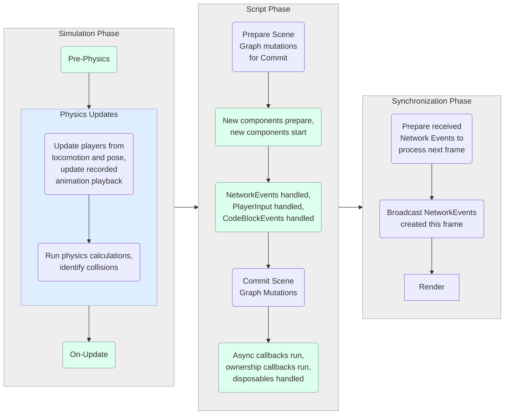

!!! warning Script execution is *single-threaded* (long-running functions will "stall" the script runtime).
    If a callback ([event](#receiving-events) or [async](#async-delays-and-timers)) runs for too much time it will "stall" all script execution. Eventually Horizon will kill a long-running callback (but only after some number of seconds). When a callback runs for too long it can block most of the other system behavior and cause unexpected results. Extremely large work-loads should be split up across frames.

#### Simulation Phase

The **Simulation Phase** runs at the start of the frame and includes physics calculations and avatar/animation updates.

1. **Pre-Physics**
    - [Broadcasts](#broadcast-events) the [World.onPrePhysicsUpdate](#run-every-frame-prephysics-and-onupdate) event locally, causing all local listeners to run.
1. **Physics Updates**
    - Players update their [positions and pose](#player-body-parts) based on locomotion inputs.
    - Animation playback is updated.
    - Physics calculations run, applying [accumulated forces and torques](#applying-forces-and-torque) to entities with [simulated=true](#simulated) to update their linear and angular velocities.
    - Collisions [with object and players](#collisions) as well as with [triggers](#trigger-gizmo) are detected; the [associated CodeBlockEvents](#built-in-code-block-events) are queued to run later in the frame in the [Script Phase](#script-phase).

1. **On-Update**
    - [Broadcasts](#broadcast-events) the [World.onUpdate](#run-every-frame-prephysics-and-onupdate) event locally, causing all local listeners to run.

 - Player positions that are modified in the `onPrePhysicsUpdate` callbacks will be used in the *physics updates* that follow. However, **modifications to entities will not be used in the *physics updates***.

#### Script Phase

The **Script Phase** executes all event listeners, handles player input, instantiates components, and commits pending scene graph changes.

1. **Scene Graph Updates Preparation**
    - Any [scene graph](#scene-graph) mutations performed via [property.set(...)](#horizon-properties) throughout the frame thus far are copied to the side and the "pending updates" cache is cleared. There are [subtleties in how scene graph mutations are applied](#scene-graph-mutations).
1. **Component Initialization**
    - New [files](#script-file-execution), from world start or [spawning](#spawning), are executed, running all code in the *top-level scope* (initializing *globals*, running `static` class members and blocks, etc).
    - New components are instantiated (due to the instance starting, assets [spawning](#spawning) in, or entities having their [ownership transferred](#ownership-transfer) to this [device](#clients-devices-and-the-server)). Those new components will [all be prepared and then started](#component-lifecycle).
1. **Event Processing**
    - [NetworkEvent](#network-events) listeners run
    - [PlayerInput](#player-input) callbacks run
    - [CodeBlockEvent](#code-block-events) listeners run (including [built-in](#built-in-code-block-events) ones, such as those prepared in the [physics calculations](#simulation-phase)).
1. **Scene Graph Updates**
    - The mutations prepared in step #2 are now applied. There are [subtleties in how scene graph mutations are applied](#scene-graph-mutations).
1. **Final Callbacks**
    - Any [asynchronous](#async-delays-and-timers) callbacks (e.g., `setTimeout`, `setInterval`) that are "passed due" are run (meaning that the current time is equal to or later than their scheduled times). Note that Horizon will limit how many async callbacks run in one frame; if too much time has been used, and there are still async callbacks to run, it may delay running them until the next frame. Note that events do *not* do this. [CodeBlockEvents](#code-block-events) and [NetworkEvents](#network-events) are all processed until the queue is empty.
    - Any entities owned by the [local device](#clients-devices-and-the-server) that had [owner.set(...)](#ownership-transfer) called on them during the frame will now have [transferOwnership](#ownership-transfer) called to get the *transfer* state that will be dispatched in the [Synchronization Phase](#synchronization-phase). These entities will be marked for [disposal](#component-lifecycle).
    - Any components that were created in step #2 due to an [ownership transfer](#ownership-transfer) will have [receiveOwnership](#ownership-transfer) called on them with their *transferred state* (or with `null` if the transfers were [discontinuous](#discontinuous-ownership-transfers)).
    - Any components that were marked for [disposal](#component-lifecycle) (due to being spawned out, the instance stopping, or in the step 2 bullets above) will have `dispose()` called. All their [event subscriptions](#receiving-events) will be `disconnect`ed. All the ongoing [timeouts and intervals](#async-delays-and-timers) will be `clear`ed.

##### Scene Graph Mutations

When you call `set(...)` on a [Horizon property](#horizon-properties) the changes are not immediately written to the [scene graph](#scene-graph). This means that **if you call `get()` you will not get the new value you just set.** Instead, the changed is *buffered* (stored off to the side to be applied later). We call a buffered change a **scene graph mutation**.

For example if you do:

```ts
entity.position.set(newPos);
const pos = entity.position.get();  // Still the old position!
```

then the `get()` returns the old position, not the new one you just set. This is because the change is *buffered*, waiting to be applied.

The **changes get applied near the end of the [script phase](#script-phase) (see the [frame sequence diagram](#frame-sequence)), just before async handlers run**. So if you modify an entity's position in an [OnUpdate callback](#run-every-frame-prephysics-and-onupdate), you won't see the new value in `get()` until the async handlers run that frame.

This buffering system means that modifications made during the [script phase](#script-phase) won't be visible at all in that same frame. At the start of the [script phase](#script-phase), all pending mutations are prepared (copied to a separate buffer and cleared). Then the frame continues with [component initialization](#component-lifecycle) and [event callbacks](#receiving-events). Any new modifications during those callbacks get buffered for later. When it's time to "commit" the mutations, only the ones that were prepared at the start get applied - newer modifications wait for the next frame.

This means that:
* **Scene graph mutations performed in *[prePhysics and onUpdate handlers](#prephysics-vs-onupdate-events)* will be seen *the next frame*** (and technically in the async callbacks at the end of this frame).
* **Scene graph mutations performed *anywhere else* will be seen *2 frames from now*** (and technically in the async callbacks at the end of the next frame).

**Player position is an exception**: Player position behaves differently. When you [set a player's position in an OnPrePhysicsUpdate callback](#player-position-and-physics), that change is available immediately for physics calculations. **[OnPrePhysicsUpdate callbacks](#prephysics-vs-onupdate-events) are useful for moving players (but not other entities)**.

**Position/rotation and physics forces don't play well together** in the same frame. If you try to [move an entity](#position) (or [move a player](#player-position-and-physics)) with both `position.set()` and [forces](#forces) at the same time, they'll conflict and give unexpected results. You should choose one approach or the other - either move things by setting their position directly, or move them with physics forces, but never both at once. The same applies to [setting rotations](#rotation) vs using [torques](#torques).

#### Synchronization Phase

The **Synchronization Phase** finalizes the frame, managing network synchronization and rendering the world (on [player-device clients](#clients-devices-and-the-server)).

1. **Network Sync**
   - Events sent this frame are broadcasted to other clients.
   - Networked entity transformations are synchronized across players.

2. **Render (if on a player device)**
   - The game world is rendered for the player based on the state of the world as it is on their [client](#clients-devices-and-the-server) due to that client's current [reconciliation](#authority-and-reconciliation).

!!! warning Network Events sent to the same client are processed on the frame *after* the next one.
    When you send a network event back to the same [client](#clients-devices-and-the-server) that sent it, there is a **2-frame delay** before it gets processed.

    This happens because, as shown in the [frame sequence diagram](#frame-sequence), network events are prepared for processing before new events created in that frame are sent out. So when an event is sent back to the same client, that client has already locked in the events it will process next frame, meaning the returned event won’t be handled until the frame after that.

    This delay is usually not an issue, since network events always involve some lag. However, if you need an immediate response, consider using [LocalEvents](#local-events) along with [local scripts](#local-and-default-scripts) and [ownership transfer](#ownership-transfer).

## Component Inheritance

It is not recommended to create deep hierarchies of components. We recommend you prefer **composition over inheritance** and use the general guidance of: **only subclass an abstract class**.

If you want to make your own component subclass that is meant to be further subclassed, then this pattern should suffice (note that the abstract Parent is *not* registered).

```ts
abstract class Parent<T> extends Component<typeof Parent & T> {
  static propsDefinition = {
    name: {type: PropTypes.String},
  }
  start() {}
  abstract greeting() : string
}

class Child<T> extends Parent<typeof Child> {
  static propsDefinition = {
    ...Parent.propsDefinition,
    favoriteNumber: {type: PropTypes.Number},
  }
  start() {}
  greeting() {
    return this.props.name + ' ' + this.props.favoriteNumber
  }
}
Component.register(Child)
```

## File-Backed Scripts (FBS)

There are two ways of storing the code for scripts: legacy Gizmo-Backed Scripts and modern File-Backed Scripts.
| Type | Description |
|----|----|
| Gizmo-Backed Scripts | Script data is stored _within_ script gizmo entities located in your world's scene graph. The script data is tied to your world. |
| File-Backed Scripts (FBS) | Script data is stored in a central file server unrelated to your world. The script data is pulled into your world by reference.

FBS are 'production ready' and used by many high profile worlds. The legacy gizmo-backed script storage, while intuitive, had a number of shortcomings:

| Constraint | Gizmo-Backed Scripts | File-Backed Scripts (FBS) |
|---|---|---|
| Script size | 32 KB per script | No reasonable limit |
| Script count | Limited | No reasonable limit |
| Travel time | Impacted by script size/count | Not significantly impacted |
| Scripted Assets | Duplicates scripts when spawned (with a generic "Script" name with auto-appended digits if the script already exists or spawns more than once) | Share single script when spawned |
| Scripted Assets | Assets must include referenced Component scripts | Referenced Component scripts are automatically added to the world (*see note below on asset module references) |
| Cross-World Updates | Not possible, as script data is tied to one world | The latest updates to script data is seen in all worlds referencing the script |
| [Cloned Worlds](#cloning-a-world) | Scripts in cloned world have no link to script data in original world | Scripts in cloned world are linked to the same script data as the original world |
| Versioning | Not supported | The script data is versioned (tho versions are not directly accessible) |
| Use in [Template Assets](#template-asset) | Not advised | Fully supported (and strongly advised) |
| In-Scene Gizmo | Requires an in-screen script gizmo to store the script data | In-scene gizmos are optional |
| In-Scene Gizmo | Each in-scene gizmo has distinct script data | Multiple in-scene gizmos can be aliases to the same script data |

!!! warning FBS Asset Module References
    While spawned assets will automatically import the FBS script containing Components directly referenced by Entities in the asset, they will _not_ do a transitive closure of all _modules_ imported by that Component's script. You will need to ensure that the scripts for those modules are _already_ in the destination world, or you will need to manually include the script gizmos for those modules in the asset definition. Otherwise, you will get a runtime compilation error during initialization of the spawned asset.

!!! note Assets reference a frozen version of FBS script data
    When you create an asset, it locks in a version of the FBS script data at the time of creation. If you later want to update the script version used by the asset, you will need to re-create or update them to get a later script version. Using [template assets](#template-asset) helps with this.

!!! warning Avoid sharing FBS scripts with untrusted partners
    As FBS in different worlds all reference and edit the same back end script data, make sure that you are sharing FBS script references only with people you trust. Any edits they make in copies of the FBS will be reflected in all instances of the FBS in all worlds. Using [template assets](#template-asset) can limit automatic updates to published changes which must be accepted into other worlds.

!!! danger Do not mix assets with FBS and Gizmo-Backed Scripts in the same world
    If you spawn assets with FBS and Gizmo-Backed Scripts into the same world, you can get into very weird situations where it is unclear which script you are editing/referencing. The desktop editor seems to refuse to allow mixing at build time, but runtime spawning may not.

### FBS Script Ids

The legacy Gizmo-Backed scripts identified script data by the name of the gizmo in the world. The world would not allow multiple script gizmos with the same name, and spawned in scripts would automatically get new names if there were a name conflict.

In FBS, when a brand new script is added to the world (i.e. one that does not already have a script by that name), a new FBS script id is assigned to that script as unique new script data on the back end storage server. FBS references are differentiated by this id, not by the name of the scripts.

!!! warning First version of FBS script id in a world "wins"
    If there are version conflicts between different assets spawning the same FBS script id reference into a world, the _first_ version of that FBS script data in the world (either via being part of the world saved state, or spawned in by an earlier asset) is the version that will be used by all subsequently spawned asset entities. A warning is printed on the console when non-identical script versions of the same script id are attempted to be added to the world.

!!! danger Multiple FBS with different ids but the same name are not allowed in the same world
    When spawning in assets, especially at runtime, ensure that none of the assets use the same name for _different_ script ids (not different versions of the same script id, rather unrelated scripts). A warning will be printed in the console when this happens, and the new script will not execute and its scripted entities will not function.

#### Branched World Development Source Control Workflow Issues

If you make clones of your main world for branching source control development workflow, and add new scripts in the branch world, it is _critically_ important that you make assets of the scripts in the branch world and add them as assets to the main world _before_ you use external source control to merge the file changes into the branch used by the main world.

Example workflow steps:
1. Clone main world for branched work
1. Branch typescript source in external revision control system for branched world
1. Create new scripts and assets in branched world
1. Check in script changes in branched world to external revision control system branch
1. **Critical:** Add assets referencing _new_ scripts from branch to the main world
1. Merge script changes in external revision control system back to main world branch

The reason for this is that you want to ensure that the script id used by the FBS in the main world matches the script id for the branch world, especially any assets created in the branch world that you plan to later spawn into the main world. By dragging the FBS scripts as assets in to the main world, they will _not_ get new FBS script ids, but will reference the same script ids as those in the branch world. Then, when you use external source control to merge the typescript to the main world, the scripts will already be there with the correct id.

If you did this in the other order (merging the source code to the main world before adding the scripts as assets), the merged code would appear as 'brand new' scripts in the main world and would be assigned unique script ids that did not match those of assets created in the branched world. Later, if you tried to spawn those assets into your main world, you would get runtime errors about colliding script names for different script ids.

### Converting to FBS

To convert your world to FBS, go to the Script settings (gear under <pre><code></></code></pre> menu) in the desktop editor, go to the File Backed Scripts section, and if it says "Update Available" click the 'Review' button to read about the ramification, and click Update schedule a pending conversion. Then click Apply to start the conversion. Depending on the size and number of legacy Gizmo-Backed Scripts in your world, it can take some time to convert them all, and a progress meter is available in Script settings if curious.

!!! info
    Though documented, a way of converting to FBS seems no longer available in the VR editor.

!!! warning
    Changing to FBS **cannot be undone**. Your only option to convert your world back to one that uses legacy Gizmo-Backed Scripts is to roll back the entire world to a saved state backup prior to when you initiated the FBS conversion. You _may_ want to clone your world and convert that clone to FBS first to debug any issues before converting your main world.

Be aware that after updating to FBS, you will also need to update all assets that were being used in the world to also have FBS scripts. Assets will not update to FBS scripts automatically.

### Typescript Scripts Workflow

Using FBS is largely seamless to the typescript workflow, as most edits to the scripts are done via the external editor (e.g. VSCode) without regard to in-world script gizmo entities. In fact, as new typescript scripts tend to pile up at the world at the origin (0, 0, 0), it can clean up your visual view by just deleting all the gizmos from the world and relying on either the VSCode view or the Script <pre><code></></code></pre> menu in the desktop editor to find/manage them.

Note: you may need to add script gizmos for typescript FBS if you need to reference them as imported modules in any assets you create.

### Codeblock Scripts workflow

Using FBS with codeblocks can be a challenging experience, as editing script data is primarily done via accessing the in-scene script gizmos. First, script gizmos are no longer synonymous with distinct script data. Simply copying a script gizmo does not make a duplicate of the script data, and editing the data in the copied gizmo will edit the data viewed in the original gizmo as well. Likewise, deleting a script gizmo does not delete the script data. The script data is still available in the Script->Library, and another gizmo can be instantiated.

!!! bug Codeblock script gizmos sometimes vanish in FBS worlds
    When editing a codeblock script in an FBS world, at times, the script gizmo may vanish while editing. The script data hasn't been deleted, as it is still in the Script->Library. Another gizmo can be re-spawned for the script data and editing can continue.

!!! bug Codeblock script updates are slow when using FBS
    Many creators report that edits to codeblock scripts in an FBS world take a long time to sync/update in the scripting UI, greatly slowing development speed.

### Scripts and Template Assets

It is _highly_ advised to use FBS when using [template assets](#template-asset). Template assets have UI support for identifying when asset definition updates are needed because of version changes to FBS scripts, and for pulling in version updates of FBS scripts to worlds that have instantiated template assets.

## Script File Execution

Here’s your rewritten text to match the style and format of the original:

---

## Script Execution Timing

Scripts run at different times depending on when and how a file is loaded. Below is a breakdown of when files are executed and how components behave in various scenarios.

* **On File Save**: When a *TypeScript file is saved*, the editor *reloads it*, triggering the following sequence:
    1. Existing components are [disposed](#component-lifecycle).
    2. The file *runs* (executing any top-level code).
    3. Any necessary [components are reinitialized](#component-lifecycle).
    4. [Props in the editor](#component-properties) are *updated* accordingly.
* **On World Start**: When the [world starts](#starting-stopping-and-resetting-an-instance), all scripts execute in the following order:
    1. *All files are run* (executing any top-level code) on the[server](#server-player).
    2. All [components are instantiated](#component-lifecycle) on the [server](#server-player).
* **On Player Join**: When a [player joins](#player-entering-and-exiting-a-world), the following occurs:
    1. *All files are run* on their [client device](#clients-devices-and-the-server). *No* [components instantiated](#component-lifecycle) *until* later (if, or when, an [ownership transfer](#ownership-transfer) occurs).
* **On Ownership Transfer**: When [ownership transfers](#ownership-transfer) from one [client](#clients-devices-and-the-server) to another:
    1. Existing [components are disposed](#component-lifecycle) on the previous owner’s client.
    2. New [components are initialized](#component-lifecycle) on the new owner’s client. The file itself is *not re-run* during ownership transfer (since all files were run when the player joined).
* **On Asset Spawn / Sublevel Stream**: When an *asset spawns or sublevel streams in*, the following happens:
    1. *All files are run* (executing any top-level code) on all active [clients](#clients-devices-and-the-server) (the server and client devices for all players in the world).
    2. All [components are instantiated](#component-lifecycle) on the [server](#server-player).

## Scripting Helper Functions

Horizon has a few helper functions in `horizon/core`:

* **clamp**: ensures that a given number stays within a specified range. `clamp(value: number, min: number, max: number): number`
  * If `value` is less than `min`, it returns `min`.
  * If `value` is greater than `max`, it returns `max`.
  * Otherwise, it returns `value` unchanged.
  * *Examples*:
    * `clamp(15, 10, 20)` is `15`
    * `clamp(5, 10, 20)` is `10`
    * `clamp(25, 10, 20)` is `20`
* **assert**: throws an error if the given condition is false. `assert(condition: boolean): void`
  * This is typically used for debugging and enforcing invariants.
  * Example: `assert(user !== null)` // Throws if user is null
* **radian to degree conversion**: converts an angle from radians to degrees. `radiansToDegrees(radians: number): number`
  * Uses the formula: `degrees = radians * 180 / Math.PI`
  * Example: `radiansToDegrees(Math.PI)` is `180`
* **degree to radian conversion**: converts an angle from degrees to radians. `degreesToRadians(degrees: number): number`
  * Uses the formula: `radians = degrees * Math.PI / 180`.
  * Example: `degreesToRadians(180)` is `3.141...`

# Network

## Clients (Devices and the Server)

Horizon [instances](#instances) run as a *distributed systems* with multiple machines involved. Each machine is called a **client**. Clients have the full [scene graph](#scene-graph), can [run code](#scripting), and have a [Player](#players) associated with them.

There are two types of clients:
  * **Player Devices**: a client associated with a human player. These clients receive player input, can run [local scripts](#local-and-default-scripts), [render](#synchronization-phase) the world from their player's camera / eyes every frame, and [synchronize](#synchronization-phase) data with Meta's servers. For a mobile player the device is their phone or tablet, for a PC or web-based player it is the computer and for a VR user this is their headset (or their computer if they are tethered).
  * **Server**: a special client that lives on Meta's servers. Its associated player is the special [server player](#server-player). The server client runs all [default scripts and local scripts on entities owned by the server player](#local-and-default-scripts). The server operates just like player devices except that it skips [rendering](#synchronization-phase) at the end of each frame.

Some [built-in CodeBlockEvents](#built-in-code-block-events) can only be connected to on the server (such as [OnPlayerEnterWorld](#player-entering-and-exiting-a-world)) whereas others can only be connected to on a player device (such as [OnPlayerEnteredFocusedInteraction](#focused-interaction)). Similarly, most [persistence APIs](#persistence) can only be called from [scripts](#scripting) running on the server.

!!! info Client have varying frame rates.
    The server typically runs at 60 frames per second. Quest VR headsets run at 72 fps. Do not rely on or hardcode specific frame rates. There's more information in the [frame rate](#frame-rate) section.

## Entity Ownership
Each entity in the world is owned by exactly one [client](#clients-devices-and-the-server). An entity's owner:
  * **Runs local scripts**: The owning client runs the attached script on the entity (if there is one and if it is set to *[local execution mode](#local-and-default-scripts)*).
  * **Has scene graph authority**: The owning client is the *[authority](#authority-and-reconciliation)* for that entity's core attributes (such as position, visibility, and collision settings). When a client wants to modify an entity it doesn't own, it must send a message to the owning client requesting the change.

When an [instance](#instances) starts (or assets / sublevels [spawn in](#spawning)) **all entities begin owned by the server** until their [ownership is changed](#ownership-transfer). When the owner changes, the [local components](#local-and-default-scripts) attached to the entity [move](#ownership-transfer). When a [player leaves](#player-entering-and-exiting-a-world), all entities owned by them are [transferred](#ownership-transfer) back to the [server](#clients-devices-and-the-server).

## Local and Default Scripts
In the Script dropdown in the desktop editor, scripts can be marked as *default* or *local* **execution mode**. All scripts are originally created with a *default* execution mode, and must be manually changed to *local* if so desired.

The *default* vs *local* terminology is a bit confusing. The execution mode setting describes what happens to a component when the entity it is attached to [changes owner](#ownership-transfer).
  * **Default script execution mode**: all components in the file will always executes on the server, regardless of ownership of the entity they are attached to.
  * **Local script execution mode**: components defined in the file will "[move](#ownership-transfer)" to execute on the client matching the new owner of the entity (every time the owner changes).

**Component execution mode**: Even though execution mode is an aspect of files, we borrow the term for components, according to the execution mode of file they are defined in. So, we say *a component has default execution mode when the file it is defined in does*.

We often abbreviate the terms as: *default component*, *local component*, *default script*, and *local script*.

A script file's execution mode (local or default) affects how its components run:
  1. **One execution mode per file**: All components in a [script file](#script-file-execution) share the file's execution mode. However:
      * A *local component* can run on any client.
      * Different components in the same *local script* can run on different clients.
      * Different instances of the same component class in a *local script* can run on different clients.

  2. **"Local" means "movable"**: The term "local" means the component *can* run on player devices, not that it *must*:
      * *Local components* run on whichever client owns their entity.
      * If the [server player](#server-player) owns the entity, its *local component* runs on the server.

  3. **Ownership transfer creates new components**: *Local components* don't actually *move*. When their entity changes owner, an [ownership transfer](#ownership-transfer) occurs:
      * The old component is [disposed](#component-lifecycle).
      * A new component is [instantiated](#component-lifecycle) on the new owner.
      * The old component may [pass data](#transferring-data-across-owners) to the new one.

  4. **Mixed execution on one entity**: Some creators have the ability to attach multiple scripts to an entity.
      * Only *local components* "move" when the entity owner changes.
      * One entity may have some components running on the [server](#clients-devices-and-the-server) and others running on a [player device](#clients-devices-and-the-server).

### Why Local Scripts and Ownership Matter: Network Latency
When a client modifies an entity it owns, the changes happen immediately at the end of the current frame. But when a client modifies an entity owned by a different client:
  1. The change is sent over the network to the owning client (through the server)
  1. The owner applies the change
  1. The owner broadcasts the new state to all clients
  1. Other clients receive and apply the new state

This process takes at least a few frames (or more if slow networks are involved). Using [local scripts](#local-and-default-scripts) on [player-owner](#entity-ownership) entities can make actions feel instantaneous to the local player (with no real impact to the other players). See the example below.

!!! example
    Imagine a player holding a flashlight and pressing a button to turn it on. The table below shows what happens if the script controlling the flashlight is running on the [player's device vs the server](#clients-devices-and-the-server). Note that **in the player-owned case, the player sees it immediately. In both cases others see it after 2 network trips**.

    In the table "📡" means that a network trip occurs.

    | Flight Owner | Steps | When The Player Sees | When Other Players See |
    |---|---|---|---|
    | Player | <ol><li>Player [presses button](#player-input) on their device</li><li>Device [enables light](#dynamic-light-gizmo)</li><li>Light's [state sent to server](#synchronization-phase)📡; from there it's [sent to other clients](#synchronization-phase)📡</li></ol> | End of frame | 2 network trips |
    | Server | <ol><li>Player [presses button](#player-input) on their device</li><li>Button press [sent to server](#synchronization-phase)📡</li><li>Server [enables light](#dynamic-light-gizmo)</li><li>Light's [state sent to all clients](#synchronization-phase)📡</li></ol> | 2 network trips | 2 network trips |

## Authority and Reconciliation

Each [entity](#entities) in a world has exactly one [owner](#entity-ownership) which is authoritative on its intrinsic state (such as [position](#position)).

When a [client](#clients-devices-and-the-server) modifies an entity it doesn't own:

1. The client sends a network message to the owning client (through the server)
2. The owner processes changes in order received
3. The owner broadcasts updated state to all clients
4. Other clients apply the changes in their simulations

Authority Considerations:

1. **Eventual Consistency**: If network latency causes updates to arrive in different orders on different devices, calculated positions might temporarily disagree. The system will automatically reconcile these differences within a few frames (once entities stop moving for long enough for all [clients](#clients-devices-and-the-server) to have the same state). Note that if updates are ongoing (as is typical) then it is **likely all [clients](#clients-devices-and-the-server) *always* have slightly divergent views of the world**.

2. **State Change Compression**: Multiple changes in one frame compress to the final value. So if a client updates the position of an entity multiple times across a frame then only the [final value is broadcast out](#synchronization-phase). Note that this cause unexpected behavior in trails due to a bug (explained in [TrailFX Gizmos](#trailfx-gizmo)).

!!! info Some attributes are *derived* from the entity and its [parent (and ancestors)](#ancestors).
    For example, an entity's [position](#position) is computed from its [local position](#local-transforms) and its parent's position.

    Consider a situation where the [parent entity](#ancestors) is owned by the [server](#clients-devices-and-the-server) and the child entity is owned by a [player device](#clients-devices-and-the-server):

    1. **Server's View** (owning the parent):
      * Has authority over parent entity's position
      * Receives child entity's local position from the owning player device
      * Calculates child's world position by combining the parent's position, which it *asserts*, and the child's local position, which it *is sent*.

    2. **Owner Player Device's View** (owning the child):
      * Receives parent entity's position from the server
      * Has authority over child entity's local position
      * Calculates child's world position by combining the parent's position, which it *is sent*, and the child's local position, which it *asserts*.

    3. **Other Player Devices' View** (owning neither parent nor child):
      * Receives parent entity's position from server
      * Receives child entity's local position from owning player device
      * Calculates child's world position by combining both *received* positions

    This means that if either the server moves the parent entity or the owning player device moves the child entity then all clients will recalculate the child's final world position. This recalculation happens automatically each frame during the [Synchronization Phase](#synchronization-phase).

## Ownership Transfer

Ownership transfer is the process by which an entity’s authority is "moved" from one [client](#clients-devices-and-the-server) to another. It affects both the entity’s intrinsic state (e.g. position, visibility, collision settings) and its attached [local components](#local-and-default-scripts). Transfers may be initiated programmatically via `entity.owner.set(newOwner)` or occur automatically (see [Automatic Ownership Transfers](#automatic-ownership-transfers)).

**Transfer Duration**: ownership transfers are not instantaneous, though are typically less than 0.5 seconds. This delay is significant relative to frame rates (its some small-ish handful of frames).

**Interim Inconsistencies**: During the transfer, any state change requests may be lost or reverted until the new owner fully assumes authority. You can avoid this with one easy guideline: ⚠️ **don't modify entities you don't own**, meaning that if a script isn't "responsible" for the ownership of an entity it should only send it events (and not `set` any of its [properties](#horizon-properties)).

**Non-Cascading Behavior**: Transfers affect only the targeted entity. Child entities retain their original owner unless explicitly transferred. You may want to transfer an entities children along with it (or in some extreme cases, transfer recursively). Here's how to transfer `entity` and its children to `newOwner`:
```ts
entity.owner.set(newOwner);
entity.children.get().forEach(c => c.owner.set(newOwner));
```

### Ownership Transfer Sequence

An ownership transfer is initiated by a [client](#clients-devices-and-the-server) running the code `entity.owner.set(newPlayer)` or via an [automatic ownership transfer](#automatic-ownership-transfers). The ownership change request is sent (by the server) to the [client](#clients-devices-and-the-server) that currently owns `entity`.

The following in an ownership transfer for an entity with a **Local Script**.

The component is [torn down](#component-lifecycle):
1. [transferOwnership](#transferring-data-across-owners) is called to get the *[transfer state](#transferring-data-across-owners)*.
1. the component is [disposed](#component-lifecycle)

The transfer request (with the relevant information) [propagates from the old client to the new](#synchronization-phase):

3. the state is sent to the server as a "transfer request"
1. the server validates the request and then forwards it onto the [client](#clients-devices-and-the-server) matching the new owner

The new component is [prepared and started](#component-lifecycle):

5. a new component is *[prepared](#component-lifecycle)* on the client associated with `toPlayer` (property initializers run,  `initializeUI` runs if it's a `UIComponent`, and then `preStart` runs).
1. `start()` runs on the new component
1. [receiveOwnership](#transferring-data-across-owners) is called on the new component along with [the state](#transferring-data-across-owners) from step #1  (or `null` if the transfer is [discontinuous](#discontinuous-ownership-transfers))

In the process above (and diagram below) that if one of the players involved is the [server player](#server-player) then steps #3 and #4 are merged into just one step.

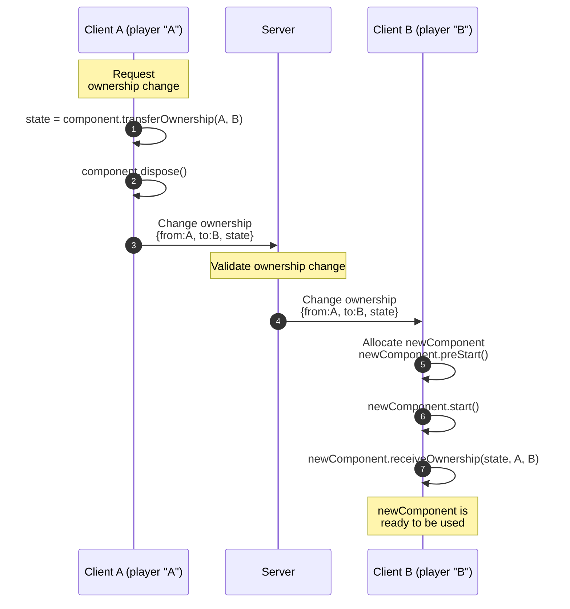

!!! Note `getLocalPlayer()` and `entity.owner.get()` are different.
    [getLocalPlayer()](#local-player) indicates the device the script is executing on, i.e. The vertical lines in the diagram indicating Client A, Server, or Client B.

    `entity.owner` is the owner that was manually or automatically requested. Note that before the ownership transfer and immediately after `entity.owner.set(B)`, the entity's owner is A. Then from `transferOwnership` in step 1 and on, the entity's owner is B.

### Discontinuous Ownership Transfers

When [ownership](#entity-ownership) of an entity is transferred from one [Player](#players) to another, including possibly the [server player](#server-player), we say that the transfer is a **continuous ownership transfer**. Whenever the "from" `Player` is unavailable we say that it is a **discontinuous ownership transfer**.

**Causes**: Discontinuous transfers occur when:
1. A component initializes for the first time in an instance (either because the [instance](#instances) started or it just [spawned](#spawning) in).
2. A player quits the app or crashes then the player's runtime is no longer available to package up the data.

**Receiving Ownership**: In a discontinuous transfer the `state` argument in [receiveOwnership](#ownership-transfer) will be `null`.

!!! warning Not handling discontinuous ownership transfers on local components is a frequent source of bugs.
    When a player abruptly leaves a world (usually because of quitting the app or crashing), there will not be any [OnGrabEnd](#grab-sequence-and-events), [OnAttachEnd](#attaching-entities), or [OnPlayerExitWorld](#player-entering-and-exiting-a-world) events delivered to the [Components](#components) running on that client prior to the ownership transfer occurring.

    If the script isn't written to properly handle suddenly "resetting" then that Entity can become unusable / unpredictable due to having an scripting state that is incompatible with the state of the world.

    A common pattern is to have *local scripts* send their state out to a server-owned entity so that if they "reset" they can then "ask" (via an [event](#communication-between-components)) for the state, when they start up again.

### Automatic Ownership Transfers

There are a number of situations where an entity's ownership is changed automatically. These situations act exactly if the ownership was changed via `entity.owner.set(...)`:
  1. When an entity is [grabbed by](#grabbing-and-holding-entities) or [attached to](#attaching-entities) a player
     * This ensures frame-accurate position updates when tracking player movement.
  2. When an entity [collides](#collisions) with another entity or player (if "preserve ownership on collision" is disable in the Properties panel)
      * This makes it easy to have the collided entities act with [low latency for the player](#why-local-scripts-and-ownership-matter-network-latency) from then on.
  3. When a [player leaves the world](#player-entering-and-exiting-a-world)
      * The entities they [own](#entity-ownership) transfer to the server.
      * This is [discontinuous](#discontinuous-ownership-transfers) since the departing owner can't participate.

!!! bug Exiting build preview does **not** automatically transfer ownership.
    When in [build mode](#visitation-modes-edit-preview-and-publish), exiting from preview back to edit mode does _not_ automatically transfer ownership of any Entities owned by the build player back to the [server player](#server-player) even though the [player exited](#player-entering-and-exiting-a-world).

    Components with *local* execution mode will continue to run in the player's device runtime. This can be confusing if they are scripted to track player avatar location, as they will start to follow the "big" build avatar around. It is best to handle `OnPlayerExitWorld` events and explicitly transfer ownership of all scripted Entities owned by the departing player back to the [server player](#server-player).

### Transferring Data Across Owners

During [continuous ownership transfers](#discontinuous-ownership-transfers), components with local execution mode can transfer state [from the old component to the new one](#ownership-transfer).

In order to create a component that transfers data during an [ownership transfer](#ownership-transfer):
1. **Define a type** representing the data that will be transferred. The date must adhere to the [SerializableState](#serializablestate) type.
    ```ts
    type Ammo = {count: number};
    ```
2. Pass the type into the **second generic slot when extending `Component`**.
    ```ts
    class Weapon extends Component<typeof Weapon, Ammo> { ... }
    ```
3. Implement **`transferOwnership`** on the component to package up data that will be transferred. The `transferOwnership` method also passes in the players involved in the transfer. It's possible, and likely, for one of them to be the [server player](#server-player).
    ```ts
    transferOwnership(from: Player, to: Player): Ammo {
      return {count: this.ammo};
    }
    ```
4. Implement **`receiveOwnership`** on the component to use the data packaged up by the previous owner. The `receiveOwnership` method also passes in the players involved in the transfer. It's possible, and likely, for one of them to be the [server player](#server-player). The state will be *`null`* if the transfer is [discontinuous](#discontinuous-ownership-transfers) (first awakening, or from a player that disconnected).
    ```ts
    receiveOwnership(state: Ammo | null, from: Player, to: Player) {
      if (state !== null) {
        this.ammo = state.count
      }
    }
    ```

!!! example
    The example below shows a simple script that tracks how much ammo is in a weapon. When the gun is [transferred](#ownership-transfer), it maintains the same ammo count. Note that if the [transfer is discontinuous](#discontinuous-ownership-transfers) the amount of ammo will be the value in the [props](#component-properties).
    ![[ horizonScripts/ownerDataTransferExample.ts ]]

# Collisions

**Collisions** occur when one entity *intersects* with another or with a player (and then are typically pushed apart by [forces](#physics) so that they don't intersect any more).

Collisions are used (under the hood) to drive [trigger events](#trigger-collisions) and to compute [raycasts](#raycast-gizmo). Additionally, [Interactive entities](#interactive-entities) can be configured to receive [collision events](#collision-events) whenever their collide.

There are a number of nuances: collisions start with entities that have a [collider](#colliders) ([meshes](#meshentity-class) and [collider gizmos](#collider-gizmo)) and those colliders must be [active](#active-colliders) for a collision to occur. A number of these features involve [traversing up an ancestor chain to find an entity with a specific tag](#entity-tag-bubbling).

## Collision Events

When an entity has [Motion set to Interactive](#interactive-entities) you can enable it to receive **[built-in collision CodeBlockEvents](#built-in-code-block-events)**. In the Properties panel, under "More", is the setting "Collision Events From" which can be set to "Players", "Object Tagged", or "Both". In the latter two cases a [tag](#entity-tags) must be specified (in the field right below the setting).

A collider must be [active](#active-colliders) for it to be detected in collisions.

There are two [CodeBlockEvents](#code-block-events) you can subscribe to on an entity to know when it collides with something:

| [Built-In CodeBlockEvent](#built-in-code-block-events) | Parameter(s) | Description  |
|---|---|---|
| `OnPlayerCollision` | <nobr>`collidedWith: Player`<br/>`collisionAt: Vec3`<br/>`normal: Vec3`<br/>`relativeVelocity: Vec3`<br/>`localColliderName: string`<br/>`otherColliderName: string`</nobr> | Sent when the entity collides the `collidedWith` player. |
| `OnEntityCollision` | <nobr>`collidedWith: Entity`<br/>`collisionAt: Vec3`<br/>`normal: Vec3`<br/>`relativeVelocity: Vec3`<br/>`localColliderName: string`<br/>`otherColliderName: string`</nobr> | Sent when the entity collides the `collidedWith` entity. |

The parameters for both events are:

| Collision Event Parameter  | Type | Notes |
|---|---|---|
| `collidedWith` | [Player](#players) or [Entity](#entity-class) (depending on the event) | What the entity collided with. |
| `collisionAt` | [Vec3](#vec3) | The global location where the entity *came in contact* with `collidedWith`. |
| `normal` | [Vec3](#vec3) | The [surface normal](#https://en.wikipedia.org/wiki/Normal_(geometry)) at the position `collidedAt` on `collidedWith`. |
| `relativeVelocity` | [Vec3](#vec3) | The global velocity of `entity` compared to `collidedWith` (which you can use to see how "hard the hit" was). |
| `localColliderName` | `string` | The *name* of first "leaf-level" collider involved in the collision. |
| `otherColliderName` | `string` |  The *name* of second "leaf-level" collider involved in the collision. This could be a [player body part](#player-body-parts) (`"Head"`, `"LegCollider"`, `"Torso"`) if the entity is configured for collision events from players. Note that [VR players](#player-device-type) have many colliders on their hands ( `"LeftPalm"`, `"LeftThumbMid"`, `"LeftThumbTip"`, `"LeftIndexFingerBase"`, `"LeftIndexFingerTip"`, `"LeftOtherFingersBase"`, `"LeftOtherFingersTip"`, and similar for the right hand). **[Mobile/Web players](#player-device-type) do not have colliders on their hands**. |

**Collider Names**: If a group containing a cube collides with a player's left hand, then the the `localColliderName` will be the name of the cube and `otherColliderName` will be the name of the


**Entity colliding with a player**

The entity's "Collision Events From" setting must be set to "Player" or "Both" to receive `OnPlayerCollision`.

**Entity colliding with another entity**

The `entity`'s "Collision Events From" setting must be set to "Object Tagged" or "Both" to receive `OnEntityCollision`.

When `entity`'s collider intersects with `other` entity's collider Horizon handles a **one-sided collision** between `entity` and `other` (with `other`'s normal), and then it handles a **one-sided collision** between `other` and `entity` (with `entity`'s normal), since it is possible that both are registered to receive collision events.

**One-Sided Entity Collision Algorithm**

Here's the steps that Horizon takes in a one-sided collision check between `entity` and `other`:
  1. check what [tag](#entity-tags) the `entity` is configured to get events from. Find a `target` entity with that tag by looking at `other` and then [bubbling up its ancestors](#entity-tag-bubbling).
  2. If other was found (otherwise skip to #3), send `CodeBlockEvents.OnEntityCollision` to `entity` with `target` as the `collidedWith` parameter.
  3. If `entity` has a `parent` then go back to step #1 and repeat the process with the `parent` replacing `entity`.

```ts
// Code approximating the algorithm Horizon
// uses to handle sending collision events
function tryOneSidedCollision(
  startEntity: Entity,
  other: Entity,
  otherNormal: Vec3,
  collisionPoint: Vec3,
  relativeVelocity: Vec3,
) {
  let entity : Entity | null = entity

  while (entity) {
    // Find the tag that `entity` want to hear
    // collision event from (not a real method)
    const tag = collisionEventsFromTag(entity)

    // Find the bubbled entity with the given tag.
    // findTagBubbledEntity is in "Entity Tag Bubbling"
    const target = findTagBubbledEntity(other, tag)

    if (target) {
      // send the event (not a real method)
      sendCodeBlockEvent(
        startEntity,
        CodeBlockEvents.OnEntityCollision,
        target,
        collisionPoint,
        otherNormal,
        relativeVelocity,
        startEntity.name.get(),
        other.name.get(),
      )
    }

    entity = entity.parent.get()
  }
}
```

## Colliders

**Colliders** are invisible (non-rendered) "shapes" that are used for detecting when entities and players overlap in 3D space (a "collision"). Colliders exist on [mesh entities](#meshentity-class), on avatars (on each of their [body parts](#player-body-parts)), and as [collider gizmos](#collider-gizmo) that are literally just colliders.

**Colliders (not meshes) drive [trigger events](#trigger-collisions), [collision events](#collision-events), and [raycast detections](#raycast-gizmo)** but only if they are [active](#active-colliders).

When a cube enters a trigger, the trigger detects its *collider* (which is shaped like a cube). When a player's head enters a trigger, the trigger detects' the heads *collider* (which is roughly sphere-shaped and has less resolution than the actual avatar head!). When two spheres collide and bounce off one another (with [physics](#physics)), it was actually their colliders (which are spheres) that collided. All of the built-in custom model primitives have built-in colliders already. **When you import your own [3D models](#3d-model-asset), Horizon uses the *meshes* to generate the colliders**. At times it makes sense to [separate out the collider](#separating-a-collider-from-a-mesh) to improve performance (don't pre-optimize this until you actually have a performance problem!).

### Active Colliders

In order for a collider to be detected it needs to be an **active collider**, otherwise it is ignored in [trigger events](#trigger-collisions), [collision events](#collision-events), and [raycast detections](#raycast-gizmo).

A **collider is active** when the following true
1. Its entity has `collidable` set `true`
1. It has *no `parent`* or its `parent` (and all [ancestors](#ancestors)) have `collidable` set to `true`
1. It is *not occluded* by other colliders in the world (e.g. it's not inside or blocked by some other collider)

Regarding #3, *occlusion is often from a specific direction*. Example: if you want to grab an object but it is behind a wall then the wall's collider will occlude the object (from the vantage point of the player trying to grab it).

**Inactive colliders are ignored by the physics system**. If the floor's collider is inactive an avatar will fall through it. If a [grabbable entity](#grabbing-and-holding-entities)'s collider is inactive you cannot grab it. If a wall's collider then a [raycast](#raycast-gizmo) cannot hit it.

**Many entities do not have a collider** and thus can never have an active collider (e.g. [particle effect](#particlefx-gizmo)). But they could have children with colliders.

**[Empty objects and groups](#empty-object-and-groups) don't have colliders** but their children may have them. When an empty object or group interacts with [triggers](#trigger-collisions), [collisions](#collisions), or [raycasts](#raycast-gizmo) they have to have active colliders within them.

### Separating a Collider from a Mesh

**For performance reasons a mesh may want to have a collider with less detail than the actual mesh**. Avatars do this. When you import your own [3D models](#3d-model-asset), you can disable **collidability** and use [collider gizmos](#collider-gizmo) to approximate the shape instead.

You shouldn't try separating out colliders unless:
  * you are experienced in doing so
  * you have identified an actual performance issue in your world

!!! example A high resolution mesh with a low resolution collider.
    Here's an example of a mesh (a character's face) that has a lot of geometry. It would really hurt perf to have Horizon compute collisions with the full face. So instead, a separate collider has been added (the icosahedron). This can be achieved by making the face with `collidable=false` and the icosahedron with `visible=false`. Or you could use the [sphere collider](#collider-gizmo) instead.
    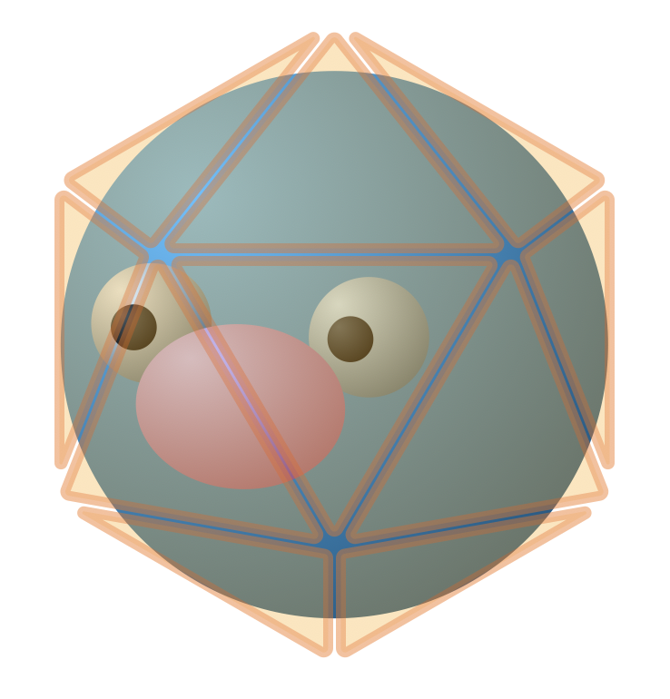


## Entity Tag Bubbling

When Horizon is looking for an entity with a specific tag it performs a process we'll call **tag bubbling** where it walks up the [ancestor chain](#ancestors) in search of an entity with the tag. This process is used in [collision detection](#collision-events) and [raycasting](#raycast-gizmo).

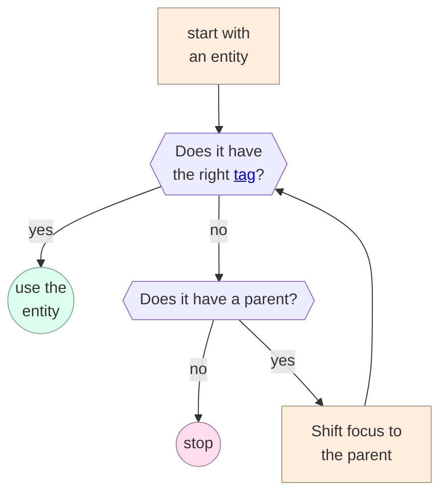

In code this algorithm looks like
```ts
// The algorithm used by Horizon in tag bubbling
function findTagBubbledEntity(
  startEntity: Entity,
  tag: string
): Entity | undefined {
  let entity : Entity | undefined = startEntity

  while (entity !== undefined) {
    if (entity.tags.get().contains(tag)) {
      return entity
    } else {
      entity = entity.parent.get()
    }
  }

  return undefined
}
```

# Physics

The Horizon physics system provides a lightweight simulation of rigid body dynamics. It allows you to add basic physical behaviors—such as gravity, mass, drag, friction, and bounciness to [interactive entities](#interactive-entities). [Forces](#forces) and [torques](#torques) are applied to update an entity’s linear and rotational motion (with helpers to create [spring mechanics](#springs) for moving and rotating). This is all done by [creating a physical entity](#creating-a-physical-entity) and using the [PhysicalEntity](#physicalentity-class).

You can use [simulated and locked](#simulated-vs-locked-entities) to disable physics updates, run callbacks every frame [before or after physics updates](#prephysics-vs-onupdate-events), and also apply [forces to players](#player-physics).

**Simple**: Horizon’s physics system is best used for simple and casual interactions. It lacks more advanced features such as constraints (rods, hinges, and ball-and-socket joints), rotational inertia modeling, fixed update, pre-physics features for entities, programmatic mass, and more. You can achieve a range of interactions, but creating complex physics-based mechanics or full-scale games may require creative workarounds (or doing your own physics calculations entirely).

## Units

The physics system in Horizon uses [SI Units](https://en.wikipedia.org/wiki/International_System_of_Units):

| Quantity | Unit |
|---|---|
| Distance | meters |
| Velocity| [Vec3](#vec3) with `magnitude` in meters/second |
| Acceleration | meters/second<sup>2</sup> |
| Angular Velocity | [Vec3](#vec3) where the direction is the *axis of rotation* and the `magnitude` is in radians/second |
| Angular Acceleration | [Vec3](#vec3) where the direction is the *axis of rotation* and the `magnitude` is in radians/second<sup>2</sup> |
| Mass | kilograms |
| Force | [Vec3](#vec3) with `magnitude` in Newtons |
| Impulse | [Vec3](#vec3) with `magnitude` in Newton \(\cdot \) seconds |
| Torque | [Vec3](#vec3) where the direction is the *axis of rotation* and the `magnitude` is in Newton \(\cdot \) meters |

## PhysicalEntity Class

| `PhysicalEntity` Class Member | Description |
|---|---|
| gravityEnabled | When `true`, a force is generated every [frame](#simulation-phase) with the magnitude set in the Properties panel |
| [applyForce](#forces) | Add a force (or impulse or velocity change) to the entity |
| [applyLocalForce](#forces) | Add a force (or impulse or velocity change) to the entity, expressed in [local coordinates](#local-transforms) |
| [applyForceAtPosition](#forces) | Add a force (or impulse or velocity change) to the entity at a specific position, which may also generate a *torque* |
| [applyTorque](#torques) | Apply a torque |
| [applyLocalTorque](#torques) | Apply a torque expressed in [local coordinates](#local-transforms) |
| [zeroVelocity](#forces) | Immediate stop the entity, positionally and rotationally |
| [springPushTowardPosition](#spring-push) | Apply a linear spring force |
| [springSpinTowardRotation](#spring-spin) | Apply a rotational spring torque |

## Creating a Physical Entity
For an entity to become a physical entity it must first be an [interactive entity](#interactive-entities):
1. Its `Motion` to `Interactive`
1. Its `Interaction` to `Physics` or `Both`.

As long as `Motion` is set to `Interactive`, the `Interaction` setting can be changed at runtime via the `interactionMode` property on the [Entity class](#entity-class).

In order for the entity to have physics applied to it, it must have:
1. An [active collider](#active-colliders)
1. [simulated](#simulated) set to `true`
1. [locked](#simulated-vs-locked-entities) set to `false`.
1. [All ancestors, if any, be Empty Objects with Motion set to None](#interactive-entities).

When an entity has `Interaction` to `Physics` or `Both`, the following properties are available in the Properties panel:

|Physics Properties|Units|Description|
|---|---|---|
|Gravity |meters/second<sup>2</sup>| Downward acceleration applied to objects. Default is 9.81 m/s<sup>2</sup>. |
|Mass| kilogram| Used in calculations for [force](#forces), |
|Drag| fraction | A measure of how much velocity is lost every frame (simulating air resistance or any other resistive force). Higher numbers represent a much faster loss of velocity. |
|Angular Drag| fraction | A measure of how much angular velocity is lost every frame (simulating air resistance or any other resistive force). Higher numbers represent a much faster loss of angular velocity. |
|Dynamic Friction| fraction | A measure of how much velocity is lost every frame when sliding against another entity. Higher numbers represent more resistance (more loss of velocity). |
|Static Friction| fraction | A measure of how much velocity is lost when *starting* to slide against another entity (from rest). Higher numbers represent more resistance (more loss of velocity). |
|Bounciness| fraction | Elasticity of collisions (0 = none, 1 = full bounce). |
|Center-of-Mass| displacement in meters | A [Vec3](#vec3) in [local coordinates](#local-transforms). This setting is only available when "Center of Mass Override" is enabled in the Properties panel. |

!!! tip Set the mass of a physical entity when first creating a physical entity
    This will ensure that physics calculations with other entities work as expected when you start experimenting with other physical properties and functions.

!!! danger Do not apply physics to an [Empty Object](#empty-object-and-groups).
    There are many bugs with Empty Objects and the physics system. For example:
    * `applyForceAtPosition` and `applyTorque` use different centers-of-mass
    * `applyForce` silently fails for `PhysicsForceMode.Force` and `PhysicsForceMode.Impulse`.

## Simulated vs Locked Entities

Every [Entity](#entities) has a [simulated property](#simulated) which *disables physics and interaction* (to make the entity act as if [Motion](#interactive-entities) is set to "None").

The [PhysicalEntity class](#physicalentity-class) has a `locked` property to **disable just physics**. Then `locked` is `false` the entity will not response to any physics-based or avatar-based movement. That means you cannot move the entity with forces or moving by grabbing. However, **a locked entity *can be grabbed*, but the hand stays locked to the entity, unable to move it**.

Locking a physical entity is useful for: [steering wheels, levers, and other things that a player's hands should "attach to"](#moving-a-held-entity-globally-in-relation-to-the-world) (without moving the entity).

Locked entities can still be [collided](#collisions) with.

## Applying Forces and Torque

Every [PhysicalEntity](#physicalentity-class) has internal state representing ***pending* (linear) acceleration** and ***pending* angular acceleration** (stored on the [client](#clients-devices-and-the-server) that [owns](#entity-ownership) the entity, due to [authority](#authority-and-reconciliation)). In the next [simulation phase](#simulation-phase) the engine will do a simulation step that accumulates the pending accelerations into the velocities, and accumulates the current velocities onto the position and rotation.

The physics-based way to impact acceleration, velocity, and position is via [force](#forces). The physics-based way to impact angular acceleration, angular velocity, and rotation is via [torque](#forces) (the rotational analog of a force).

### Forces

**Force** causes object to *move* (whereas [torque](#torques) causes them to *rotate*).

The force equation is

<div style="text-align:center">Force = Mass · Acceleration</div>

where *mass* can be set in Properties panel for the entity (defaulting to `1` kilogram). This is Newton's famous "F=ma".

Note that:
* Force creates an *acceleration* for 1 frame, changing the *velocity* just *once*
* *Velocity* will continue to update the position *every frame*
* [PhysicalEntity](#physicalentity-class)'s "angular drag" setting will cause the *velocity* to shrink over time (as long as no further forces are applied)
* A player or entity can create a force on an entity by colliding with it, grabbing it, or throwing it.

You can apply a force with a number of methods on [PhysicalEntity](#physicalentity-class):

| [PhysicalEntity](#physicalentity-class) method | Notes |
|---|---|
| <nobr>`zeroVelocity(): void`</nobr> | Apply the exact force and torque needed to bring the entity to a stop (positionally and rotationally). |
| <pre class="language-ts ts"><span><code>applyForce(<br/>  vector: Vec3,<br/>  mode: PhysicsForceMode<br/>): void</code></span></pre> | The `PhysicsForceMode` enum has three values, each of which will change how the input `vector` is will be used in the next [simulation phase](#simulation-phase):<table><tr><td>-</td><td>`vector`<br/>units</td><td>velocity change</td></tr><tr><td>`Force`</td><td>N</td><td><nobr>`v += vector/m * dt`</nobr></td></tr><tr><td>`Impulse`</td><td>N·s</td><td><nobr>`v += vector/m`</nobr></td></tr><tr><td>`VelocityChange`</td><td><nobr>m/s</nobr></td><td><nobr>`v += vector`</nobr></td></tr></table>where `v` is the *velocity*, `m` is the *mass*, and `dt` is the "delta time" (the time, in seconds, since the last frame). |
| <pre class="language-ts ts"><span><code>applyLocalForce(<br/>  vector: Vec3,<br/>  mode: PhysicsForceMode<br/>): void</code></span></pre> | Behaves the same as `applyForce` except that the force is expressed in they entity's [local coordinates](#local-transforms). |
| <pre class="language-ts ts"><span><code>applyForceAtPosition(<br/>  vector: Vec3,<br/>  position: Vec3,<br/>  mode: PhysicsForceMode<br/>): void</code></span></pre> | Applies a force, impulse, or velocity change on the entity at the specified position, which will compute both a *force and a torque*. For example: pushing on an bar from the side will cause it to move and turn.<br/><br/>The *position does not need to be "on" the entity*. The position is simply used to compute the torque (a position really far away from the [pivot point](#pivot-points) of the entity will generate a large torque). |
| <pre class="language-ts ts"><span><code>springPushTowardPosition(<br/>  position: Position,<br/>  options?: Partial<SpringOptions><br/>): void</code></span></pre> | See the documentation in [spring push](#spring-push). |

### Torques

**Torque** is the [rotational analogue of (linear) force](https://en.wikipedia.org/wiki/Torque). Force causes object to *move*. Torque causes them to *rotate*.

The torque equation is (as an analog to "F=ma"):
<div style="text-align:center">Torque = Rotation Inertia · Angular Acceleration</div>


but unfortunately there is **no public documentation on how Horizon handles rotational inertia**. You'll have to experiment with torque values until you find a value that works for your use case.

Note that:
* Torque creates an *angular acceleration* for 1 frame, changing the *angular velocity* just *once*
* *Angular velocity* will continue to update the rotation *every frame*
* [PhysicalEntity](#physicalentity-class)'s "drag" setting will cause the *angular velocity* to shrink over time (as long as no further torques are applied)
* A player or entity can create a torque on an entity by colliding with it, grabbing it, or throwing it.

You can apply a torque with a number of methods on [PhysicalEntity](#physicalentity-class):

| [PhysicalEntity](#physicalentity-class) method | Notes |
|---|---|
| <nobr>`zeroVelocity(): void`</nobr> | Apply the exact force and torque needed to bring the entity to a stop (positionally and rotationally). |
| <nobr>`applyTorque(vector: Vec3): void`</nobr> | Apply a torque in [(global) world coordinates](#coordinate-system). |
| <nobr>`applyLocalTorque(vector: Vec3): void`</nobr> | Apply a torque in the entity's [local coordinates](#local-transforms). |
| <pre class="language-ts ts"><span><code>applyForceAtPosition(<br/>  vector: Vec3,<br/>  position: Vec3,<br/>  mode: PhysicsForceMode<br/>): void</code></span></pre> | See the documentation in [forces](#forces). |
| <pre class="language-ts ts"><span><code>springSpinTowardRotation(<br/>  rotation: Quaternion,<br/>  options?: Partial<SpringOptions><br/>): void</code></span></pre> | See the documentation in [spring spin](#spring-spin). |

### Springs

Spring physics allows entities to move and rotate as if they were attached to a spring. This system provides smooth, natural motion that can be adjusted using stiffness and damping parameters. The spring helper methods are **intended to be called every frame**.

**Spring Options**: spring behavior is controlled through the `SpringOptions` type, which defines key parameters for spring-based movement.

```ts
type SpringOptions = {
  stiffness: number;
  damping: number;
  axisIndependent: boolean;
};
```
* `stiffness`: The stiffness of the spring, which controls the amount of force applied to the object. Higher values represent a spring that "pulls harder".
* `damping`: The damping ratio of the spring, which reduces oscillation and prevents excessive bouncing. Higher values reduce in a faster "loss of energy".
* `axisIndependent`: If `true`, the object's motion is parallel to the push direction; if `false`, rotation and movement may interact.

**Default Spring Options**: if no options are provided, the following defaults are used.

```ts
const DefaultSpringOptions: SpringOptions = {
  stiffness: 2,
  damping: 0.5,
  axisIndependent: true
};
```

These values are intended to provide a balanced spring motion that feels natural without excessive oscillation.

#### Spring Push

`springPushTowardPosition` moves an entity toward a target position as if attached to (and pulled by) a spring. Spring-push computes a [force](#applying-forces-and-torque), so the entity must have **[Motion=Interactive](#interactive-entities)** and **[simulated=true](#simulated)**. A common use case is to call `springPushTowardPosition` every frame.

```ts
// PhysicalEntity
springPushTowardPosition(
  position: Vec3, options?: Partial<SpringOptions>
): void
```

* `position`: the target position, which acts as the origin of the spring force.
* `options` (optional): overrides the spring behavior (stiffness, damping, and axis independence).

!!! example
    ```ts
    const physEnt = this.props.obj1.as(PhysicalEntity);
    this.connectLocalBroadcastEvent(World.onUpdate, (data: { deltaTime: number }) => {
      physEnt.springPushTowardPosition(this.props.obj2.position.get(), {stiffness: 5, damping: 0.2});
    });
    ```

#### Spring Spin

`springSpinTowardRotation` rotates an entity toward a target rotation as if attached to (and twisted by) a spring. Spring-spin computes a [torque](#applying-forces-and-torque), so the entity must have **[Motion=Interactive](#interactive-entities)** and **[simulated=true](#simulated)**. A common use case is to call `springSpinTowardRotation` every frame.

```ts
// PhysicalEntity
springSpinTowardRotation(
  rotation: Quaternion, options?: Partial<SpringOptions>
): void
```

* `rotation`: the target rotation, represented as a quaternion.
* `options` (optional): overrides the spring behavior.

!!! example
    ```ts
    const physEnt = this.props.obj1.as(PhysicalEntity);
    this.connectLocalBroadcastEvent(World.onUpdate, (data: { deltaTime: number }) => {
      physEnt.springSpinTowardRotation(this.props.obj2.rotation.get(), {stiffness: 10, damping: 0.5, axisIndependent: false});
    });
    ```

## PrePhysics vs OnUpdate Events

A common way to apply forces (or torques) to entities and players is to do so [every frame](#run-every-frame-prephysics-and-onupdate), e.g. [spring](#spring-push) might exert a [force](#forces) on a [PhysicalEntity](#physicalentity-class) every frame.

The [broadcast local events](#built-in-local-events) for [OnPrePhysicsUpdate and OnUpdate](#run-every-frame-prephysics-and-onupdate) allow you to register callbacks to be run every frame *before* and *after* the physics computations, respectively.

!!! warning `OnPrePhysicsUpdate` is only useful for **moving players** (not entities).
    If you want to move entities every frame, do so in `OnUpdate`. An entity's pending acceleration updates live in the scene graph and are updated following the [scene graph mutation rules](#scene-graph-mutations). Thus even if you apply a force in an `OnPrePhysicsUpdate` callback, the acceleration won't be *committed* until the end of the frame, and then the physics updates will see it in the *next frame*. **The fact that player positions update after `OnPrePhysicsUpdate` is an exception to the rules.**

**PrePhysics is useful for moving the player and having physics react.** If you move the player in a [OnPrePhysicsUpdate callback](#run-every-frame-prephysics-and-onupdate) with a [force](#forces) (or by setting their [player position](#player-position-and-physics)) then the [physics simulation](#simulation-phase) could respond (for instance, if a movement pushed the player into the wall, then the physics calculations could bounce the player off of it). This is possible because **if you modify a player's position in `OnPrePhysicsUpdate`, it is used during the [physics updates](#simulation-phase) right after.** However, not that there is some [awkwardness in how the values are used](#player-position-and-physics).

**OnUpdate is useful for moving the player as a result of physics.** If you wanted to move a player every frame so that they are standing on top of a boulder rolling down a hill, then you would want to position the player *after* the physics update each from (so that you can move the player *after* the boulder has moved, to keep them in sync).

## Player Physics

The player avatar acts like a single *physical entity*, although you cannot actually use it as one. But you can still apply forces to the player and have them interact with other physics-based entities in the world (players can [collide with entities and with other players](#collision-events)).

| [Player class](#player-class) member | Notes |
|---|---|
| `applyForce(force: Vec3): void` | Apply a force, as a vector with magnitude in Newtons, to the player. This acts just like [applying a force to an entity](#applying-forces-and-torque):<br/><pre class="language-ts ts"><span><code>physicalEntity.applyForce(<br/>  force, PhysicsForceMode.Force<br/>)</code></span></pre> |
| <pre class="language-ts ts"><span><code>configurePhysicalHands(<br/>   collideWithDynamicObjects: boolean,<br/>  collideWithStaticObjects: boolean<br/>): void</code></span></pre> | This is only for [VR players](#player-device-type), allowing you to set if their hands should *physically* collide with [dynamic and static entities](#static-vs-dynamic-entities) in the world. To be able to change these values you have to set "Can Hands Collide With Physics Objects" and "Can Hands Collide With Static Objects" in [Player Settings](#publishing-and-player-settings). |
| `gravity: HorizonProperty<number>` | Read and write the downward acceleration (*not force*) on the player in m/s<sup>2</sup>. The default is Earth gravity: `9.81`. |
| `velocity: HorizonProperty<Vec3>` | The velocity of the player *due to physics*. See [player physical velocity](#player-physical-velocity) for details. |

### Player Physical Velocity

The [Player class](#physicalentity-class) has a property: `velocity: HorizonProperty<Vec3>`. Unfortunately **this property does not represent the actual `velocity` of the player**. If you want the actual velocity then you show measure the position two frames apart and divide by the time between (such as with an [OnUpdate callback](#run-every-frame-prephysics-and-onupdate)).

Calling `player.velocity.get()` returns (or `set()` to modify it) a quantify called the **physical velocity** of the player. This quantity represent the velocity of the player that the *physics system is using*. It does not account for locomotion (via a VR controller joystick, computer keyboard, or on-screen controls). Additionally is does not account for a player being [grounded](#player-locomotion); meaning that the physics system might be tracking a person as "falling" even though the *grounding* feature has them standing still.

**This feature was designed with the intent of being used for flying, swimming, climbing, etc where locomotion is replaced with force-based movement**. Any time that the player is [grounded](#player-locomotion), the values in player `velocity` may be unexpected.

### Player Position and Physics

**Update player position in `OnPrePhysicsUpdate`**: If you set a player's position in an [OnPrePhysicsUpdate callback](#prephysics-vs-onupdate-events) on the [player's device](#clients-devices-and-the-server), that position will be used in the physics calculation that follows, in the same frame. This is the [only scene graph property that works this way](#scene-graph-mutations). This is useful to have the physics system respond to player movement.

Unfortunately, there is **some awkwardness in how Horizon reports the player position**.If you set a player's position in `OnPrePhysicsUpdate`, then the [physics updates](#simulation-phase) will react and compute a new vale. However that new physics-computed value won't actually be set in the scene graph until the end of the frame. Instead, the `position.get()` will keep returning the value you used in `OnPrePhysicsUpdate`, until [scene graph mutations](#scene-graph-mutations) are committed.

**Setting player position from the [server](#clients-devices-and-the-server)**: Since a player's device is [authoritative](#authority-and-reconciliation) over the player's position, if you modify a player's position from a script running on the server, then it will have to send a request to the player's device, wait for the movement, and then wait for the response. At that point it will see the new value.

**Position/rotation and physics forces don't play well together** in the same frame. If you try to [move an entity](#position) (or [move a player](#player-position-and-physics)) with both `position.set()` and [forces](#forces) at the same time, they'll conflict and give unexpected results. You should choose one approach or the other - either move things by setting their position directly, or move them with physics forces, but never both at once. The same applies to [setting rotations](#rotation) vs using [torques](#torques).

# Players

The `Player` class represents a person in the instance, an [NPC](#npc-gizmo) in the instance, or the "omnipotent player" (the server).

**<a id="maximum-player-count">Max player count</a>**: Each world has a maximum player count that controls the maximum number of players allowed in each [instance](#instances). The count is configured in [world settings](#publishing-and-player-settings).

**Construction / New**: `Player` instances are allocated by the system; you should *never allocate them directly* (never use `new Player`).

**Equality Comparison**: `Player` instances can be compared referentially `aPlayer === bPlayer` which is the same as `aPlayer.id === bPlayer.id`.

**Server Player**: There is a special "Server `Player`" instance that represents the [server](#server-player). Its primary use is in checking or setting which player "owns" an entity (it's the "server player" if none of the human players do). The server player does not count against the [maximum player count](#maximum-player-count) being reached.

**ID and Index**: Each `Player` has an `id` and an `index` which serve different purposes (see below). From a `Player` instance you can access `PlayerBodyBart`s, e.g. `aPlayer.leftHand` or get their name `aPlayer.name.get()`. There are many `CodeBlockEvents` associated with players (such as entering/exiting a world, grabbing entities, and much). All aspects of players are described in detail in the next sections.

## Player Class

| `Entity` Class Member | Description |
|---|---|
| **Identification** |
| [deviceType](#player-device-type) | The type of device the player is using |
| [id](#player-id) | ID in this instance |
| [index](#player-indices) | Index in this instance |
| [isInBuildMode](#identifying-players) | Is the player in an editor instance and in build mode |
| [name](#identifying-players) | Readonly `string` [Horizon Property](#horizon-properties) of the player's name |
| **Body Parts** |
| [foot](#player-body-parts) | Player's foot reference object |
| [head](#player-body-parts) | Player's head object |
| [leftHand](#player-body-parts) | Player's left hand object |
| [rightHand](#player-body-parts) | Player's right hand object |
| [torso](#player-body-parts) | Player's torso object |
| **Pose** |
| [clearAvatarGripPoseOverride](#scripted-grip-pose-animation) | Remove the current grip pose override |
| [playAvatarAnimation](#avatar-animation) | Play avatar animation (<span style="color:#770000">currently unsupported</span>) |
| [playAvatarGripPoseAnimationByName](#scripted-grip-pose-animation) | Play a grip pose animation |
| [setAvatarGripPoseOverride](#scripted-grip-pose) | Set a grip pose override |
| [stopAvatarAnimation](#avatar-animation) | Stop avatar animation (<span style="color:#770000">currently unsupported</span>) |
| **Transform** |
| [forward](#local-transforms) | Local forward of the player (measured from their hips) |
| [position](#player-position-and-rotation) | Position of the player's center point |
| [rotation](#player-position-and-rotation) | Rotation of the player around their center point |
| [up](#local-transforms) | Local up of the player (measured from their hips) |
| **Locomotion** |
| [isGrounded](#player-locomotion) | Is the player anchored "on the ground" (not falling or jumping) |
| [locomotionSpeed](#player-locomotion) | The non-sprinting speed of the player |
| [jumpSpeed](#player-locomotion) | The speed the player leaves the ground at when they jump |
| **Physics** |
| [applyForce](#player-physics) | Apply a force to the player |
| [configurePhysicalHands](#player-physics) | Configure if a [VR player](#player-device-type)'s hands can collide with entities in the world |
| [gravity](#player-physics) | The vertical acceleration of the player (when they are in the air) |
| [throwHeldItem](#throwing) | Throw the currently held item |
| [velocity](#player-physical-velocity) | The player's velocity due to physics (not including locomotion) |
| **Quests / Achievements** |
| [hasCompletedAchievement](#quests) | Check if the player has completed the given achievement |
| [setAchievementComplete](#quests) | Set if the player has completed the given achievement |
| **UI / Focused Interaction** |
| [enterFocusedInteractionMode](#focused-interaction) | Change a [Mobile/Web player](#player-device-type) from locomotion mode to focus mode (where they can tap on the screen instead of moving the avatar). Must be called on a [player device](#clients-devices-and-the-server). |
| [exitFocusedInteractionMode](#focused-interaction) | Return a [Mobile/Web player](#player-device-type) to normal locomotion mode. Must be called on a [player device](#clients-devices-and-the-server). |
| [focusedInteraction](#focused-interaction) | The `FocusedInteraction` object for the player. |
| [unfocusUI](#custom-ui) | Exit a player from the UI they are focused on |
| **Aim Assist** |
| [clearAimAssistTarget](#aim-assist) | Remove the aim-assist target |
| [setAimAssistTarget](#aim-assist) | Configure a [Mobile/Web player](#player-device-type)'s cursor to be attracted to a given target |
| **Voip** |
| [setVoipSetting](#voip-settings) | Configure who can hear the player |

## Identifying Players

Players have three *readonly* [Horizon Properties](#horizon-properties) you can use to get information about them:

| [Player class](#player-class) readonly Horizon Property | Type | Notes |
|---|---|---|
| [deviceType](#player-device-type) | `PlayerDeviceType` | What kind of device the player is currently using. Values are `VR`, `Mobile`, and `Desktop`. |
| isInBuildMode | `boolean` | Returns true if the player is in an [editor instance](#instance-selection) **[is in edit mode](#visitation-modes-edit-preview-and-publish)**.
| name | `string` | The player's in-game name. |

Players in Horizon all have a global "account id". There is no way to access this id directly, although Horizon uses it under the hood for persistence (player variables, leaderboards, and quests). Within an instance players can be referenced by the `id` or the `index` they are assigned on entry. Player `index`es are reused when players leave; `id`s are not.

### Player Device Type

The `deviceType` [readonly Horizon property](#horizon-properties) on the [Player class](#player-class) let's you check what kind of device a player is on. It returns an instance of `PlayerDeviceType` which has values of `VR`, `Mobile`, and `Desktop`.

Here are some example functions that may be useful:

```ts
import { Player, PlayerDeviceType } from 'horizon/core'

function isVRPlayer(player: Player) {
  return player.deviceType.get() === PlayerDeviceType.VR
}

function isScreenPlayer(player: Player) {
  return player.deviceType.get() !== PlayerDeviceType.VR
}
```

### Player ID

Each `Player` instance has a `readonly id: number` property.

!!! info Entering an instance assigns a new ID (for that instance).
    When a person enters an instance they are assigned an `id` that has not yet been used in that instance. If a player switches devices, or leave the instance and later return, they will be given a new `id`.

!!! danger IDs are per-instance. Do not persist them.
    The `id` that a player gets in one instance of a world has nothing to do with the `id` they might get in another instance. If a person gets assigned `id` 42 in one instance then the moment they leave that instance you should no longer associate them with the `id`.

!!! warning IDs should be used rarely.
    Since you can compare two `Player` instances directly with `===` and `!==` there is little reason to use the `id` property. You can even use `Player` instances as keys in a `Map`. If you have a reason to use the `id` field, be mindful that the association between a person and their `id` only exists until they leave that instance.

### Player Indices

When a player (human or [NPC](#npc-gizmo)) enters a world they are also assigned an `index`. The `index` will be a number between `0` and `n-1`, where `n` is the maximum number of players allowed in an instance. When a player enters an instance they are assigned an `index` value that is not currently used by any other player. When they leave that value becomes available again.

For example: if three players arrive in an instance they may be assigned `index` values of `0`, `1`, and `2`. If they player with `index` `1` leaves then the next player that arrives may get index `1` again.

You can read a player's index with

```ts
player.index.get()
```

and use
```ts
world.getPlayerFromIndex(index) // Player | null
```

to find out which player currently, if any, has a given index.

!!! danger Do not rely on the order indices are assigned
    There are no guarantees that a player gets the _smallest_ available `index`. Any available value maybe be assigned to a new player.

!!! example Example: per-player entities
    A common use of `index`es is managing per-player entities. For instance, if you want every player to have a shield when they spawn in. Then you could have an array of shield `Entity`s and when a player enters the world, assign them the shield from that array that matches their `index`.

### Listing All Players

The `World` class has the method:

```ts
getPlayers() : Player[]
```

which returns the current list of players in the world (human and [NPC](#npc-gizmo), but does not include the server player). Note that the order of this array should not be relied upon. The order may change between calls and there is no relation to the `index` property described above.

Note that since `getPlayers` returns both human and [NPC](#npc-gizmo) players you can use [the player type function](#checking-human-vs-npc-vs-server) to get just the human players, or just the NPCs:

```ts
const humanPlayers = this.world.getPlayers().filter(
  p => getPlayerType(p, this.world) === 'human'
)
```

When a [player leaves](#player-entering-and-exiting-a-world), they `Player` instance is no long in the `getPlayers()` array. So you can also use this helper:

```ts
import { Player, World } from 'horizon/core'

function isPlayerInWorld(player: Player, world: World) {
  return world.getPlayers().includes(player) &&
    !player.isInBuildMode.get()
}
```

### Checking Human vs NPC vs Server

Human players and [NPC](#npc-gizmo) players both use the `Player` class. You can use the function below to detect the type of a player:

```ts
import { Player, World } from 'horizon/core'
import { AvatarAIAgent } from 'horizon/avatar_ai_agent'

type PlayerType = 'human' | 'npc' | 'server' | 'builder' | 'departed'

function getPlayerType(player: Player, world: World) : PlayerType {
  if (player === world.getServerPlayer()) {
    return 'server'
  } else if (!this.getPlayers().includes(player)) {
    return 'departed'
  } else if (player.isInBuildMode.get()) {
    return 'builder'
  } else if (AvatarAIAgent.getGizmoFromPlayer(player) !== undefined) {
    return 'npc'
  } else else {
    return 'human'
  }
}
```

### Server Player

There is a special instance of the `Player` class that represents the [_server_](#clients-devices-and-the-server). It has an `id` but no meaningful `index`. All `Player` APIs work for the server player, but return default values (example: the location will return the origin; name will return the empty string).

The **server player does not count as one of the human player**s:
  * it does not get assigned an `index`
  * it does not count toward the [maximum player count](#maximum-player-count) being reached
  * it is not included in the [getPlayer()](#listing-all-players) array

The server player [owns all entities](#entity-ownership) when the world starts (or when entities are [spawned](#spawning) in).

The `World` class has the method
```ts
getServerPlayer(): Player
```
which can be used to access the server player. The primary use cases are:
1. Transferring ownership to the server
    ```ts
    entity.owner.set(world.getServerPlayer());
    ```
2. Checking if an entity is owned by the server
    ```ts
    if (entity.owner.get() === world.getServerPlayer()) { ... }
    ```
3. Checking if a script is running locally
    ```ts
    if (world.getLocalPlayer() === world.getServerPlayer()) { ... }
    ```

### Local Player

Every script is run on an execution client associated with a `Player` (see [Network](#network) for more info). If the script is set to _default_ mode, then it is always running on the server. If the script is set to _local_ then is can be transferred to and from the servers and the local devices of players.

If a script is running locally on a human-player's device then that player is the _local player_ for that script. If the script is running on the server then the _server player_ is the _local player_ for that script.

The `World` class has the method

```ts
getLocalPlayer() : Player
```

for determining which `Player`'s device the current script is running one. This method with return a human-player in the world or the _server player_.

## Player Entering and Exiting a World

When a player (human or [NPC](#npc-gizmo)) enters an [instance](#instances) they are assigned a [player id](#player-id) and a [player index](#player-indices). The [built-in CodeBlockEvent](#built-in-code-block-events) `OnPlayerEnterWorld` is then sent to all [component instances](#component-class) that have [registered to receive](#receiving-events) to it. Likewise `OnPlayerEnterWorld` is [broadcast](#built-in-broadcasted-code-block-events) when a player leaves the instance.

**Is in World**: You can check if a `Player` instance is (still) in the world by using the [isPlayerInWorld helper function](#listing-all-players).

**CodeBlockEvents**: Both events in the table below are [🔈 server-broadcast CodeBlockEvents](#built-in-broadcasted-code-block-events); you can connect to any [server-owned](#entity-ownership) entity to receive them.

| [Built-In CodeBlockEvent](#built-in-code-block-events) | Parameter(s) | Description  |
|---|---|---|
| 🔈`OnPlayerEnterWorld` | <nobr>`player: Player`</nobr> | [Broadcast](#built-in-broadcasted-code-block-events) when a player enters the instance. This occurs when a **player [travels](#instance-selection) to the instance**; it also happens when a player goes from **[edit mode to preview mode](#visitation-modes-edit-preview-and-publish)** in the editor. The player is already in [getPlayers()](#listing-all-players) when this event is sent. |
| 🔈`OnPlayerExitWorld` | <nobr>`player: Player`</nobr> | [Broadcast](#built-in-broadcasted-code-block-events) when a player exits the instance. This occurs when a **player [travels](#travel-doors-and-links) away from the instance** or quits Horizon; it also happens when a player goes from **[preview mode to edit mode](#visitation-modes-edit-preview-and-publish)** in the editor. The player is no longer in [getPlayers()](#listing-all-players) when this event is sent (unless they are in build mode; then they remain in the array). |

When a player exits the world, [all entities owned by them](#entity-ownership) are [transferred to the server](#ownership-transfer).

The flow of events are shown in the diagram below. Ovals represent the *state* the entity is in. The boxes represent what happens when the entity goes from one state to another; in the box, *italics text is the action* that caused the change, **bold text is [built-in CodeBlockEvents](#built-in-code-block-events)** that are sent (in the order top-to-bottom if there are multiple in a box), and <u>underlined text is a system action that occurs</u>.

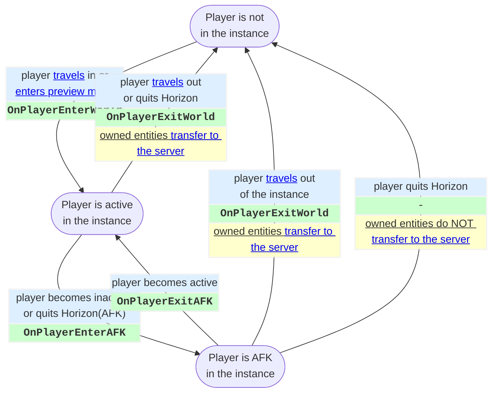

!!! warning `OnPlayerEnterWorld` and `OnPlayerExitWorld` are sent to only [server-owned entities](#entity-ownership).
    If an entity is [owned by a player](#entity-ownership) then the two code blocks above *are not* sent to it. Any component connected to receive those events from that entity will not get them.

!!! bug `OnPlayerExitWorld` is not sent if a player leaves suddenly.
    When a player leaves suddenly (crash, quit the Horizon app, turn off the device, etc...) then some player-related events such as [OnPlayerExitWorld](#player-entering-and-exiting-a-world), [OnAttachEnd](#player-entering-and-exiting-a-world), [OnGrabEnd](#grabbing-and-holding-entities) and [OnMultiGrabEnd](#grabbing-and-holding-entities) *may not be sent*. However, `OnPlayerEnterAFK` is sent immediately. So if you need to ensure a player releases held entities when they leave the world, then [detach](#detaching)/[forceRelease](#force-release) the entities on `OnPlayerEnterAFK` and [attach](#scripted-attach)/[forceHold](#force-grabbing) them on `OnPlayerExitAFK`. Note [`getPlayers()`](#listing-all-players) is only affected by `OnPlayerEnterWorld` and `OnPlayerExitWorld`, so it will not have an accurate list of all players in the instance.

!!! bug Entities are not [transferred to the server](#ownership-transfer) when leaving [preview mode](#visitation-modes-edit-preview-and-publish).
    When `OnPlayerExitWorld` is called on a player all the entities they own are [automatically transferred to the server player](#automatic-ownership-transfers). However this does not happen when going from preview to edit mode (when in an [editor instance](#instances)). This can result in unusual behavior where entities continue to react to a player that is in build mode. To avoid this, listen to the `OnPlayerExitWorld` event and assign entities back to the [server player](#server-player).

!!! warning In build mode, `OnPlayerEnterWorld` can occur twice in succession for one player id.
    In published mode, `OnPlayerEnterWorld` occurs only once per [player id](#player-id). In build mode, a player on the desktop editor triggers `OnPlayerEnterWorld` twice when they enter Preview mode from a stopped instance. This means that if you're tracking a list of all players using `OnPlayerEnterWorld`, add the new player to a set or dictionary instead of an array.

## Player Enter and Exit AFK

A [player](#players) in an [instance](#instances) can become **inactive**. The avatar of a player who has gone afk becomes a spinning coin.

Horizon calls this inactive state: **AFK** (standing for <u>A</u>way <u>F</u>rom <u>K</u>eyboard). The exact rules for inactivity are not documented and are subject to change. Roughly speaking:

**Becoming inactive (AFK)**: A mobile player becomes inactive when they go for a while without touching the screen, when they temporarily switch to a different app, or when they quit the app. A [VR player](#player-device-type) goes inactive when they take off their headset (or even raise it to their forehead) or when they open the Quest OS menu while in the app.

**Becoming active (no longer AFK)**: A mobile player becomes active when they foreground the app and begin touching the screen. A [VR player](#player-device-type) becomes active when they put their headset back on or close the OS menu.

There are two [built-in code block events](#built-in-code-block-events) associated with inactivity / AFK. Both are [🔈 server-broadcast CodeBlockEvents](#built-in-broadcasted-code-block-events); you can connect to any server-owned entity to receive them.

| [Built-In CodeBlockEvents](#built-in-code-block-events) | Parameter(s) | Description |
|---|---|---|
| 🔈`OnPlayerEnterAFK` | <nobr>`player: Player`</nobr> | [Broadcast](#built-in-broadcasted-code-block-events) when a player becomes inactive. |
| 🔈`OnPlayerExitAFK` | <nobr>`player: Player`</nobr> | [Broadcast](#built-in-broadcasted-code-block-events) when a player is no longer inactive. |

See the [diagram in the player enter / exit section](#player-entering-and-exiting-a-world) for a detailed overview of when the above two events are sent.

!!! warning `OnPlayerEnterAFK` and `OnPlayerExitAFK` are sent to only server-owned entities.
    If an entity is [owned by a player](#entity-ownership) then the two code blocks above *are not* sent to it. Any component connected to receive those events from that entity will not get them.

## Player Locomotion

A [VR player](#player-device-type) locomotes (moves the avatar) using their controllers. A [Mobile/Web player](#player-device-type) locomotes via mouse and keyboard or via on-screen controls. These inputs are applied during the [simulation phase](#simulation-phase) of each frame. You can also "take over" and override the inputs using [player controls](#player-controls).

The table below shows some methods related to player locomotion. There are additional ways to interact with player movement in [player physics](#player-physics).

The [Player class](#player-class) has a few properties related to locomotion:

| [Player class](#player-class) locomotion [Horizon property](#horizon-properties) | Type | Notes |
|---|---|---|
| isGrounded | `ReadableHorizonProperty`<br/>`<boolean>` | A read-only `boolean` property denoting if the player is on the ground and able to walk around (grounded) or in the air due to falling or jumping (not grounded). |
| jumpSpeed | `HorizonProperty`<br/>`<number>` | A read-write `number` property of how fast the player jumps in m/s. The value must be between `0` and `45`. `0` means that the player can't jump. The default is `4.3` m/s.
| locomotionSpeed | `WritableHorizonProperty`<br/>`<number>` | A write-only `number` property of how fast the player can locomote when not sprinting, in m/s. `0` means that the player cannot move. The default is `4.5` m/s.

## Player Position and Rotation

The [Player class](#player-class) has properties for `position` and `rotation`. These are [Horizon properties](#horizon-properties) and so you must call `get()` (e.g. `player.position.get()`). The `position` properties returns the world location of the player's center point (which is near the middle of their hips).

**Moving the player**: You can only `set` player position if "Custom Player Movement" is enabled in [Player Settings](#publishing-and-player-settings). Note that there are some subtleties with [player position and physics](#player-position-and-physics).

**Rotating the player**: The only way to rotate a player is to have them enter an [avatar pose gizmo](#avatar-pose-gizmo) and then script the movement of the gizmo. There is currently no way to force a player into a pose gizmo, nor to prevent them from exiting.

## Player Body Parts

A [player](#players) has a number of properties for accessing body parts: `head`, `torso`, `foot`, `leftHand`, and `rightHand`; each return an instance of the class `PlayerBodyPart` (or the more specific `PlayerHand`). They are [Horizon properties](#horizon-properties) and so you must use `get()`:

```ts
const torso = player.torso.get()
```

The `foot` body part is an "abstract" location in between the two feet (directly below the avatar center point near the hips).

Each body part has a has the standard global transform properties: [position](#position), [rotation](#rotation), and [scale](#scale) as well as [local](#local-transforms) versions: `localPosition`, `localRotation`, and `localScale`. There is also `forward` and `up`.

Additionally you can use `bodyPart.player` to identify which [player](#players) the part belongs to and `bodyPart.type` to identify which part of the body it is (e.g. `player.leftHand.get().type` returns `PlayerBodyPartType.LeftHand`).

Body parts have two helper methods: `getPosition` and `getRotation` that let you conditionally pass in an instance of the `Space` enum:
* `bodyPart.getPosition(Space.World)` is the same as `bodyPart.position.get()`.
* `bodyPart.getPosition(Space.Local)` is the same as `bodyPart.localPosition.get()`.

!!! tip Getting a body part's local *right* vector.
    Unlike for entities, there is no built-in `right` property to get the [local position x-axis](#local-transforms) direction. You can compute it yourself with:
    ```ts
    const torso = player.torso.get()
    const torsoUp = torso.up.get()
    const torsoForward = torso.forward.get()

    const torsoRight = torsoUp.cross(torsoForward)
    ```
    We did "up cross forward" because [Horizon is left-handed](#coordinate-system); "forward cross up" gives the local *left* axis instead.

### Player Hand

`PlayerHand` is a subclass of [PlayerBodyPart](#player-body-parts), thus inheriting all of the behaviors and properties outlined above.

`PlayerHand` also has a property `handedness`, returning either `Handedness.Left` or `Handedness.Right`.

Additionally, `PlayerHand` has the method `playHaptics` which is used to [make a VR player's controllers vibrate](#haptics).

## Player Pose

For [Mobile/Web players](#player-device-type), it is possible to activate or deactivate an avatar pose through scripting or through the configuration of grabbable items.

### Grip Pose
Grip poses allow for a easy avatar configuration, activating as soon as the [Mobile/Web player](#player-device-type) grabs an entity (pistol, sword, etc). These poses do not require any scripting and in most cases have a secondary animation (recoil, attack sword motion, etc) which activate when the player presses the action button (Left mouse click on PC and on-screen button for mobile).

To configure a pose animation through on a [grabbable entity](#grabbing-and-holding-entities):
1. Click on the entity in the desktop editor to open its properties.
1. Scroll down to the More category, and locate the Avatar Pose option.
1. Select an option from the dropdown menu.

To test the selection, enter preview mode and grab the object. Observe how the avatar chances its pose. Press the action button and observe the secondary animation.

### Scripted Grip Pose
Scripted animations allow for more control over the behavior of [Mobile/Web player](#player-device-type) avatar poses. You can set the pose the avatar is using with respect to a held item (the **grip pose**):

```ts
// Player
setAvatarGripPoseOverride(avatarGripPose: AvatarGripPose): void;
clearAvatarGripPoseOverride(): void;
```

The setting will override any configurations set on held items and the avatar will remain in the grip pose until `setAvatarGripPoseOverride` is called again with a new pose or `clearAvatarGripPoseOverride` is called to clear the pose override.

The **current possible AvatarGripPose options** are: *Default, Pistol, Shotgun, Rifle, RPG, Sword, Torch, Shield, Fishing, CarryLight, CarryHeavy*.

### Scripted Grip Pose Animation
When an item is configured with a grip pose, an animation plays whenever the player uses the action button. You can also script the animation to play directly, whenever you need it to:

```ts
// Player
playAvatarGripPoseAnimationByName(
  avatarGripPoseAnimationName: string
): void;
```

The animations names can be found under the exported enum **AvatarGripPoseAnimationNames**, with values of: *Fire, Reload, ReadyThrow, ChargeThrow, Throw, CancelThrow*

Other animations names not included in the enum are:
- *Die*: the avatar falls to the ground.
- *Respawn*: the player stands up instantly.

### Avatar Animation

There are two methods on the [Player Class](#player-class): `playAvatarAnimation` and `stopAvatarAnimation` which are currently **not supported** and are in `horizon/core` by error.

Likewise the types `PlayAnimationOptions`, `StopAnimationOptions`, `AnimationCallback`, `AnimationCallbackReason`, and `AnimationCallbackReasons` are also **currently unsupported**.

## Voip Settings

Horizon has the ability control *who can hear a player and from how far away*.

It call this the **Voip Setting** (borrowing the term [VoIP](#https://en.wikipedia.org/wiki/Voice_over_IP)) which can be configured with a number of values: **mute, whisper, nearby, *default*, extended, global** which representing increases ranges of being heard. Mute means that no one can hear the player, global means that everyone can hear the player (and with full volume). The other values represent a spectrum in between mute and global, with **default** being the recommended setting for most experiences (people in your general vicinity can hear and so can people farther away if you are loud). There is one more special VOIP Setting **environment**, which is described below.

!!! info There are no team-based voip settings (there are no "voice channels").
    There is (currently) no way to configure voip  settings between two specific players or to configure voice channels. Specifically you can't make a team game where a whole hears each other globally but the other team hears them whisper. When a player is set to global or whisper, **the setting controls how everyone else hears them**.

The **[environment gizmo](#environment-gizmo)** allows you to set a VOIP Setting for the whole world. All players will be assigned this value upon joining.

You can change the VOIP setting for a given player in TypeScript with:

```ts
player.setVoipSetting(VoipSetting.Whisper)
```

and at any point in time you can "cancel" that custom setting and return the player back to whatever setting is on the environment gizmo via:

```ts
player.setVoipSetting(VoipSetting.Environment)
```

!!! info Spawning Environment Gizmos
    when a new environment gizmo is [spawned](#spawning), all players will be updated to have its VOIP setting. If the spawned gizmo is set to `Environment` then all players will be returned to the setting in the last active gizmo.

**World's Player Settings' VOIP Setting**: there is a top-level setting in *Player Settings* called *VOIP Settings* that can be set to `Global` and `Local`. When set to `Global` every player has **global** as their setting, it is not possible to change any VOIP settings further (all gizmos and TypeScript related to VOIP are ignored). The `Local` setting gives the world the **default** setting, which can then be further changed by environment gizmos and TypeScript.

!!! danger Never use the World's Player Settings' `Global` VOIP Setting.
    The World's Player Settings' VOIP Settings toggle has bugs. We recommend that you **set it to `Local`** (or just never touch it after creating a new world).

## Haptics

A [VR player](#player-device-type)'s controllers can be made to vibrate to add immersion to an experience. There is currently no way to vibrate a mobile device.

To vibrate a [VR player](#player-device-type)'s controllers, choose a [player hand](#player-body-parts) and then call the `playHaptics` method on it with a duration (in seconds), a strength (via the `HapticsStrength` enum), and a sharpness (via the `HapticsSharpness` enum). For example:

```ts
player.leftHand.playHaptics(0.5, HapticStrength.Medium, HapticSharpness.Sharp)
```

**Strength**: the overall intensity of the vibration. For example, imagine a constant unchanging vibration; that vibration should occur at different levels of "intensity" or "volume". This is the *strength* of the haptic effect.

**Sharpness**: the texture or "shape" of the vibration. It's about if the effect ramps up slowly or starts immediately at full strength and if it's a fast vibration vs a slower "pulsing".

!!! tip Analogy: think of strength like "volume" and sharpness like "melody".

The supported values for haptics strength are:

| `HapticsStrength` | Meaning |
|---|---|
| `VeryLight` | A barely noticeable vibration, just enough to create a faint tactile response without drawing attention. |
| `Light` | A subtle vibration, likely intended for gentle feedback, such as indicating a soft touch or a minor interaction. |
| `Medium` | A more noticeable vibration, suitable for standard feedback like button presses or interactions that require a stronger confirmation. |
| `Strong` | A powerful vibration, used for significant events, such as impacts, collisions, or urgent notifications. |

The supported values for haptics sharpness are:

| `HapticsSharpness` | Meaning |
|---|---|
| `Sharp` | A high-frequency vibration with a quick onset and quick decay. Ideal for rapid alerts or precision interactions. |
| `Coarse` | A moderate vibration with a slightly longer duration, striking a balance between sharp and soft. Ideal for interactions that need to feel distinct without being abrupt. |
| `Soft` | A low-frequency, smooth vibration that builds and fades gradually, creating a more diffuse, gentle sensation. Ideal for subtle cues or immersive environmental effects. |

## Aim Assist

For experiences at involve the player aiming at something, Horizon offers the ability to *assist a player with their aim**. This only works for [Mobile/Web players](#player-device-type).

There are two methods on the [Player class](#player-class) related to aiming:

* **Setting an Aim Assist Target**: You can enable aim assist, via `player.setAimAssistTarget(target, options)`, to help `player` aim at `target`. You can call `setAimAssistTarget` again to change the target. The `setAimAssistTarget` method allows you to specify which [Player](#players), [Entity](#entities), or [location](#vec3) you want to help the player aim at. It does this by "pulling" the center of the screen in the direction of the target.

    ```ts
    // Player
    setAimAssistTarget(
      target: Player | Entity | Vec3,
      options?: AimAssistOptions
    ): void;
    ```

    The `AimAssistOptions` object has a few optional fields:

    | `AimAssist` field | Type | Default | Notes |
    |---|---|---|---|
    | `assistanceStrength` | `number` | 10 | The speed the camera should rotate (in degrees/second) |
    | `targetSize` | `number` | 4 | How close the center of the screen has to be to the target for the aim assist to start "pulling". A larger number is *more helpful*. |
    | `oInputGracePeriod` | `number` | 1 | How long the aim assist continues rotating the camera after the player stops providing input (in seconds) |


* **Clearing an Aim Assist Target**: To disable aim assist, call `player.clearAimAssistTarget()`.

## Throwing

```ts
export declare type ThrowOptions = {
    speed?: number | null;
    pitch?: number | null;
    yaw?: number | null;
    playThrowAnimation?: boolean | null;
    hand?: Handedness | null;
};

export declare const DefaultThrowOptions: ThrowOptions;

// Player
throwHeldItem(options?: Partial<ThrowOptions>): void;
```

# Grabbing and Holding Entities

When a [VR player](#player-device-type) grabs an entity is stays grabbed until they release the trigger. The entity is only held as long as they are holding the entity. A screen-based player uses an on-screen button to grab and then (later) a different on-screen button to release.

There is no way to check if an entity is currently held but you can listen to [grab events](#grab-sequence-and-events) to know when an entity is grabbed or released.

There are rules for when an entity [can be grabbed](#can-grab) as well as when a player can [take from another player](#setting-who-can-take-from-holder). You [force a player to grab](#force-grabbing) as well as [force a player to release](#force-release) an entity.

When a player grabs an entity, [ownership](#entity-ownership) is [transferred to that player](#grabbables-and-ownership).

## Creating a Grabbable Entity

Select an entity and then in the Properties panel set its `Motion` to `Interactive` and `Interaction` to `Grabbable` or `Both`. The entity _must_ be a root entity or it will not actually be allowed to be grabbed. Ensure that `collidable` is `true` and that (if it is a group) there is an [active collider](#active-colliders) within it.

!!! danger Grabbables cannot be inside dynamic objects
    A grabbable entity must be a *root entity* (it can only have [Static Objects](#static-vs-dynamic-entities) in its ancestor chain).

!!! warning Entities must be collidable to be grabbed!
    If a grabbable entity is not `collidable` then it cannot be grabbed. If it is a group and none of the colliders within it are active then it cannot be grabbed, even if the root is collidable!

A grabbable entity can be configured to automatically modify a [Mobile/Web player](#player-device-type)'s pose when they grab the item and also configure what action buttons are on-screen while holding the entity. For more details [see the article on configuring held items for Mobile/Web players](https://developers.meta.com/horizon-worlds/learn/documentation/create-for-web-and-mobile/grabbable-entities/intro-to-grabbable-entities).

## Can Grab

For an entity to be grabbable it needs:

1. To be a grabbable entity
   1. `Motion` to be `Interactive`
   1. `Interaction` to be `Grabbable` or `Both`
   1. [All ancestors, if any, are Meshes and Empty Objects with Motion set to None](#interactive-entities).
1. To be currently grabbable
   1. `simulated` set to `true`
   1. At least one [active collider](#active-colliders) within it (which is not occluded from the perspective of the player)
1. To be grabbable by this player
   1. Match the rules of ["Who Can Grab"](#setting-who-can-grab)
   1. If it is currently held, match the rules of ["Who Can Take From Holder"](#setting-who-can-take-from-holder)

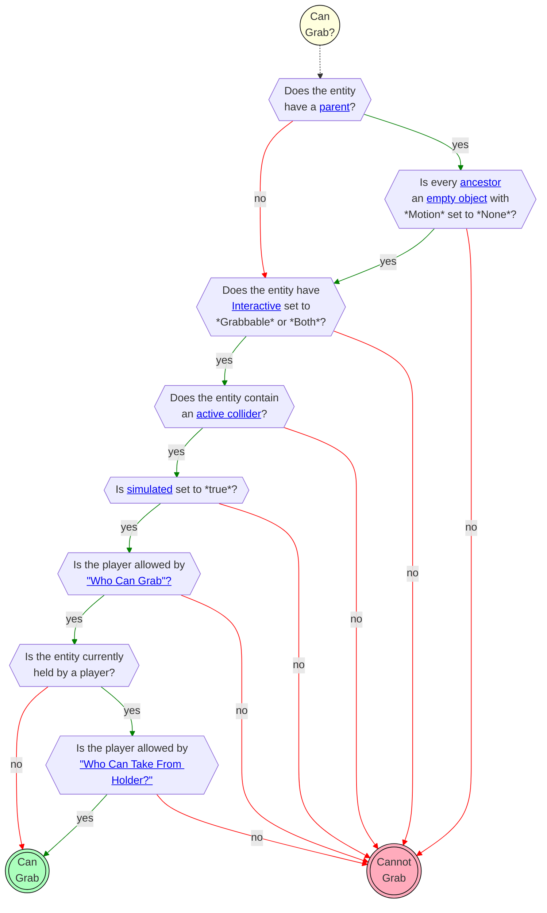

!!! bug Entities with grab anchors can be grabbed even when collidable is set to false.
    There is currently a bug where when an entity has a grab anchor it can still be grabbed even when collidable is set to false. If you want to make an entity, with a grab anchor, "disappear" you should move it far away (instead of just setting visibility and collidability to false).

### Setting "Who Can Grab?"

`Interactive` entities have a setting in the Properties panel called "Who Can Grab?" with the following options controlling who can grab the entity.

| Setting | Behavior |
|---|---|
| **Anyone** | Any player is eligible to grab the entity. |
| **First To Grab Only** | If an entity has never been grabbed then any player can grab it. Once a player grabs it, only that player can re-grab it until [they exit the world instance](#player-entering-and-exiting-a-world). Then anyone can grab the entity, and only next player to grab it can re-grab it until they exit the instance, and so on. |
| **Script Assignee(s)** | A player is only eligible to grab the entity if they are in the list of allowed players assigned with `entity.setWhoCanGrab(listOfPlayers)`. |

When the **Who Can Grab** setting is set to **Script Assignee(s)**, no one can grab the entity until `setWhoCanGrab` is called with an array of some players. You can pass an empty array to make an entity not grabbable.

When the **Who Can Grab** setting is *not* **Script Assignee(s)**, the `setWhoCanGrab` method does nothing when called.

!!! bug **First To Grab Only** can cause an entity to be grabbable by no one, even after the player is no longer in the world.
    If a player kills the app after going AFK, [OnPlayerExitWorld](#player-entering-and-exiting-a-world) is not triggered. When that happens, the entity will be ungrabbable unless that player re-enters the same world instance, thereby triggering OnPlayerExitWorld on that player and releasing held and attached entities. Our recommendation is to not use **First to Grab Only** because there would be no way to reset who can grab using scripts. Instead, set **Can Grab** to **Anyone**, or to **Script Assignee(s)** and `forceRelease` any held entity when a player is AFK.

!!! note `setWhoCanGrab` does not auto-update.
    There is no way to have it auto-update when new players join the instance (example: everyone except one player can grab the entity). If you want to include a newly-joined player in the list then you must call the API again.

### Setting "Who Can Take From Holder?"

`Interactive` entities have a setting in the Properties panel called "Who Can Taken From Holder?" with the following options controlling what can happen to the entity while it is held.

| Setting      | Can the holder grab it out of their own hand using their other hand? | Can another player take it from the player that is holding it? |
| ------------ | -------------------------------------------------------------------- | -------------------------------------------------------------- |
| *No One*   | No                                                                   | No                                                             |
| *Only You* | Yes                                                                  | No                                                             |
| *Anyone*   | Yes                                                                  | Yes (_if_ the person can grab the entity)                      |

### Grab Distance

!!! warning Grab distance varies between platforms.
    For example [Mobile/Web](#player-device-type) can grab entities when much farther away than [VR players](#player-device-type).

!!! tip Grab-distance cannot be configured.
    You cannot explicitly control from how far away an entity can be grabbed; however you can use a trigger to control grabbability (for example: make an entity grabbable by a specific play when they are in that trigger).

### Grab Lock

When an entity is [grabbable](#creating-a-grabbable-entity) there is a setting its Properties called `Grab Lock`. When it is enabled a [VR player](#player-device-type) no longer needs to keep the trigger (on their VR controller) pressed to hold the entity (which gets tiring after a while!). When `Grab lock` is enabled a [VR player](#player-device-type) presses (and releases) the trigger to grab. When they release the trigger the entity _stays held_. When they later again press and release the trigger again, the entity is released.

### Force Grabbing

An entity can be forced into the hand of a player used the TypeScript API:

```ts
// GrabbableEntity
forceHold(player: Player, hand: Handedness, allowRelease: boolean): void;
```

It allows you to specify which player to have hold it, which hand they should hold it in, and whether or not that can _manually_ release it. If `allowRelease` is `false` then the entity can only be released by [force release](#force-release). When `allowRelease` is set to `true` a [VR player](#player-device-type) can release the entity by pressing the trigger on their VR controller; a screen-based player can release it using the on-screen release button.

**Not quite instantaneous**: calling `forceHold` "animates" the entity into the players hand. It can be a number of frames until they are holding it and the [OnGrabStart](#grab-sequence-and-events) event is sent.

!!! example Giving players a weapon when the game starts
    A common use case for force-grabbing is a game where every player has a sword, for example. When the round starts, you given all players a weapon by force-grabbing it. If you don't want them to let go then set `allowRelease` to `false`. Then you can [force release](#force-release) the entities at the end of the game.

    !!! danger A force-grabbed item can be released "accidentally"
        Even if an entity is force-grabbed with `allowRelease` set to `false`, it is still possible for the entity to be released by [force release](#force-release), including if the entity gets too far away from the player or is knocked out of their hand (by physics). If you want to ensure that players are always holding an entity during a game, then you should listen for the [grab-release](#grab-sequence-and-events) event and have the player force-hold the entity again.

## Releasing Entities

### Manual release

If an entity was manually grabbed or it was [force-grabbed](#force-grabbing) with `allowRelease` set to `true`, then a player can manually release it. If an entity was [force-grabbed](#force-grabbing) with `allowRelease` set to `false` then a player will not be able to manually release the entity and instead must wait on it (eventually) being done for them.

### Force release

A held entity can be forced out of a player's hand at any time by calling

```ts
entity.forceRelease();
```

on the held object. If the entity was **force held** then this is how you remove the entity from their hand.

Note that the [PlayerControls' triggerDropAction() method](#triggering-player-input-actions) is just like force release (except you call it on the player instead of the entity and it does not work for [VR players](#player-device-type)).

!!! info Some actions automatically force release.
    There are a number of ways in which a grabbable entity can be "automatically" force released:
    1. **`Simulated` is set to `false`** - the entity is force released and then remains ungrabbable until `simulated` is set to `true` again.
    1. **Entity is [attached](#attaching-entities).** When an entity is attached to a player it is forced released (after attaching to the player, meaning that it is momentarily held *and* attached at the same time).
    1. **Entity moves too far away from player** - either via scripting, animation, or physics "knocking it out of the hand".
    1. **Player moves too far away entity** - either via scripting, physics, or player movement input "walking away while grabbing physics locked object".
    1. <span style="color:#770000">(Not recommended)</span> **[Ownership](#entity-ownership) is [changed while held](#grabbables-and-ownership)** - changing the owner of a held entity will cause it to be force-release from the player. The `grabEnd` event will *not* be sent in this case.

    !!! info Disabling collidability does *not* cause a force release.


!!! danger Despawning a held object does not send a grab release event!
    This is a bug that may be fixed in the future. Be mindful of despawning assets that contain grabbable entities (you may need to clean up manually).

## Grab Sequence and Events

There are a number of events associated with grabbing and holding. The diagram below shows how the state of an entity changes with user-actions (highlighted in blue). Actions have associated `CodeBlockEvent`s that are sent. If a box contains multiple events then they are sent in the top-down order shown.

| [Built-In CodeBlockEvents](#built-in-code-block-events) | Parameter(s) | Description |
|---|---|---|
| `OnGrabStart` | <nobr>`isRightHand: boolean`</nobr><br/><nobr>`player: Player`</nobr> | Sent when a player grabs an entity (it is sent *both* for the first hand grabbing *and* the second hand grabbing in a *multi-grab*). |
| `OnGrabEnd` | <nobr>`player: Player`</nobr> | Sent when a player stops holding the entity (both hands off, for a multi-grab). |
| `OnMultiGrabStart` | <nobr>`player: Player`</nobr> | Sent when a player adds their second hand to a multi-grab entity. |
| `OnMultiGrabEnd` | <nobr>`player: Player`</nobr> | Sent when a multi-grab entity is no longer held with 2 hands (either because it is now held by 1 or by none). |

The flow of events are shown in the diagram below. Ovals represent the *state* the entity is in. The boxes represent what happens when the entity goes from one state to another; in the box, *italics text is the action* that caused the change, **bold text is [built-in CodeBlockEvents](#built-in-code-block-events)** that are sent (in the order top-to-bottom if there are multiple in a box), and <u>underlined text is a system action that occurs</u>.

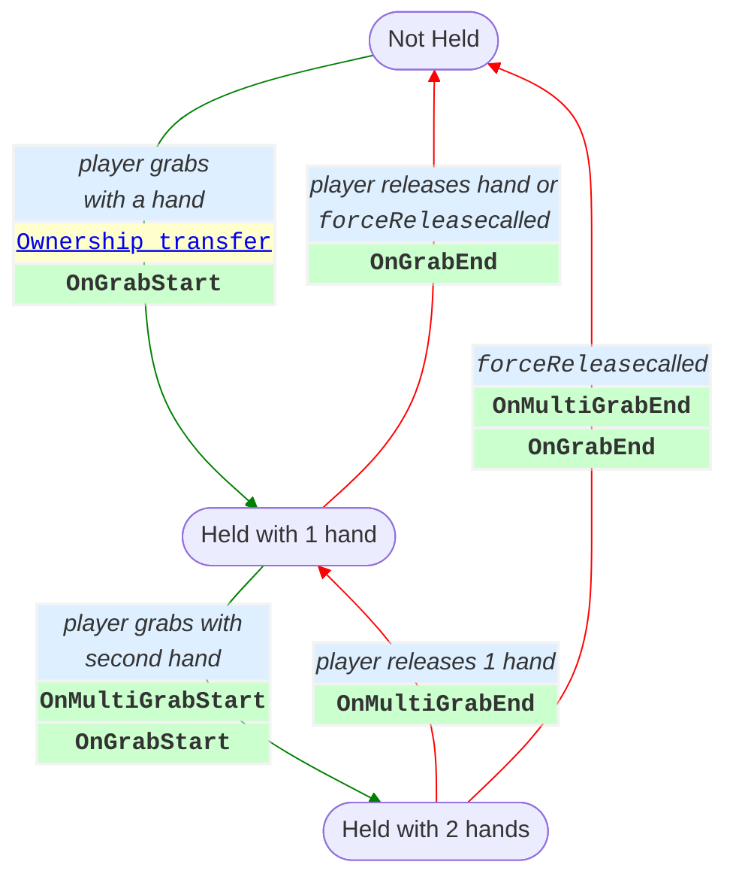

!!! bug `OnGrabEnd` and `OnMultiGrabEnd` are not sent if a player leaves suddenly.
    When a player leaves suddenly (crash, force quit, turn off the device, etc) then some player-related events such as [OnPlayerExit](#player-entering-and-exiting-a-world), [OnAttachEnd](#player-entering-and-exiting-a-world), [OnGrabEnd](#grabbing-and-holding-entities) and [OnMultiGrabEnd](#grabbing-and-holding-entities) *may not be sent*. However, `OnPlayerEnterAFK` is sent immediately. So if you need to ensure a player releases a held entity when they leave the instance (for example, if the entity has ["Who Can Take From Holder?"=NoOne](#setting-who-can-take-from-holder)), then [forceRelease](#force-release) the entity on `OnPlayerEnterAFK` and [forceHold](#force-grabbing) it on `OnPlayerExitAFK`. Note [`getPlayers()`](#listing-all-players) is only affected by `OnPlayerEnterWorld` and `OnPlayerExitWorld`, so it will not have an accurate list of all players in the instance.

### Hand-off (Switching Hands or Players)

When an entity is transferred from one hand to another or from one player to another then the entity is _fully released_ by the first player before being grabbed by the second player. This means there is a moment where the entity is held by no one. An entity is never held by 2 players (not even momentarily); and if it is not a multi-grab entity then it is never held by 2 hands (not even momentarily).

!!! warning `OnGrabEnd` is sent during a "hand-off".
    The `OnGrabEnd` event may mean that an entity is about to grabbed by a different hand or player.

### Moving Held Entities

Normally the position and rotation of a held object is determined by the position and orientation of the player hand that is holding it (during the [physics stage](#frame-sequence) of the frame).

It is some times useful to invert that and instead have __the position and rotation of the held entity influence the position and rotation of the hand that is holding it__.

This can be achieved due to the fact that
```ts
player.leftHand.position.get()
```
returns where the _player's hand is __supposed__ to be_, but not where the _avatar's_ hand is. That means that you can move a held entity, which will move the avatar hand holding it, but can still check where the hand is supposed to be (if you hadn't moved it).

There are two approaches for moving a held entity:

#### Moving a Held Entity Locally in Relation to the Hand
In a gun-recoil animation you want the player hand to be able to move freely, yet have the gun apply an additional local rotation "on top of it". If you set the position / rotation of the entity when a user takes an action (such as firing the gun) then that change will only last for one frame (which might be ok for a quick recoil effect) because the entity's position / rotation will be immediately updated the next frame from the avatar's hand.

If you want a multi-frame or ongoing effect then you need to set the position / rotation of the entity repeatedly in an [OnUpdate](#run-every-frame-prephysics-and-onupdate) callback. In summary: **every frame in which you want the entity change from where the avatar want it, you must set it yourself**.

#### Moving a Held Entity Globally in Relation to the World
When building a lever, for example, you want the avatar hand to "lock onto" the lever. In this case you want to completely control the position of the avatar hand. To do this,  set `locked` to `true` on the grabbable entity. This will prevent the entity from being moved by physics or by the avatar. Then you can move the entity by setting its `position` and `rotation`. The avatar hand will then be moved to match.

In this lever example, you could get `player.leftHand.position.get()` every frame to identify where the avatar's hand is _supposed_ to be, constrain that position to a "valid position" and then rotate the level according. This is an advanced use case that likely requires trigonometry.

Note that if the grabbed entity gets too far away from the avatar hand you will get a [force release](#force-release).

Here is a simple example of a grabbable entity that is constrained to move along the y-axis (you can only move it up and down).

![[ horizonScripts/axisYConstrainedGrabbable.ts ]]

### Grabbables and Ownership

**Transfer-on-grab**: [Ownership](#entity-ownership) of a [grabbable entity](#grabbing-and-holding-entities) is transferred to the grabbing player, every time it is [grabbed](#grabbing-and-holding-entities). The ownership transfer is visible in the [grab sequence diagram](#grab-sequence-and-events). The ownership transfer occurs *before* the `OnGrabEvent`. When the `OnGrabEvent` is sent, the entity will already have the new owner. If the entity is released while the transfer is occurring you will get both `OnGrabStart` and `OnGrabEnd`.

**No transfer-on-release**: When the grabbable entity is [released](#releasing-entities), the owner continues to be that player (unless explicitly transferred or when that player leaves the [instance](#instances)).

!!! danger Don't change the owner of a held object
    When you change the owner of a grabbable entity while it is held, it will be [force released](#force-release). However, the [`OnGrabEnd`](#grab-sequence-and-events) event **will not** be sent. If you are tracking which entities are and are not held (by the `GrabStart` and `GrabEnd` events), this is likely to "break" your ability to correctly track the entity.

# Attaching Entities

Entities can be attached to players and avatar NPCs.

!!! warning Attaching multiple entities to one player.
    It's possible for a [VR players](#player-device-type) to put multiple entities on their head at the same time, for example. You can also use [scripted attach](#scripted-attach) to put multiple entities on a player at the same attachment anchor. If this behavior is undesirable, you should track when entities are attached to which players and handle the case where a second entity is attached to an anchor.

## Creating an Attachable

1. Set item properties in Horizon to `Motion: Animated`, or `Motion: Interactive` if you want players to grab the item or give it physics.

1. Make sure `Collidable` is Enabled.

1. Find the `Avatar Attachable` setting and select `Sticky` or `Anchor`.

1. If `Anchor` then select the `Anchor To` setting to either `Head`, `Torso`, `LeftHip`, or `RightHip`.

1. Either let the player grab the item and attach it to themselves or attach it by script.

You can adjust the Anchor Position and Rotation which affects where and how the items appears on the player around the specified anchor.

!!! note Attaching by Hand versus Script
    Entity must have `Motion: Animated`, or `Motion: Interactive` and `Collidable` enabled to configure attachment settings and attach by hand, but none of that is required to attach by script after it has been configured.

## Attachable By
This setting defines the permissions of which players can *manually* attach the entity (by releasing the entity while holding it over their body). This setting does not affect [scripted attach](#scripted-attach) with `attachToPlayer`.

| Attachable By | Description |
|---|---|
| *Owner* | Only the person holding the attachable entity is permitted to attach it to themselves.|
| *Everyone* | Anyone holding the attachable entity is permitted to attach it to themselves or anyone else.|

## Avatar Attachable
Attaching an entity to player can be done by the following:

| Attach Method | Description |
|---|---|
| *Release on body part* | Upon releasing the held entity, the entity checks if collision has occurred between the active collider and the body part of the [Attachable By](#attachable-by) permitted player.|
| *Script* | See attachables API.|

Attaching entities involves two built-in code block events being sent to the attachable. If the player attached or detached by hand (only possible for a [VR player](#player-device-type)) then there are also events related to [grabbing](#grab-sequence-and-events).

| [Built-In CodeBlockEvents](#built-in-code-block-events) | Parameter(s) | Description |
|---|---|---|
| `OnAttachStart` | <nobr>`player: Player`</nobr> | Sent when the entity is attached to the given player |
| `OnAttachEnd` | <nobr>`player: Player`</nobr> | Sent when the entity is detached from the given player |

The flow of events are shown in the diagram below. Ovals represent the *state* the entity is in. The boxes represent what happens when the entity goes from one state to another; in the box, *italics text is the action* that caused the change, **bold text is [built-in CodeBlockEvents](#built-in-code-block-events)** that are sent (in the order top-to-bottom if there are multiple in a box), and <u>underlined text is a system action that occurs</u>.

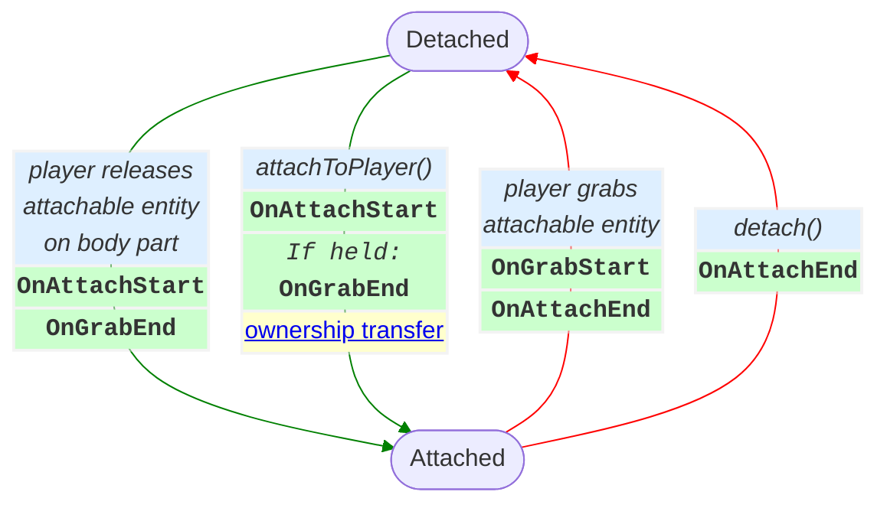

!!! bug `OnAttachEnd` is not sent if a player leaves suddenly.
    When a player leaves suddenly (crash, force quit, turn off the device, etc) then some player-related events such as [OnPlayerExit](#player-entering-and-exiting-a-world), [OnAttachEnd](#player-entering-and-exiting-a-world), [OnGrabEnd](#grabbing-and-holding-entities) and [OnMultiGrabEnd](#grabbing-and-holding-entities) *may not be sent*. However, `OnPlayerEnterAFK` is sent immediately. So if you need to ensure a player releases a held entity when they leave the instance (e.g. when the entity has **AttachableBy=Owner** so no one else can grab it), then [detach](#detaching) the entity on `OnPlayerEnterAFK` and [re-attach](#scripted-attach) it on `OnPlayerExitAFK`. Note [`getPlayers()`](#listing-all-players) is only affected by `OnPlayerEnterWorld` and `OnPlayerExitWorld`, so it will not have an accurate list of all players in the instance.

!!! info Transitioning between Held and Attached results in being both at the same time.
    An entity goes *from being held to being attached* when `attachToPlayer` is called. An entity goes *from being attached to held* when a player [grabs](#can-grab) or when `forceGrab` is called. In both of these cases the entity is **momentarily held and attached at the same time**.

    **Events ordering**:
    * From Held to Attached: the `OnAttachStart` is sent and then `OnGrabEnd`.
    * From Attached to Held: the `OnGrabStart` is sent and then `OnAttachEnd`.

### Scripted Attach

Entities can be attached to players and detached from players in scripting using `Entity`'s  `attachToPlayer` and `detach`, respectively. The `attachToPlayer` method is not not restricted by the [Attachable By](#attachable-by) and [Anchor To](#anchor-attachment-to) settings set in Properties panel; those settings only impact a player manually grabbing an entity and attaching it to themselves (in VR). In order for `attachToPlayer` and `detach` to work the [Avatar Attachable](#avatar-attachable) property must be enabled in the Properties panel.

**Attach and ownership**: When `entity.attachToPlayer(player, anchor)` is run, the `entity` is attached to `player` at the `anchor`. If the entity has a Local Script, the ownership is [automatically transferred](#automatic-ownership-transfers) to `player`. When `detach()` is called (or a [VR player](#player-device-type) manually removes an item) there is *no* ownership transfer; ownership of the `entity` stays with the player.

!!! bug `attachToPlayer` only automatically transfers ownership of the entity when it has a Local Script on it.
    This behavior is different from `forceHold`, which always automatically transfer ownership of the entity to the player capable of holding the entity.

**Anchor**: The anchor is specified by the `AttachablePlayerAnchor` enum which currently has values for `Head` and `Torso`. See [socket attachment](#socket-attachment) for changing the exact position and rotation of where an attachable attaches.

!!! bug Non-grabbable collidable attachables can continuously push the player when they are attached.
    When a `attachToPlayer` is called on a **Collidable** entity with **Motion=Animated** or **Interaction=Physics** or `simulated` set to `false`, the entity can continuously push the player (forever). To mitigate this, disable collision on the entity before calling `attachToPlayer`.

### Detaching

An attachable entity can be detached in 2 ways:
1. By calling `entity.detach()`
1. A [VR player](#player-device-type) grabs the attachment off their, or someone else's, body (if it is [grabbable](#creating-a-grabbable-entity) and the player [can grab](#can-grab) it).

In both cases the `OnAttachEnd` event is sent (as shown in [the diagram](#avatar-attachable)).

### Socket Attachment

By default, attachables anchor their [pivot point](#pivot-points) to the attach point with no local rotation (e.g. attaching a hat to a head will have the hat's [up vector](#local-transforms) aligned with the head's up vector, and likewise for right and forward vectors).

You can modify the attachment position and rotation (expressed as a local offset) in the Properties panel by setting `Anchor Position` and `Anchor Rotation` on the attachable entity. In scripting, you can get and set the attachment offsets with `socketAttachmentPosition : HorizonProperty<Vec3>` and `socketAttachmentRotation : HorizonProperty<Quaternion>` on the `AttachableEntity` class.

!!! example Attach 1 meter in front of a player's torso.
    The code below will attach `attachable` to `player` on their torso. Moving the socket position forward a meter, via `new Vec3(0, 0, 1)`, moves `attachable` to always be 1 meter forward from `player`'s torso.
    ```ts
    attachable.attachToPlayer(player, AttachablePlayerAnchor.Torso)
    attachable.socketAttachmentPosition.set(new Vec3(0, 0, 1))
    ```

### Sticky Attachments
Whereas attachable entities may have their `Motion` set to `Animated`, `Sticky` entities work best when set to `Grabbable`. Upon releasing the held entity, it will attach to where the collision occurs between the active collider and the [Attachable By](#attachable-by) permitted player.

#### Stick Attachment To
The following is a list of player body parts that the attachable entity may stick to.

| Body Part Setting | Sets the stickiness to |
|---|---|
| *Any* | Both head and torso|
| *Head* | Anywhere on the player's head|
| *Torso* | Anywhere on the player's torso|

!!! warning Using code to attach a sticky entity does not place the entity at the center of the body part.
    Wherever the entity is located upon calling `attachToPlayer()` will be where the entity will begin to follow the body part.

    Set `Avatar Attachable` to [Anchor](#attachment-anchors) to reposition the entity to the body part when doing a scripted attach.

### Attachment Anchors
When attached, an anchored entity will position its [pivot point](#pivot-points) at a specified anchor position.

The anchor position is a body part specified in [Anchor To](#anchor-attachment-to). Anchor position can be altered by setting [socket attachment](#socket-attachment) offset values.

By default an anchored entity's [rotation](#rotation) matches the rotation of the [body part](#player-body-parts) it is attached to. For example, by default, a hat's forward vector will match the head's forward vector (assuming the hat was attached the head with no [socket attachment](#socket-attachment) offsets).

!!! note Once attached, the entity will be affixed to the body part defined in `Anchor To` until [detached](#detaching) from player.

#### Anchor Attachment To
The following is a list of player body parts that the attachable entity may anchor to.

| Body Part Setting | Sets the attachment point to |
|---|---|
| *Head* | Front-center of the player's forehead.|
| *Torso* | Front-center-bottom of the player's ribcage. |
| *Left Hip* | Front-left-bottom of the player's pelvis. Note that the attachment will be rotated to "look down", simulating a "holstered" item. |
| *Right Hip* | Front-right-bottom of the player's pelvis. Note that the attachment will be rotated to "look down", simulating a "holstered" item. |

!!! warning As of 1/15, `Left Hip` or `Right Hip` are not available as a `AttachablePlayerAnchor`
    Use [socket attachments](#socket-attachment) with `AttachablePlayerAnchor.Torso` to get around this.

#### Auto Scale to Anchor

When an entity has "Avatar Attachable" set to "Anchor" there is a setting available: "Auto Scale to Anchor". When enabled, the attached item will have its [scale](#scale) changed when it is [attached](#avatar-attachable) to fit the anchor it has been attached to. This setting makes it easier to support avatars of different shapes and styles. When the entity is *detached* it will be [scaled](#scale) back to its intrinsic size, its scale automatically becoming (1,1,1).

## Attach to 2D screen
This toggle causes the attachable entity to become **screen-attached**. This means the entity's transformation will match the camera transformation. The transformation can be offset by setting the 2D Screen Position, 2D Screen Rotation, and 2D Screen Scale.

Attach to 2D screen can be toggled on for both `Sticky` and `Anchor` attachable types.

!!! note Attach to 2D screen is meant for cross-screen players
    A [VR player](#player-device-type) who attaches the entity will see the attachable attach to their body as expected.

!!! warning Screen-attached entities will appear on every cross-screen player's screen by default
    Consider setting [who can see](#entity-visibility) an entity to avoid this issue.

!!! bug [VR players](#player-device-type) will see other players' screen-attached incorrectly
    The attachable follows their camera's position, but the orientation will be wrong.

# Holstering Entities
Holstering is the action of attaching an entity to the player with the purpose of storing it for later use. Common holstered item examples are things like a torch, a grenade, or even food. In VR, You would simply [attach](#anchor-attachment-to) the entity to the player (with `AttachablePlayerAnchor.Torso`) and ensure that it is [grabbable](#can-grab). Cross-world players may use the [built-in cross-screen holstering system](#cross-screen-holstering).

## Cross-screen Holstering
This cross-screen holstering system is basically a simple inventory system that makes use of the holster UI icon. Since a cross-screen player can only hold one entity at a time, this system gives the player a simple way to swap between a held entity and one of their attached entities. A player with at least one attached entity can holster by pressing Z on desktop or tapping the holster icon on mobile.

!!! warning You must attach at least one entity to use the holstering system.
    The holster icon will only be displayed after attaching an entity. This means if the player grabs an entity, but does not already have an entity attached, the holster icon will not display.

    You can attach an entity to a player any time, like by trigger-enter or world-enter events. After that, the player will see the holster icon.

For a [screen player](#player-device-type):

* When [attachToPlayer()](#attaching-entities) is called `AttachablePlayerAnchor.Torso` on a [grabbable entity](#grabbing-and-holding-entities) it becomes *holstered*. If multiple entities are attached at once, they are all holstered.
* If a holstered entity has `detach` called on it then it becomes unholstered.
* When a player presses the *Holster Icon* they *unholster* an item and grab on it. If they were previously holding an entity, they release it.
* While a player has multiple holstered items they can use the Z key to switch which item they are holstering.

More info here: https://developers.meta.com/horizon-worlds/learn/documentation/create-for-web-and-mobile/grabbable-entities/holster-icon-menu

!!! tip Entities do not holster automatically on release.
    You will need to add a script that attaches the entity to the player when released if you want that released entity to become holstered.

When a player has more than one attached entity, they will see this UI when pressing the holster icon.
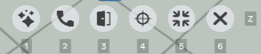

The icon that is displayed can be selected in the entity's `Holster Icon` property in the Properties panel.

The player may choose to unholster 1 of their attached items. They can only see 6 holstered items at a time in the UI. The player can press Z or the arrow button to see the next set of 6 items. Maximum amount of holstered items is limited to the maximum amount of grabbable entities allowed in a world.

### Scripting Holstering

The `PlayerControls` class allows you to manage holstering via scripting. These methods must be called [locally](#local-and-default-scripts) on a [player's device](#clients-devices-and-the-server):

```ts
// PlayerControls

// Open the holstering UI if more than one item is holstered
static triggerContextualMultiHolsterAction(): void;

// Cycle holstered items forward
static equipNextHolsteredItem(): void;

// Cycle holstered items backward
static equipPreviousHolsteredItem(): void;

// Cycle holstered items to a specific index
static equipHolsteredItem(index: number): void;
```

There is also a [LocalEvent that is broadcast](#built-in-local-events) every time the holstered item changes:

```ts
static readonly onHolsteredItemsUpdated: LocalEvent<{
  player: Player;
  items: Entity[];
  grabbedItem: Entity;
}>;
```

The **player** is the local player, the one doing the holstering, the **items** are all currently holstered items (by `player`), and **grabbed item** is the currently holstered item. Note that `grabbedItem` will also be in the `items` array, so if you want to show a player the "other" items, you would need to filter `grabbedItem` out.

# Player Input

There are two main ways to get input from players:
1. [Player Controls](#player-controls): Observe on-screen buttons being pressed and configure custom buttons to be on-screen.
1. [Focused Interaction](#focused-interaction): Change the player's input mode from locomotion (move the avatar around the world) to instead be a mode where they can interact with the world by directly tapping/clicking on the screen and dragging their finger/mouse around.

## Player Controls

The `PlayerControls` class offers a number of `static` methods and [broadcast LocalEvents](#built-in-local-events) for providing controls to the player and observing the input. The class has members and events related to:
* [Holstering](#scripting-holstering): A Mobile/Web player carrying multiple items at once.
* [Focused Interaction](#observing-focused-interactions): A Mobile/Web player directly touching/clicking the screen to interact with the world.
* [Custom input](#custom-input): Overlaying custom controls on the screen to create buttons (or even disable all the standard on-screen buttons).
* [Triggering Input Actions](#triggering-player-input-actions): Using scripting to directly perform the actions that a player can do with the on-screen controls.

### Triggering Player Input Actions

There are a few methods on the [PlayerControls class](#player-controls) that let you perform an input action for a player (e.g. simulate them pressing/clicking on on-screen button). Just like the other methods in [PlayerControls](#player-controls), these **must be called [locally](#local-and-default-scripts) on the [player's device](#clients-devices-and-the-server)**.

```ts
class PlayerControls {
  static triggerDropAction()
  static triggerInputActionDown(inputAction: PlayerInputAction): void;
  static triggerInputActionUp(inputAction: PlayerInputAction): void;

  // ...
}
```

**Drop Action**: `PlayerControls.triggerDropAction()` acts just like [force release](#force-release) except that it is being called on the player (under the hood it gets the [local player](#local-player)). This method does not work on [VR players](#player-device-type).

**Action Button Down/Up**: There are two methods for simulating a player starting/stopping an action (as if pressing/release an action button on-screen): `triggerInputActionDown` and `triggerInputActionUp`. Both methods take an argument of type [PlayerInputAction](#playerinputaction) to specify the action.

### Custom Input

There are a number of methods on the [PlayerControls class](#player-controls) that listen to player inputs (physical or onscreen button presses) and configure onscreen buttons (for [non-VR players](#player-device-type)). Just like the other methods in [PlayerControls](#player-controls), these **must be called [locally](#local-and-default-scripts) on the [player's device](#clients-devices-and-the-server)**.

```ts
class PlayerControls {
  static isInputActionSupported(action: PlayerInputAction): boolean;
  static getPlatformKeyNames(action: PlayerInputAction): Array<string>;

  static disableSystemControls(): void;
  static enableSystemControls(): void;

  // ...
}
```

The `isInputActionSupported` method takes a [PlayerInputAction](#playerinputaction) and lets you know if the action is available on the [current device](#player-device-type).

The `getPlatformKeyNames` method returns the list of key names that the action is currently bound to (for example if you wanted to render text to explain to the user what to press).

The `disableSystemControls` method removes the onscreen buttons / controls for a [Mobile player](#player-device-type). The `enableSystemControls` method puts them back.

There is an additional method, [connectLocalInput](#connect-local-input), described below.

#### Connect Local Input

The [PlayerControls class](#player-controls) allows you to register to receive input events from a playing, for a given action. Just like the other methods in [PlayerControls](#player-controls), this **must be called [locally](#local-and-default-scripts) on the [player's device](#clients-devices-and-the-server)**.

```ts
// PlayerControls
static connectLocalInput(
  input: PlayerInputAction,
  icon: ButtonIcon,
  disposableObject: DisposableObject,
  options?: PlayerControlsConnectOptions
): PlayerInput;
```

The `connectLocalInput` method has you specify:
* **input**: Which action to [PlayerInputAction](#playerinputaction) to.
* **icon**: The [ButtonIcon](#player-input-buttonicon) to render the onscreen button with (if a [mobile player](#player-device-type)).
* **disposableObject**: The [DisposableObject](#disposing-objects) that this is tied to (usually its the [Component](#components) that registered it). When the `disposableObject` is disposed, the input will be disconnected.
* **options**: The optional `options` let you specify where you prefer the button to be placed on a [mobile user's](#player-device-type) screen. This is a *preference*, the system may not respect it (for example if the spot is already taken).
  ```ts
  type PlayerControlsConnectOptions = {
    preferredButtonPlacement?: ButtonPlacement;
  };

  enum ButtonPlacement = { Default, Center }
  ```

The `connectLocalInput` method returns an instance of the `PlayerInput` class. The class can be used in two ways: to read current values, and to register a callback for then there is a change.

| `PlayerInput` Class Member | Description |
|---|---|
| `disconnect()` | Disconnect the input. You will no longer be able to read values or get callbacks. This method is automatically called when the `disposableObject` passed to `connectLocalInput` is disposed. |
| `connected: ReadableHorizonProperty<boolean>` | Returns `false` once `disconnect()` is called. |
| `action: ReadableHorizonProperty<PlayerInputAction>` | Get the [PlayerInputAction](#playerinputaction) that this is connected to (the one passed into `connectLocalInput` when this was created). |
| `held: ReadableHorizonProperty<boolean>` | For a button `true` means that the button is pressed. For a continuous input (such as a joystick) this returns `true` if the value is at least halfway (e.g. more than 0.5 for a VR thumbstick axis). |
| `pressed: ReadableHorizonProperty<boolean>` | Returns `true` if this is a button input and it went from unpressed to pressed in the last frame. |
| `released: ReadableHorizonProperty<boolean>` | Returns `true` if this is a button input and it went from pressed to unpressed in the last frame. |
| `axisValue: ReadableHorizonProperty<number>` | The current value of the axis (`0` to `1`) or `0` if it is a button. |
| <pre class="language-ts ts"><span><code>registerCallback(<br/>  callback: PlayerInputStateChangeCallback<br/>): void</code></span></pre> | Register a callback to be called when the input changes. Only one callback is allowed at a time, so if you call this while one is registered then the existing one will first be unregistered. This is intended to be used with *buttons*. |
| `unregisterCallback` | Unregister the current callback, if there is one. |

The `registerCallback` method takes a callback argument with type:
```ts
type PlayerInputStateChangeCallback = (
  action: PlayerInputAction, pressed: boolean
) => void
```
which is meant to be used with *button* type inputs.

#### PlayerInputAction

The `PlayerInputAction` represents an action that a player can take (a button a player can press).

| `PlayerInputAction` value | Mobile Player | Desktop / Web | Quest VR |
|---|---|---|---|
| Jump | on-screen button  | spacebar | A button |
| RightPrimary | on-screen button | R | right thumbstick click |
| RightSecondary | on-screen button | F | B button |
| RightTertiary | on-screen button | Y | *unavailable*
| RightGrip | on-screen button | E | right analog grip trigger |
| RightTrigger | on-screen button | left mouse click | right analog trigger |
| RightXAxis | *unavailable* | *unavailable* | right thumbstick x axis |
| RightYAxis | *unavailable* | *unavailable* | right thumbstick y axis |
| LeftPrimary | on-screen button | T | X button |
| LeftSecondary | on-screen button | G | Y button |
| LeftTertiary | on-screen button | H | left thumbstick click |
| LeftGrip | on-screen button | Q | left analog grip trigger |
| LeftTrigger | on-screen button | right mouse click | left analog trigger |
| LeftXAxis | *unavailable* | *unavailable* | left thumbstick x axis |
| LeftYAxis | *unavailable* | *unavailable* | left thumbstick y axis |

## Player Input ButtonIcon

The `ButtonIcon` enum is used for [custom player input](#player-class). The list is long, and continually growing. The current values are:

`Ability`, `Aim`, `Airstrike`, `Contract`, `Crouch`, `Door`, `Drink`, `Drop`, `DualWield`, `EagleEye`, `Eat`, `Expand`, `Fire`, `FireSpecial`, `Grab`, `Heal`, `InfiniteAmmo`, `Inspect`, `Interact`, `Invisible`, `Jump`, `LeftChevron`, `Map`, `Menu`, `MouseLeft`, `MouseMiddle`, `MouseRight`, `MouseScroll`, `Net`, `None`, `Place`, `Punch`, `Purchase`, `Reload`, `RightChevron`, `Rocket`, `RocketJump`, `RocketVolley`, `Shield`, `Speak`, `Special`, `SpeedBoost`, `Sprint`, `Swap`, `SwingWeapon`, `Throw`, `Use`

### Player Input CodeBlockEvents

The following [CodeBlockEvents](#code-block-events) can be listened to on a [grabbable entity](#grabbing-and-holding-entities). The code block events are **sent to the entity only if the player presses the buttons while holding the entity**. These are intended to be used with [VR players](#player-device-type). If you need to know which hand these events are coming from, listen to the [OnGrabEvent](#grab-sequence-and-events) and store the `isRightHand` value.

| [Built-In CodeBlockEvent](#built-in-code-block-events) | Parameter(s) |
|---|---|
| OnButton1Down | `player: Player` |
| OnButton1Up | `player: Player` |
| OnButton2Down | `player: Player` |
| OnButton2Up | `player: Player` |
| OnIndexTriggerDown | `player: Player` |
| OnIndexTriggerUp | `player: Player` |

## Focused Interaction

**Locomotion Mode**: The primary way in which [Mobile/Web players](#player-device-type) use Horizon is by controller the avatar (via mouse and keyboard or on-screen controls) to interact with the world.

**Focused Interaction Mode**: There is another way in which you can use Horizon in which avatar locomotion is disabled and you directly interact with the screen by tapping on it or clicking on it. **Focused interaction does not exist for [VR players](#player-device-type)**.

*Example*: a player could be exploring a world (via locomotion mode) and they find a an electrical box. They could then "zoom in" (focused interaction) to focus on the electrical box where they could touch / click on their screen to flip switches. When they are don't, they cancel out of the zoomed in state and return to exploring (back in locomotion mode).

There are a few relevant members on the [Player class](#player-class):

| [Player Class](#player-class) member | Description |
|---|---|
| <nobr>`enterFocusedInteractionMode(): void`<nobr> | Change a [Mobile/Web player](#player-device-type) from locomotion mode to focus mode (where they can tap on the screen instead of moving the avatar). Must be called on a [player device](#clients-devices-and-the-server). |
| <nobr>`exitFocusedInteractionMode(): void`</nobr> | Return a [Mobile/Web player](#player-device-type) to normal locomotion mode. Must be called on a [player device](#clients-devices-and-the-server). |
| <nobr>`focusedInteraction: FocusedInteraction`</nobr> | The `FocusedInteraction` object for the player. |

### Entering and Exiting Focused Interaction
The methods `enterFocusedInteractionMode()` and `exitFocusedInteractionMode()` must be called [locally](#local-and-default-scripts) on a [player's device](#clients-devices-and-the-server). Calling these methods will [broadcast local events CodeBlockEvents](#built-in-code-block-events):

| [Built-In CodeBlockEvent](#built-in-code-block-events) | Parameter(s) |
|---|---|
| 🏠OnPlayerEnteredFocusedInteraction | `player: Player` |
| 🏠OnPlayerExitedFocusedInteraction | `player: Player` |

### Observing Focused Interactions

When a player is [in focused interaction mode](#entering-and-exiting-focused-interaction) there are a number of [local events that are broadcasted](#built-in-local-events) that you can listen to for information on input events (the player touching or clicking the screen, moving their finger or the mouse, and lifting their finger or releasing the mouse). All three events are `static` members of the [PlayerControls](#player-controls) class and have the same payload:

```ts
class PlayerControls {
  static readonly onFocusedInteractionInputStarted: LocalEvent<{
    interactionInfo: InteractionInfo[];
  }>;
  static readonly onFocusedInteractionInputMoved: LocalEvent<{
    interactionInfo: InteractionInfo[];
  }>;
  static readonly onFocusedInteractionInputEnded: LocalEvent<{
    interactionInfo: InteractionInfo[];
  }>;

  // ...
}
```

When the [LocalEvents](#local-events) above are [broadcast](#broadcast-events), they are each broadcast with an array of `InteractionInfo`, a type that gives information about the finger / mouse on the screen:

```ts
type InteractionInfo = {
  interactionIndex: number;
  screenPosition: Vec3;
  worldRayOrigin: Vec3;
  worldRayDirection: Vec3;
};
```

| `InteractionInfo` Field | Type | Notes |
|---|---|---|
| interactionIndex | `number` | The "multitouch" index. On Web/PC this number will always be `0`. On mobile it tells you which finger is used when there are multiple used simultaneously.
| screenPosition | [Vec3](#vec3) | The location on the screen that the tap occurred. Only the `x` and `y` components are used. `(0, 0)` is the lower-left of the screen, `(1, 1)` is the top-right, and (0.5, 0.5)` is the exact center.
| worldRayOrigin | [Vec3](#vec3) | The global world position of the point on screen where the player tapped / clicked. |
| worldRayDirection | [Vec3](#vec3) | The global world direction, from the point on screen where the player tapped / clicked, continuing into the world. |

!!! tip Focused Interaction and Raycasts
    The `worldRayOrigin` and `worldRayDirection` values in `InteractionIfo` are exactly the data needed to perform a [raycast](#raycast-gizmo) from the player's finger / mouse out into the world!

### Configuring Focused Interaction Visuals
The `FocusedInteraction` class has two methods you can use to configure visuals:

```ts
// FocusedInteraction
setTapOptions(
  isEnabled: boolean,
  tapOptions?: Partial<FocusedInteractionTapOptions>
): void;
setTrailOptions(
  isEnabled: boolean,
  trailOptions?: Partial<FocusedInteractionTrailOptions>
): void;
```

where `isEnabled` turns the interaction type on or off and the options options are used to configure the visual details:

```ts
type FocusedInteractionTapOptions = {
  duration: number;      // default 0.5
  startScale: number;    // default 0.4
  endScale: number;      // default 1.0
  startRotation: number; // default 0.0
  endRotation: number;   // default 0.0
  startColor: Color;     // default Color.white
  endColor: Color;       // default Color.white
  startOpacity: number;  // default 0.4
  endOpacity: number;    // default 0.0
}

type FocusedInteractionTrailOptions = {
  length: number;       // default 0.25
  startWidth: number;   // default 1.0
  endWidth: number;     // default 0.1
  startColor: Color;    // default Color.white
  endColor: Color;      // default Color.white
  startOpacity: number; // default 0.4
  endOpacity: number;   // default 0.0
}
```

The default values for the tap options and trail options are exposed in two `const` values: `DefaultFocusedInteractionTapOptions` and `DefaultFocusedInteractionTrailOptions`, respectively.

# Persistence

Persistence allows **data to be stored beyond a single session**, ensuring that player progress, achievements, and purchases remain available when they return.

Persistent data is categorized into the following types:
1. [Leaderboards](#leaderboards): Track and display scores globally.
1. [Quests](#quests): Track player progression with world-based achievements.
1. [In-World Purchases (IWP)](#in-world-purchases-iwps): Store ownership of purchased items.
1. [Player Persistent Variables (PPVs)](#player-persistent-variables-ppvs): Store per-player custom data.

See the section on [cloning a world](#cloning-a-world) for what happens to persistent data when you clone.

!!! info Persistent data can only be set on the [server](#clients-devices-and-the-server) (except [Quests](#quests)).
    [Leaderboards](#leaderboards), [In-World Purchases (IWP)](#in-world-purchases-iwps), and [Player Persistent Variables (PPVs)](#player-persistent-variables-ppvs) can only be updated from scripts [running on the server](#local-and-default-scripts), meaning that it must be a default script or a local script [owned](#entity-ownership) by the [server player](#server-player). [Quests](#quests) are the one exception and can be updated from any [client](#clients-devices-and-the-server).

!!! info Persistent data is only accessible when a player is in the instance.
    Persistent data for [Quests](#quests), [In-World Purchases (IWP)](#in-world-purchases-iwps), and [Player Persistent Variables (PPVs)](#player-persistent-variables-ppvs) is tied to individual players and can only be accessed when the player is present in the instance.

!!! warning There is no persistent world data.
    Persistence is currently tied to individual players. A world cannot store "global" variables that persist *across sessions* (other than [leaderboards](#leaderboards) which don't have a way to *read* the data back).

## Leaderboards

Leaderboards store and display player scores, allowing players to compare progress even when they are not in the same session. Leaderboards have two parts: a **leaderboard** and **leaderboard gizmos**. [Leaderboards contain the *properties*](#creating-editing-and-deleting-leaderboards) (such as name, sort order, and auto-reset behavior). [Leaderboard Gizmos](#using-the-world-leaderboard-gizmo) are an entity in the world that allow a player to see and interact with the data.

* **Global Persistence**: Unlike other persistent data, leaderboards retain and display scores across all instances, even when the player is not present.
* **Write-Only (by default)**: Scores can be updated (written) but not retrieved (read) via scripts. However, to work around this, you can create a [player persistent variable](#player-persistent-variables-ppvs) and then [always set them together](#using-a-leaderboard-with-a-player-persistent-variable).
* **Privacy and Player Control**: Players can opt out of leaderboard tracking and delete stored scores from the *in-app menu → General tab → Leaderboard Participation / Data*.

!!! tip One Cool Trick: Leaderboards Metrics Tracking
    Leaderboards can be used to gain insight into a world's. Common examples are tracking how often players enter an area, or how frequently the visitors interact with elements in the world. Typically these leaderboards are out-of-view of players and only viewable to the creator.

**Leaderboard Limitations**
There is a limit of 10 leaderboards per world. In terms of the data that can be displayed:

| Data Type | Intake Data Type | Display Limitations |
|---|---|---|
| *Raw Value* | Integers | Integer values from -2<sup>31</sup> to 2<sup>31</sup>-1<br/>(roughly -2 billion to 2 billion) |
| *Time in Secs* | Integers | - |

!!! warning Leaderboard values are clamped to integers in the range -2<sup>31</sup> to 2<sup>31</sup>-1.

### Creating, Editing, and Deleting Leaderboards

To **create a Leaderboard** using the Desktop Editor:
1. Access the Systems dropdown and select *Leaderboards*.
1. Click on *Create Leaderboard* indicated with the [+] symbol.
1. Add a Name, preferably without spaces. This is the leaderboard ID that will be used in the scripts.
1. Select the display order:
    | Display Order | Meaning |
    |---|---|
    | *Ascending* | Scores *increase* as you go down the leaderboard.<br/>The *lowest value is at the top*. |
    | *Descending* | Scores *decrease* as you go down the leaderboard.<br/>The *highest value is at the top*. |
1. Indicate how frequently the leaderboard must be reset.
    | Parameter | Cutoff Time |
    |---|---|
    | *Never* | Data persists and is never reset |
    | *Daily* | Each day at 12:00 AM PST |
    | *Weekly* | Mondays at 12:00 AM PST |
    | *Monthly* | First day of the calendar month at 12:00 AM PST |
1. If the previous setting is anything other than *Never*, the *Reset persistent variable* toggle will be activated. If enabled allows you to specify a [player persistence variable](#player-persistent-variables-ppvs) which will be reset whenever the leaderboard is (see the section on [reading leaderboard data](#using-a-leaderboard-with-a-player-persistent-variable)).

To **edit a leaderboard**, go to the systems menu, select Leaderboards in the dropdown, and then hover over the leaderboard and click the *pencil icon*.

To **delete a leaderboard**, go to the systems menu, select Leaderboards in the dropdown, and then hover over the leaderboard and click the *trash can icon*. Deleting a leaderboard will cause all [leaderboard gizmos](#world-leaderboard-gizmo) associated with it to to no longer render any data (until they are reconfigured with a new/different leaderboard).

!!! warning Exercise caution when editing or deleting leaderboards.
    If you change the leaderboard name (which is the *script id*), or delete the leaderboard, then all scripts that reference the leaderboard will have to be updated.

!!! danger Leaderboard data is lost after its deletion.
    Once a leaderboard is deleted, the data is gone. Even if a new one is create a new leaderboard with the same name, the data is gone.

    If you [pair the leaderboard with a player persistent variable](#using-a-leaderboard-with-a-player-persistent-variable) then you could recover the data (partially) by setting the leaderboard data (from the PPV) whenever players enter the world again.

### Using the World Leaderboard Gizmo

| Property | Type | Description |
|---|---|---|
| Leaderboard | dropdown | Contains a list of all the available leaderboards in your world. |
| Displayed Title | `string` | Sets the title of the Leaderboard Gizmo window. |
| Number of Entries Per Page | `number` | Sets how many scores you can see per page. Value is between 1 and 10. |
| UI Anchor Style | `Static` or `Billboard` | `Billboard` causes the Leaderboard Gizmo to have per-player rotation so that each player sees the leaderboard always rotate to face toward them (a ["Freeform" billboard](#billboarding)). `Static` uses the normal rotation behavior of entities (meaning that it's fixed in place unless it or one of its [ancestors](#ancestors) transforms). |
| Panel UI Mode | `Light Mode` or `Dark Mode` | Determines the color theme. Light vs dark refers to the background color of the gizmo.
| Entry Display Mode | `Raw Value` or ` Time in Secs` | `Raw Value` will display the value as an integer. `Time in Secs` will display the number in `hours:minutes:seconds` formats. E.g. a score of 90 (seconds) would render as `1:30`. |

During play and preview mode, players will be able to see the following data categories displayed on the leaderboard:
- Global: Top world leaderboard, from creation or since the last reset.
- My Rank: Same as global, but scrolled to the ranked position of the player.
- Session: Player's score against the other current visitors in the world.
- Mutuals: How the player compares against their friends.

The leaderboard shows players names and their scores, sorted by values in descending or ascending order according to the [leaderboard properties](#creating-editing-and-deleting-leaderboards).

**Typescript**: Leaderboard Gizmos are referenced as the `Entity` class (with no special methods). However, there is one related method on the [World class](#world-class):

```ts
// World
setScoreForPlayer(
  leaderboardName: string,
  player: Player,
  score: number,
  override: boolean
): void;
```

The **leaderboardName** parameter is the *name* field that you set in [leaderboard creation](#creating-editing-and-deleting-leaderboards).

The **override** parameter specifies whether to *ignore [sort order](#creating-editing-and-deleting-leaderboards)* when setting the value. By default, when you call `setScoreForPlayer`, it only keeps the score if the score is better (in regard to the sort order). So if the sort order is set to "Descending" (meaning that highest scores are at the top), then the `score` will only be persisted if it is *higher* than the player's current score on the leaderboard. When *override is true* it will set `score` as the player's new value, even if it is *worse* than their current one.

Example scenarios:

| Display Order | Current Value | Incoming Value | Override Parameter | Final Value |
|---|---|---|---|---|
| Descending | 5 | 4 | False | 5 |
| Descending | 5 | 4 | True  | 4 |
| Ascending  | 5 | 6 | False | 5 |
| Ascending  | 5 | 6 | True  | 6 |

!!! Leaderboard gizmos update their data every few seconds.
    When you call `setScoreForPlayer`, the score is immediately store. But to improve perf, leaderboard gizmos only update the data that they display every few seconds.

### Using a Leaderboard with a Player Persistent Variable

There is no API to *read* leaderboard data. However a common trick is to create a [player persistent variable](#player-persistent-variables-ppvs) and then whenever you set the leaderboard value, also set the persistent variable with the example same value. If you are not careful about the *override* parameter then the two will get out of sync. If you use this technique, it is **recommended to always set *override* to true** and handle the logic yourself (by reading the persistent variable, comparing, and then deciding if you need to update).

Note that if you ever [delete a leaderboard](#creating-editing-and-deleting-leaderboards) there is no way to get its data back. But, if you use the technique described above, you can at least set the leaderboard data again when [players enter](#player-entering-and-exiting-a-world) the [instance](#instances).

## Quests

Quests (formerly known as Achievements) track player achievements and goals, providing motivation for players to engage with world content. Each quest represents a trackable objective that can be displayed to players through [Quest gizmos](#using-the-quests-gizmo). Unlike [leaderboards](#leaderboards), quest data is private; players can only see their own quest progress and completions.

**Quest Properties**
- **Individual Progress**: Each player's quest progress is tracked separately
- **Two Types**: Simple (binary complete/incomplete) or Tracked (tied to a PPV value)
- **Local Scripts Updates**: Unlike other persistence types, quests can be updated from any [client](#clients-devices-and-the-server), including scripts running on [player-owned entities](#entity-ownership).
- **Privacy**: Quest progress is only visible to the individual player

### Creating, Editing, and Deleting Quests

Quests are created through the Desktop Editor by navigating to the Quests section, under the Systems menu. Clicking on `Create Quest` will open the configuration panel with the following mandatory fields:

| Field | Description | Notes |
|---|---|---|
| Script ID | Unique identifier used in scripts | Cannot be changed after creation |
| Name | Display name shown to players | 40 character limit |
| Description | Quest details shown to players | 100 character limit |
| Quest Type | [Simple or Tracked](#simple-vs-tracked-quests) | Affects completion tracking |
| Persistent Variable | For [Tracked quests](#simple-vs-tracked-quests) only | PPV to track (link to one already existing) |
| Completion Threshold | For [Tracked quests](#simple-vs-tracked-quests) only | Value PPV must reach |

To **edit a quest**, access it through *Systems → Quests* and click the pencil icon. Note that the Script ID cannot be changed after creation.

To **delete a quest**, access it through *Systems → Quests* and click the trash can icon.

### Simple vs Tracked Quests

A **simple** quest is one that is simple accomplished at some point in time (set via `player.setAchievementComplete(...)`).

A **tracked** quest is tied to *reaching a value*, tracked in a [player persistent variable](#player-persistent-variables-ppvs). For example, an achievement might be to "find 10 chickens". For this achievement you would create a persistent variable that you increment each time the player finds a chicken. You would then set the **Quest Type to Tracked**, set that variable as the **Persistent Variable**, and then set 10 as the **Completion Threshold**. When the variable reaches 10, the player will be automatically assigned the achievement.

Note that with tracked quests you can still use `player.setAchievementComplete(...)` if for any reason you want to grant the achievement.

To **revoke a Tracked quest** you must *both* lower the tracked [persistent variable](#player-persistent-variables-ppvs) *and* call `player.setAchievementComplete(scriptId, false)`. Simply lowering the variable will *not* revoke the achievement.

### Using the Quests Gizmo

The Quest gizmo displays quest information to players. Each player sees only their own quest progress.

| Property | Type | Description |
|---|---|---|
| Displayed Title | `string` | Header text shown on the gizmo |
| Number of Entries Per Page | `number` | Quests shown per page (1-6) |
| Panel UI Mode | `Light Mode` or `Dark Mode` | Color theme (light vs dark refers to background color) |
| LoD Radius | `number` | Maximum visibility distance |

**Typescript**: Quest Gizmos are referenced [as()](#entity-as-method) the `AchievementsGizmo` class with the method

```ts
// AchievementsGizmo
displayAchievements(scriptIDs: string[]): void
```

allowing you to specify a subset of quests that will appear on the gizmo. For example, you could have two Quest gizmos in the world and have one show the "easy quests" and the other show the "hard ones".

The [Player](#players) class has two methods for setting and for querying if an achievement is complete:

```ts
// Player
setAchievementComplete(scriptID: string, complete: boolean): void;
hasCompletedAchievement(scriptID: string): boolean;
```

There is also a [broadcast CodeBlockEvent](#built-in-broadcasted-code-block-events) for knowing when an achievement has been completed. There are no events for knowing if one was revoked.

| [Built-In CodeBlockEvent](#built-in-code-block-events) | Parameter(s) | Description  |
|---|---|---|
| 🔈onAchievementComplete | <nobr>`player: Player`<br/>`scriptID: string`</nobr> | [Broadcast](#built-in-broadcasted-code-block-events) when an achievement is completed by a player. |

### Resetting Quests
There are two ways of resetting a quest completion or progression:
1. Calling `player.setAchievementComplete(scriptId, false)` (`false` revokes it for the player).
1. Through the *systems menu > Quests*. Click `Debug Quests` (represented with a gear icon). From here, click on *Reset all quests* or toggle off the individual quests to reset.

When resetting [tracked quests](#simple-vs-tracked-quests) the [persistent variable](#player-persistent-variables-ppvs) has to be reset first, otherwise the quest will change back to completed.

## In-World Purchases (IWPs)

In-World Purchases (IWPs) allow players to use Meta Credits to acquire virtual items, enhancements, entitlements, unlocks, special access, give kudos/tips, and more within worlds.

**IWPs Offer**

* **Transaction Types**: Durable (one-time) or Consumable (repeatable) purchases
* **Asset Integration**: Purchases can be linked to [spawning](#spawning) assets
* **Auto-Use Option**: Consumables can trigger automatically on purchase
* **Pricing Range**: 25 to 20,000 Meta Credits per item
* **Presentation**: Customizable purchase UI with name, description, and thumbnail

### Creating, Editing, and Deleting IWPs

To **create an IWP** using the Desktop Editor:
1. Access the Systems dropdown and select Commerce
1. Click "Create In-world Item"
1. Configure required fields, shown in the table below

| Field | Description | Notes |
|---|---|---|
| Name | Display name (shown in UI and used to auto-generate script ID) | 25 character limit |
| Description | Item details shown in UI | 250 character limit |
| Thumbnail | Display icon (using in purchase flow and in UI showcasing the available purchases in the world) | Select from provided options (currently thumbnails must be created in the editor and cannot be uploaded) |
| Item Price | Cost in Meta Credits | 25-20,000 range |
| Item Type | [Durable](#in-world-durable-items) or [Consumable](#in-world-consumable-items) | Durable means "purchased once forever" and Consumable means "can be purchased and consumed, and then purchased again, indefinitely" |
| Asset Reference | Link the [asset to be spawned](#durable-in-world-item-asset) | For Durable items only |
| Auto Use | Triggers use on purchase | For Consumable items only |

### Using the In-World Purchase Gizmo

The IWP gizmo can be found in the Desktop Editor under the Build Menu, Gizmos option. Search for the "In-world Item" option, and drag it into the world scene.

| Property | Type | Description |
|---|---|---|
| In-world Item | dropdown | Contains a list of all the In-World Items you have created in this world. |
| Customize Purchase Dialog Position | `boolean` | If enabled, allows you to adjust the `Purchase Dialog Position` (expressed [in local coordinates](#local-transforms)). |
| Purchase Dialog Position | `Vec3` | Adjust the position on screen the Purchase Dialog menu appears. |
| UI Property | `Trigger`, `Button`, or `Icon`. Default is `Trigger`. | Determines how your In-world Item Gizmo is displayed.<ul><li>`Trigger` doesn't render anything; it opens the menu when a player enters into the trigger area.</li><li>`Button` renders a small symbol in the world that opens the menu when pressed. The button is *not* a [billboard](#billboarding).<li>`Icon` shows a small button with the meta credit price. The icon is a [billboard](#billboarding).</li></ul> |

**Testing**: The In-World Item Gizmo allows [the world owner & editors](#editor-roles) to test purchases (in [preview and play mode](#visitation-modes-edit-preview-and-publish)) without being charged. Testers *cannot* perform test-purchases; they will be charged.

**TypeScript**: In-World Item Gizmos are referenced [as()](#entity-as-method) the `IWPSellerGizmo` class. There are methods for [durables](#in-world-durable-items) and for [consumables](#in-world-consumable-items).

### In-World Item ID String

Every in-world item ([Durable](#in-world-durable-items) or [Consumable](#in-world-consumable-items)) has a `string` `id` that is used in the TypeScript APIs for interacting with in-world items.

Right now there is *no way to get an IWP id in the desktop editor*: go to https://horizon.meta.com/creator/monetization_purchases and select "Item management". The `id`s are listed under the column **SKU Name**.

### In-World Durable Items

**Durable items** are purchased once and then owned forever. An example would be unlocking a golden sword (that you then never lose).

**TypeScript**: Unlike leaderboards and quests, you need an actual `IWPSellerGizmo`, [via as](#entity-as-method), to interact with durable items. There is one method on the `IWPSellerGizmo` class related to durable items, which lets you check if a given `player` owns the item with the given [item id](#in-world-item-id-string):

```ts
// IWPSellerGizmo
playerOwnsItem(player: Player, item: string): boolean;
```

There are also [durable item CodeBlockEvents](#in-world-item-codeblockevents) that can be connected to.

There is no method for granting access to a durable item. If you want to allow people to "unlock" the item (e.g. with time instead of money) then you would have to use a combination of a durable item *and* a [player persistent variable](#player-persistent-variables-ppvs), providing the functionality if they have *either*.

#### Durable In-World Item Asset

When creating an durable in-world item, you can specify an [asset](#spawnable-assets) with it. If you do so, then any player who has purchased the item will be able to spawn that given asset (whenever they want). You can [connect to](#receiving-events) the [OnPlayerSpawnedItem CodeBlockEvent](#in-world-item-codeblockevents) to know when a player spawns the asset.

You can [despawn](#despawning) these assets with `world.deleteAsset(...)`.

#### Durable In-World Item CodeblockEvents

All events in the table below are [🔈 server-broadcast CodeBlockEvents](#built-in-broadcasted-code-block-events); you can connect to any server-owned entity to receive them.

### In-World Consumable Items

**Consumable items** are purchased and then *used*. They can be purchased again and then used. It is possible to have many at once ("stockpiling" until you use them). An example would be a speed boost that lasts for 5 minutes once activated. When a player tries to use a consumable you are [sent a request that you must handle](#handling-an-item-consume-item-request). There are a number of  other APIs, listed below.

**TypeScript**: Unlike leaderboards and quests, you need an actual `IWPSellerGizmo`, [via as](#entity-as-method), to interact with durable items.

There are [consumable item CodeBlockEvents](#in-world-item-codeblockevents) that can be connected to.

There are also a few methods on the `IWPSellerGizmo` class related to durable items. In the below methods `item` is an [item id](#in-world-item-id-string):

1. Check how many of the given item a player has:
    ```ts
    // IWPSellerGizmo
    quantityPlayerOwns(player: Player, item: string): number
    ```
1. Check if the player has *ever* consumed the item:
    ```ts
    // IWPSellerGizmo
    playerHasConsumedItem(player: Player, item: string): boolean
    ```
1. Check when the player last consumed the item. The API asks for a `MonetizationTimeOption` to request `Seconds`, `Hours`, or `Days`. Note that (unfortunately) it will return `0` if the item has never been consumed:
    ```ts
      // IWPSellerGizmo
      timeSincePlayerConsumedItem(
        player: Player,
        item: string,
        timeOption: MonetizationTimeOption
      ): number;
      ```
1. Consume the item for a player (if they have one otherwise a [OnItemConsumeComplete](#in-world-item-codeblockevents) is sent with `success` set to `false`):
    ```ts
    consumeItemForPlayer(player: Player, item: string): void
    ```

#### Item Packs
Consumables can be bundled into 2 or more of the same item so that players can purchase a collection instead of one-by-one (i.e. health packs, cannon balls, gems) as **item packs**. Item packs allow creators to offer special promotions to motivate purchases (such as 1 heart for 25 credits vs a pack of 5 hearts for 100 credits).

To create a pack:
1. Create the consumable item following the steps from the prior section.
1. Once created, open the Commerce UI (Systems > Commerce), and Change the ***Displaying*** drop down to Iem Packs.
1. Click on the + Icon to opn the ***Create an item pack*** UI.
1. Select the consumable item, and click ***Select***.
1. Specify a quantity (between 2 and 99).
1. Specify a price (25 to 20,000 credits).
1. Click Create.

When a player purchases a pack of consumables *without auto-use*, they are able to see their unused item quantity in their inventory. Clicking the inventory icon will not trigger the consume automatically; instead, a broadcast code block event is emitted. This even can then be intercepted with a script, that would also confirm if the player can consume or not the item. For more details see [Handling an Item-Consume Item Request](####handling-an-item-consume-item-request).


#### Auto-Use Consumable In-World Items

When a [consumable item](#in-world-consumable-items) is set to **auto-use**, the player does not initiate the use of the item (since it is used automatically at the time of purchase). This means that **[OnItemConsumeStart](#in-world-consumable-items) is *never sent***. But the **[OnItemConsumeComplete](#in-world-consumable-items) is sent** right after the purchase succeeds (since the item is then auto-used).

#### Handling an Item-Consume Item Request

1. **Listen for consume-requests**: When a player attempts to use a [consumable item](#in-world-consumable-items), `CodeBlockEvents.OnItemConsumeStart` is [broadcast](#built-in-broadcasted-code-block-events). You *need to listen to this event and handle it*; if you do not, then the item will not be consumed.

1. **Decide whether to consume**: When you [receive the event](#receiving-events) you need to decide if you want the player to actually consume the item. For example, if the item is a 5-minute power boost and they already consumed one only 2 minutes ago, then you might not want them to consume another until the current one runs out!

1. **Consume, if desired**: If you want the play to consume the item then *you should call `consumeItemForPlayer`, with the player and the [item id](#in-world-item-id-string). You will then get a [OnItemConsumeComplete](#in-world-item-codeblockevents) event with `success` set to `true`.

1. **Otherwise, ignore**: If you don't call `consumeItemForPlayer` (because you don't want them to consume it) then the request will timeout and send a [OnItemConsumeComplete](#in-world-item-codeblockevents) event with `success` set to `false`.

!!! example Consume an item when the player requests to.
    Here is a simple example that always consumes a bagel every time the player tries to (in their menu):
    ```ts
    this.connectCodeBlockEvent(this.entity, CodeBlockEvents.OnItemConsumeStart, (player, item) => {
      if (item === 'bagel_id') {
        const iwpGizmo = this.entity.as(hz.IWPSellerGizmo)
        iwpGizmo.consumeItemForPlayer(player, item)
      }
    })
    ```

### In-World Item CodeBlockEvents

All events in the table below are [🔈 server-broadcast CodeBlockEvents](#built-in-broadcasted-code-block-events); you can connect to any server-owned entity to receive them. Events marked with 🧱 are for [durable items](#in-world-durable-items); events marked with 🍏 are for [consumable items](#in-world-consumable-items).

| [Built-In CodeBlockEvent](#built-in-code-block-events) | Parameter(s) | Description  |
|---|---|---|
| <nobr>🔈🧱🍏`OnItemPurchaseStart`</nobr> | <nobr>`player: Player`<nobr/><br/><nobr>`item: string`</nobr> | [Broadcast](#built-in-broadcasted-code-block-events) when a player opens the purchase menu (both [Durable](#in-world-durable-items) and [Consumable](#in-world-consumable-items)). |
| <nobr>🔈🧱🍏`OnItemPurchaseComplete`</nobr> | <nobr>`player: Player`<nobr/><br/><nobr>`item: string`</nobr><br/><nobr>`success: boolean`</nobr> | [Broadcast](#built-in-broadcasted-code-block-events) when a player closes the purchase menu (for both [Durable](#in-world-durable-items) and [Consumable](#in-world-consumable-items)). `success` contains if purchase was successful. |
| <nobr>~~🔈🧱🍏`OnItemPurchaseSucceeded`~~</nobr><br/>(<span style="color:#770000">deprecated</span>) | <nobr>`player: Player`<nobr/><br/><nobr>`item: string`</nobr> | [Broadcast](#built-in-broadcasted-code-block-events) when a player successfully purchases an item. |
| <nobr>~~🔈🧱🍏`OnItemPurchaseFailed`~~</nobr><br/>(<span style="color:#770000">deprecated</span>) | <nobr>`player: Player`<nobr/><br/><nobr>`item: string`</nobr> | [Broadcast](#built-in-broadcasted-code-block-events) when a player fails to purchase an item. |
| <nobr>🔈🍏`OnItemConsumeStart`</nobr> | <nobr>`player: Player`<nobr/><br/><nobr>`item: string`</nobr> | [Broadcast](#built-in-broadcasted-code-block-events) when a player tries to consume an item. You [should handle this event](#handling-an-item-consume-item-request). This is not sent for [auto-use consumables](#auto-use-consumable-in-world-items). |
| <nobr>🔈🍏`OnItemConsumeComplete`</nobr> | <nobr>`player: Player`<nobr/><br/><nobr>`item: string`</nobr><br/><nobr>`success: boolean`</nobr> | [Broadcast](#built-in-broadcasted-code-block-events) when a player 's attempt-to-consume finishes, based on if you [handled the request](#handling-an-item-consume-item-request). For an [auto-use consumable](#auto-use-consumable-in-world-items) this will be broadcast right after purchase. |
| <nobr>~~🔈🍏`OnPlayerConsumeSucceeded`~~</nobr><br/>(<span style="color:#770000">deprecated</span>) | <nobr>`player: Player`<nobr/><br/><nobr>`item: string`</nobr> | [Broadcast](#built-in-broadcasted-code-block-events) when a player consumes an item. |
| <nobr>~~🔈🍏`OnPlayerConsumeFailed`~~</nobr><br/>(<span style="color:#770000">deprecated</span>) | <nobr>`player: Player`<nobr/><br/><nobr>`item: string`</nobr> | [Broadcast](#built-in-broadcasted-code-block-events) when a player fails to consume an item.|
| 🔈`OnPlayerSpawnedItem` | <nobr>`player: Player`<nobr/><br/><nobr>`item: Entity`</nobr> | [Broadcast](#built-in-broadcasted-code-block-events) when a player spawns a Durable item into the world from their personal Horizon Inventory. The parameters give you a reference to the `Player` and the item (as an `Entity`).|

!!! info An`OnItemPurchaseComplete` event with `success` set to `false` does not imply ownership.
    If a person tries to buy an item they already own you will get a `success=false` event. Some times a `success=false` event will even send (🐞 erroneously) right after a `success=true` event. When `OnItemPurchaseComplete` is sent `success=false` you should check if the player owns the item with `playerOwnsItem` *before* reacting to the failure.

## Player Persistent Variables (PPVs)

Player Persistent Variables (PPVs) store custom data that persists across sessions for each player. PPVs provide flexible storage for tracking player state, progress, and preferences. Every PPV exists with a [variable group](#persistent-variable-groups), which can be shared between worlds.

**PPV Properties**
* **Per-Player Storage**: Each player has their own independent values
* **Server-Side Updates**: Can only be modified from server scripts
* **Runtime Access**: PPV data is only accessible when the player is in the instance
* **Type Safety**: Variables are strongly typed as either `number`s or [object](#persistent-variable-object-data)
* **[Group Organization](#persistent-variable-groups)**: PPVs are organized into named groups for better management

**PPV Limitations**
* PPV recognition requires world reload after creation
* Reading or writing PPVs at rapid rates can significantly degrade perf and [frame rate](#frame-rate).

### Using Persistent Player Variables

After [creating a ppv](#creating-editing-and-deleting-player-persistent-variables) in a [variable group](#persistent-variable-groups), you can read and write data to it, per-player, only when the player is in the instance.

The [World class](#world-class) has a property `persistentStorage` that contains the `getPlayerVariable` (taking the player and the variable name) and `setPlayerVariable` (taking the player, variable name, and value to set).

!!! example Increment a counter every time a player enters the world.
    ![[ horizonScripts/incrementPPVOnEnter.ts ]]

### Persistent Variable Groups

Every player persistent variable belows to a **variables group**.

**Variables can be shared between worlds** of the same owner to create some cool cross-world experiences (such as earning a "key" in one world that unlocks a door in another; you do this by setting the ppv in the first world and reading it in the second).

**Limitations**: A group can have up to 100 variables in it. A world can have a maximum of 6 groups associated / accessible within it.

To create a PPV group using the Desktop Editor:
  1. Access the Systems menu and select Persistent Variables
  1. Click Create Variable Group
  1. Provide a name and optional description
  1. Toggle "Add to this world" to make it available
  1. Click Create

To add a pre-existing variable group created in a different world:
1. Access the Systems menu, and select Persistent Variables
1. Click on the Added to World dropdown, and select Owned by me.
1. Hover over the Variables Group that you want to implement, and click on the ellipsis menu (3 dots).
1. Select Add to world.

In this same contextual menu, you have options to:
* Edit variable group: to rename it or change its description.
* View details: containing information about the owner, last modified date, creation date, people with access to these variables, and the list of worlds where the group is being used.

When duplicating a world an UI will provide an option to also include a reference to the Variable Groups in the clone. Only the world owner can duplicate a world.

### Creating, Editing, and Deleting Player Persistent Variables

**Creating PPVs**:
Once the Variables Group is created and added to the world, you can add Player Persistent Variables by:
1. Access the Systems menu and select Persistent Variables.
1. Click on the Variables Groups that will contain the PPV.
1. Click on Create Variable (indicated with the + sign).
1. In the Create Persistent Variable UI, enter a name and select a type: Number or Object

**Editing and Deleting PPVs**:
Once created, only the name and current value of a PPV can be edited. The type can't not be modified.

To change the name of a PPV:
1. Access the Systems menu and select Persistent Variables.
1. Click on the Variables Groups that will contain the PPV.
1. Hover over the PPV, and click on:
* The pencil icon to change the name of PPV
* The trash can to delete it

!!! warning Renaming or deleting a Player Persistent Variable will cause scripting compiling errors if it's currently being used. When a ppv is deleted, its becomes unavailable to all the worlds it is used in.

Sometimes it's convenient to set the values of a PPV manually to test scenarios. To do this:
1. Return to the Persistent Variables UI (under the Systems menu).
1. Select a variable group.
1. Click on Debug Values to open a panel where you can set the PPV values. You can either click each text field individually, or click Clear All Debug Values to reset all of them at once.
1. If you make individual changes, click Save. If you used the Clear All Debug Values option, a window will appear asking to confirm this action.

Note that this manual changes only affect the PPVs of the user that is making the changes. Collaborators can modify their debug values as well. For testers, you would have to use scripts to clear or adjust their PPV values.

### Persistent Variable Object Data

When a PPV is [created](#creating-editing-and-deleting-player-persistent-variables), its type is set to "number" or "object". If "object" is chosen then you can read and write values with the type [PersistentSerializableState](#serializablestate) (which is similar to [JSON.stringify](https://developer.mozilla.org/en-US/docs/Web/JavaScript/Reference/Global_Objects/JSON/stringify) but also supports `Vec3`, `Entity`, and others. It *does not support `Player`* since [player ids](#player-id) are per-instance).

When you read data you need to use TypeScript's `as` operator to cast it to the write type:

```ts
type UserStats = { points: number }

const data = this.world.persistentStorage.getPlayerVariable<UserStats>(
  player, 'key'
)
```

The `getPlayerVariable` method will return `null` if the data has never been set for that player.

⚠️ **Reading object data has no type checks, no built-in versioning, and no migration tools**. You are responsible for the types of the data that you read and write. If you write a `{name: string}` and read it back as a `boolean[]` then you will have runtime errors when trying to use the value. We **recommend always storing actual object types** that **include a "kind" key and a "versionNumber" key**. This will make it much easier to change the data format in the future and have it easy to write code that can handle data written in the old vs new format. When you change the way you store data there is **no way to run a data migration** to change all persisted data, so instead your code has to be resilient and be able to read to versions that have ever been written.

!!! example Versioning PPV Object Data
    ```ts
    const UserStatsPPVKey = 'key'
    type UserStats =    { kind: 'stats', version: 0, points: number }
    type UserStats_v1 = {
      kind: 'stats', version: 1, points: number, visits: number
    }

    const data = this.world.persistentStorage.getPlayerVariable<
      UserStats | UserStats_v1
    >(
      player, UserStatsPPVKey
    )

    if (data?.kind === 'stats') {
      if (data.version === 0) {
        console.log(`User score: ${data.points}`)
      } else if (data.version === 1) {
        console.log(`User score: ${data.points}, visits: ${data.visits}`)
      }
    }
    ```
# Spawning

**Spawning** is the act of loading content into a world [instance](#instances) while it is already running (meaning that the content was not "laid out" in the Desktop editor; it's not in the [world snapshot](#world-snapshot)). For example, imagine a racing game that has 100 kinds of vehicles to choose from and allows 8 players. It would use too much memory and really impact perf to put 800 vehicles into the world (so all 8 players have full choice). Instead, you could create a [UI](#custom-ui) to let players choose from and then load in the vehicle that they choose. This act of "load in when needed" is *spawning*.

Spawning requires a "template" or "blueprint", a description of entities / meshes / scripts / properties, that should be "stamped" into the world. Horizon calls these blueprints **assets**.

<a id="spawnable-assets">**What can be spawned**</a>: Not all asset types can be spawned. You can only spawn the ones that encode [Entities](#entities). You **can spawn [3D models](#3d-model-asset), [audio assets](#audio-asset), [template assets](#template-asset), and [legacy asset groups](#legacy-asset-group)**.

!!! tip Spawn an environment gizmo to change *lighting and the sky*.
    You can spawn an [Environment Gizmo](#environment-gizmo) to change the sky and lighting while a world is running. But note that this will change [Voip Settings](#voip-settings), fog, and all other properties associated with the gizmo.

## Simple Spawning

The simplest way to spawn an asset is using the [World class'](#world-class) `spawnAsset` method which takes the following parameters:
| `spawnAsset` Parameter Name | Type | Default Value | Notes |
|---|---|--|----|
| asset | [Asset](#assets) | n/a - required | The asset to spawn. |
| position | [Vec3](#vec3) | n/a - required | The global [position](#position) to spawn the asset. Its [pivot point](#pivot-points) will be at that location. |
| rotation | [Quaternion](#quaternion) | `Quaternion.one`<br/>("no rotation") | The global [rotation](#rotation) to spawn the asset with. It will be rotated around its [pivot point](#pivot-points). |
| scale | [Vec3](#vec3) | `Vec3.one`<br/>("no-stretch" scale) | The global [scale](#position) to spawn the asset with, as a multiple of the assets *inherent size*. |

`spawnAsset` will spawn the specified asset with the specified [transform](#transforms) data and return a `Promise<Entity[]>` which will *resolve* with a list of entities matching the top-level entities defined in the asset. If the spawn fails for any reason, the promise will *reject*.

**Root entity**: The first entity, in the list that `spawnAsset` resolves with, is called the **root entity**; it was the first entity you selected in the desktop editor when you made the asset (if it is a multi-entity asset). The root entity is imported for [despawning](#deleting-simply-spawned-entities). The other entities in the array are called the **associated entities**.

**Not immediate (asynchronous)**: Spawning takes time. It needs to prepare the information, send it to all [clients](#clients-devices-and-the-server), wait for them to all load it and be ready, and then the spawn will complete. The means that if even one player has a slow network that the entire spawn process can be prolonged. It you want **to make spawning faster, use [controller-based spawning](#advanced-spawning-spawncontroller)**.

**Spawning static content**: You can spawn [static](#static-vs-dynamic-entities) anywhere in the world, but once it is spawned you cannot move it, since it would have to be [dynamic](#static-vs-dynamic-entities) to be moved in scripting. The closest you could get to moving a static spawned entity would be [despawn](#despawning) it and then spawn it again elsewhere. Since spawning is not immediate, you **cannot use this technique to move anything quickly**.

### Deleting Simply Spawned Entities

The [World Class](#world-class) has one more spawn-related method: `deleteAsset` (which is misnamed; it should be "delete spawned entities) which takes the following parameters:

| `deleteAsset` Parameter Name | Type | Default Value | Notes |
|---|---|--|----|
| entity | [Entity](#entities) | n/a - required | The entity to remove from the [instance](#instances). It is an error to pass in an entity that wasn't spawned via `spawnAsset`. |
| fullDelete | `boolean` | `false` | If `true` the `entity` must be the *root entity* (the first one in the spawned entities array). The `entity` and all its *associated entities* will be deleted (essentially undoing the single "spawn event" that created them all). |

The `deleteAsset` method returns a `Promise<undefined>` which resolves when the spawned entities have been fully removed from the [instance](#instances).

**Entity exists()**: after calling `deleteAsset` on `entity`, `entity.exists()` will then return `false`. If `fullDelete` was set to `true` then all entities created in the same "spawn event" will also no longer exist.

### Spawn CodeBlockEvents

There are three [built-in broadcast CodeBlockEvents](#built-in-broadcasted-code-block-events) that you can listen to on any entity:

| [Built-In CodeBlockEvent](#built-in-code-block-events) | Parameter(s) | Description |
|---|---|---|
| 🔈OnAssetDespawned | `entity: Entity`<br/>`asset: Asset` | Entities have been despawned. `entity` is the one that was passed to [deleteAsset](#deleting-simply-spawned-entities). |
| 🔈OnAssetSpawnFailed | `asset: Asset` | - |
| 🔈OnAssetSpawned | `entity: Entity`<br/>`asset: Asset` | `entity` is the [root entity](#simple-spawning). |

## Despawning

**Despawning** is the act of removing entities from the world that were created by *asset spawning* (or [sublevel streaming](#sublevels)). There are a few ways to *despawn*:
1. Call `world.deleteAsset(...)` on the root entity (or any other to-level entities) when using [simple spawning](#simple-spawning)
1. Call `controller.unload()` or `controller.dispose()` on a [SpawnController](#spawncontroller-methods) (after entities have been created with `spawn()`). You can also call `world.deleteAsset(...)` on the root entity (but *not* the other top-level entities).
1. Call `sublevel.hide()` on a [SublevelEntity](#sublevels) (after entities have been created with `activate()`)
1. Call `world.deleteAsset(...)` on the root entity resulting from a [durable item asset spawn](#durable-in-world-item-asset).
1. [Stop or Reset an editor instance](#starting-stopping-and-resetting-an-instance) or call `world.reset()`

## Advanced Spawning (SpawnController)

A `SpawnController` gives you more control over spawning than the [simple spawn method](#simple-spawning). Most importantly, it lets you *prepare* as asset (by calling `load()`) before you are ready for it to spawn it; this allows *most of the work* to be done so that when you are ready for the spawn to actually occur it can be done nearly instantaneously. **A SpawnController allows you to spawn in an asset in a "hidden" state and then later "show" it instantaneously**.

You instantiate a spawn controller by specifying a [spawnable asset](#spawnable-assets):
```ts
const controller = new SpawnController(
  asset,    // Spawnable asset
  position, // Vec3
  rotation: // Quaternion
  scale     // Vec3
)
```

**Spawning an Asset**: You can then spawn the asset by calling `spawn()` on the controller. When the promise returned from `spawn()` resolves you can call `controller.rootEntities` to get the list of entities that spawned in (as `Entity[]`).

**Loading an Asset**: If you want to prepare the spawn (doing everything accept adding the entities to the scene graph and showing them) then you can call `load()` instead of `spawn()`.

**Spawning a Loaded Asset**: When you are ready to do the last step (showing the entities) you can call `spawn()`.

**Pausing a Loading Asset**: If you have called `load()` or `spawn()` you can call `pause()` to pause it. Though be aware that nothing will happen if it has already fully loaded.

**Unloading an Asset**: If you want to **despawn** the asset (or unload a loaded asset), you call `unload()`.

**Disposing the Controller**: When you are done with the controller and don't plan to spawn from it again, call `dispose()`. ⚠️ Once you call `dispose` the `SpawnController` is no longer usable; you have to create an entirely new `SpawnController` if/when you want to spawn the asset again.

Note: there is **currently no way to go from *spawned to loaded*** (although [Sublevels *can*](#sublevels)), meaning that you can't simply "hide" the spawned entities but keep them all around. Instead you need to go from *spawned to unloaded* and then *load* again. If you simple try to go from *spawned* to *loaded* then nothing happens, since a spawned asset *is* loaded.

### SpawnController State Machine

The `SpawnController` class is implemented as a state machine. It has two properties `currentState` and `targetState` which are both [readonly Horizon Properties](#horizon-properties) for `SpawnState`. The spawn system will automatically move `currentState` *toward* `targetState`.

The `SpawnState` enum supports the following values:
* `NotReady`: [clients](#clients-devices-and-the-server) are downloading the asset information
* `Unloaded`: all [clients](#clients-devices-and-the-server) have downloaded the asset information
* `Loading`: [clients](#clients-devices-and-the-server) are preparing the asset (e.g. computing [lighting](#horizon-lighting) on all the meshes)
* `Paused`: [clients](#clients-devices-and-the-server) are paused preparing the asset
* `Loaded`: all [clients](#clients-devices-and-the-server) have prepared the asset
* `Active`: [clients](#clients-devices-and-the-server) have inserting entities into the scene graph
* `Unloading`: [clients](#clients-devices-and-the-server) clients have removed entities from the scene graph (if it had made it to the `Active` state) and are deleting all prepared data (such as [lighting](#horizon-lighting))
* `Disposed`: [clients](#clients-devices-and-the-server) have deleted the downloaded information, the prepared data, and the created entities. The controller is no longer usable (all methods will throw errors) and should be discarded.

**`SpawnState` Usage**
* **`currentState`** moves through all values of `SpawnState`
* **`targetState`** is only ever `Unloaded`, `Loaded`, `Active`, or `Disposed`

**`SpawnError` (Failure)**
If any of the spawn process fails (promises reject), you can find the error in `controller.spawnError.get()` which will be a `SpawnError`.

### SpawnController Methods

**Method Promise Return Values**: All of the methods in the table below returns `Promise<void>` for when the action completes. If you call `load()` and then, before it resolves, you call `pause()` then the promise returned from `load()` will *stay unresolved* until you eventually call `load()` or `spawn()` and the loading actually finishes. If you call `unload()` or `dispose()` while it is loading then the original promise returned from `load()` will reject.

| `SpawnController` Method | `targetState` must be | `currentState` must be | Result |
|---|---|---|--|
| `load()` | `Unloaded` | not `Disposed` | <nobr>`targetState` ➜ `Loaded`</nobr> |
| `pause()` | - | `Loading` | <nobr>`targetState` ➜ `Paused`<br/>`currentState` ➜ `Paused`</nobr> |
| `spawn()` | `Unloaded` or `Loaded` | not `Disposed` | <nobr>`targetState` ➜ `Active`</nobr> |
| `unload()` | `Loaded` or `Active` | not `Disposed` | <nobr>`targetState` ➜ `Unloaded`</nobr> |
| `dispose()` | `Loaded` or `Active` or `Unloaded` | not `Disposed` | <nobr>`targetState` ➜ `Disposed`</nobr> |

**SpawnController `currentState` Transitions**
1. A spawn controller has a `targetState`.

2. A spawn controller also has a `currentState`.

3. The diagram shows all possible `currentState`s. Whenever `currentState` does not equal `targetState` the system "automatically" progresses through the states in the diagram, moving along the shortest path, updating `currentState` as it progresses through the nodes.

4. Once `targetState` is set to `Disposed`, it will traverse through *red edges* as it tears down.

5. When a spawn controller starts, its `currentState` is `NotReady` and its target state is `Unloaded`.

**Dotted edges** represent transitions that take time and where all [clients](#clients-devices-and-the-server) are waited on.

**Labeled edges** describe the actions that occur to go from one `currentState` to the next.

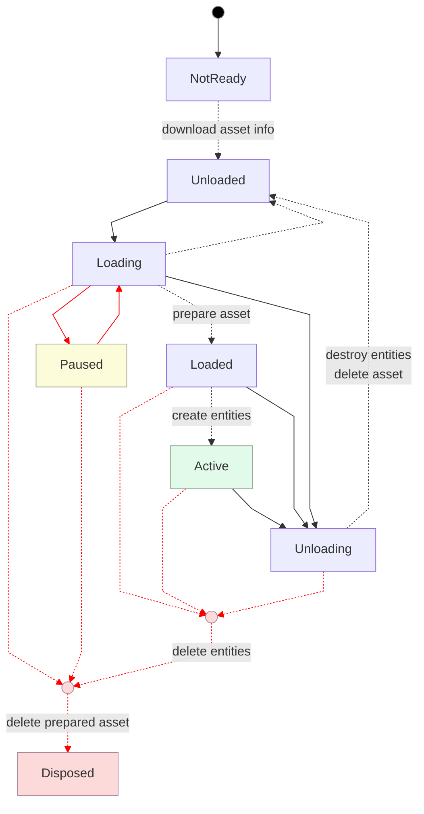

## Sublevels

**Sublevels** are portions of a world that can be spawned in. They are very similar to [spawnable assets](#spawnable-assets) except that they can pre-compute a lot more data (such as [lighting](#horizon-lighting)) which makes spawning a *lot* faster. **Horizon uses the term *stream* with Sublevels (instead of *spawn*)**.

Sublevel functionality is in the `horizon/world_streaming` module.

**TypeScript**: To spawn in a sublevel you need to have a [Sublevel Gizmo](#sublevel-gizmo) in the world with "Sublevel Type" set to "Deeplink". Then you can use the entity [as()](#entity-as-method) the `SublevelEntity` class.

The class interface on `SublevelEntity` acts much like a [SpawnController](#advanced-spawning-spawncontroller) with [currentState and targetState](#spawncontroller-state-machine) using the enum `SublevelStates` which has the exact same values as [SpawnState](#spawncontroller-state-machine).

| `SublevelEntity` Method | Equivalent `SpawnController` Method |
|---|---|
| `load` | `load` |
| `pause` |  `pause` |
| `unload` | `unload` |
| `activate` | `spawn` |
| `hide` | Similar to calling<br/><pre class="language-ts ts"><span><code>spawnController.unload().then(<br/>  () => spawnController.load()<br/>)</code></span></pre>|

# Showing Players Temporary Messages

There are two ways to show temporary messages to players: popups (which appear in a fixed screen position) and tooltips (which can follow players or entities). Note that there are currently many limitations with tooltips (they only work with [VR players](#player-device-type), for example). We recommend to **only use popups; do not use tooltips (for now)**.

## Popups

You can show popups to every player in the world by accessing the `ui` field on a [World](#world-class) instance

```ts
world.ui.showPopupForEveryone(
  "Go!", 3 /* seconds */
);
```

or to just one player

```ts
world.ui.showPopupForPlayer(
  player, "Shh! You found a secret", 5 /* seconds */
);
```

**Methods**: The two "showPopup" methods take a `text`, `displayTime` (duration in seconds that the message is shown), and optional `options`.

```ts
// IUI (accessed via `ui` on World)
showPopupForEveryone(
  text: string | i18n_utils.LocalizableText,
  displayTime: number,
  options?: Partial<PopupOptions>
): void;
showPopupForPlayer(
  player: Player,
  text: string | i18n_utils.LocalizableText,
  displayTime: number,
  options?: Partial<PopupOptions>
): void;
```

!!! info Screen position for [Mobile/Web players](#player-device-type).
    For players on screen devices, popups appear in the center of the screen by default. The position offset in `options` moves the popup in screen coordinates (whereas for [VR players](#player-device-type) it is in [player-local coordinates](#local-transforms)).

**Popup Options**: When showing a popup the optional `options` parameter can specify any of the fields in `PopupOptions`:

```ts
type PopupOptions = {
  position: Vec3;         // Local player offset of UI
  fontSize: number;
  fontColor: Color;
  backgroundColor: Color;
  playSound: boolean;     // Play a sound when it appears?
  showTimer: boolean;     // Show the countdown timer?
};
```

The default values for `PopupOptions` are available in `DefaultPopupOptions`:
```ts
const DefaultPopupOptions = {
  position: new Vec3(0, -0.5, 0),
  fontSize: 5,
  fontColor: Color.black,
  backgroundColor: Color.white,
  playSound: true,
  showTimer: false
};
```

!!! info `i18n_utils` is not available.
    Although the `text` argument is typed as a `string | i18n_utils.LocalizableText`, there is currently no way to use `i18n_utils` 🙈. The `text` (for now) must be a `string`.

## Tooltips

!!! danger Tooltips are not recommended
    Tooltips currently only work for VR players and have known issues with Quest Link. We recommend using [popups](#popups) or [Custom UI](#custom-ui) instead.

Tooltips can be shown to a player by accessing the `ui` field on a [World](#world-class) instance:

```ts
world.ui.showTooltipForPlayer(
  player,
  TooltipAnchorLocation.LEFT_WRIST,
  "Check your wrist!"
);
```

The tooltip must be be manually dismissed:

```ts
world.ui.dismissTooltip(player, true /* play sound */);
```

**Methods**: The tooltip API has two methods show showing and dismissing the tooltip:

```ts
// IUI (accessed via `ui` on World)
showTooltipForPlayer(
  player: Player,
  tooltipAnchorLocation: TooltipAnchorLocation,
  tooltipText: string | i18n_utils.LocalizableText,
  options?: Partial<TooltipOptions>
): void;
dismissTooltip(
  player: Player,
  playSound?: boolean
): void;
```

**Tooltip Anchor Location**: The tooltip appears near one of three anchor points on the player, using the `TooltipAnchorLocation` enum (with values `LEFT_WRIST`, `RIGHT_WRIST`, and `TORSO`).

**Tooltip Options**: When showing a tooltip the optional `options` parameter can specify any of the fields in `TooltipOptions`:

```ts
type TooltipOptions = {
  tooltipAnchorOffset?: Vec3;    // Offset from anchor point
  displayTooltipLine?: boolean;  // Show line to anchor
  tooltipLineAttachmentProperties?: TooltipLineAttachmentProperties;
  playSound?: boolean;           // Play sound when shown
}
```

The `tooltipLineAttachmentProperties` allow you to customize how the connecting line looks and acts:

```ts
type TooltipLineAttachmentProperties = {
  lineAttachmentEntity?: Entity | PlayerBodyPartType;
  lineAttachmentLocalOffset?: Vec3;
  lineAttachmentRounded?: boolean;
  lineChokeStart?: number;
  lineChokeEnd?: number;
}
```

!!! info i18n_utils is not available.
    Although the tooltipText argument is typed as a string | i18n_utils.LocalizableText, there is currently no way to use i18n_utils 🙈. The tooltipText (for now) must be a string.

# Custom UI

Custom UI you to create 2D user interfaces (somewhat inspired by [React](https://react.dev/)) using [CSS flexbox](https://developer.mozilla.org/en-US/docs/Web/CSS/CSS_flexible_box_layout/Basic_concepts_of_flexbox) for layout. Custom UI creates a "view tree" *once* and then you use [bindings](#bindings) (and [animated bindings](#animated-bindings)) to update the view thereafter. Horizon calls each element in a UI tree a `UINode`.

To create a UI you instantiate a [Custom UI Gizmo](#custom-ui-gizmo), create a [UIComponent](#uicomponent-class) subclass, and then attach it to the gizmo. The UIComponent subclass implements `initializeUI()` to return a collection of [Views](#ui-view), [Images](#ui-image), [Pressables](#ui-pressable), [Dynamic Lists](#ui-dynamic-list), and [ScrollViews](#ui-scrollview).

Here's an example that shows a collection of features:
* `UIComponent` is a subclass of [Component](#component-class) and so you can still use [start](#component-class) and [propsDefinition](#component-properties).
* [Bindings](#bindings) and [derived Bindings](#deriving-bindings)
* [View](#ui-view) and [Text](#ui-text)

![[ horizonScripts/uicomponentExample.ts ]]

## UIComponent Class

The `UIComponent` class is a subclass of the [Component class](#component-class). Thus the following all exactly as they do in `UIComponent`:
* [Component.register](#component-class)
* [propsDefinition](#component-properties)
* [preStart](#component-class)
* [start](#component-class)
* [transferOwnership](#transferring-data-across-owners)
* [receiveOwnership](#transferring-data-across-owners)
* [dispose](#disposing-objects)

There are some members specific to `UIComponent`. Additionally, whereas `Component` can be attached to [any entity](#all-gizmos-intrinsic-entity-types), a `UIComponent` **must be attached to a [Custom UI Gizmo](#custom-ui-gizmo)** for it to render any UI.

| UIComponent Member | Description |
|---|---|
| `abstract initializeUI(): UINode` | You *must* override this method and return the initial "view tree". This method is called [before preStart](#component-lifecycle). |
| `readonly panelWidth: number` | The total number of pixels the UI gizmo is wide. This doesn't change the size of the UI (use [scale](#scale for that)); it just changes how you reference the UI. For instance if you set this to `100` then you can use `50` to reference the midpoint. The default is `500`. |
| `readonly panelHeight: number` | The same as `panelWidth` except specifying *height*. |

## Bindings

Bindings are **the only way that a Custom UI changes its contents**. A binding is a *container with a value inside*. Any time that you change the contents of it, via `binding.set(...)`, the UI will update accordingly. Many fields in the various [UINode types](#uinode-types) accept bindings for their values. For instance:

```ts
const contents = new Binding('hi!')

Text({
  text: contents
})
```

will create a [Text](#ui-text) view that renders the word `hi!`. If, or when, `contents.set('ciao!')` is run, then that Text node in the UI will update its contents to render `ciao!` instead.

**Performance**: Having too many bindings, or updating them too frequently, can impact the performance of your world. Monitor your performance metrics as you build complex UIs.

**Per-Player Values**: Binding can have different values for each player. This makes it so that multiple players can interact with a UI at the same and see different results (example: reading instructions). You can choose to [set values per-player](#global-vs-player-binding-values) whenever using [set() and reset()](#setting-and-resetting-bindings).

**Derived Bindings**: You can have [a binding that "flows" downstream from another binding (or multiple)](#deriving-bindings). For instance if you have a binding containing an array of strings, you could then make a new binding that just has the length of that array. Whenever the array one changes, the length one will change too.

**Values**: The value inside a `Binding` must be [JSON-serializable](#creating-bindings).

### Binding Class

| `Binding` Class Member | Description |
|---|---|
| [set](#setting-and-resetting-bindings) | Update the values in a binding. This can be done by setting a new value or by running a function on current values. This can be done per-player. |
| [reset](#setting-and-resetting-bindings) | Reset the values in the bindings. This can be done per-player. |
| [derive](#deriving-bindings) | Create a new binding whose values update whenever the original one does. |
| [static derive](#deriving-bindings) | Create a new binding whose values update whenever any of the original ones do. |

### Creating Bindings

You create a binding using the `Binding` class and pass in the initial value that all players will have:
```ts
const binding = new Binding(123)
```

You can specify the type directly if it can't be inferred from the initial value:
```ts
const otherBinding = new Binding<number | string>(123)
```

**Value types**: Bindings serialize their values via [JSON.stringify](https://developer.mozilla.org/en-US/docs/Web/JavaScript/Reference/Global_Objects/JSON/stringify). Thus you cannot use any values that `JSON.stringify` doesn't allows. For example: **you cannot put a `bigint` into a binding**. This means that an **[Entity](#entity-class) cannot be put into a binding** (since its `id` is a `bigint`).

You can also create bindings by [deriving them](#deriving-bindings).

**Bindings count**: Having a large number of binding (or [frequently updating them](#setting-and-resetting-bindings)) will hurt the world's performance. You should **create (or derive) bindings *once* and store them** instead of regularly creating them.

**Player Enter**: Whenever a player enters the world they will see the binding with the [global value](#global-vs-player-binding-values).

### Global vs Player Binding Values

Every binding has an underlying value, the **global value**. When you [create a binding](#creating-bindings), the value passed in becomes the global value.

The value *can be overridden for a player* in the [set and reset](#setting-and-resetting-bindings) methods.

The **current value** of a player is their override if they have one; otherwise it is the global value.

### Setting and Resetting Bindings

The [Binding class](#binding-class) has set and resets method to update the value(s) in the binding:
```ts
// Binding
set(
  value: T | ((prev: T) => T),
  players?: Array<Player>
): void
reset(players?: Array<Player>): void
```

The `reset` method acts exactly like `binding.set(originalValue, players)`.

The **players** argument describes who the update is for. It is optional:
* If `players` is **specified** then those players will get per-player values that [override the global value](#global-vs-player-binding-values).
* If `players` is **omitted** then the global value will be updated and *all per-player overrides will be cleared*.

The **value** argument specifies the data. It can be a value or a function:
  * If it is a **value** then it will be used for the new global value (or new overrides if `players` was included).
  * If it is a **function** then that function will be applied to the current global value to compute the new one. Unless `players` was included, then the function will be used to compute a new override for each of those players using their current values (an override or the global value if they don't yet have an override).

**Derived Bindings**: whenever `set()` or `reset()` is called on a binding, it will also update all bindings that are [derived from it](#deriving-bindings).

Example uses:
| Code | Global Value | Player Overrides |
|---|---|---|
| <pre class="language-ts ts"><span><code>binding.set(4)</code></span></pre> | Becomes `4` | All player overrides are removed |
| <pre class="language-ts ts"><span><code>binding.set(<br/>  5,</code></br><code>  [groucho, harpo]<br/>)</code></span></pre> | Untouched | *Only* Groucho and Harpo will have  overrides set to 5 |
| <pre class="language-ts ts"><span><code>binding.set(<br/>  (d: number) => d + 1,</code></br><code>)</code></span></pre> | Increases by 1 | All player overrides are removed |
| <pre class="language-ts ts"><span><code>binding.set(<br/>  (d: number) => d + 2,</code></br><code>  [laurel, hardy]<br/>)</code></span></pre> | Untouched | *Only* Laurel and Hardy will have overrides that are their previous values increased by 2. Previous value means their override, if they had one, or the global value otherwise. |

### Deriving Bindings

The [Binding class](#binding-class) has a method **derive** that is used to create a binding that **does not have a *set* method**. Instead, these bindings are "downstream" of another binding and use that other binding's value(s) to compute theirs (every time it changes). For example
```ts
const derived = binding.derive((s: string) => s.length)
```
creates a new binding whose values are all computed from those in `binding`.
* The [global value](#global-vs-player-binding-values) in `derived` will be updated (by calling the function) whenever the global value in `binding` changes.
* The [player overrides](#global-vs-player-binding-values) will be updated (by calling the function) on the player overrides in `binding`.

You can only derive from a top-level binding. You **cannot derive from a derived binding**.

There is also a `static` version of derive (similar to a *zip* if you know that term) that allows you to create a binding derived from a collection of others. For example here is a binding that contains a `boolean` representing if a `string` in a binding is contained in a `string[]` in another binding.

```ts
const needleBinding = new Binding('lemon')
const haystackBinding = new Binding(['apple', 'pear'])

const containedBinding = Binding.derive(
  [needleBinding, haystackBinding],
  (needle, haystack) => haystack.includes(needle)
)
```

### Animated Bindings

The `AnimatedBinding` class offers a way to have a binding change smoothly every frame, which is useful for creating animations. The docs are here:

https://developers.meta.com/horizon-worlds/learn/documentation/desktop-editor/custom-ui/api-reference-for-custom-ui#animatedbinding

## UINode Types

There are a number of built-in `UINode` types. We link to Meta's docs below. Most builtin `UINode` types take a `style` argument. The `LayoutStyle` type is documented here:

https://developers.meta.com/horizon-worlds/learn/documentation/desktop-editor/custom-ui/api-reference-for-custom-ui#styles

### Conditional UI (If)

Use `UINode.If` to create a `UINode` that uses a binding to choose between showing one of two children:

https://developers.meta.com/horizon-worlds/learn/documentation/desktop-editor/custom-ui/api-reference-for-custom-ui#if

### UI View

https://developers.meta.com/horizon-worlds/learn/documentation/desktop-editor/custom-ui/api-reference-for-custom-ui#view

### UI Text

https://developers.meta.com/horizon-worlds/learn/documentation/desktop-editor/custom-ui/api-reference-for-custom-ui#text

### UI Image

https://developers.meta.com/horizon-worlds/learn/documentation/desktop-editor/custom-ui/api-reference-for-custom-ui#image

### UI Pressable

https://developers.meta.com/horizon-worlds/learn/documentation/desktop-editor/custom-ui/api-reference-for-custom-ui#pressable

### UI ScrollView

https://developers.meta.com/horizon-worlds/learn/documentation/desktop-editor/custom-ui/api-reference-for-custom-ui#scrollview

### UI Dynamic List

https://developers.meta.com/horizon-worlds/learn/documentation/desktop-editor/custom-ui/dynamic-list

# Navigation Mesh

https://developers.meta.com/horizon-worlds/learn/documentation/desktop-editor/npcs/npcs/

## Navigation Mesh Volume

https://developers.meta.com/horizon-worlds/learn/documentation/desktop-editor/npcs/navigation-mesh-generation#navigation-gizmo

## Navigation Mesh Profile

https://developers.meta.com/horizon-worlds/learn/documentation/desktop-editor/npcs/navigation-mesh-generation#navigation-profile

## Navigation Mesh Agent

https://developers.meta.com/horizon-worlds/learn/documentation/desktop-editor/npcs/nav-mesh-agents

# Cross Screens - Mobile vs PC vs VR

https://developers.meta.com/horizon-worlds/learn/documentation/create-for-web-and-mobile/create-for-web-and-mobile/

## Camera

https://developers.meta.com/horizon-worlds/learn/documentation/create-for-web-and-mobile/typescript-apis-for-mobile/camera

# Common Problems and Troubleshooting

**Desktop Editor**
* If you reset the world without stopping it first, it is possible the things don't fully reset. We recommend that you **always do Stop -> Reset -> Play**.

* If scripts are not syncing or you modify an entity's properties and don't see it behaving as if it has the updates then **leave the world and return**.

* If leaving a world and returning doesn't fix an issue, you may want to have everyone leave the [editor instance](#instance-selection) for a few minutes so that the instance is shut down and a new one can be created when you return.

* While waiting for an instance to shutdown, or just as another "debug" trick to try, you can **quit the Desktop app and then relaunch it**.

* If scripts are not syncing you can **delete the `.editor` file and then leave the world and return**.

* When you see an error message showing just an [Entity](#entity-class) `id` (such as 100006) then you can do **an entity debug trick** and run
    ```ts
    console.log(
      new Entity(BigInt("100006")).name.get()
    )
    ```
    to see the name of the entity. You should **never call `new Entity` in a published world**.

## Horizon TypeScript Symbols

[AchievementsGizmo](#quests)
[AIAgentGizmo](#npc-gizmo)
[AimAssistOptions](#aim-assist)
[AnimatedEntity](#animated-entities)
[AnimationCallback](#avatar-animation)
[AnimationCallbackReason](#avatar-animation)
[AnimationCallbackReasons](#avatar-animation)
[assert](#scripting-helper-functions)
[Asset](#assets)
[AssetContentData](#text-asset-json)
[AttachableEntity](#attaching-entities)
[AttachablePlayerAnchor](#attaching-entities)
[AudioGizmo](#sound-gizmo)
[AudibilityMode](#sound-gizmo)
[AudioOptions](#sound-gizmo)
[AvatarGripPose](#player-pose)
[AvatarGripPoseAnimationNames](#player-pose)
[BaseRaycastHit](#raycast-gizmo)
[BuiltInVariableType](#builtinvariabletype)
[ButtonIcon](#player-input-buttonicon)
[ButtonPlacement](#connect-local-input)
[clamp](#scripting-helper-functions)
[Color](#color)
[CodeBlockEvents](#built-in-code-block-events)
[Comparable](#comparable-interface)
[Component](#component-class)
[CodeBlockEvent](#code-block-events)
[DefaultFetchAsDataOptions](#text-asset-json)
[DefaultFocusedInteractionTapOptions](#focused-interaction)
[DefaultFocusedInteractionTrailOptions](#focused-interaction)
[DefaultPopupOptions](#popups)
[DefaultSpringOptions](#springs)
[DefaultThrowOptions](#throwing)
[DefaultTooltipOptions](#tooltips)
[degreesToRadians](#scripting-helper-functions)
[DisposableObject](#disposing-objects)
[DisposableOperation](#disposing-objects)
[DisposableOperationRegistration](#disposing-objects)
[DynamicLightGizmo](#dynamic-light-gizmo)
[EntityInteractionMode](#interactive-entities)
[EntityRaycastHit](#raycast-gizmo)
[EntityStyle](#meshentity-style)
[EntityTagMatchOperation](#entity-tags)
[EulerOrder](#quaternion)
[EventSubscription](#receiving-events)
[FetchAsDataOptions](#text-asset-json)
[FocusedInteraction](#focused-interaction)
[FocusedInteractionTapOptions](#focused-interaction)
[FocusedInteractionTrailOptions](#focused-interaction)
[GrabbableEntity](#grabbing-and-holding-entities)
**Handedness**: [force hold](#force-grabbing), [haptics](#haptics), [throwing](#throwing)
[HapticSharpness](#haptics)
[HapticStrength](#haptics)
[HorizonProperty](#horizon-properties)
[HorizonSetProperty](#horizon-properties)
[ILeaderboards](#leaderboards)
[InteractionInfo](#focused-interaction)
[IPersistentStorage](#persistence)
[IUI](#showing-players-temporary-messages)
[IWPSellerGizmo](#in-world-item-gizmo)
[LaunchProjectileOptions](#projectile-launcher-gizmo)
[LayerType](#raycast-gizmo)
[LocalEvent](#local-events)
[LocalEventData](#local-events)
[MaterialAsset](#material-asset)
[MeshEntity](#meshentity-class)
[MonetizationTimeOption](#in-world-consumable-items)
[NetworkEvent](#network-events)
[NetworkEventData](#network-events)
[ParticleFXPlayOptions](#particlefx-gizmo)
[ParticleFXStopOptions](#particlefx-gizmo)
[ParticleGizmo](#particlefx-gizmo)
[PersistentSerializableState](#serializablestate)
[PhysicalEntity](#physicalentity-class)
[PhysicsForceMode](#applying-forces-and-torque)
[PlayAnimationOptions](#avatar-animation)
[Player](#players)
[PlayerBodyPart](#player-body-parts)
[PlayerBodyPartType](#player-body-parts)
[PlayerDeviceType](#player-device-type)
[PlayerHand](#player-body-parts)
[PlayerControls](#player-controls)
[PlayerControlsConnectOptions](#connect-local-input)
[PlayerInput](#connect-local-input)
[PlayerInputAction](#playerinputaction)
[PlayerInputStateChangeCallback](#connect-local-input)
[PlayerRaycastHit](#raycast-gizmo)
[PlayerVisibilityMode](#entity-visibility)
[PopupOptions](#popups)
[ProjectileLauncherGizmo](#projectile-launcher-gizmo)
[PropTypes](#proptypes)
[Quaternion](#quaternion)
[radiansToDegrees](#scripting-helper-functions)
[RaycastGizmo](#raycast-gizmo)
[RaycastHit](#raycast-gizmo)
[RaycastTargetType](#raycast-gizmo)
[ReadableHorizonProperty](#horizon-properties)
[SerializableState](#serializablestate)
[SetMaterialOptions](#material-asset)
[SetMeshOptions](#meshentity-setmesh)
[SetTextureOptions](#texture-asset)
**Space**: [body part](#player-body-parts), [transform helpers](#transform-helpers)
[SpawnController](#advanced-spawning-spawncontroller)
[SpawnControllerBase](#advanced-spawning-spawncontroller)
[SpawnError](#advanced-spawning-spawncontroller)
[SpawnPointGizmo](#spawn-point-gizmo)
[SpawnState](#advanced-spawning-spawncontroller)
[SpringOptions](#springs)
[StaticRaycastHit](#raycast-gizmo)
[StopAnimationOptions](#avatar-animation)
[TextGizmo](#text-gizmo)
[TextureAsset](#texture-asset)
[ThrowOptions](#throwing)
[TooltipAnchorLocation](#tooltips)
[TooltipLineAttachmentProperties](#tooltips)
[TooltipOptions](#tooltips)
[TrailGizmo](#trailfx-gizmo)
[Transform](#transforms)
[TriggerGizmo](#trigger-gizmo)
[Vec3](#vec3)
[VoipSettingValues](#voip-settings)
[World](#world-class)
[WritableHorizonProperty](#horizon-properties)

# All Built-In CodeBlockEvents

In the table below:
  * 🔈 is a *[CodeBlockEvent broadcast on the server](#built-in-code-block-events)*.
  * 🏠 is a *[CodeBlockEvent broadcast on the device owned by the player in the parameters](#built-in-code-block-events)*.

| [Built-In CodeBlockEvent](#built-in-code-block-events) | Parameter(s) |
|---|---|
| 🔈[OnAchievementComplete](#quests-gizmo) | `player: Player`<br/>`scriptId: string` |
| 🔈[OnAssetDespawned](#spawn-codeblockevents) | `entity: Entity`<br/>`asset: Asset` |
| 🔈[OnAssetSpawnFailed](#spawn-codeblockevents) | `asset: Asset` |
| 🔈[OnAssetSpawned](#spawn-codeblockevents) | `entity: Entity`<br/>`asset: Asset` |
| [OnAttachEnd](#attachable-by) | `player: Player` |
| [OnAttachStart](#attachable-by) | `player: Player` |
| [OnAudioCompleted](#sound-gizmo) |  |
| [OnButton1Down](#player-input-codeblockevents) | `player: Player` |
| [OnButton1Up](#player-input-codeblockevents) | `player: Player` |
| [OnButton2Down](#player-input-codeblockevents) | `player: Player` |
| [OnButton2Up](#player-input-codeblockevents) | `player: Player` |
| 🔈OnCameraPhotoTaken | `player: Player`<br/>`isSelfie: boolean` |
| [OnEntityCollision](#collision-events) | `collidedWith: Entity`<br/>`collisionAt: Vec3, normal: Vec3, relativeVelocity: Vec3, localColliderName: string, OtherColliderName: string` |
| [OnEntityEnterTrigger](#trigger-gizmo) | `enteredBy: Entity` |
| [OnEntityExitTrigger](#trigger-gizmo) | `enteredBy: Entity` |
| [OnGrabEnd](#grab-sequence-and-events) | `player: Player` |
| [OnGrabStart](#grab-sequence-and-events) | `isRightHand: boolean`<br/>`player: Player` |
| [OnIndexTriggerDown](#player-input-codeblockevents) | `player: Player` |
| [OnIndexTriggerUp](#player-input-codeblockevents) | `player: Player` |
| [OnItemConsumeComplete](#in-world-consumable-items) | `player: Player`<br/>`item: string, success: boolean` |
| [OnItemConsumeStart](#in-world-consumable-items) | `player: Player`<br/>`item: string` |
| 🔈[OnItemPurchaseComplete](#in-world-durable-items) | `player: Player`<br/>`item: string, success: boolean` |
| 🔈[OnItemPurchaseFailed](#in-world-durable-items) | `player: Player`<br/>`item: string` |
| 🔈[OnItemPurchaseStart](#in-world-durable-items) | `player: Player`<br/>`item: string` |
| 🔈[OnItemPurchaseSucceeded](#in-world-durable-items) | `player: Player`<br/>`item: string` |
| [OnMultiGrabEnd](#grab-sequence-and-events) | `player: Player` |
| [OnMultiGrabStart](#grab-sequence-and-events) | `player: Player` |
| OnPassiveInstanceCameraCreated | `sessionId: Player`<br/>`cameraMode: string` |
| [OnPlayerCollision](#collision-events) | `collidedWith: Player`<br/>`collisionAt: Vec3, normal: Vec3, relativeVelocity: Vec3, localColliderName: string, OtherColliderName: string` |
| 🔈[OnPlayerConsumeFailed](#in-world-consumable-items) | `player: Player`<br/>`item: string` |
| 🔈[OnPlayerConsumeSucceeded](#in-world-consumable-items) | `player: Player`<br/>`item: string` |
| 🔈[OnPlayerEnterAFK](#player-enter-and-exit-afk) | `player: Player` |
| [OnPlayerEnterTrigger](#trigger-gizmo) | `enteredBy: Player` |
| 🔈[OnPlayerEnterWorld](#player-entering-and-exiting-a-world) | `player: Player` |
| 🏠[OnPlayerEnteredFocusedInteraction](#focused-interaction) | `player: Player` |
| 🔈[OnPlayerExitAFK](#player-enter-and-exit-afk) | `player: Player` |
| [OnPlayerExitTrigger](#trigger-gizmo) | `exitedBy: Player` |
| 🔈[OnPlayerExitWorld](#player-entering-and-exiting-a-world) | `player: Player` |
| 🏠[OnPlayerExitedFocusedInteraction](#focused-interaction) | `player: Player` |
| [OnPlayerSpawnedItem](#in-world-item-gizmo) | `player: Player`<br/>`item: Entity` |
| [OnProjectileExpired](#projectile-launcher-gizmo) | `position: Vec3`<br/>`rotation: Quaternion, velocity: Vec3` |
| [OnProjectileHitObject](#projectile-launcher-gizmo) | `objectHit: Entity`<br/>`position: Vec3, normal: Vec3` |
| [OnProjectileHitPlayer](#projectile-launcher-gizmo) | `playerHit: Player`<br/>`position: Vec3, normal: Vec3, headshot: boolean` |
| [OnProjectileHitWorld](#projectile-launcher-gizmo) | `position: Vec3`<br/>`normal: Vec3` |
| [OnProjectileLaunched](#projectile-launcher-gizmo) | `launcher: Entity` |